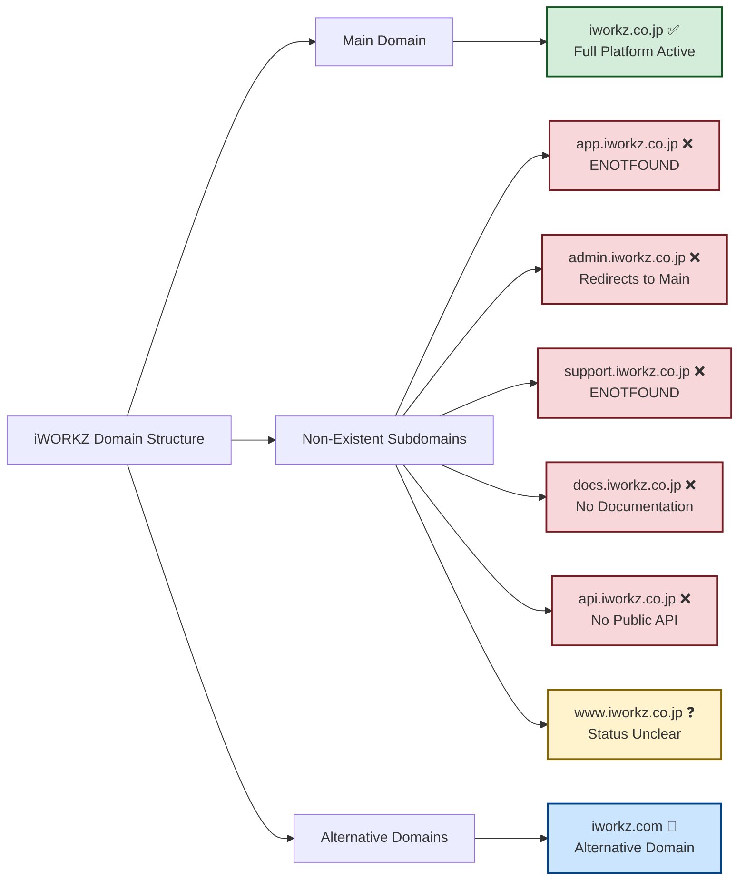

# iWORKZ Complete Sitemap Diagram

## Main Domain Structure: iworkz.co.jp

```mermaid
graph TD
    A[iworkz.co.jp] --> B[Core Pages]
    A --> C[Employer Portal]
    A --> D[Localization]
    A --> E[Broken Links - 404]
    
    %% Core Pages - Working
    B --> B1[/ - Homepage ✅]
    B --> B2[/platform - Platform Overview ✅]
    B --> B3[/ai-tools - AI Tools & Features ✅]
    B --> B4[/clients - Client Segments ✅]
    B --> B5[/contact - Contact Information ✅]
    B --> B6[/about - Company Information ✅]
    B --> B7[/news - News & Updates ✅]
    B --> B8[/privacy - Privacy Policy ✅]
    B --> B9[/terms - Terms of Service ✅]
    
    %% Employer Portal - Working
    C --> C1[/employer/dashboard - Cultural Intelligence Dashboard ✅]
    C --> C2[/employer/candidates - Candidate Management ✅]
    C --> C3[/employer/positions - Position Management 🔗]
    C --> C4[/employer/analytics - Analytics Dashboard 🔗]
    C --> C5[/employer/team - Team Culture Management 🔗]
    
    %% Localization - Working
    D --> D1[/pt-br - Portuguese/Brazilian ✅]
    
    %% Broken Links - 404 Errors
    E --> E1[/solutions - Platform Solutions ❌]
    E --> E2[/demo - Interactive Demo ❌]
    E --> E3[/get-started - Getting Started ❌]
    E --> E4[/company - Company Information ❌]
    E --> E5[/pricing - Pricing Plans ❌]
    E --> E6[/blog - Blog/Articles ❌]
    
    %% Landing Page Navigation Flow
    B1 --> B2
    B1 --> B3
    B1 --> B4
    B1 --> B5
    B1 --> C1
    B1 --> E2
    B1 --> E3
    
    %% Platform Page Links
    B2 --> C1
    B2 --> B5
    
    %% AI Tools Page Links
    B3 --> C1
    B3 --> B5
    
    %% Clients Page Links
    B4 --> C1
    B4 --> B5
    
    %% Contact Page Links
    B5 --> B1
    B5 --> B6
    
    %% Employer Dashboard Links
    C1 --> C2
    C1 --> C3
    C1 --> C4
    C1 --> C5
    
    %% Footer Navigation (All Pages)
    B1 --> B8
    B1 --> B9
    B2 --> B8
    B2 --> B9
    B3 --> B8
    B3 --> B9
    B4 --> B8
    B4 --> B9
    B5 --> B8
    B5 --> B9
    C1 --> B8
    C1 --> B9
    C2 --> B8
    C2 --> B9
    
    classDef working fill:#d4edda,stroke:#155724,stroke-width:2px
    classDef broken fill:#f8d7da,stroke:#721c24,stroke-width:2px
    classDef referenced fill:#fff3cd,stroke:#856404,stroke-width:2px
    
    class B1,B2,B3,B4,B5,B6,B7,B8,B9,C1,C2,D1 working
    class E1,E2,E3,E4,E5,E6 broken
    class C3,C4,C5 referenced
```

## Subdomain Analysis



## Link Flow Analysis

### Internal Link Patterns
- **Homepage (/)** → Most active hub with links to all major sections
- **Platform Page** → Focuses on technical capabilities, links to employer dashboard
- **AI Tools Page** → Showcases technology stack, directs to contact and dashboard
- **Clients Page** → Segmented by user type, drives to dashboard signup
- **Contact Page** → Central contact point with company information
- **Employer Dashboard** → Protected area with candidate and team management tools

### External Link Destinations
- **Social Media**: LinkedIn, Twitter profiles (working)
- **Documentation**: Links to external API docs and guides
- **Partner Sites**: Integration partner websites
- **Government Resources**: Japanese immigration and work visa information

### Navigation Issues Found
1. **Broken CTAs**: "Request a Demo" and "Get Started" links lead to 404s
2. **Missing Solutions Page**: Main navigation references non-existent /solutions
3. **Incomplete Employer Portal**: Some dashboard sections not yet implemented
4. **No Public API Docs**: API documentation not publicly accessible

## Site Health Summary

| Status | Count | Pages |
|--------|-------|-------|
| ✅ Working | 11 | Core functionality complete |
| 🔗 Referenced | 3 | Employer portal sections |
| ❌ Broken | 6 | Missing navigation targets |
| ❓ Unknown | 1 | www subdomain status |

## Recommendations

### Immediate Fixes Needed
1. **Create missing pages**: /solutions, /demo, /get-started, /company
2. **Fix broken CTAs**: Update all "Request Demo" and "Get Started" buttons
3. **Complete employer portal**: Implement remaining dashboard sections
4. **Add subdomain structure**: Consider app.iworkz.co.jp for the employer portal

### Enhancement Opportunities
1. **API Documentation**: Create public docs.iworkz.co.jp
2. **Support Portal**: Implement support.iworkz.co.jp
3. **Blog Platform**: Add /blog for content marketing
4. **Pricing Page**: Create transparent pricing structure
5. **Help Center**: Customer support and onboarding resources

## Legend
- ✅ = Working and accessible
- ❌ = Broken/404 error
- 🔗 = Referenced but not directly verified
- ❓ = Status unclear/needs verification