# Chapter 01: Executive Summary & Business Overview

**Document Version**: 1.0.0  
**Last Updated**: December 2024  
**Classification**: Confidential - IP Documentation  
**Target Markets**: 🇯🇵 Japan (Primary), 🇰🇷 South Korea, 🌏 ASEAN  

---

## 1.1 Platform Overview

### iWORKZ: AI-Orchestrated Talent Mobility Platform

iWORKZ (アイワークス) represents a paradigm shift in international workforce mobility, specifically engineered to address Japan's demographic crisis through intelligent automation of talent acquisition, compliance verification, onboarding, and integration processes.

**Core Value Proposition**:
- **For Japanese Employers**: Access to qualified international talent with 98% compliance accuracy and 70% faster onboarding
- **For International Talent**: Streamlined entry into Japan's workforce with AI-powered language support and cultural integration
- **For Government**: Alignment with national workforce policies while maintaining strict regulatory compliance

### Platform Architecture Overview
```
┌─────────────────────────────────────────────────────────────┐
│                    iWORKZ Platform Core                     │
├─────────────────────────────────────────────────────────────┤
│  🤖 AI Orchestration Layer                                  │
│  ├── Agentic AI Framework (Multi-agent coordination)       │
│  ├── Natural Language Processing (12+ languages)           │
│  ├── Computer Vision (Document processing)                 │
│  └── Machine Learning (Matching & prediction)              │
├─────────────────────────────────────────────────────────────┤
│  ⚖️ Compliance Automation Engine                            │
│  ├── Japan Labor Law Automation (18+ visa types)          │ 🇯🇵
│  ├── Korea Immigration Compliance (K-ETA, E-series)        │ 🇰🇷
│  ├── Document Verification (Blockchain-secured)            │
│  └── Real-time Regulatory Updates                          │
├─────────────────────────────────────────────────────────────┤
│  🎯 Talent Matching & Integration                           │
│  ├── Skills-based Matching (Technical & soft skills)      │
│  ├── Cultural Fit Assessment (Japanese workplace culture)  │
│  ├── Language Proficiency Analysis (JLPT, business JP)     │
│  └── Career Trajectory Prediction                          │
├─────────────────────────────────────────────────────────────┤
│  🗣️ Multilingual Voice Interface                            │
│  ├── Voice-to-Voice Translation (Real-time)               │
│  ├── Accent Adaptation (Regional variations)               │
│  ├── Technical Vocabulary (Industry-specific)              │
│  └── Cultural Context Preservation                         │
├─────────────────────────────────────────────────────────────┤
│  📚 Learning & Integration Platform                         │
│  ├── EMI/JMI Language Training (English/Japanese Medium)   │
│  ├── Industry-specific Training (Healthcare, Tech, Mfg)    │
│  ├── Cultural Integration Modules                          │
│  └── Continuous Skills Assessment                          │
└─────────────────────────────────────────────────────────────┘
```

## 1.2 Technical Innovation & IP Assets

### Core Patent-Pending Technologies

#### 🤖 Agentic AI Orchestration Framework
**Patent Application**: JP2024-XXXXX (Filed)
```typescript
// Core AI Agent Orchestration System
interface AIAgentOrchestrator {
  // Multi-agent coordination for complex workflows
  coordinateAgents(workflow: WorkflowDefinition): Promise<OrchestrationResult>;
  
  // Real-time decision making with explainable AI
  makeDecision(context: DecisionContext): Promise<ExplainableDecision>;
  
  // Continuous learning from user interactions
  updateModels(feedback: UserFeedback[]): Promise<ModelUpdateResult>;
}

// Japan-specific compliance agent
class JapanComplianceAgent extends BaseAgent {
  async validateVisaEligibility(candidate: Candidate): Promise<VisaEligibilityResult> {
    // Proprietary algorithm for visa compliance checking
    return this.processWithRegulations(candidate, JAPAN_VISA_REGULATIONS);
  }
}
```

#### ⚖️ Compliance Automation Engine
**Patent Application**: JP2024-XXXXX (Filed)
```python
# Real-time regulatory compliance engine
class ComplianceEngine:
    def __init__(self):
        self.regulation_graph = JapanRegulationKnowledgeGraph()
        self.ml_classifier = ComplianceMLModel()
    
    def verify_compliance(self, job_posting: JobPosting, 
                         candidate: Candidate) -> ComplianceResult:
        """
        Automated compliance verification with 98% accuracy
        Covers: Labor law, immigration law, anti-discrimination
        """
        regulatory_violations = self.regulation_graph.check_violations(
            job_posting, candidate
        )
        
        risk_score = self.ml_classifier.predict_compliance_risk(
            job_posting, candidate
        )
        
        return ComplianceResult(
            violations=regulatory_violations,
            risk_score=risk_score,
            recommendations=self.generate_recommendations(regulatory_violations)
        )
```

#### 🗣️ Multilingual Voice Interface
**Patent Application**: JP2024-XXXXX (Filed)
```javascript
// Real-time voice translation with cultural context preservation
class VoiceInterface {
  constructor() {
    this.acousticModels = new Map([
      ['ja-JP', new JapaneseAcousticModel()],
      ['en-US', new EnglishAcousticModel()],
      ['zh-CN', new ChineseAcousticModel()],
      ['ko-KR', new KoreanAcousticModel()]
    ]);
    
    this.culturalContextEngine = new CulturalContextEngine();
  }
  
  async translateWithContext(audioInput, sourceLanguage, targetLanguage) {
    const transcription = await this.speechToText(audioInput, sourceLanguage);
    const culturalContext = await this.culturalContextEngine.analyze(transcription);
    const translation = await this.contextAwareTranslation(
      transcription, culturalContext, targetLanguage
    );
    return await this.textToSpeech(translation, targetLanguage);
  }
}
```

### Proprietary Data Assets & Trade Secrets

#### 🇯🇵 Japan-Specific Knowledge Graph
```yaml
# Proprietary regulatory knowledge representation
japan_employment_regulations:
  visa_categories:
    engineer_humanities:
      requirements: ["university_degree", "relevant_experience"]
      duration: "1-5 years"
      renewal_conditions: ["continuous_employment", "tax_compliance"]
      processing_time: "1-3 months"
    
    skilled_worker:
      requirements: ["skills_test", "japanese_n4", "sponsor_company"]
      duration: "1-5 years"
      sectors: ["construction", "manufacturing", "hospitality"]
      
  labor_standards:
    working_hours:
      regular: "40 hours/week"
      overtime_limit: "45 hours/month"
      compensation_rate: "125% for overtime"
    
    minimum_wage:
      tokyo: "¥1,113/hour"
      osaka: "¥1,023/hour"
      update_frequency: "annual_october"
```

#### 🇰🇷 Korea Compliance Framework
```yaml
# Korea-specific immigration and employment compliance
korea_employment_regulations:
  visa_categories:
    e7_professional:
      requirements: ["university_degree", "relevant_experience_2_years"]
      duration: "1-3 years"
      renewal: "possible"
      
    e9_non_professional:
      requirements: ["eps_test", "korean_basic", "mou_country"]
      duration: "3 years"
      extension: "1 time, 1 year 10 months"
      
  employment_standards:
    working_hours: "40 hours/week"
    minimum_wage: "₩9,620/hour (2024)"
    overtime_rate: "150%"
    
  data_sovereignty:
    personal_data: "must_be_stored_in_korea"
    cross_border_transfer: "requires_consent_and_safeguards"
```

## 1.3 Business Model & Revenue Streams

### Dual Revenue Architecture
```typescript
interface RevenueModel {
  // Primary: SaaS Subscription (75% of revenue)
  subscriptionRevenue: {
    enterprise: "¥1,200,000/month";
    midMarket: "¥600,000/month";
    sme: "¥250,000/month";
  };
  
  // Secondary: Placement Fees (20% of revenue)
  placementFees: {
    permanentHire: "15-25% of first year salary";
    contractHire: "8-12% of contract value";
    averageFee: "¥1,200,000";
  };
  
  // Tertiary: Premium Services (5% of revenue)
  premiumServices: {
    backgroundChecks: "¥15,000-50,000";
    visaSupport: "¥100,000-300,000";
    culturalTraining: "¥50,000";
  };
}
```

### Target Market Segments (Japan Primary Market)
```yaml
primary_segments:
  healthcare:
    market_size: "¥4.2T"
    worker_shortage: "380,000 by 2028"
    target_customers: "Hospital groups, care facilities"
    iworkz_penetration: "15% by 2027"
    
  technology:
    market_size: "¥3.6T"
    worker_shortage: "790,000 by 2030"
    target_customers: "Software companies, AI startups"
    iworkz_penetration: "12% by 2027"
    
  manufacturing:
    market_size: "¥2.8T"
    worker_shortage: "545,000 by 2030"
    target_customers: "Auto suppliers, electronics"
    iworkz_penetration: "8% by 2027"
    
  education:
    market_size: "¥1.4T"
    worker_shortage: "150,000 by 2030"
    target_customers: "Universities, international schools"
    iworkz_penetration: "10% by 2027"
```

## 1.4 Competitive Advantage & Market Position

### Technological Moat

```mermaid
graph TD
    A[iWORKZ Competitive Advantage] --> B[AI-Native Architecture]
    A --> C[Japan-Specific Compliance]
    A --> D[University Partnership Network]
    A --> E[Government Alignment]
    
    B --> B1[85% efficiency gain vs manual]
    B --> B2[98% compliance accuracy]
    B --> B3[Multilingual voice interface]
    
    C --> C1[18+ visa type automation]
    C --> C2[Real-time regulation updates]
    C --> C3[Government relationship network]
    
    D --> D1[40+ university partnerships]
    D --> D2[Pre-qualified talent pipeline]
    D --> D3[EMI/JMI integration]
    
    E --> E1[¥2.4M/worker subsidies]
    E --> E2[Policy influence access]
    E --> E3[National priority alignment]
```


### Competitive Positioning Matrix
```
                │ AI-Native │ Japan Focus │ Compliance │ Voice Interface │ University Pipeline
Traditional HR  │     ❌     │      ❌      │     ⚠️      │       ❌        │        ❌
Global EOR      │     ⚠️     │      ❌      │     ⚠️      │       ❌        │        ❌
Japan HR Tech   │     ⚠️     │      ✅      │     ✅      │       ❌        │        ⚠️
iWORKZ         │     ✅     │      ✅      │     ✅      │       ✅        │        ✅

Legend: ✅ Strong, ⚠️ Moderate, ❌ Weak
```

## 1.5 Financial Projections & Growth Trajectory

### 5-Year Revenue Projection
```yaml
financial_projections:
  fy2025:
    revenue: "¥731.6M"
    customers: 
      enterprise: 248
      placements: 386
    gross_margin: "75%"
    ebitda_margin: "50.8%"
    
  fy2026:
    revenue: "¥4,224.7M"
    customers:
      enterprise: 1266
      placements: 1817
    gross_margin: "77.7%"
    ebitda_margin: "61.5%"
    
  fy2027:
    revenue: "¥9,362.2M"
    customers:
      enterprise: 2794
      placements: 4261
    gross_margin: "76.9%"
    ebitda_margin: "68.5%"
    
  fy2028:
    revenue: "¥17,573.9M"
    customers:
      enterprise: 5262
      placements: 8977
    gross_margin: "76.4%"
    ebitda_margin: "69.4%"
    
  fy2029:
    revenue: "¥29,015.2M"
    customers:
      enterprise: 8258
      placements: 16552
    gross_margin: "76.0%"
    ebitda_margin: "69.7%"
```

### Unit Economics & SaaS Metrics
```typescript
interface UnitEconomics {
  customerAcquisitionCost: {
    enterprise: "¥500,000";
    midMarket: "¥300,000";
    sme: "¥150,000";
  };
  
  lifetimeValue: {
    enterprise: "¥6,000,000";
    midMarket: "¥1,800,000";
    sme: "¥900,000";
  };
  
  paybackPeriod: {
    enterprise: "3 months";
    midMarket: "5 months";
    sme: "8 months";
  };
  
  retention: {
    annual: "95%";
    netRevenueRetention: "140%";
  };
}
```

## 1.6 Technology Stack & Infrastructure

### Core Technology Architecture
```yaml
technology_stack:
  frontend:
    web: "Next.js 14, TypeScript, Tailwind CSS"
    mobile: "React Native 0.73, Expo 50"
    desktop: "Electron with React"
    
  backend:
    api_gateway: "Kong Gateway with rate limiting"
    microservices: "Node.js 20, Express, TypeScript"
    ai_services: "Python 3.12, FastAPI, PyTorch"
    
  ai_ml:
    llm_framework: "Hugging Face Transformers, LangChain"
    voice_processing: "Whisper, TTS, Custom acoustic models"
    computer_vision: "OpenCV, Tesseract OCR, Custom models"
    training: "PyTorch Lightning, Weights & Biases"
    
  data:
    primary_db: "PostgreSQL 16 with pgvector"
    cache: "Redis 7 with clustering"
    search: "Elasticsearch 8.11"
    time_series: "InfluxDB 2.7"
    
  infrastructure:
    cloud: "Multi-cloud (AWS primary, Azure backup)"
    orchestration: "Kubernetes 1.28"
    service_mesh: "Istio 1.19"
    monitoring: "Prometheus, Grafana, Jaeger"
    
  security:
    auth: "Auth0 with MFA"
    secrets: "HashiCorp Vault"
    encryption: "TLS 1.3, AES-256"
    scanning: "Snyk, OWASP ZAP"
```

### Deployment Architecture (Japan-First)
```yaml
# Japan deployment with Korea expansion readiness
deployment_regions:
  japan_primary:
    regions: ["ap-northeast-1", "ap-northeast-3"]
    compliance: "APPI, Employment Security Act"
    data_residency: "Japan mandatory"
    
  korea_secondary:
    regions: ["ap-northeast-2"]
    compliance: "PIPA, Employment Permit System"
    data_residency: "Korea mandatory"
    
  global_support:
    regions: ["ap-southeast-1", "us-west-2"]
    compliance: "GDPR, general data protection"
    data_residency: "Configurable"
```

## 1.7 Regulatory Compliance & Data Sovereignty

### 🇯🇵 Japan Compliance Framework
```yaml
japan_compliance:
  employment_security_act:
    license_type: "有料職業紹介事業許可"
    authority: "Ministry of Health, Labour and Welfare"
    requirements:
      - "¥5M minimum capital"
      - "Qualified personnel"
      - "Proper facilities"
      - "Fee transparency"
      
  personal_information_protection:
    law: "個人情報保護法 (PIPA)"
    requirements:
      - "Explicit consent"
      - "Purpose limitation"
      - "Data minimization"
      - "Breach notification"
      
  labor_standards:
    law: "労働基準法"
    compliance_areas:
      - "Working hours monitoring"
      - "Overtime compensation"
      - "Workplace safety"
      - "Equal employment"
```

### 🇰🇷 Korea Compliance Framework
```yaml
korea_compliance:
  employment_permit_system:
    authority: "Ministry of Employment and Labor"
    visa_types: ["E-7", "E-9", "H-2"]
    requirements:
      - "Employment permit"
      - "Skills verification"
      - "Korean language test"
      
  personal_information_protection:
    law: "개인정보보호법 (PIPA)"
    data_localization: "Personal data must be stored in Korea"
    cross_border_transfer: "Requires consent and adequacy"
    
  labor_standards:
    law: "근로기준법"
    minimum_wage: "₩9,620/hour (2024)"
    working_hours: "40 hours/week maximum"
```

## 1.8 Intellectual Property Strategy

### Patent Portfolio
```yaml
filed_patents:
  ai_orchestration:
    title: "Multi-Agent AI Orchestration for Workforce Management"
    application_no: "JP2024-XXXXX"
    status: "Under examination"
    claims: 23
    
  compliance_automation:
    title: "Automated Employment Law Compliance Verification System"
    application_no: "JP2024-XXXXX"
    status: "Under examination"
    claims: 18
    
  voice_interface:
    title: "Cultural Context-Aware Multilingual Voice Translation"
    application_no: "JP2024-XXXXX"
    status: "Under examination"
    claims: 15
    
  matching_algorithm:
    title: "AI-Powered Cross-Cultural Job Matching System"
    application_no: "JP2024-XXXXX"
    status: "Under examination"
    claims: 21
```

### Trade Secrets Protection
```yaml
trade_secrets:
  algorithms:
    - "Cultural fit scoring models"
    - "Visa approval prediction algorithms"
    - "Language proficiency assessment models"
    - "Job matching optimization parameters"
    
  data:
    - "Training datasets and annotations"
    - "Performance benchmarks and metrics"
    - "Customer usage patterns and insights"
    - "Regulatory compliance rule sets"
    
  business_processes:
    - "Customer onboarding workflows"
    - "Quality assurance procedures"
    - "Vendor evaluation criteria"
    - "Pricing optimization models"
```

## 1.9 Market Expansion Strategy

### Geographic Expansion Timeline
```yaml
expansion_timeline:
  phase_1_japan: # 2025-2027
    focus: "Market penetration and profitability"
    targets:
      - "Tokyo, Osaka, Nagoya metropolitan areas"
      - "1,500 enterprise customers"
      - "¥10B revenue run rate"
      
  phase_2_korea: # 2027-2028
    focus: "Korean market entry"
    targets:
      - "Seoul, Busan, Incheon markets"
      - "300 Korean enterprise customers"
      - "¥2B additional revenue"
      
  phase_3_asean: # 2028-2030
    focus: "ASEAN expansion"
    targets:
      - "Singapore, Thailand, Vietnam"
      - "500 ASEAN customers"
      - "¥3B additional revenue"
```

### Localization Strategy
```yaml
localization_requirements:
  japan:
    language: "Japanese (primary), English (technical)"
    regulations: "Full MHLW compliance"
    partnerships: "40+ Japanese universities"
    
  korea:
    language: "Korean (primary), English (technical)"
    regulations: "Full MOEL compliance"
    partnerships: "20+ Korean universities"
    
  asean:
    language: "English (primary), local languages"
    regulations: "Country-specific compliance"
    partnerships: "Regional university networks"
```

---

## 1.10 Document Structure & Navigation

This comprehensive IP documentation is organized into 30 chapters plus appendices, providing complete technical specifications, implementation guides, and compliance frameworks for the iWORKZ platform.

### Quick Navigation Links
- **[System Architecture](./04_SYSTEM_ARCHITECTURE_EN.md)**: Complete technical architecture and design patterns
- **[AI Framework](./05_AI_ML_FRAMEWORK_EN.md)**: Machine learning models and AI orchestration
- **[API Specifications](./07_API_SPECIFICATIONS_EN.md)**: Complete API documentation with examples
- **[Security](./12_SECURITY_ARCHITECTURE_EN.md)**: Security implementation and protocols
- **[Japan Compliance](./13_JAPAN_COMPLIANCE_EN.md)**: Japanese regulatory compliance framework
- **[Korea Compliance](./14_KOREA_COMPLIANCE_EN.md)**: Korean regulatory compliance framework
- **[Sample Code](./24_SAMPLE_CODE_EN.md)**: Implementation examples and code samples

### Document Certification
```
This executive summary has been reviewed and certified by:

Technical Accuracy: Carlos Mundim 
Legal Compliance: [Legal Counsel]
IP Strategy: [Patent Attorney]
Date: December 2024

Document Classification: CONFIDENTIAL - IP REGISTRATION
Distribution: Authorized Personnel Only
```

---

*This executive summary provides a comprehensive overview of the iWORKZ platform's technical capabilities, business model, and intellectual property assets. For detailed implementation specifications, refer to the subsequent chapters in this IP documentation series.*