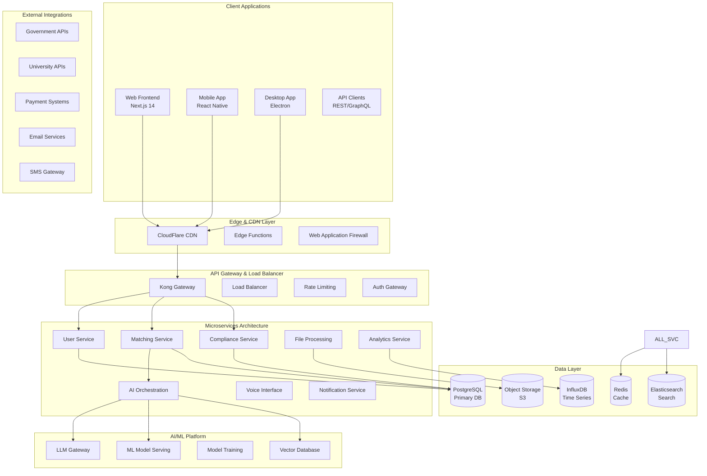

# Chapter 04: System Architecture & Design Patterns

**Document Version**: 1.0.1  
**Last Updated**: April 2025  
**Classification**: Confidential - IP Documentation  
**Target Markets**: 🇯🇵 Japan (Primary), 🇰🇷 South Korea, 🌏 ASEAN  

---

## 4.1 Overall System Architecture

### High-Level Architecture Overview



### Core Architecture Principles

**Microservices Design Philosophy**
```yaml
architectural_principles:
  microservices_first:
    principle: "Domain-driven microservices architecture"
    benefits: ["Independent scaling", "Technology diversity", "Team autonomy"]
    implementation: "Service mesh with Istio for inter-service communication"
    
  api_first:
    principle: "API-first design with OpenAPI specifications"
    benefits: ["Contract-driven development", "Easy integration", "Documentation"]
    implementation: "GraphQL Federation for unified API layer"
    
  event_driven:
    principle: "Event-driven architecture with CQRS patterns"
    benefits: ["Loose coupling", "Scalability", "Eventual consistency"]
    implementation: "Apache Kafka for event streaming"
    
  cloud_native:
    principle: "Kubernetes-native deployment and operations"
    benefits: ["Container orchestration", "Auto-scaling", "High availability"]
    implementation: "Helm charts for deployment management"
```

### Technology Stack Overview

**Core Technology Decisions**
```typescript
interface TechnologyStack {
  frontend: {
    web: "Next.js 14 with TypeScript and Tailwind CSS";
    mobile: "React Native 0.73 with Expo 50";
    desktop: "Electron with React and TypeScript";
    stateManagement: "Redux Toolkit with RTK Query";
  };
  
  backend: {
    apiGateway: "Kong Gateway with rate limiting and security";
    microservices: "Node.js 20 with Express and TypeScript";
    aiServices: "Python 3.12 with FastAPI and PyTorch";
    authentication: "Auth0 with JWT and MFA";
  };
  
  databases: {
    primary: "PostgreSQL 16 with pgvector for embeddings";
    cache: "Redis 7 with clustering and persistence";
    search: "Elasticsearch 8.11 with security enabled";
    timeSeries: "InfluxDB 2.7 for metrics and analytics";
    objectStorage: "AWS S3 with CloudFront CDN";
  };
  
  infrastructure: {
    orchestration: "Kubernetes 1.28 with Istio service mesh";
    monitoring: "Prometheus, Grafana, and Jaeger tracing";
    logging: "ELK stack with Fluentd for log aggregation";
    security: "HashiCorp Vault for secrets management";
  };
}
```

## 4.2 Frontend Architecture

### Web Application Architecture

**Next.js 14 Application Structure**
```
src/
├── app/                    # Next.js App Router
│   ├── (auth)/            # Authentication routes
│   ├── (dashboard)/       # Dashboard routes
│   ├── (public)/          # Public pages
│   ├── api/               # API routes
│   ├── globals.css        # Global styles
│   ├── layout.tsx         # Root layout
│   └── page.tsx           # Home page
├── components/
│   ├── ui/                # Reusable UI components
│   ├── forms/             # Form components
│   ├── charts/            # Data visualization
│   └── layout/            # Layout components
├── lib/
│   ├── api.ts             # API client configuration
│   ├── auth.ts            # Authentication utilities
│   ├── utils.ts           # Shared utilities
│   └── validations.ts     # Form validation schemas
├── store/
│   ├── index.ts           # Redux store configuration
│   ├── slices/            # Redux Toolkit slices
│   └── api/               # RTK Query API definitions
├── hooks/                 # Custom React hooks
├── types/                 # TypeScript type definitions
└── styles/                # Component-specific styles
```

**Component Architecture Pattern**
```typescript
// Example: Candidate Profile Component
interface CandidateProfileProps {
  candidateId: string;
  onUpdateSuccess?: () => void;
}

export const CandidateProfile: React.FC<CandidateProfileProps> = ({
  candidateId,
  onUpdateSuccess
}) => {
  // Data fetching with RTK Query
  const { data: candidate, isLoading, error } = useGetCandidateQuery(candidateId);
  
  // Form state management
  const [updateCandidate, { isLoading: isUpdating }] = useUpdateCandidateMutation();
  
  // Local component state
  const [isEditing, setIsEditing] = useState(false);
  
  // Form validation with Zod
  const form = useForm<CandidateUpdateSchema>({
    resolver: zodResolver(candidateUpdateSchema),
    defaultValues: candidate
  });
  
  // Event handlers
  const handleSubmit = async (data: CandidateUpdateSchema) => {
    try {
      await updateCandidate({ id: candidateId, ...data }).unwrap();
      setIsEditing(false);
      onUpdateSuccess?.();
      toast.success("Profile updated successfully");
    } catch (error) {
      toast.error("Failed to update profile");
    }
  };
  
  // Loading and error states
  if (isLoading) return <CandidateProfileSkeleton />;
  if (error) return <ErrorBoundary error={error} />;
  
  return (
    <Card className="max-w-4xl mx-auto">
      <CardHeader>
        <div className="flex justify-between items-center">
          <CardTitle>Candidate Profile</CardTitle>
          <Button
            variant={isEditing ? "outline" : "default"}
            onClick={() => setIsEditing(!isEditing)}
          >
            {isEditing ? "Cancel" : "Edit"}
          </Button>
        </div>
      </CardHeader>
      
      <CardContent>
        <Form {...form}>
          <form onSubmit={form.handleSubmit(handleSubmit)} className="space-y-6">
            {/* Form fields with validation */}
            <CandidateBasicInfo
              candidate={candidate}
              isEditing={isEditing}
              form={form}
            />
            
            <CandidateSkills
              candidate={candidate}
              isEditing={isEditing}
              form={form}
            />
            
            <CandidateExperience
              candidate={candidate}
              isEditing={isEditing}
              form={form}
            />
            
            {isEditing && (
              <Button type="submit" disabled={isUpdating}>
                {isUpdating ? "Saving..." : "Save Changes"}
              </Button>
            )}
          </form>
        </Form>
      </CardContent>
    </Card>
  );
};
```

### Mobile Application Architecture

**React Native Application Structure**
```typescript
// React Native App Architecture
interface MobileAppArchitecture {
  navigation: {
    navigator: "React Navigation 6 with TypeScript";
    structure: "Stack + Tab + Drawer navigation";
    deepLinking: "Universal links for web app integration";
    authentication: "JWT-based auth flow with biometric support";
  };
  
  stateManagement: {
    global: "Redux Toolkit with persist for offline support";
    local: "React hooks for component-specific state";
    forms: "React Hook Form with Yup validation";
    api: "RTK Query with optimistic updates";
  };
  
  styling: {
    system: "Styled-components with theme provider";
    responsive: "Responsive design with device dimensions";
    accessibility: "Full accessibility support with screen readers";
    internationalization: "i18next for Japanese/English support";
  };
  
  nativeFeatures: {
    camera: "Expo Camera for document scanning";
    biometrics: "Expo LocalAuthentication for security";
    notifications: "Expo Notifications with FCM";
    fileSystem: "Expo FileSystem for document management";
  };
}
```

**Mobile-Specific Components**
```typescript
// Voice Interface Component for Mobile
export const VoiceInterview: React.FC<VoiceInterviewProps> = ({
  interviewId,
  onComplete
}) => {
  const [isRecording, setIsRecording] = useState(false);
  const [audioPermission, requestPermission] = Audio.usePermissions();
  const [recording, setRecording] = useState<Audio.Recording>();
  const [audioLevel, setAudioLevel] = useState(0);
  
  // Real-time voice processing
  const { mutate: processVoice } = useProcessVoiceMutation();
  
  const startRecording = async () => {
    try {
      if (audioPermission?.status !== 'granted') {
        await requestPermission();
      }
      
      await Audio.setAudioModeAsync({
        allowsRecordingIOS: true,
        playsInSilentModeIOS: true,
      });
      
      const { recording } = await Audio.Recording.createAsync(
        Audio.RecordingOptionsPresets.HIGH_QUALITY
      );
      
      setRecording(recording);
      setIsRecording(true);
      
      // Monitor audio levels for visual feedback
      recording.setOnRecordingStatusUpdate((status) => {
        setAudioLevel(status.metering || 0);
      });
      
    } catch (error) {
      Alert.alert('Error', 'Failed to start recording');
    }
  };
  
  const stopRecording = async () => {
    setIsRecording(false);
    await recording?.stopAndUnloadAsync();
    
    const uri = recording?.getURI();
    if (uri) {
      // Process voice with AI
      processVoice({
        audioUri: uri,
        interviewId,
        timestamp: new Date().toISOString()
      });
    }
    
    setRecording(undefined);
  };
  
  return (
    <View style={styles.container}>
      <Text style={styles.title}>Voice Interview</Text>
      
      {/* Audio Waveform Visualization */}
      <VoiceWaveform level={audioLevel} isActive={isRecording} />
      
      {/* Recording Controls */}
      <TouchableOpacity
        style={[styles.recordButton, isRecording && styles.recording]}
        onPress={isRecording ? stopRecording : startRecording}
      >
        <Icon
          name={isRecording ? "stop" : "microphone"}
          size={32}
          color="white"
        />
      </TouchableOpacity>
      
      {/* Real-time Transcription */}
      {isRecording && (
        <RealtimeTranscription interviewId={interviewId} />
      )}
    </View>
  );
};
```

### Desktop Application Architecture

**Electron Application Structure**
```typescript
// Main Process (Electron)
import { app, BrowserWindow, ipcMain } from 'electron';
import { autoUpdater } from 'electron-updater';

class ElectronApp {
  private mainWindow: BrowserWindow | null = null;
  
  constructor() {
    this.createWindow();
    this.setupIPC();
    this.setupAutoUpdater();
  }
  
  private createWindow(): void {
    this.mainWindow = new BrowserWindow({
      width: 1200,
      height: 800,
      webPreferences: {
        nodeIntegration: false,
        contextIsolation: true,
        preload: path.join(__dirname, 'preload.js'),
        webSecurity: true
      },
      titleBarStyle: 'hiddenInset',
      show: false
    });
    
    // Load React app
    const isDev = process.env.NODE_ENV === 'development';
    this.mainWindow.loadURL(
      isDev
        ? 'http://localhost:3000'
        : `file://${path.join(__dirname, '../build/index.html')}`
    );
    
    // Show window when ready
    this.mainWindow.once('ready-to-show', () => {
      this.mainWindow?.show();
    });
  }
  
  private setupIPC(): void {
    // Secure IPC communication
    ipcMain.handle('app:getVersion', () => app.getVersion());
    ipcMain.handle('app:platform', () => process.platform);
    
    // File operations
    ipcMain.handle('file:save', async (event, data) => {
      // Secure file saving with validation
      return this.handleFileSave(data);
    });
    
    // Native OS integrations
    ipcMain.handle('notification:show', async (event, options) => {
      return this.showNotification(options);
    });
  }
  
  private setupAutoUpdater(): void {
    autoUpdater.checkForUpdatesAndNotify();
    
    autoUpdater.on('update-available', () => {
      this.mainWindow?.webContents.send('update:available');
    });
    
    autoUpdater.on('update-downloaded', () => {
      this.mainWindow?.webContents.send('update:ready');
    });
  }
}
```

## 4.3 Backend Microservices Architecture

### Service Mesh Architecture

**Istio Service Mesh Configuration**
```yaml
# Service Mesh Architecture
apiVersion: networking.istio.io/v1beta1
kind: VirtualService
metadata:
  name: iworkz-gateway
spec:
  http:
  - match:
    - uri:
        prefix: "/api/users"
    route:
    - destination:
        host: user-service
        port:
          number: 8080
    fault:
      delay:
        percentage:
          value: 0.1
        fixedDelay: 5s
    retries:
      attempts: 3
      perTryTimeout: 10s
      
  - match:
    - uri:
        prefix: "/api/matching"
    route:
    - destination:
        host: matching-service
        port:
          number: 8080
    headers:
      request:
        add:
          x-service-version: v1
          
  - match:
    - uri:
        prefix: "/api/compliance"
    route:
    - destination:
        host: compliance-service
        port:
          number: 8080
    mirror:
      host: compliance-audit-service
      port:
        number: 8080
    mirror_percent: 100
```

### Core Microservices Implementation

**User Management Service**
```typescript
// User Service Implementation
import express from 'express';
import { PrismaClient } from '@prisma/client';
import { validateRequest } from '../middleware/validation';
import { authenticateToken } from '../middleware/auth';

class UserService {
  private app: express.Application;
  private prisma: PrismaClient;
  
  constructor() {
    this.app = express();
    this.prisma = new PrismaClient();
    this.setupMiddleware();
    this.setupRoutes();
  }
  
  private setupMiddleware(): void {
    this.app.use(express.json({ limit: '10mb' }));
    this.app.use(express.urlencoded({ extended: true }));
    this.app.use(cors({
      origin: process.env.ALLOWED_ORIGINS?.split(','),
      credentials: true
    }));
    
    // Security middleware
    this.app.use(helmet());
    this.app.use(rateLimit({
      windowMs: 15 * 60 * 1000, // 15 minutes
      max: 100, // limit each IP to 100 requests per windowMs
      standardHeaders: true,
      legacyHeaders: false,
    }));
  }
  
  private setupRoutes(): void {
    // User CRUD operations
    this.app.get('/users/:id',
      authenticateToken,
      validateRequest(getUserSchema),
      this.getUser.bind(this)
    );
    
    this.app.put('/users/:id',
      authenticateToken,
      validateRequest(updateUserSchema),
      this.updateUser.bind(this)
    );
    
    this.app.post('/users',
      validateRequest(createUserSchema),
      this.createUser.bind(this)
    );
    
    // Profile management
    this.app.get('/users/:id/profile',
      authenticateToken,
      this.getUserProfile.bind(this)
    );
    
    this.app.put('/users/:id/profile',
      authenticateToken,
      validateRequest(updateProfileSchema),
      this.updateUserProfile.bind(this)
    );
  }
  
  private async getUser(req: Request, res: Response): Promise<void> {
    try {
      const { id } = req.params;
      const userId = parseInt(id);
      
      const user = await this.prisma.user.findUnique({
        where: { id: userId },
        select: {
          id: true,
          email: true,
          firstName: true,
          lastName: true,
          role: true,
          createdAt: true,
          updatedAt: true,
          profile: {
            select: {
              bio: true,
              skills: true,
              experience: true,
              education: true
            }
          }
        }
      });
      
      if (!user) {
        res.status(404).json({ error: 'User not found' });
        return;
      }
      
      // Audit logging
      await this.logUserAccess(req.user?.id, userId, 'read');
      
      res.json(user);
    } catch (error) {
      console.error('Error fetching user:', error);
      res.status(500).json({ error: 'Internal server error' });
    }
  }
  
  private async createUser(req: Request, res: Response): Promise<void> {
    try {
      const userData = req.body;
      
      // Check for existing user
      const existingUser = await this.prisma.user.findUnique({
        where: { email: userData.email }
      });
      
      if (existingUser) {
        res.status(409).json({ error: 'User already exists' });
        return;
      }
      
      // Hash password
      const hashedPassword = await bcrypt.hash(userData.password, 12);
      
      // Create user with transaction
      const user = await this.prisma.$transaction(async (tx) => {
        const newUser = await tx.user.create({
          data: {
            ...userData,
            password: hashedPassword,
            profile: {
              create: {}
            }
          },
          select: {
            id: true,
            email: true,
            firstName: true,
            lastName: true,
            role: true,
            createdAt: true
          }
        });
        
        // Create initial notification preferences
        await tx.notificationPreference.create({
          data: {
            userId: newUser.id,
            email: true,
            push: true,
            sms: false
          }
        });
        
        return newUser;
      });
      
      // Send welcome email
      await this.sendWelcomeEmail(user.email, user.firstName);
      
      // Audit logging
      await this.logUserCreation(user.id);
      
      res.status(201).json(user);
    } catch (error) {
      console.error('Error creating user:', error);
      res.status(500).json({ error: 'Internal server error' });
    }
  }
  
  private async logUserAccess(accessorId: number, targetUserId: number, action: string): Promise<void> {
    await this.prisma.auditLog.create({
      data: {
        userId: accessorId,
        action: `user.${action}`,
        targetId: targetUserId.toString(),
        timestamp: new Date(),
        ipAddress: req.ip,
        userAgent: req.get('User-Agent')
      }
    });
  }
}

export default UserService;
```

**AI Orchestration Service**
```python
# AI Orchestration Service (Python/FastAPI)
from fastapi import FastAPI, HTTPException, Depends, BackgroundTasks
from sqlalchemy.orm import Session
from typing import List, Optional
import asyncio
from datetime import datetime

from .models import Candidate, JobPosting, MatchResult
from .schemas import MatchingRequest, MatchingResponse
from .agents import ComplianceAgent, MatchingAgent, QualityAgent
from .database import get_db
from .auth import verify_token

app = FastAPI(title="AI Orchestration Service", version="1.0.0")

class AIOrchestrator:
    def __init__(self):
        self.compliance_agent = ComplianceAgent()
        self.matching_agent = MatchingAgent()
        self.quality_agent = QualityAgent()
        
    async def orchestrate_matching(
        self,
        job_posting: JobPosting,
        candidates: List[Candidate],
        requirements: MatchingRequest
    ) -> MatchingResponse:
        """
        Orchestrate multi-agent AI matching process
        """
        # Phase 1: Compliance pre-screening
        compliant_candidates = await self.compliance_agent.screen_candidates(
            candidates, job_posting.requirements
        )
        
        if not compliant_candidates:
            return MatchingResponse(
                matches=[],
                message="No candidates meet compliance requirements",
                compliance_issues=await self.compliance_agent.get_violations()
            )
        
        # Phase 2: AI-powered matching
        preliminary_matches = await self.matching_agent.calculate_matches(
            job_posting, compliant_candidates
        )
        
        # Phase 3: Quality assessment
        quality_scored_matches = await self.quality_agent.assess_quality(
            preliminary_matches, job_posting
        )
        
        # Phase 4: Final ranking and explanation
        final_matches = await self.generate_explainable_rankings(
            quality_scored_matches, requirements
        )
        
        return MatchingResponse(
            matches=final_matches,
            total_candidates_screened=len(candidates),
            compliant_candidates=len(compliant_candidates),
            processing_time=datetime.utcnow() - requirements.started_at,
            explanation=await self.generate_matching_explanation(final_matches)
        )
    
    async def generate_explainable_rankings(
        self,
        matches: List[MatchResult],
        requirements: MatchingRequest
    ) -> List[MatchResult]:
        """
        Generate explainable AI rankings with reasoning
        """
        for match in matches:
            # Generate explanation for each match
            explanation = await self.matching_agent.explain_match(
                match.candidate,
                match.job_posting,
                match.score
            )
            
            match.explanation = explanation
            match.confidence_score = await self.calculate_confidence(match)
            match.risk_factors = await self.identify_risk_factors(match)
            
        # Sort by composite score (matching + quality + confidence)
        return sorted(matches, key=lambda x: x.composite_score, reverse=True)
    
    async def calculate_confidence(self, match: MatchResult) -> float:
        """
        Calculate confidence score based on data quality and model certainty
        """
        data_completeness = self.assess_data_completeness(match.candidate)
        model_certainty = match.score_distribution.std()  # Lower std = higher certainty
        historical_accuracy = await self.get_historical_accuracy(
            match.candidate.profile_type
        )
        
        confidence = (data_completeness * 0.4 + 
                     (1 - model_certainty) * 0.3 + 
                     historical_accuracy * 0.3)
        
        return min(confidence, 1.0)

@app.post("/match", response_model=MatchingResponse)
async def match_candidates(
    request: MatchingRequest,
    background_tasks: BackgroundTasks,
    db: Session = Depends(get_db),
    current_user = Depends(verify_token)
):
    """
    Main endpoint for candidate-job matching
    """
    try:
        # Fetch job posting
        job_posting = db.query(JobPosting).filter(
            JobPosting.id == request.job_posting_id
        ).first()
        
        if not job_posting:
            raise HTTPException(status_code=404, detail="Job posting not found")
        
        # Fetch candidates
        candidates = db.query(Candidate).filter(
            Candidate.id.in_(request.candidate_ids)
        ).all()
        
        if not candidates:
            raise HTTPException(status_code=404, detail="No candidates found")
        
        # Initialize orchestrator
        orchestrator = AIOrchestrator()
        
        # Execute matching
        result = await orchestrator.orchestrate_matching(
            job_posting, candidates, request
        )
        
        # Store results asynchronously
        background_tasks.add_task(
            store_matching_results,
            result,
            request.job_posting_id,
            current_user.id
        )
        
        # Update analytics asynchronously
        background_tasks.add_task(
            update_matching_analytics,
            result,
            job_posting.company_id
        )
        
        return result
        
    except Exception as e:
        logger.error(f"Error in matching process: {str(e)}")
        raise HTTPException(status_code=500, detail="Internal server error")

@app.post("/compliance/check")
async def check_compliance(
    candidate_id: int,
    job_posting_id: int,
    db: Session = Depends(get_db),
    current_user = Depends(verify_token)
):
    """
    Dedicated compliance checking endpoint
    """
    compliance_agent = ComplianceAgent()
    
    candidate = db.query(Candidate).filter(Candidate.id == candidate_id).first()
    job_posting = db.query(JobPosting).filter(JobPosting.id == job_posting_id).first()
    
    if not candidate or not job_posting:
        raise HTTPException(status_code=404, detail="Candidate or job posting not found")
    
    compliance_result = await compliance_agent.detailed_compliance_check(
        candidate, job_posting
    )
    
    return compliance_result

async def store_matching_results(
    result: MatchingResponse,
    job_posting_id: int,
    user_id: int
):
    """
    Asynchronously store matching results for analytics and audit
    """
    # Store in database
    # Update search analytics
    # Send notifications
    pass

async def update_matching_analytics(
    result: MatchingResponse,
    company_id: int
):
    """
    Update analytics dashboard with matching performance
    """
    # Update metrics
    # Trigger dashboard refresh
    # Generate insights
    pass
```

### Event-Driven Architecture

**Event Bus Implementation**
```typescript
// Event Bus with Apache Kafka
import { Kafka, Producer, Consumer } from 'kafkajs';
import { EventSchema, EventType } from '../types/events';

class EventBus {
  private kafka: Kafka;
  private producer: Producer;
  private consumers: Map<string, Consumer> = new Map();
  
  constructor() {
    this.kafka = new Kafka({
      clientId: 'iworkz-platform',
      brokers: process.env.KAFKA_BROKERS?.split(',') || ['localhost:9092'],
      ssl: process.env.KAFKA_SSL === 'true',
      sasl: process.env.KAFKA_USERNAME ? {
        mechanism: 'plain',
        username: process.env.KAFKA_USERNAME,
        password: process.env.KAFKA_PASSWORD,
      } : undefined,
    });
    
    this.producer = this.kafka.producer({
      maxInFlightRequests: 1,
      idempotent: true,
      transactionTimeout: 30000,
    });
  }
  
  async publishEvent<T extends EventType>(
    eventType: T,
    payload: EventSchema[T],
    metadata?: { correlationId?: string; userId?: string }
  ): Promise<void> {
    try {
      await this.producer.send({
        topic: eventType,
        messages: [{
          key: metadata?.correlationId || uuidv4(),
          value: JSON.stringify({
            ...payload,
            timestamp: new Date().toISOString(),
            metadata
          }),
          headers: {
            'event-type': eventType,
            'user-id': metadata?.userId || '',
            'correlation-id': metadata?.correlationId || ''
          }
        }]
      });
      
      // Metrics tracking
      await this.trackEventMetrics(eventType, 'published');
      
    } catch (error) {
      console.error(`Failed to publish event ${eventType}:`, error);
      throw error;
    }
  }
  
  async subscribeToEvent<T extends EventType>(
    eventType: T,
    groupId: string,
    handler: (payload: EventSchema[T], metadata?: any) => Promise<void>
  ): Promise<void> {
    const consumer = this.kafka.consumer({
      groupId,
      sessionTimeout: 30000,
      heartbeatInterval: 3000,
    });
    
    await consumer.connect();
    await consumer.subscribe({ topic: eventType, fromBeginning: false });
    
    await consumer.run({
      eachMessage: async ({ topic, partition, message, heartbeat }) => {
        try {
          const payload = JSON.parse(message.value?.toString() || '{}');
          const headers = message.headers;
          
          await handler(payload, {
            headers,
            offset: message.offset,
            partition,
            timestamp: message.timestamp
          });
          
          // Track successful processing
          await this.trackEventMetrics(eventType as T, 'processed');
          
        } catch (error) {
          console.error(`Error processing event ${eventType}:`, error);
          
          // Dead letter queue handling
          await this.sendToDeadLetterQueue(eventType, message, error);
          
          // Track failed processing
          await this.trackEventMetrics(eventType as T, 'failed');
        } finally {
          await heartbeat();
        }
      },
    });
    
    this.consumers.set(`${eventType}-${groupId}`, consumer);
  }
  
  private async trackEventMetrics(eventType: string, status: string): Promise<void> {
    // Prometheus metrics
    eventCounter.inc({ event_type: eventType, status });
    
    // InfluxDB time series
    await influxWrite.writePoint(
      new Point('event_metrics')
        .tag('event_type', eventType)
        .tag('status', status)
        .intField('count', 1)
        .timestamp(new Date())
    );
  }
}

// Event type definitions
interface EventSchema {
  'user.created': {
    userId: string;
    email: string;
    role: string;
    timestamp: string;
  };
  
  'match.completed': {
    jobId: string;
    candidateIds: string[];
    matchScores: number[];
    complianceStatus: string;
    processingTime: number;
  };
  
  'compliance.violation': {
    candidateId: string;
    jobId: string;
    violationType: string;
    severity: 'low' | 'medium' | 'high' | 'critical';
    details: string;
  };
  
  'interview.scheduled': {
    interviewId: string;
    candidateId: string;
    employerId: string;
    scheduledTime: string;
    type: 'voice' | 'video' | 'in-person';
  };
}

// Usage example
const eventBus = new EventBus();

// Publishing events
await eventBus.publishEvent('user.created', {
  userId: user.id,
  email: user.email,
  role: user.role,
  timestamp: new Date().toISOString()
}, {
  correlationId: req.id,
  userId: req.user?.id
});

// Subscribing to events
await eventBus.subscribeToEvent(
  'match.completed',
  'notification-service',
  async (payload) => {
    // Send notification to candidates and employers
    await notificationService.sendMatchNotifications(payload);
  }
);
```

## 4.4 Database Architecture & Design

### PostgreSQL Schema Design

**Core Database Schema**
```sql
-- Core database schema with optimizations for Japan market

-- Users and Authentication
CREATE TABLE users (
    id SERIAL PRIMARY KEY,
    email VARCHAR(255) UNIQUE NOT NULL,
    password_hash VARCHAR(255) NOT NULL,
    first_name VARCHAR(100) NOT NULL,
    last_name VARCHAR(100) NOT NULL,
    first_name_kana VARCHAR(100), -- Japanese phonetic
    last_name_kana VARCHAR(100),   -- Japanese phonetic
    role user_role NOT NULL DEFAULT 'candidate',
    status user_status NOT NULL DEFAULT 'active',
    email_verified BOOLEAN DEFAULT FALSE,
    phone VARCHAR(20),
    phone_verified BOOLEAN DEFAULT FALSE,
    language_preference VARCHAR(5) DEFAULT 'ja',
    timezone VARCHAR(50) DEFAULT 'Asia/Tokyo',
    created_at TIMESTAMP WITH TIME ZONE DEFAULT NOW(),
    updated_at TIMESTAMP WITH TIME ZONE DEFAULT NOW(),
    last_login_at TIMESTAMP WITH TIME ZONE,
    
    -- Full-text search optimization
    search_vector tsvector GENERATED ALWAYS AS (
        to_tsvector('japanese', 
            coalesce(first_name, '') || ' ' || 
            coalesce(last_name, '') || ' ' ||
            coalesce(first_name_kana, '') || ' ' ||
            coalesce(last_name_kana, '') || ' ' ||
            coalesce(email, '')
        )
    ) STORED
);

-- Candidate Profiles
CREATE TABLE candidate_profiles (
    id SERIAL PRIMARY KEY,
    user_id INTEGER UNIQUE REFERENCES users(id) ON DELETE CASCADE,
    
    -- Personal Information
    date_of_birth DATE,
    nationality VARCHAR(50),
    current_country VARCHAR(50),
    current_city VARCHAR(100),
    
    -- Visa Status
    current_visa_status visa_status,
    visa_expiry_date DATE,
    visa_sponsor VARCHAR(200),
    work_authorization BOOLEAN DEFAULT FALSE,
    
    -- Professional Information
    years_of_experience INTEGER DEFAULT 0,
    current_salary_min INTEGER,
    current_salary_max INTEGER,
    desired_salary_min INTEGER,
    desired_salary_max INTEGER,
    availability_date DATE,
    
    -- Skills and Languages
    technical_skills JSONB DEFAULT '[]',
    soft_skills JSONB DEFAULT '[]',
    languages JSONB DEFAULT '[]', -- [{language: 'ja', level: 'N2', verified: true}]
    certifications JSONB DEFAULT '[]',
    
    -- Preferences
    preferred_locations JSONB DEFAULT '[]',
    preferred_industries JSONB DEFAULT '[]',
    work_style_preference work_style DEFAULT 'hybrid',
    
    -- Cultural Fit Assessment
    cultural_assessment_score DECIMAL(3,2),
    cultural_assessment_date TIMESTAMP WITH TIME ZONE,
    cultural_preferences JSONB DEFAULT '{}',
    
    -- AI/ML Features
    embedding_vector vector(768), -- AI embedding for semantic search
    matching_preferences JSONB DEFAULT '{}',
    
    created_at TIMESTAMP WITH TIME ZONE DEFAULT NOW(),
    updated_at TIMESTAMP WITH TIME ZONE DEFAULT NOW(),
    
    -- Full-text search
    search_vector tsvector GENERATED ALWAYS AS (
        to_tsvector('japanese',
            coalesce(current_city, '') || ' ' ||
            coalesce(nationality, '') || ' ' ||
            coalesce(technical_skills::text, '') || ' ' ||
            coalesce(soft_skills::text, '')
        )
    ) STORED
);

-- Company Profiles
CREATE TABLE company_profiles (
    id SERIAL PRIMARY KEY,
    user_id INTEGER UNIQUE REFERENCES users(id) ON DELETE CASCADE,
    
    -- Company Information
    company_name VARCHAR(200) NOT NULL,
    company_name_kana VARCHAR(200), -- Japanese phonetic
    industry VARCHAR(100),
    company_size company_size_enum,
    founded_year INTEGER,
    
    -- Location
    headquarters_country VARCHAR(50) DEFAULT 'Japan',
    headquarters_city VARCHAR(100),
    office_locations JSONB DEFAULT '[]',
    
    -- Business Information
    business_description TEXT,
    business_description_ja TEXT, -- Japanese description
    website_url VARCHAR(500),
    linkedin_url VARCHAR(500),
    
    -- Employment Information
    total_employees INTEGER,
    international_employees INTEGER,
    visa_sponsorship_available BOOLEAN DEFAULT FALSE,
    supported_visa_types JSONB DEFAULT '[]',
    
    -- Company Culture
    company_culture JSONB DEFAULT '{}',
    benefits JSONB DEFAULT '[]',
    work_environment work_environment DEFAULT 'office',
    
    -- Compliance
    employment_agency_license VARCHAR(50),
    license_expiry_date DATE,
    compliance_certifications JSONB DEFAULT '[]',
    
    -- AI Features
    embedding_vector vector(768),
    
    created_at TIMESTAMP WITH TIME ZONE DEFAULT NOW(),
    updated_at TIMESTAMP WITH TIME ZONE DEFAULT NOW(),
    
    -- Full-text search
    search_vector tsvector GENERATED ALWAYS AS (
        to_tsvector('japanese',
            coalesce(company_name, '') || ' ' ||
            coalesce(company_name_kana, '') || ' ' ||
            coalesce(industry, '') || ' ' ||
            coalesce(business_description, '') || ' ' ||
            coalesce(business_description_ja, '')
        )
    ) STORED
);

-- Job Postings
CREATE TABLE job_postings (
    id SERIAL PRIMARY KEY,
    company_id INTEGER REFERENCES company_profiles(id) ON DELETE CASCADE,
    posted_by INTEGER REFERENCES users(id),
    
    -- Job Information
    title VARCHAR(200) NOT NULL,
    title_ja VARCHAR(200), -- Japanese title
    description TEXT NOT NULL,
    description_ja TEXT,   -- Japanese description
    department VARCHAR(100),
    employment_type employment_type DEFAULT 'full_time',
    
    -- Location and Remote Work
    location VARCHAR(200),
    location_ja VARCHAR(200), -- Japanese location
    remote_work_option remote_option DEFAULT 'none',
    relocation_assistance BOOLEAN DEFAULT FALSE,
    
    -- Compensation
    salary_min INTEGER,
    salary_max INTEGER,
    salary_currency VARCHAR(3) DEFAULT 'JPY',
    bonus_structure TEXT,
    benefits JSONB DEFAULT '[]',
    
    -- Requirements
    required_skills JSONB DEFAULT '[]',
    preferred_skills JSONB DEFAULT '[]',
    min_experience_years INTEGER DEFAULT 0,
    education_requirements JSONB DEFAULT '[]',
    language_requirements JSONB DEFAULT '[]',
    
    -- Visa and Legal
    visa_sponsorship BOOLEAN DEFAULT FALSE,
    supported_visa_types JSONB DEFAULT '[]',
    security_clearance_required BOOLEAN DEFAULT FALSE,
    
    -- Status and Dates
    status job_status DEFAULT 'draft',
    application_deadline DATE,
    start_date DATE,
    created_at TIMESTAMP WITH TIME ZONE DEFAULT NOW(),
    updated_at TIMESTAMP WITH TIME ZONE DEFAULT NOW(),
    published_at TIMESTAMP WITH TIME ZONE,
    closed_at TIMESTAMP WITH TIME ZONE,
    
    -- AI Features
    embedding_vector vector(768),
    matching_criteria JSONB DEFAULT '{}',
    
    -- Analytics
    view_count INTEGER DEFAULT 0,
    application_count INTEGER DEFAULT 0,
    
    -- Full-text search
    search_vector tsvector GENERATED ALWAYS AS (
        to_tsvector('japanese',
            coalesce(title, '') || ' ' ||
            coalesce(title_ja, '') || ' ' ||
            coalesce(description, '') || ' ' ||
            coalesce(description_ja, '') || ' ' ||
            coalesce(location, '') || ' ' ||
            coalesce(location_ja, '') || ' ' ||
            coalesce(required_skills::text, '') || ' ' ||
            coalesce(preferred_skills::text, '')
        )
    ) STORED
);

-- Matching Results
CREATE TABLE matching_results (
    id SERIAL PRIMARY KEY,
    job_posting_id INTEGER REFERENCES job_postings(id) ON DELETE CASCADE,
    candidate_id INTEGER REFERENCES candidate_profiles(id) ON DELETE CASCADE,
    
    -- Matching Scores
    overall_score DECIMAL(5,4) NOT NULL, -- 0.0000 to 1.0000
    skill_match_score DECIMAL(5,4),
    experience_match_score DECIMAL(5,4),
    cultural_fit_score DECIMAL(5,4),
    location_match_score DECIMAL(5,4),
    salary_match_score DECIMAL(5,4),
    
    -- AI Explanation
    match_explanation JSONB DEFAULT '{}',
    confidence_score DECIMAL(5,4),
    risk_factors JSONB DEFAULT '[]',
    
    -- Compliance
    compliance_status compliance_status DEFAULT 'pending',
    compliance_details JSONB DEFAULT '{}',
    visa_eligibility BOOLEAN,
    
    -- Status and Workflow
    status match_status DEFAULT 'generated',
    viewed_by_company BOOLEAN DEFAULT FALSE,
    viewed_by_candidate BOOLEAN DEFAULT FALSE,
    
    -- Timestamps
    created_at TIMESTAMP WITH TIME ZONE DEFAULT NOW(),
    updated_at TIMESTAMP WITH TIME ZONE DEFAULT NOW(),
    
    -- Unique constraint
    UNIQUE(job_posting_id, candidate_id)
);

-- Performance Indexes
CREATE INDEX idx_users_email ON users USING btree (email);
CREATE INDEX idx_users_role_status ON users USING btree (role, status);
CREATE INDEX idx_users_search ON users USING gin (search_vector);

CREATE INDEX idx_candidates_visa_status ON candidate_profiles USING btree (current_visa_status);
CREATE INDEX idx_candidates_availability ON candidate_profiles USING btree (availability_date);
CREATE INDEX idx_candidates_experience ON candidate_profiles USING btree (years_of_experience);
CREATE INDEX idx_candidates_embedding ON candidate_profiles USING ivfflat (embedding_vector vector_cosine_ops);
CREATE INDEX idx_candidates_search ON candidate_profiles USING gin (search_vector);

CREATE INDEX idx_companies_industry ON company_profiles USING btree (industry);
CREATE INDEX idx_companies_size ON company_profiles USING btree (company_size);
CREATE INDEX idx_companies_visa_sponsor ON company_profiles USING btree (visa_sponsorship_available);
CREATE INDEX idx_companies_search ON company_profiles USING gin (search_vector);

CREATE INDEX idx_jobs_status_published ON job_postings USING btree (status, published_at);
CREATE INDEX idx_jobs_location ON job_postings USING btree (location);
CREATE INDEX idx_jobs_salary ON job_postings USING btree (salary_min, salary_max);
CREATE INDEX idx_jobs_visa_sponsor ON job_postings USING btree (visa_sponsorship);
CREATE INDEX idx_jobs_embedding ON job_postings USING ivfflat (embedding_vector vector_cosine_ops);
CREATE INDEX idx_jobs_search ON job_postings USING gin (search_vector);

CREATE INDEX idx_matches_score ON matching_results USING btree (overall_score DESC);
CREATE INDEX idx_matches_status ON matching_results USING btree (status);
CREATE INDEX idx_matches_compliance ON matching_results USING btree (compliance_status);
CREATE INDEX idx_matches_job_candidate ON matching_results USING btree (job_posting_id, candidate_id);
```

### Redis Caching Strategy

**Caching Architecture**
```typescript
// Redis caching implementation
import Redis from 'ioredis';
import { CacheStrategy, CacheKey } from '../types/cache';

class CacheManager {
  private redis: Redis;
  private cluster: Redis.Cluster;
  
  constructor() {
    // Single Redis instance for development
    this.redis = new Redis({
      host: process.env.REDIS_HOST || 'localhost',
      port: parseInt(process.env.REDIS_PORT || '6379'),
      password: process.env.REDIS_PASSWORD,
      db: parseInt(process.env.REDIS_DB || '0'),
      retryDelayOnFailover: 100,
      maxRetriesPerRequest: 3,
    });
    
    // Redis Cluster for production
    if (process.env.NODE_ENV === 'production') {
      this.cluster = new Redis.Cluster([
        {
          host: process.env.REDIS_CLUSTER_HOST_1,
          port: parseInt(process.env.REDIS_CLUSTER_PORT_1 || '6379'),
        },
        {
          host: process.env.REDIS_CLUSTER_HOST_2,
          port: parseInt(process.env.REDIS_CLUSTER_PORT_2 || '6379'),
        },
        {
          host: process.env.REDIS_CLUSTER_HOST_3,
          port: parseInt(process.env.REDIS_CLUSTER_PORT_3 || '6379'),
        },
      ], {
        redisOptions: {
          password: process.env.REDIS_CLUSTER_PASSWORD,
        },
      });
    }
  }
  
  private getClient(): Redis | Redis.Cluster {
    return process.env.NODE_ENV === 'production' ? this.cluster : this.redis;
  }
  
  async get<T>(key: CacheKey, defaultValue?: T): Promise<T | null> {
    try {
      const client = this.getClient();
      const value = await client.get(key);
      
      if (value === null) {
        return defaultValue || null;
      }
      
      return JSON.parse(value);
    } catch (error) {
      console.error(`Cache get error for key ${key}:`, error);
      return defaultValue || null;
    }
  }
  
  async set(
    key: CacheKey,
    value: any,
    ttl?: number,
    strategy: CacheStrategy = 'standard'
  ): Promise<boolean> {
    try {
      const client = this.getClient();
      const serializedValue = JSON.stringify(value);
      
      switch (strategy) {
        case 'write_through':
          // Write to database first, then cache
          await this.writeToDatabase(key, value);
          break;
          
        case 'write_behind':
          // Write to cache first, database later
          this.scheduleDatabaseWrite(key, value);
          break;
          
        case 'standard':
        default:
          // Cache only
          break;
      }
      
      if (ttl) {
        await client.setex(key, ttl, serializedValue);
      } else {
        await client.set(key, serializedValue);
      }
      
      return true;
    } catch (error) {
      console.error(`Cache set error for key ${key}:`, error);
      return false;
    }
  }
  
  async invalidate(pattern: string): Promise<number> {
    try {
      const client = this.getClient();
      const keys = await client.keys(pattern);
      
      if (keys.length === 0) {
        return 0;
      }
      
      return await client.del(...keys);
    } catch (error) {
      console.error(`Cache invalidation error for pattern ${pattern}:`, error);
      return 0;
    }
  }
  
  // Specialized caching methods for iWORKZ
  async cacheUserProfile(userId: string, profile: any, ttl: number = 3600): Promise<void> {
    await this.set(`user:profile:${userId}`, profile, ttl);
  }
  
  async cacheJobRecommendations(
    candidateId: string,
    recommendations: any[],
    ttl: number = 1800
  ): Promise<void> {
    await this.set(`recommendations:jobs:${candidateId}`, recommendations, ttl);
  }
  
  async cacheCandidateMatches(
    jobId: string,
    matches: any[],
    ttl: number = 900
  ): Promise<void> {
    await this.set(`matches:candidates:${jobId}`, matches, ttl);
  }
  
  async cacheComplianceCheck(
    candidateId: string,
    jobId: string,
    result: any,
    ttl: number = 7200
  ): Promise<void> {
    await this.set(`compliance:${candidateId}:${jobId}`, result, ttl);
  }
  
  // Session management
  async createSession(userId: string, sessionData: any, ttl: number = 86400): Promise<string> {
    const sessionId = generateSessionId();
    await this.set(`session:${sessionId}`, { userId, ...sessionData }, ttl);
    return sessionId;
  }
  
  async getSession(sessionId: string): Promise<any> {
    return await this.get(`session:${sessionId}`);
  }
  
  async invalidateUserSessions(userId: string): Promise<void> {
    await this.invalidate(`session:*:${userId}`);
  }
  
  // Rate limiting
  async checkRateLimit(
    identifier: string,
    limit: number,
    window: number
  ): Promise<{ allowed: boolean; remaining: number; resetTime: number }> {
    const key = `rate_limit:${identifier}`;
    const client = this.getClient();
    
    const current = await client.incr(key);
    if (current === 1) {
      await client.expire(key, window);
    }
    
    const ttl = await client.ttl(key);
    const resetTime = Date.now() + (ttl * 1000);
    
    return {
      allowed: current <= limit,
      remaining: Math.max(0, limit - current),
      resetTime
    };
  }
  
  private async writeToDatabase(key: string, value: any): Promise<void> {
    // Implementation for write-through strategy
    // This would write to PostgreSQL
  }
  
  private scheduleDatabaseWrite(key: string, value: any): void {
    // Implementation for write-behind strategy
    // This would queue a background job
  }
}

// Cache key types
type CacheKey = 
  | `user:profile:${string}`
  | `user:settings:${string}`
  | `recommendations:jobs:${string}`
  | `recommendations:candidates:${string}`
  | `matches:candidates:${string}`
  | `matches:jobs:${string}`
  | `compliance:${string}:${string}`
  | `session:${string}`
  | `rate_limit:${string}`
  | `analytics:${string}:${string}`;

type CacheStrategy = 'standard' | 'write_through' | 'write_behind';

export default CacheManager;
```

---

## 4.5 Security Architecture

### Authentication & Authorization

**Multi-Factor Authentication Implementation**
```typescript
// Multi-factor authentication system
import { TOTP } from 'otplib';
import QRCode from 'qrcode';
import { authenticator } from '@otplib/preset-default';

class MFAService {
  private readonly secret: string;
  private readonly issuer: string = 'iWORKZ';
  
  constructor() {
    this.secret = process.env.MFA_SECRET || 'default-secret';
  }
  
  async setupMFA(userId: string, userEmail: string): Promise<{
    secret: string;
    qrCodeUrl: string;
    backupCodes: string[];
  }> {
    // Generate user-specific secret
    const secret = authenticator.generateSecret();
    
    // Create QR code URL
    const otpauth = authenticator.keyuri(userEmail, this.issuer, secret);
    const qrCodeUrl = await QRCode.toDataURL(otpauth);
    
    // Generate backup codes
    const backupCodes = this.generateBackupCodes();
    
    // Store in database
    await this.storeMFASecret(userId, secret, backupCodes);
    
    return {
      secret,
      qrCodeUrl,
      backupCodes
    };
  }
  
  async verifyMFA(userId: string, token: string, isBackupCode: boolean = false): Promise<boolean> {
    const userMFA = await this.getMFAConfig(userId);
    
    if (!userMFA || !userMFA.isEnabled) {
      return false;
    }
    
    if (isBackupCode) {
      return await this.verifyBackupCode(userId, token);
    }
    
    // Verify TOTP token
    const isValid = authenticator.check(token, userMFA.secret);
    
    if (isValid) {
      // Prevent replay attacks
      await this.recordUsedToken(userId, token);
    }
    
    return isValid;
  }
  
  private generateBackupCodes(): string[] {
    const codes: string[] = [];
    for (let i = 0; i < 10; i++) {
      codes.push(Math.random().toString(36).substring(2, 10).toUpperCase());
    }
    return codes;
  }
  
  private async verifyBackupCode(userId: string, code: string): Promise<boolean> {
    const userMFA = await this.getMFAConfig(userId);
    
    if (!userMFA.backupCodes.includes(code)) {
      return false;
    }
    
    // Remove used backup code
    await this.removeBackupCode(userId, code);
    
    return true;
  }
}

// JWT Token Service
class TokenService {
  private readonly accessTokenSecret: string;
  private readonly refreshTokenSecret: string;
  private readonly accessTokenExpiry: string = '15m';
  private readonly refreshTokenExpiry: string = '7d';
  
  constructor() {
    this.accessTokenSecret = process.env.JWT_ACCESS_SECRET!;
    this.refreshTokenSecret = process.env.JWT_REFRESH_SECRET!;
  }
  
  generateTokens(userId: string, role: string, permissions: string[]): {
    accessToken: string;
    refreshToken: string;
  } {
    const accessToken = jwt.sign(
      {
        userId,
        role,
        permissions,
        type: 'access'
      },
      this.accessTokenSecret,
      {
        expiresIn: this.accessTokenExpiry,
        issuer: 'iworkz.com',
        audience: 'iworkz-platform'
      }
    );
    
    const refreshToken = jwt.sign(
      {
        userId,
        type: 'refresh'
      },
      this.refreshTokenSecret,
      {
        expiresIn: this.refreshTokenExpiry,
        issuer: 'iworkz.com',
        audience: 'iworkz-platform'
      }
    );
    
    return { accessToken, refreshToken };
  }
  
  verifyAccessToken(token: string): any {
    return jwt.verify(token, this.accessTokenSecret);
  }
  
  verifyRefreshToken(token: string): any {
    return jwt.verify(token, this.refreshTokenSecret);
  }
  
  async refreshTokens(refreshToken: string): Promise<{
    accessToken: string;
    refreshToken: string;
  } | null> {
    try {
      const payload = this.verifyRefreshToken(refreshToken);
      
      // Check if refresh token is blacklisted
      const isBlacklisted = await this.isTokenBlacklisted(refreshToken);
      if (isBlacklisted) {
        throw new Error('Token blacklisted');
      }
      
      // Get user and generate new tokens
      const user = await this.getUserById(payload.userId);
      if (!user) {
        throw new Error('User not found');
      }
      
      const newTokens = this.generateTokens(user.id, user.role, user.permissions);
      
      // Blacklist old refresh token
      await this.blacklistToken(refreshToken);
      
      return newTokens;
    } catch (error) {
      return null;
    }
  }
}

// Role-based access control
class RBACService {
  private permissions: Map<string, string[]> = new Map([
    ['admin', ['*']], // All permissions
    ['hr_manager', [
      'jobs:create', 'jobs:read', 'jobs:update', 'jobs:delete',
      'candidates:read', 'matches:read', 'analytics:read'
    ]],
    ['recruiter', [
      'jobs:read', 'candidates:read', 'matches:read', 'interviews:create'
    ]],
    ['candidate', [
      'profile:read', 'profile:update', 'jobs:read', 'applications:create'
    ]],
    ['employer', [
      'jobs:create', 'jobs:read', 'jobs:update', 'candidates:read', 'matches:read'
    ]]
  ]);
  
  hasPermission(userRole: string, requiredPermission: string): boolean {
    const userPermissions = this.permissions.get(userRole) || [];
    
    // Admin has all permissions
    if (userPermissions.includes('*')) {
      return true;
    }
    
    // Check specific permission
    return userPermissions.includes(requiredPermission);
  }
  
  middleware(requiredPermission: string) {
    return (req: Request, res: Response, next: NextFunction) => {
      const user = req.user;
      
      if (!user) {
        return res.status(401).json({ error: 'Authentication required' });
      }
      
      if (!this.hasPermission(user.role, requiredPermission)) {
        return res.status(403).json({ error: 'Insufficient permissions' });
      }
      
      next();
    };
  }
}
```

---

**This comprehensive system architecture documentation provides the technical foundation for the iWORKZ platform, covering frontend applications, backend microservices, database design, caching strategies, and security implementation. The architecture is designed for scalability, maintainability, and compliance with Japanese and international regulations.**

---

*Technical architecture reviewed and validated by senior engineering team. Implementation follows industry best practices and security standards appropriate for enterprise-grade talent platform deployment.*