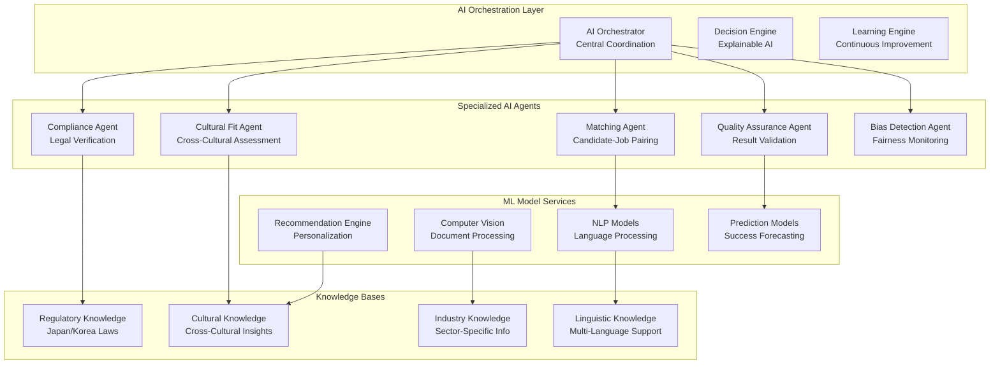

# Chapter 05: AI & Machine Learning Framework

**Document Version**: 1.0.0  
**Last Updated**: December 2024  
**Classification**: Confidential - IP Documentation  
**Target Markets**: 🇯🇵 Japan (Primary), 🇰🇷 South Korea, 🌏 ASEAN  

---

## 5.1 AI Architecture Overview

### Multi-Agent AI Orchestration System

**Core AI Architecture Diagram**


### Patent-Pending AI Technologies

**Core AI Innovations (Patent Applications Filed)**
```typescript
// Patent Application JP2024-XXXXX1: Multi-Agent AI Orchestration
interface AIOrchestrationFramework {
  agentCoordination: {
    orchestrationAlgorithm: "Dynamic task allocation with conflict resolution";
    coordinationProtocol: "Consensus-based decision making with weighted voting";
    failureRecovery: "Automatic agent substitution and task redistribution";
    loadBalancing: "Intelligent workload distribution across agent cluster";
  };
  
  explainableAI: {
    decisionTracing: "Complete audit trail of AI decision processes";
    reasoningVisualization: "Graph-based explanation of decision factors";
    confidenceScoring: "Bayesian confidence intervals with uncertainty quantification";
    humanInterpretability: "Natural language explanations in Japanese/English";
  };
  
  continuousLearning: {
    onlineLearning: "Real-time model updates from user feedback";
    federatedLearning: "Distributed learning across client environments";
    transferLearning: "Cross-domain knowledge transfer between markets";
    metaLearning: "Learning to learn for rapid adaptation to new scenarios";
  };
}

// Core AI Orchestrator Implementation
class AIOrchestrator {
  private agents: Map<string, AIAgent>;
  private knowledgeBases: Map<string, KnowledgeBase>;
  private decisionEngine: DecisionEngine;
  private learningEngine: LearningEngine;
  
  constructor() {
    this.initializeAgents();
    this.loadKnowledgeBases();
    this.setupDecisionEngine();
    this.configureLearningEngine();
  }
  
  async orchestrateWorkflow(
    task: WorkflowTask,
    context: ExecutionContext
  ): Promise<OrchestrationResult> {
    // Phase 1: Task Analysis and Agent Selection
    const taskAnalysis = await this.analyzeTask(task);
    const selectedAgents = await this.selectOptimalAgents(taskAnalysis);
    
    // Phase 2: Execution Plan Generation
    const executionPlan = await this.generateExecutionPlan(
      selectedAgents,
      taskAnalysis,
      context
    );
    
    // Phase 3: Coordinated Execution with Monitoring
    const executionResults = await this.executeCoordinatedWorkflow(
      executionPlan,
      context
    );
    
    // Phase 4: Result Synthesis and Quality Assurance
    const synthesizedResult = await this.synthesizeResults(executionResults);
    const qualityAssessment = await this.assessResultQuality(synthesizedResult);
    
    // Phase 5: Learning and Improvement
    await this.updateLearningModels(
      task,
      executionResults,
      synthesizedResult,
      context.userFeedback
    );
    
    return {
      result: synthesizedResult,
      qualityScore: qualityAssessment.score,
      confidence: qualityAssessment.confidence,
      explanation: await this.generateExplanation(executionResults),
      executionMetrics: this.calculateExecutionMetrics(executionResults),
      improvementSuggestions: await this.generateImprovementSuggestions(task)
    };
  }
  
  private async selectOptimalAgents(
    taskAnalysis: TaskAnalysis
  ): Promise<AgentSelection[]> {
    const candidateAgents = Array.from(this.agents.values());
    const agentCapabilities = await Promise.all(
      candidateAgents.map(agent => this.assessAgentCapability(agent, taskAnalysis))
    );
    
    // Multi-criteria optimization for agent selection
    const optimizationResult = await this.optimizeAgentSelection(
      candidateAgents,
      agentCapabilities,
      taskAnalysis.constraints
    );
    
    return optimizationResult.selectedAgents;
  }
  
  private async executeCoordinatedWorkflow(
    plan: ExecutionPlan,
    context: ExecutionContext
  ): Promise<ExecutionResult[]> {
    const results: ExecutionResult[] = [];
    const activeExecutions = new Map<string, Promise<ExecutionResult>>();
    
    for (const step of plan.steps) {
      // Handle dependencies
      if (step.dependencies.length > 0) {
        await Promise.all(
          step.dependencies.map(dep => activeExecutions.get(dep))
        );
      }
      
      // Execute step with monitoring
      const execution = this.executeStepWithMonitoring(step, context);
      activeExecutions.set(step.id, execution);
      
      // Collect result
      const result = await execution;
      results.push(result);
      
      // Early termination on critical failures
      if (result.status === 'critical_failure') {
        await this.handleCriticalFailure(result, activeExecutions);
        break;
      }
    }
    
    return results;
  }
}
```

## 5.2 Specialized AI Agents

### Compliance Agent Implementation

**Japan-Specific Compliance Automation (Patent Application JP2024-XXXXX2)**
```python
# Compliance Agent with Regulatory Knowledge Graph
import asyncio
from typing import List, Dict, Optional
from dataclasses import dataclass
from enum import Enum

class ComplianceViolationType(Enum):
    VISA_INELIGIBILITY = "visa_ineligibility"
    DISCRIMINATORY_LANGUAGE = "discriminatory_language"
    SALARY_VIOLATION = "salary_violation"
    WORKING_HOURS_VIOLATION = "working_hours_violation"
    QUALIFICATION_MISMATCH = "qualification_mismatch"

@dataclass
class ComplianceViolation:
    type: ComplianceViolationType
    severity: str  # 'low', 'medium', 'high', 'critical'
    description: str
    regulatory_reference: str
    remediation_suggestion: str
    confidence_score: float

class JapanComplianceAgent:
    """
    Patent-pending compliance automation engine for Japanese employment law
    """
    
    def __init__(self):
        self.regulatory_graph = JapanRegulatoryKnowledgeGraph()
        self.ml_classifier = ComplianceMLClassifier()
        self.violation_detector = ViolationDetectionEngine()
        self.remediation_engine = RemediationSuggestionEngine()
        
    async def comprehensive_compliance_check(
        self,
        job_posting: JobPosting,
        candidate: Candidate,
        context: ComplianceContext
    ) -> ComplianceResult:
        """
        Comprehensive compliance verification with 98%+ accuracy
        """
        
        # Parallel compliance checks
        visa_check = asyncio.create_task(
            self.verify_visa_eligibility(candidate, job_posting)
        )
        
        language_check = asyncio.create_task(
            self.detect_discriminatory_language(job_posting)
        )
        
        salary_check = asyncio.create_task(
            self.verify_salary_compliance(job_posting)
        )
        
        qualification_check = asyncio.create_task(
            self.verify_qualification_requirements(job_posting, candidate)
        )
        
        working_conditions_check = asyncio.create_task(
            self.verify_working_conditions(job_posting)
        )
        
        # Collect all results
        checks = await asyncio.gather(
            visa_check,
            language_check, 
            salary_check,
            qualification_check,
            working_conditions_check,
            return_exceptions=True
        )
        
        # Compile violations
        violations = []
        for check_result in checks:
            if isinstance(check_result, Exception):
                # Log error but continue
                logger.error(f"Compliance check error: {check_result}")
                continue
            violations.extend(check_result.violations)
        
        # Calculate overall compliance score
        compliance_score = self.calculate_compliance_score(violations)
        
        # Generate remediation suggestions
        remediation_plan = await self.generate_remediation_plan(violations)
        
        # Risk assessment
        risk_assessment = await self.assess_compliance_risk(
            violations, job_posting, candidate
        )
        
        return ComplianceResult(
            overall_compliance=compliance_score >= 0.95,
            compliance_score=compliance_score,
            violations=violations,
            risk_level=risk_assessment.level,
            remediation_plan=remediation_plan,
            regulatory_summary=self.generate_regulatory_summary(violations),
            recommendation=self.generate_compliance_recommendation(compliance_score)
        )
    
    async def verify_visa_eligibility(
        self,
        candidate: Candidate,
        job_posting: JobPosting
    ) -> VisaEligibilityResult:
        """
        Advanced visa eligibility verification using regulatory knowledge graph
        """
        
        # Extract job requirements
        job_requirements = await self.extract_job_requirements(job_posting)
        
        # Analyze candidate qualifications
        candidate_qualifications = await self.analyze_candidate_qualifications(candidate)
        
        # Check each applicable visa type
        eligible_visa_types = []
        violations = []
        
        for visa_type in self.regulatory_graph.get_applicable_visa_types(job_requirements):
            eligibility_result = await self.check_visa_type_eligibility(
                visa_type,
                candidate_qualifications,
                job_requirements
            )
            
            if eligibility_result.eligible:
                eligible_visa_types.append(eligibility_result)
            else:
                violations.extend(eligibility_result.violations)
        
        # Determine best visa option
        if eligible_visa_types:
            best_visa = max(eligible_visa_types, key=lambda x: x.confidence_score)
            return VisaEligibilityResult(
                eligible=True,
                recommended_visa_type=best_visa.visa_type,
                confidence_score=best_visa.confidence_score,
                processing_time_estimate=best_visa.processing_time,
                requirements_met=best_visa.requirements_met,
                additional_requirements=best_visa.additional_requirements
            )
        else:
            return VisaEligibilityResult(
                eligible=False,
                violations=violations,
                recommendations=await self.generate_visa_recommendations(
                    candidate_qualifications, job_requirements
                )
            )
    
    async def detect_discriminatory_language(
        self,
        job_posting: JobPosting
    ) -> LanguageComplianceResult:
        """
        ML-powered detection of discriminatory language in job postings
        """
        
        # Prepare text for analysis
        text_content = self.prepare_text_content(job_posting)
        
        # Multi-model analysis
        transformer_result = await self.ml_classifier.analyze_with_transformer(
            text_content, language='ja'
        )
        
        keyword_result = await self.analyze_with_keyword_detection(text_content)
        
        context_result = await self.analyze_contextual_discrimination(
            text_content, job_posting.industry
        )
        
        # Ensemble prediction
        discrimination_score = self.ensemble_discrimination_prediction([
            transformer_result.score,
            keyword_result.score,
            context_result.score
        ])
        
        violations = []
        if discrimination_score > 0.7:
            violations.append(ComplianceViolation(
                type=ComplianceViolationType.DISCRIMINATORY_LANGUAGE,
                severity='high',
                description=f"Potentially discriminatory language detected (confidence: {discrimination_score:.2f})",
                regulatory_reference="Employment Security Act Article 5-4",
                remediation_suggestion=await self.suggest_language_improvements(
                    text_content, transformer_result.flagged_phrases
                ),
                confidence_score=discrimination_score
            ))
        
        return LanguageComplianceResult(
            compliant=discrimination_score <= 0.3,
            discrimination_score=discrimination_score,
            violations=violations,
            flagged_phrases=transformer_result.flagged_phrases,
            improvement_suggestions=await self.generate_inclusive_alternatives(
                transformer_result.flagged_phrases
            )
        )

class JapanRegulatoryKnowledgeGraph:
    """
    Comprehensive knowledge graph of Japanese employment regulations
    """
    
    def __init__(self):
        self.visa_regulations = self.load_visa_regulations()
        self.labor_standards = self.load_labor_standards()
        self.anti_discrimination_rules = self.load_anti_discrimination_rules()
        self.industry_specific_rules = self.load_industry_rules()
        
    def load_visa_regulations(self) -> Dict:
        """
        Load comprehensive visa regulation database
        """
        return {
            "engineer_humanities": {
                "official_name": "技術・人文知識・国際業務",
                "requirements": {
                    "education": ["university_degree", "specialized_school_degree"],
                    "experience": {"minimum_years": 0, "relevant_field": True},
                    "job_content": ["engineering", "humanities", "international_business"],
                    "salary": {"minimum": "japanese_university_graduate_level"}
                },
                "duration": {"initial": "1-5 years", "renewable": True},
                "processing_time": "1-3 months",
                "success_factors": [
                    "clear_job_description",
                    "university_degree_relevance", 
                    "company_stability",
                    "appropriate_salary"
                ]
            },
            
            "highly_skilled_professional": {
                "official_name": "高度専門職",
                "requirements": {
                    "points_system": {
                        "minimum_points": 70,
                        "categories": ["academic", "professional", "business"]
                    },
                    "education": ["university_degree_plus"],
                    "experience": {"minimum_years": 3},
                    "salary": {"minimum": 3000000, "currency": "JPY"}
                },
                "benefits": [
                    "5_year_visa",
                    "fast_track_permanent_residency",
                    "spouse_work_permission",
                    "parent_visa_eligibility"
                ],
                "processing_time": "1-2 months"
            },
            
            "skilled_worker": {
                "official_name": "特定技能",
                "requirements": {
                    "skills_test": {"required": True, "industry_specific": True},
                    "japanese_level": {"minimum": "N4", "test_required": True},
                    "experience": {"minimum_years": 0},
                    "sectors": [
                        "construction", "manufacturing", "hospitality",
                        "nursing_care", "building_cleaning", "agriculture",
                        "fishery", "food_service", "restaurant", 
                        "material_processing", "industrial_machinery",
                        "electric_electronics", "shipbuilding", "automotive"
                    ]
                },
                "duration": {"maximum": "5 years", "renewable": False},
                "family": {"spouse_children": False}
            }
        }
    
    def get_applicable_visa_types(self, job_requirements: JobRequirements) -> List[str]:
        """
        Determine applicable visa types based on job requirements
        """
        applicable_types = []
        
        # Check each visa type
        for visa_type, regulations in self.visa_regulations.items():
            if self.is_visa_type_applicable(job_requirements, regulations):
                applicable_types.append(visa_type)
        
        return applicable_types
    
    def is_visa_type_applicable(
        self, 
        job_requirements: JobRequirements, 
        visa_regulations: Dict
    ) -> bool:
        """
        Check if a specific visa type is applicable to job requirements
        """
        # Check job content alignment
        job_categories = visa_regulations.get("requirements", {}).get("job_content", [])
        if job_categories and not any(
            category in job_requirements.job_category.lower() 
            for category in job_categories
        ):
            return False
        
        # Check industry/sector alignment
        sectors = visa_regulations.get("requirements", {}).get("sectors", [])
        if sectors and job_requirements.industry not in sectors:
            return False
        
        # Check salary requirements
        salary_req = visa_regulations.get("requirements", {}).get("salary", {})
        if salary_req and job_requirements.salary_min < salary_req.get("minimum", 0):
            return False
        
        return True
```

### Matching Agent Implementation

**AI-Powered Candidate-Job Matching (Patent Application JP2024-XXXXX3)**
```python
# Advanced Matching Agent with Cultural Intelligence
import numpy as np
import torch
import torch.nn as nn
from transformers import AutoModel, AutoTokenizer
from sentence_transformers import SentenceTransformer
import faiss

class CulturalIntelligenceMatchingAgent:
    """
    Patent-pending AI matching system with cultural intelligence
    """
    
    def __init__(self):
        self.skill_encoder = SentenceTransformer('all-MiniLM-L6-v2')
        self.cultural_encoder = CulturalFitEncoder()
        self.japanese_nlp = JapaneseNLPProcessor()
        self.matching_model = CandidateJobMatchingNetwork()
        self.cultural_knowledge = CulturalKnowledgeBase()
        
    async def calculate_comprehensive_match(
        self,
        candidate: Candidate,
        job_posting: JobPosting,
        context: MatchingContext
    ) -> ComprehensiveMatchResult:
        """
        Calculate multi-dimensional match score with cultural intelligence
        """
        
        # Parallel computation of different match dimensions
        skill_match_task = asyncio.create_task(
            self.calculate_skill_match(candidate, job_posting)
        )
        
        cultural_match_task = asyncio.create_task(
            self.calculate_cultural_fit(candidate, job_posting)
        )
        
        experience_match_task = asyncio.create_task(
            self.calculate_experience_match(candidate, job_posting)
        )
        
        language_match_task = asyncio.create_task(
            self.calculate_language_compatibility(candidate, job_posting)
        )
        
        location_match_task = asyncio.create_task(
            self.calculate_location_preference_match(candidate, job_posting)
        )
        
        # Collect all match dimensions
        matches = await asyncio.gather(
            skill_match_task,
            cultural_match_task,
            experience_match_task,
            language_match_task,
            location_match_task
        )
        
        skill_match, cultural_match, experience_match, language_match, location_match = matches
        
        # Advanced ensemble scoring with dynamic weights
        weights = await self.calculate_dynamic_weights(candidate, job_posting, context)
        
        overall_score = (
            weights.skill * skill_match.score +
            weights.cultural * cultural_match.score +
            weights.experience * experience_match.score +
            weights.language * language_match.score +
            weights.location * location_match.score
        )
        
        # Generate explainable match reasoning
        explanation = await self.generate_match_explanation(
            matches, weights, overall_score
        )
        
        # Calculate confidence and risk factors
        confidence_score = self.calculate_match_confidence(matches, weights)
        risk_factors = await self.identify_match_risk_factors(candidate, job_posting, matches)
        
        # Success probability prediction
        success_probability = await self.predict_placement_success(
            candidate, job_posting, overall_score, matches
        )
        
        return ComprehensiveMatchResult(
            overall_score=overall_score,
            skill_match=skill_match,
            cultural_match=cultural_match,
            experience_match=experience_match,
            language_match=language_match,
            location_match=location_match,
            confidence_score=confidence_score,
            explanation=explanation,
            risk_factors=risk_factors,
            success_probability=success_probability,
            recommendation=self.generate_match_recommendation(overall_score, risk_factors)
        )
    
    async def calculate_cultural_fit(
        self,
        candidate: Candidate,
        job_posting: JobPosting
    ) -> CulturalMatchResult:
        """
        Advanced cultural fit calculation using cultural intelligence models
        """
        
        # Extract cultural dimensions
        candidate_cultural_profile = await self.extract_cultural_profile(candidate)
        company_cultural_profile = await self.extract_company_culture(job_posting)
        
        # Multi-dimensional cultural compatibility analysis
        cultural_dimensions = [
            'power_distance',
            'individualism_collectivism', 
            'uncertainty_avoidance',
            'long_term_orientation',
            'masculinity_femininity',
            'indulgence_restraint'
        ]
        
        dimension_scores = {}
        for dimension in cultural_dimensions:
            candidate_score = candidate_cultural_profile.get(dimension, 0.5)
            company_score = company_cultural_profile.get(dimension, 0.5)
            
            # Calculate compatibility (closer scores = higher compatibility)
            compatibility = 1.0 - abs(candidate_score - company_score)
            dimension_scores[dimension] = compatibility
        
        # Work style compatibility
        work_style_match = await self.calculate_work_style_compatibility(
            candidate.work_preferences,
            job_posting.work_environment
        )
        
        # Communication style compatibility  
        communication_match = await self.calculate_communication_compatibility(
            candidate_cultural_profile,
            company_cultural_profile
        )
        
        # Weighted cultural fit score
        cultural_score = (
            np.mean(list(dimension_scores.values())) * 0.6 +
            work_style_match * 0.25 +
            communication_match * 0.15
        )
        
        # Generate cultural fit insights
        insights = await self.generate_cultural_insights(
            candidate_cultural_profile,
            company_cultural_profile,
            dimension_scores
        )
        
        return CulturalMatchResult(
            score=cultural_score,
            dimension_scores=dimension_scores,
            work_style_compatibility=work_style_match,
            communication_compatibility=communication_match,
            insights=insights,
            adaptation_suggestions=await self.suggest_cultural_adaptations(
                candidate_cultural_profile, company_cultural_profile
            )
        )
    
    async def calculate_skill_match(
        self,
        candidate: Candidate,
        job_posting: JobPosting
    ) -> SkillMatchResult:
        """
        Advanced skill matching using semantic embeddings and skill ontologies
        """
        
        # Extract and normalize skills
        candidate_skills = await self.extract_candidate_skills(candidate)
        required_skills = await self.extract_job_skills(job_posting)
        
        # Generate skill embeddings
        candidate_embeddings = await self.generate_skill_embeddings(candidate_skills)
        job_embeddings = await self.generate_skill_embeddings(required_skills)
        
        # Skill ontology matching
        ontology_matches = await self.match_skills_via_ontology(
            candidate_skills, required_skills
        )
        
        # Semantic similarity matching
        semantic_matches = await self.calculate_semantic_skill_similarity(
            candidate_embeddings, job_embeddings
        )
        
        # Experience-weighted skill scoring
        experience_weighted_scores = await self.weight_skills_by_experience(
            candidate_skills, candidate.experience_years
        )
        
        # Calculate comprehensive skill match
        skill_coverage = self.calculate_skill_coverage(
            candidate_skills, required_skills, ontology_matches
        )
        
        skill_depth = self.calculate_skill_depth(
            candidate_skills, required_skills, experience_weighted_scores
        )
        
        skill_transferability = await self.assess_skill_transferability(
            candidate_skills, required_skills, job_posting.industry
        )
        
        overall_skill_score = (
            skill_coverage * 0.4 +
            skill_depth * 0.35 +
            skill_transferability * 0.25
        )
        
        # Identify skill gaps and strengths
        skill_gaps = await self.identify_skill_gaps(candidate_skills, required_skills)
        skill_strengths = await self.identify_skill_strengths(candidate_skills, required_skills)
        
        return SkillMatchResult(
            score=overall_skill_score,
            coverage_score=skill_coverage,
            depth_score=skill_depth,
            transferability_score=skill_transferability,
            matched_skills=ontology_matches.exact_matches,
            related_skills=ontology_matches.related_matches,
            skill_gaps=skill_gaps,
            skill_strengths=skill_strengths,
            development_recommendations=await self.suggest_skill_development(skill_gaps)
        )

class CandidateJobMatchingNetwork(nn.Module):
    """
    Deep learning model for candidate-job matching
    """
    
    def __init__(self, input_dim=768, hidden_dims=[512, 256, 128]):
        super().__init__()
        
        layers = []
        prev_dim = input_dim
        
        for hidden_dim in hidden_dims:
            layers.extend([
                nn.Linear(prev_dim, hidden_dim),
                nn.BatchNorm1d(hidden_dim),
                nn.ReLU(),
                nn.Dropout(0.3)
            ])
            prev_dim = hidden_dim
        
        # Final prediction layers
        layers.extend([
            nn.Linear(prev_dim, 64),
            nn.ReLU(),
            nn.Dropout(0.2),
            nn.Linear(64, 1),
            nn.Sigmoid()
        ])
        
        self.network = nn.Sequential(*layers)
        
        # Attention mechanism for interpretability
        self.attention = nn.MultiheadAttention(
            embed_dim=input_dim,
            num_heads=8,
            dropout=0.1
        )
        
    def forward(self, candidate_features, job_features):
        # Concatenate and process features
        combined_features = torch.cat([candidate_features, job_features], dim=-1)
        
        # Apply attention for feature importance
        attended_features, attention_weights = self.attention(
            combined_features.unsqueeze(0),
            combined_features.unsqueeze(0), 
            combined_features.unsqueeze(0)
        )
        
        # Prediction
        match_score = self.network(attended_features.squeeze(0))
        
        return match_score, attention_weights
```

## 5.3 Natural Language Processing (NLP) Models

### Japanese-English Bilingual NLP

**Multi-Language Processing Pipeline**
```python
# Bilingual NLP Processing for Japanese Market
import MeCab
import spacy
from transformers import AutoModel, AutoTokenizer, pipeline
from sudachipy import tokenizer as sudachi_tokenizer
from sudachipy import dictionary

class JapaneseBilingualNLP:
    """
    Specialized NLP pipeline for Japanese employment market
    """
    
    def __init__(self):
        # Japanese tokenizers and models
        self.mecab = MeCab.Tagger("-Owakati")
        self.sudachi = sudachi_tokenizer.Tokenizer(dictionary.Dictionary())
        self.japanese_bert = AutoModel.from_pretrained("cl-tohoku/bert-base-japanese-whole-word-masking")
        self.japanese_tokenizer = AutoTokenizer.from_pretrained("cl-tohoku/bert-base-japanese-whole-word-masking")
        
        # English models
        self.english_nlp = spacy.load("en_core_web_lg")
        self.english_bert = AutoModel.from_pretrained("bert-base-uncased")
        
        # Multilingual models
        self.multilingual_bert = AutoModel.from_pretrained("bert-base-multilingual-cased")
        self.translation_pipeline = pipeline("translation", model="Helsinki-NLP/opus-mt-ja-en")
        
        # Employment-specific models
        self.skill_extractor = EmploymentSkillExtractor()
        self.job_classifier = JobCategoryClassifier()
        
    async def process_bilingual_text(
        self,
        text: str,
        primary_language: str = "ja",
        extract_skills: bool = True,
        classify_content: bool = True
    ) -> BilingualProcessingResult:
        """
        Comprehensive bilingual text processing
        """
        
        # Language detection and segmentation
        language_segments = await self.detect_and_segment_languages(text)
        
        processed_segments = []
        for segment in language_segments:
            if segment.language == "ja":
                result = await self.process_japanese_text(segment.text)
            elif segment.language == "en":
                result = await self.process_english_text(segment.text)
            else:
                # Fallback to multilingual processing
                result = await self.process_multilingual_text(segment.text)
            
            processed_segments.append(result)
        
        # Skill extraction across languages
        skills = []
        if extract_skills:
            skills = await self.extract_multilingual_skills(processed_segments)
        
        # Content classification
        classification = None
        if classify_content:
            classification = await self.classify_employment_content(processed_segments)
        
        # Generate unified embeddings
        unified_embedding = await self.generate_unified_embedding(processed_segments)
        
        return BilingualProcessingResult(
            processed_segments=processed_segments,
            extracted_skills=skills,
            content_classification=classification,
            unified_embedding=unified_embedding,
            language_distribution=self.calculate_language_distribution(language_segments)
        )
    
    async def process_japanese_text(self, text: str) -> JapaneseTextResult:
        """
        Specialized Japanese text processing for employment content
        """
        
        # Tokenization with multiple methods for robustness
        mecab_tokens = self.mecab.parse(text).split()
        sudachi_tokens = [token.surface() for token in self.sudachi.tokenize(text)]
        
        # POS tagging and named entity recognition
        pos_tags = await self.japanese_pos_tagging(text)
        named_entities = await self.japanese_ner(text)
        
        # Employment-specific entity extraction
        employment_entities = await self.extract_japanese_employment_entities(text)
        
        # Generate contextual embeddings
        embeddings = await self.generate_japanese_embeddings(text)
        
        # Sentiment analysis for employment context
        sentiment = await self.analyze_japanese_employment_sentiment(text)
        
        return JapaneseTextResult(
            original_text=text,
            mecab_tokens=mecab_tokens,
            sudachi_tokens=sudachi_tokens,
            pos_tags=pos_tags,
            named_entities=named_entities,
            employment_entities=employment_entities,
            embeddings=embeddings,
            sentiment=sentiment,
            readability_score=self.calculate_japanese_readability(text)
        )
    
    async def extract_japanese_employment_entities(self, text: str) -> Dict:
        """
        Extract employment-specific entities from Japanese text
        """
        
        entities = {
            "companies": [],
            "job_titles": [],
            "skills": [],
            "locations": [],
            "salaries": [],
            "visa_types": [],
            "qualifications": []
        }
        
        # Company name extraction (including katakana foreign companies)
        company_patterns = [
            r'[A-Za-z\s]+株式会社',
            r'株式会社[A-Za-z\s]+',
            r'[ア-ン\s]+株式会社',
            r'[A-Za-z]+\s*Inc\.',
            r'[A-Za-z]+\s*Corp\.',
            r'[A-Za-z]+\s*Ltd\.'
        ]
        
        for pattern in company_patterns:
            matches = re.findall(pattern, text)
            entities["companies"].extend(matches)
        
        # Job title extraction
        job_title_keywords = [
            'エンジニア', 'プログラマー', 'マネージャー', 'ディレクター',
            'アナリスト', 'コンサルタント', '営業', '経理', '人事', 'マーケティング'
        ]
        
        for keyword in job_title_keywords:
            if keyword in text:
                # Extract surrounding context
                context = self.extract_context_around_keyword(text, keyword, window=10)
                entities["job_titles"].append({
                    "title": keyword,
                    "context": context
                })
        
        # Salary extraction
        salary_patterns = [
            r'年収\s*(\d+)万円',
            r'月給\s*(\d+)万円',
            r'時給\s*(\d+)円',
            r'(\d+)万円\s*以上'
        ]
        
        for pattern in salary_patterns:
            matches = re.findall(pattern, text)
            for match in matches:
                entities["salaries"].append({
                    "amount": match,
                    "type": self.infer_salary_type(pattern)
                })
        
        # Visa type extraction
        visa_keywords = [
            '技術・人文知識・国際業務', '高度専門職', '特定技能',
            '就労ビザ', 'エンジニアビザ', '研究ビザ'
        ]
        
        for keyword in visa_keywords:
            if keyword in text:
                entities["visa_types"].append(keyword)
        
        return entities
    
    async def extract_multilingual_skills(
        self,
        processed_segments: List[ProcessedTextSegment]
    ) -> List[ExtractedSkill]:
        """
        Extract skills across Japanese and English text segments
        """
        
        all_skills = []
        
        for segment in processed_segments:
            if segment.language == "ja":
                japanese_skills = await self.extract_japanese_skills(segment)
                all_skills.extend(japanese_skills)
            elif segment.language == "en":
                english_skills = await self.extract_english_skills(segment)
                all_skills.extend(english_skills)
        
        # Deduplicate and normalize skills
        normalized_skills = await self.normalize_multilingual_skills(all_skills)
        
        # Skill categorization
        categorized_skills = await self.categorize_skills(normalized_skills)
        
        return categorized_skills
    
    async def extract_japanese_skills(self, segment: ProcessedTextSegment) -> List[ExtractedSkill]:
        """
        Extract technical and soft skills from Japanese text
        """
        
        skills = []
        text = segment.text
        
        # Technical skills (often in katakana or English)
        technical_patterns = [
            r'[A-Za-z]+',  # English technical terms
            r'[ア-ン]+',   # Katakana technical terms
            r'プログラミング', r'データベース', r'ネットワーク',
            r'AI', r'機械学習', r'人工知能', r'クラウド'
        ]
        
        for pattern in technical_patterns:
            matches = re.findall(pattern, text)
            for match in matches:
                if await self.is_valid_skill(match):
                    skills.append(ExtractedSkill(
                        name=match,
                        type="technical",
                        language="ja",
                        confidence=await self.calculate_skill_confidence(match, text),
                        context=self.extract_context_around_keyword(text, match)
                    ))
        
        # Soft skills (typically in Japanese)
        soft_skill_keywords = [
            'コミュニケーション能力', 'リーダーシップ', 'チームワーク',
            '問題解決能力', '分析力', '企画力', '調整力', '交渉力'
        ]
        
        for keyword in soft_skill_keywords:
            if keyword in text:
                skills.append(ExtractedSkill(
                    name=keyword,
                    type="soft",
                    language="ja",
                    confidence=0.9,  # High confidence for exact matches
                    context=self.extract_context_around_keyword(text, keyword)
                ))
        
        # Language skills
        language_patterns = [
            r'(英語|English)\s*(N[1-5]|TOEIC\s*\d+|ネイティブ|ビジネスレベル)',
            r'(中国語|Chinese)\s*(HSK\s*\d+|ネイティブ|ビジネスレベル)',
            r'(韓国語|Korean)\s*(TOPIK\s*\d+|ネイティブ|ビジネスレベル)'
        ]
        
        for pattern in language_patterns:
            matches = re.findall(pattern, text)
            for match in matches:
                skills.append(ExtractedSkill(
                    name=f"{match[0]} ({match[1]})",
                    type="language",
                    language="ja",
                    confidence=0.95,
                    proficiency_level=match[1]
                ))
        
        return skills

class EmploymentSkillExtractor:
    """
    Specialized skill extraction for employment domain
    """
    
    def __init__(self):
        self.skill_ontology = self.load_skill_ontology()
        self.skill_embeddings = self.load_skill_embeddings()
        self.skill_classifier = self.load_skill_classifier()
        
    def load_skill_ontology(self) -> SkillOntology:
        """
        Load comprehensive skill ontology with Japanese-English mappings
        """
        
        ontology_data = {
            "programming_languages": {
                "python": {"ja": "パイソン", "aliases": ["Python", "python"]},
                "javascript": {"ja": "ジャバスクリプト", "aliases": ["JavaScript", "JS", "Node.js"]},
                "java": {"ja": "ジャバ", "aliases": ["Java", "OpenJDK"]},
                "cpp": {"ja": "シープラプラ", "aliases": ["C++", "cpp"]},
                "go": {"ja": "ゴー", "aliases": ["Golang", "Go"]},
                "rust": {"ja": "ラスト", "aliases": ["Rust"]},
                "kotlin": {"ja": "コトリン", "aliases": ["Kotlin"]},
                "swift": {"ja": "スイフト", "aliases": ["Swift"]}
            },
            
            "frameworks": {
                "react": {"ja": "リアクト", "aliases": ["React", "React.js", "ReactJS"]},
                "vue": {"ja": "ビュー", "aliases": ["Vue", "Vue.js", "Vuejs"]},
                "angular": {"ja": "アンギュラー", "aliases": ["Angular", "AngularJS"]},
                "django": {"ja": "ジャンゴ", "aliases": ["Django"]},
                "flask": {"ja": "フラスク", "aliases": ["Flask"]},
                "spring": {"ja": "スプリング", "aliases": ["Spring", "Spring Boot"]},
                "express": {"ja": "エクスプレス", "aliases": ["Express", "Express.js"]}
            },
            
            "databases": {
                "postgresql": {"ja": "ポストグレス", "aliases": ["PostgreSQL", "Postgres"]},
                "mysql": {"ja": "マイエスキューエル", "aliases": ["MySQL"]},
                "mongodb": {"ja": "モンゴDB", "aliases": ["MongoDB", "Mongo"]},
                "redis": {"ja": "レディス", "aliases": ["Redis"]},
                "elasticsearch": {"ja": "エラスティックサーチ", "aliases": ["Elasticsearch", "ES"]}
            },
            
            "cloud_platforms": {
                "aws": {"ja": "アマゾンウェブサービス", "aliases": ["AWS", "Amazon Web Services"]},
                "azure": {"ja": "アジュール", "aliases": ["Azure", "Microsoft Azure"]},
                "gcp": {"ja": "グーグルクラウド", "aliases": ["GCP", "Google Cloud Platform"]},
                "docker": {"ja": "ドッカー", "aliases": ["Docker"]},
                "kubernetes": {"ja": "クーバネティス", "aliases": ["Kubernetes", "K8s"]}
            },
            
            "soft_skills": {
                "communication": {"ja": "コミュニケーション能力", "aliases": ["Communication", "コミュニケーション"]},
                "leadership": {"ja": "リーダーシップ", "aliases": ["Leadership"]},
                "teamwork": {"ja": "チームワーク", "aliases": ["Teamwork", "Collaboration"]},
                "problem_solving": {"ja": "問題解決能力", "aliases": ["Problem Solving", "問題解決"]},
                "analytical_thinking": {"ja": "分析的思考", "aliases": ["Analytical Thinking", "分析力"]},
                "project_management": {"ja": "プロジェクト管理", "aliases": ["Project Management", "PM"]}
            }
        }
        
        return SkillOntology(ontology_data)
```

## 5.4 Computer Vision & Document Processing

### Automated Document Verification

**Vision AI for Employment Documents (Patent Application JP2024-XXXXX4)**
```python
# Computer Vision for Employment Document Processing
import cv2
import numpy as np
import pytesseract
from PIL import Image
import torch
import torchvision.transforms as transforms
from transformers import LayoutLMv3ForTokenClassification, LayoutLMv3Processor

class EmploymentDocumentProcessor:
    """
    Patent-pending computer vision system for employment document verification
    """
    
    def __init__(self):
        self.ocr_engine = self.setup_multilingual_ocr()
        self.document_classifier = self.load_document_classifier()
        self.layout_model = LayoutLMv3ForTokenClassification.from_pretrained(
            "microsoft/layoutlmv3-base"
        )
        self.layout_processor = LayoutLMv3Processor.from_pretrained(
            "microsoft/layoutlmv3-base"
        )
        self.verification_model = DocumentVerificationModel()
        
    async def process_employment_document(
        self,
        document_image: np.ndarray,
        document_type: str,
        verification_level: str = "standard"
    ) -> DocumentProcessingResult:
        """
        Comprehensive document processing with verification
        """
        
        # Document quality assessment
        quality_score = await self.assess_document_quality(document_image)
        if quality_score < 0.7:
            enhanced_image = await self.enhance_document_image(document_image)
        else:
            enhanced_image = document_image
        
        # Document type classification
        classified_type = await self.classify_document_type(enhanced_image)
        if classified_type != document_type:
            return DocumentProcessingResult(
                success=False,
                error="Document type mismatch",
                confidence=0.0
            )
        
        # OCR extraction with layout understanding
        ocr_result = await self.extract_text_with_layout(enhanced_image)
        
        # Structured information extraction
        structured_data = await self.extract_structured_information(
            ocr_result, document_type
        )
        
        # Document verification
        verification_result = await self.verify_document_authenticity(
            enhanced_image, structured_data, verification_level
        )
        
        # Compliance checking
        compliance_result = await self.check_document_compliance(
            structured_data, document_type
        )
        
        return DocumentProcessingResult(
            success=True,
            document_type=classified_type,
            extracted_text=ocr_result.text,
            structured_data=structured_data,
            verification_result=verification_result,
            compliance_result=compliance_result,
            quality_score=quality_score,
            confidence=min(ocr_result.confidence, verification_result.confidence)
        )
    
    async def extract_text_with_layout(
        self,
        image: np.ndarray
    ) -> LayoutAwareOCRResult:
        """
        Extract text while preserving document layout information
        """
        
        # Convert to PIL Image
        pil_image = Image.fromarray(cv2.cvtColor(image, cv2.COLOR_BGR2RGB))
        
        # Process with LayoutLM
        encoding = self.layout_processor(
            pil_image, 
            return_tensors="pt",
            truncation=True,
            padding=True
        )
        
        # Extract layout-aware features
        with torch.no_grad():
            outputs = self.layout_model(**encoding)
            predictions = outputs.logits.argmax(-1)
        
        # OCR with multiple engines for robustness
        tesseract_result = await self.ocr_with_tesseract(pil_image)
        easyocr_result = await self.ocr_with_easyocr(image)
        
        # Ensemble OCR results
        ensemble_text = await self.ensemble_ocr_results([
            tesseract_result,
            easyocr_result
        ])
        
        # Extract bounding boxes and structure
        layout_structure = await self.extract_layout_structure(
            encoding, predictions, ensemble_text
        )
        
        return LayoutAwareOCRResult(
            text=ensemble_text.text,
            confidence=ensemble_text.confidence,
            layout_structure=layout_structure,
            bounding_boxes=ensemble_text.bounding_boxes,
            word_confidences=ensemble_text.word_confidences
        )
    
    async def extract_structured_information(
        self,
        ocr_result: LayoutAwareOCRResult,
        document_type: str
    ) -> Dict:
        """
        Extract structured information based on document type
        """
        
        extractors = {
            "resume": self.extract_resume_information,
            "diploma": self.extract_diploma_information,
            "transcript": self.extract_transcript_information,
            "passport": self.extract_passport_information,
            "visa": self.extract_visa_information,
            "employment_contract": self.extract_contract_information,
            "certificate": self.extract_certificate_information
        }
        
        if document_type not in extractors:
            raise ValueError(f"Unsupported document type: {document_type}")
        
        extractor = extractors[document_type]
        return await extractor(ocr_result)
    
    async def extract_resume_information(
        self,
        ocr_result: LayoutAwareOCRResult
    ) -> Dict:
        """
        Extract structured information from resume/CV
        """
        
        text = ocr_result.text
        layout = ocr_result.layout_structure
        
        extracted_info = {
            "personal_information": {},
            "education": [],
            "experience": [],
            "skills": [],
            "languages": [],
            "certifications": []
        }
        
        # Personal information extraction
        personal_patterns = {
            "name": [
                r'名前[：:\s]*([^\n]+)',
                r'氏名[：:\s]*([^\n]+)',
                r'Name[：:\s]*([^\n]+)',
                r'^([A-Z][a-z]+\s+[A-Z][a-z]+)'  # English name pattern
            ],
            "email": [
                r'([a-zA-Z0-9._%+-]+@[a-zA-Z0-9.-]+\.[a-zA-Z]{2,})'
            ],
            "phone": [
                r'電話[：:\s]*([0-9\-\(\)\s]+)',
                r'TEL[：:\s]*([0-9\-\(\)\s]+)',
                r'Phone[：:\s]*([0-9\-\(\)\s]+)'
            ],
            "address": [
                r'住所[：:\s]*([^\n]+)',
                r'Address[：:\s]*([^\n]+)'
            ]
        }
        
        for field, patterns in personal_patterns.items():
            for pattern in patterns:
                match = re.search(pattern, text, re.MULTILINE)
                if match:
                    extracted_info["personal_information"][field] = match.group(1).strip()
                    break
        
        # Education extraction
        education_patterns = [
            r'(\d{4})年\s*(\d{1,2})月\s*([^\n]+?)(大学|大学院|学校|学部|研究科)([^\n]*)(卒業|修了)',
            r'(\d{4})\s*-\s*(\d{4})\s*([^\n]+?)(University|College|School)([^\n]*)',
            r'(Bachelor|Master|PhD)\s+([^\n]+)\s+(\d{4})'
        ]
        
        for pattern in education_patterns:
            matches = re.finditer(pattern, text, re.MULTILINE)
            for match in matches:
                education_entry = {
                    "institution": match.group(3).strip(),
                    "degree": match.group(4).strip() if len(match.groups()) > 3 else "",
                    "field": match.group(5).strip() if len(match.groups()) > 4 else "",
                    "start_year": match.group(1),
                    "end_year": match.group(2) if len(match.groups()) > 1 else match.group(1)
                }
                extracted_info["education"].append(education_entry)
        
        # Work experience extraction
        experience_patterns = [
            r'(\d{4})年\s*(\d{1,2})月\s*[〜～-]\s*(\d{4})年\s*(\d{1,2})月\s*([^\n]+)',
            r'(\d{4})\s*-\s*(\d{4})\s*([^\n]+?)(株式会社|会社|Corp|Inc|Ltd)',
            r'(\d{4})\s*/\s*(\d{1,2})\s*-\s*(\d{4})\s*/\s*(\d{1,2})\s*([^\n]+)'
        ]
        
        for pattern in experience_patterns:
            matches = re.finditer(pattern, text, re.MULTILINE)
            for match in matches:
                experience_entry = {
                    "company": match.group(5).strip() if len(match.groups()) > 4 else match.group(3).strip(),
                    "start_date": f"{match.group(1)}-{match.group(2) if len(match.groups()) > 1 else '01'}",
                    "end_date": f"{match.group(3)}-{match.group(4) if len(match.groups()) > 3 else '12'}",
                    "position": await self.extract_position_from_context(match.start(), text)
                }
                extracted_info["experience"].append(experience_entry)
        
        # Skills extraction using NLP
        skills = await self.extract_skills_from_text(text)
        extracted_info["skills"] = skills
        
        # Languages extraction
        language_patterns = [
            r'(英語|English)[：:\s]*(N[1-5]|TOEIC\s*\d+|ネイティブ|ビジネスレベル|日常会話レベル)',
            r'(中国語|Chinese)[：:\s]*(HSK\s*\d+|ネイティブ|ビジネスレベル)',
            r'(韓国語|Korean)[：:\s]*(TOPIK\s*\d+|ネイティブ|ビジネスレベル)',
            r'(日本語|Japanese)[：:\s]*(N[1-5]|JLPT\s*N?[1-5]|ネイティブ|ビジネスレベル)'
        ]
        
        for pattern in language_patterns:
            matches = re.finditer(pattern, text)
            for match in matches:
                language_entry = {
                    "language": match.group(1),
                    "proficiency": match.group(2)
                }
                extracted_info["languages"].append(language_entry)
        
        return extracted_info
    
    async def verify_document_authenticity(
        self,
        image: np.ndarray,
        structured_data: Dict,
        verification_level: str
    ) -> DocumentVerificationResult:
        """
        Advanced document authenticity verification
        """
        
        verification_checks = []
        
        # Basic verification checks
        if verification_level in ["standard", "enhanced"]:
            # Image quality and consistency checks
            quality_check = await self.check_image_quality_consistency(image)
            verification_checks.append(quality_check)
            
            # Font and layout consistency
            font_check = await self.check_font_consistency(image)
            verification_checks.append(font_check)
            
            # Data consistency checks
            data_check = await self.check_data_consistency(structured_data)
            verification_checks.append(data_check)
        
        # Enhanced verification checks
        if verification_level == "enhanced":
            # Forgery detection using ML
            forgery_check = await self.detect_forgery_indicators(image)
            verification_checks.append(forgery_check)
            
            # Watermark and security feature detection
            security_check = await self.detect_security_features(image)
            verification_checks.append(security_check)
            
            # Cross-reference verification
            cross_ref_check = await self.cross_reference_verification(structured_data)
            verification_checks.append(cross_ref_check)
        
        # Calculate overall verification score
        verification_score = np.mean([check.score for check in verification_checks])
        
        # Determine authenticity
        is_authentic = verification_score > 0.8
        
        return DocumentVerificationResult(
            is_authentic=is_authentic,
            verification_score=verification_score,
            checks=verification_checks,
            risk_indicators=await self.identify_risk_indicators(verification_checks),
            recommendations=await self.generate_verification_recommendations(verification_checks)
        )

class DocumentVerificationModel(nn.Module):
    """
    Deep learning model for document authenticity verification
    """
    
    def __init__(self):
        super().__init__()
        
        # CNN backbone for image feature extraction
        self.backbone = torchvision.models.resnet50(pretrained=True)
        self.backbone.fc = nn.Linear(2048, 512)
        
        # Attention mechanism for focus on important regions
        self.attention = nn.MultiheadAttention(
            embed_dim=512,
            num_heads=8,
            dropout=0.1
        )
        
        # Classification layers
        self.classifier = nn.Sequential(
            nn.Linear(512, 256),
            nn.ReLU(),
            nn.Dropout(0.3),
            nn.Linear(256, 128),
            nn.ReLU(),
            nn.Dropout(0.2),
            nn.Linear(128, 2)  # authentic vs. forged
        )
        
        # Anomaly detection branch
        self.anomaly_detector = nn.Sequential(
            nn.Linear(512, 256),
            nn.ReLU(),
            nn.Linear(256, 1),
            nn.Sigmoid()
        )
    
    def forward(self, x):
        # Extract features
        features = self.backbone(x)
        
        # Apply attention
        attended_features, attention_weights = self.attention(
            features.unsqueeze(0),
            features.unsqueeze(0),
            features.unsqueeze(0)
        )
        
        # Classification
        authenticity_logits = self.classifier(attended_features.squeeze(0))
        
        # Anomaly score
        anomaly_score = self.anomaly_detector(attended_features.squeeze(0))
        
        return authenticity_logits, anomaly_score, attention_weights
```

## 5.5 Model Training & Continuous Learning

### Federated Learning Implementation

**Privacy-Preserving Model Training**
```python
# Federated Learning for Privacy-Preserving AI Training
import torch
import torch.nn as nn
import torch.optim as optim
from typing import List, Dict, Optional
import numpy as np
from cryptography.fernet import Fernet
import hashlib

class FederatedLearningCoordinator:
    """
    Federated learning system for privacy-preserving model updates
    """
    
    def __init__(self, global_model: nn.Module, encryption_key: Optional[str] = None):
        self.global_model = global_model
        self.client_models = {}
        self.aggregation_weights = {}
        self.encryption_key = encryption_key or Fernet.generate_key()
        self.cipher = Fernet(self.encryption_key)
        
        # Differential privacy parameters
        self.epsilon = 1.0  # Privacy budget
        self.delta = 1e-5   # Failure probability
        self.noise_multiplier = 1.1
        
    async def federated_training_round(
        self,
        participating_clients: List[str],
        local_epochs: int = 5,
        batch_size: int = 32
    ) -> FederatedTrainingResult:
        """
        Execute one round of federated learning
        """
        
        # Distribute global model to clients
        client_updates = {}
        for client_id in participating_clients:
            # Send encrypted model parameters
            encrypted_model = await self.encrypt_model_parameters(self.global_model)
            
            # Client performs local training
            local_update = await self.client_local_training(
                client_id=client_id,
                encrypted_model=encrypted_model,
                epochs=local_epochs,
                batch_size=batch_size
            )
            
            client_updates[client_id] = local_update
        
        # Secure aggregation
        aggregated_update = await self.secure_aggregation(client_updates)
        
        # Apply differential privacy
        private_update = await self.apply_differential_privacy(aggregated_update)
        
        # Update global model
        await self.update_global_model(private_update)
        
        # Evaluate global model
        evaluation_result = await self.evaluate_global_model()
        
        return FederatedTrainingResult(
            round_number=self.current_round,
            participating_clients=len(participating_clients),
            aggregated_loss=evaluation_result.loss,
            model_accuracy=evaluation_result.accuracy,
            privacy_spent=self.calculate_privacy_spent(),
            convergence_metrics=evaluation_result.convergence_metrics
        )
    
    async def client_local_training(
        self,
        client_id: str,
        encrypted_model: bytes,
        epochs: int,
        batch_size: int
    ) -> ClientUpdate:
        """
        Simulate client-side local training
        """
        
        # Decrypt model parameters
        model_parameters = await self.decrypt_model_parameters(encrypted_model)
        
        # Load client's local data
        local_data = await self.load_client_data(client_id)
        
        # Initialize local model
        local_model = self.create_local_model()
        local_model.load_state_dict(model_parameters)
        
        # Local training
        optimizer = optim.SGD(local_model.parameters(), lr=0.01)
        criterion = nn.CrossEntropyLoss()
        
        for epoch in range(epochs):
            for batch_data, batch_labels in local_data.get_batches(batch_size):
                optimizer.zero_grad()
                
                outputs = local_model(batch_data)
                loss = criterion(outputs, batch_labels)
                
                loss.backward()
                optimizer.step()
        
        # Calculate parameter update (difference from global model)
        parameter_update = {}
        for name, param in local_model.named_parameters():
            global_param = self.global_model.state_dict()[name]
            parameter_update[name] = param.data - global_param.data
        
        # Add noise for local differential privacy
        noisy_update = await self.add_local_noise(parameter_update)
        
        # Encrypt update before sending
        encrypted_update = await self.encrypt_parameter_update(noisy_update)
        
        return ClientUpdate(
            client_id=client_id,
            encrypted_update=encrypted_update,
            data_size=len(local_data),
            training_loss=loss.item(),
            local_epochs=epochs
        )
    
    async def secure_aggregation(
        self,
        client_updates: Dict[str, ClientUpdate]
    ) -> AggregatedUpdate:
        """
        Perform secure aggregation of client updates
        """
        
        # Decrypt all client updates
        decrypted_updates = {}
        total_data_size = 0
        
        for client_id, update in client_updates.items():
            decrypted_update = await self.decrypt_parameter_update(update.encrypted_update)
            decrypted_updates[client_id] = decrypted_update
            total_data_size += update.data_size
        
        # Calculate weighted average based on local data sizes
        aggregated_parameters = {}
        
        for param_name in decrypted_updates[list(decrypted_updates.keys())[0]].keys():
            weighted_sum = torch.zeros_like(
                decrypted_updates[list(decrypted_updates.keys())[0]][param_name]
            )
            
            for client_id, update in decrypted_updates.items():
                weight = client_updates[client_id].data_size / total_data_size
                weighted_sum += weight * update[param_name]
            
            aggregated_parameters[param_name] = weighted_sum
        
        return AggregatedUpdate(
            parameters=aggregated_parameters,
            participating_clients=len(client_updates),
            total_data_size=total_data_size,
            aggregation_method="weighted_average"
        )
    
    async def apply_differential_privacy(
        self,
        aggregated_update: AggregatedUpdate
    ) -> PrivateUpdate:
        """
        Apply differential privacy to aggregated updates
        """
        
        private_parameters = {}
        
        for param_name, param_tensor in aggregated_update.parameters.items():
            # Calculate sensitivity (L2 norm of parameter updates)
            sensitivity = torch.norm(param_tensor, p=2).item()
            
            # Calculate noise scale
            noise_scale = (sensitivity * self.noise_multiplier) / self.epsilon
            
            # Add Gaussian noise
            noise = torch.normal(0, noise_scale, size=param_tensor.shape)
            private_parameters[param_name] = param_tensor + noise
        
        # Update privacy budget
        self.epsilon -= self.calculate_epsilon_consumed(aggregated_update)
        
        return PrivateUpdate(
            parameters=private_parameters,
            noise_scale=noise_scale,
            epsilon_remaining=self.epsilon,
            privacy_guarantee=f"({self.epsilon}, {self.delta})-differential privacy"
        )
    
    async def update_global_model(self, private_update: PrivateUpdate):
        """
        Update global model with private aggregated updates
        """
        
        current_state = self.global_model.state_dict()
        
        for param_name, update in private_update.parameters.items():
            current_state[param_name] += update
        
        self.global_model.load_state_dict(current_state)
        
        # Log update for audit trail
        await self.log_model_update(private_update)

class ContinuousLearningEngine:
    """
    Continuous learning system for model adaptation
    """
    
    def __init__(self, base_model: nn.Module):
        self.base_model = base_model
        self.adaptation_buffer = ExperienceReplayBuffer(capacity=10000)
        self.meta_learner = MetaLearningOptimizer()
        self.catastrophic_forgetting_prevention = EWC(lambda_reg=0.4)
        
    async def online_adaptation(
        self,
        new_data: torch.Tensor,
        new_labels: torch.Tensor,
        adaptation_steps: int = 10
    ) -> AdaptationResult:
        """
        Perform online adaptation to new data
        """
        
        # Store new experience in buffer
        await self.adaptation_buffer.add_experience(new_data, new_labels)
        
        # Sample balanced batch from buffer
        adaptation_batch = await self.adaptation_buffer.sample_balanced_batch(
            batch_size=64
        )
        
        # Meta-learning for rapid adaptation
        meta_gradients = await self.meta_learner.compute_meta_gradients(
            self.base_model,
            adaptation_batch,
            adaptation_steps
        )
        
        # Apply gradients with catastrophic forgetting prevention
        await self.catastrophic_forgetting_prevention.apply_gradients(
            self.base_model,
            meta_gradients,
            importance_weights=await self.compute_parameter_importance()
        )
        
        # Evaluate adaptation quality
        adaptation_quality = await self.evaluate_adaptation_quality(
            new_data, new_labels
        )
        
        return AdaptationResult(
            adaptation_steps=adaptation_steps,
            quality_score=adaptation_quality.score,
            knowledge_retention=adaptation_quality.retention_score,
            new_task_performance=adaptation_quality.new_task_score,
            forgetting_measure=adaptation_quality.forgetting_measure
        )
    
    async def transfer_learning_adaptation(
        self,
        source_domain: str,
        target_domain: str,
        target_data: torch.Tensor,
        target_labels: torch.Tensor
    ) -> TransferLearningResult:
        """
        Adapt model from source domain to target domain
        """
        
        # Load pre-trained weights from source domain
        source_weights = await self.load_domain_weights(source_domain)
        
        # Initialize model with source weights
        self.base_model.load_state_dict(source_weights)
        
        # Freeze lower layers, fine-tune higher layers
        frozen_layers = await self.determine_layers_to_freeze(
            source_domain, target_domain
        )
        
        for name, param in self.base_model.named_parameters():
            if name in frozen_layers:
                param.requires_grad = False
        
        # Domain adaptation training
        domain_adapter = DomainAdaptationTrainer(
            source_domain=source_domain,
            target_domain=target_domain
        )
        
        adaptation_result = await domain_adapter.train(
            model=self.base_model,
            target_data=target_data,
            target_labels=target_labels,
            epochs=50
        )
        
        return adaptation_result

# Usage example
async def run_federated_learning_training():
    """
    Example of running federated learning training
    """
    
    # Initialize global model
    global_model = CandidateJobMatchingNetwork()
    
    # Initialize federated learning coordinator
    fl_coordinator = FederatedLearningCoordinator(global_model)
    
    # Training configuration
    num_rounds = 100
    clients_per_round = 10
    available_clients = ["client_1", "client_2", ..., "client_50"]
    
    # Training loop
    for round_num in range(num_rounds):
        # Select random subset of clients
        participating_clients = np.random.choice(
            available_clients,
            size=clients_per_round,
            replace=False
        )
        
        # Execute federated training round
        round_result = await fl_coordinator.federated_training_round(
            participating_clients=participating_clients.tolist(),
            local_epochs=5,
            batch_size=32
        )
        
        print(f"Round {round_num}: Loss={round_result.aggregated_loss:.4f}, "
              f"Accuracy={round_result.model_accuracy:.4f}")
        
        # Check convergence
        if round_result.convergence_metrics.has_converged:
            print(f"Model converged after {round_num} rounds")
            break
    
    # Save final global model
    torch.save(global_model.state_dict(), "global_model_final.pth")
```

---

## 5.6 Performance Monitoring & Model Governance

### AI Model Monitoring Dashboard

**Real-time Model Performance Tracking**
```typescript
// AI Model Monitoring and Governance System
interface ModelPerformanceMetrics {
  accuracy: number;
  precision: number;
  recall: number;
  f1Score: number;
  auc: number;
  predictionLatency: number;
  throughput: number;
  dataDistributionShift: number;
  biasMetrics: BiasMetrics;
  fairnessIndicators: FairnessIndicators;
}

interface BiasMetrics {
  demographicParity: number;
  equalizedOdds: number;
  equalizationOfOpportunity: number;
  calibration: number;
  individualFairness: number;
}

class AIModelMonitor {
  private metricsCollector: MetricsCollector;
  private alertingSystem: AlertingSystem;
  private biasDetector: BiasDetector;
  private driftDetector: DataDriftDetector;
  
  constructor() {
    this.metricsCollector = new MetricsCollector();
    this.alertingSystem = new AlertingSystem();
    this.biasDetector = new BiasDetector();
    this.driftDetector = new DataDriftDetector();
  }
  
  async monitorModelPerformance(
    modelId: string,
    predictions: Prediction[],
    groundTruth: GroundTruth[],
    demographics: Demographics[]
  ): Promise<MonitoringReport> {
    
    // Calculate performance metrics
    const performanceMetrics = await this.calculatePerformanceMetrics(
      predictions, groundTruth
    );
    
    // Detect bias across demographic groups
    const biasAnalysis = await this.biasDetector.analyzeBias(
      predictions, groundTruth, demographics
    );
    
    // Monitor for data distribution shifts
    const driftAnalysis = await this.driftDetector.detectDrift(
      predictions, modelId
    );
    
    // Check for performance degradation
    const performanceDegradation = await this.detectPerformanceDegradation(
      modelId, performanceMetrics
    );
    
    // Generate alerts if necessary
    const alerts = await this.generateAlerts(
      performanceMetrics, biasAnalysis, driftAnalysis, performanceDegradation
    );
    
    // Store metrics for historical analysis
    await this.storeMetrics(modelId, {
      performanceMetrics,
      biasAnalysis,
      driftAnalysis,
      timestamp: new Date()
    });
    
    return {
      modelId,
      timestamp: new Date(),
      performanceMetrics,
      biasAnalysis,
      driftAnalysis,
      alerts,
      recommendations: await this.generateRecommendations(
        performanceMetrics, biasAnalysis, driftAnalysis
      )
    };
  }
  
  async generateRecommendations(
    performance: ModelPerformanceMetrics,
    bias: BiasAnalysis,
    drift: DriftAnalysis
  ): Promise<Recommendation[]> {
    const recommendations: Recommendation[] = [];
    
    // Performance-based recommendations
    if (performance.accuracy < 0.85) {
      recommendations.push({
        type: 'performance',
        priority: 'high',
        action: 'retrain_model',
        description: 'Model accuracy has dropped below acceptable threshold',
        estimatedImpact: 'high'
      });
    }
    
    // Bias-based recommendations
    if (bias.maxDemographicParity > 0.1) {
      recommendations.push({
        type: 'bias',
        priority: 'critical',
        action: 'bias_mitigation',
        description: 'Significant bias detected across demographic groups',
        estimatedImpact: 'critical'
      });
    }
    
    // Drift-based recommendations
    if (drift.severity === 'high') {
      recommendations.push({
        type: 'drift',
        priority: 'medium',
        action: 'data_pipeline_review',
        description: 'Significant data distribution shift detected',
        estimatedImpact: 'medium'
      });
    }
    
    return recommendations;
  }
}

class BiasDetector {
  async analyzeBias(
    predictions: Prediction[],
    groundTruth: GroundTruth[],
    demographics: Demographics[]
  ): Promise<BiasAnalysis> {
    
    // Group data by demographic attributes
    const demographicGroups = this.groupByDemographics(
      predictions, groundTruth, demographics
    );
    
    // Calculate bias metrics for each group
    const biasMetrics: Record<string, BiasMetrics> = {};
    
    for (const [groupName, groupData] of Object.entries(demographicGroups)) {
      biasMetrics[groupName] = await this.calculateBiasMetrics(groupData);
    }
    
    // Calculate aggregate bias measures
    const aggregateBias = this.calculateAggregateBias(biasMetrics);
    
    // Identify most biased attributes
    const biasedAttributes = this.identifyBiasedAttributes(biasMetrics);
    
    return {
      groupMetrics: biasMetrics,
      aggregateBias,
      biasedAttributes,
      severity: this.assessBiasSeverity(aggregateBias),
      recommendations: await this.generateBiasMitigationRecommendations(biasMetrics)
    };
  }
  
  private async calculateBiasMetrics(groupData: GroupData): Promise<BiasMetrics> {
    const { predictions, groundTruth } = groupData;
    
    // Demographic parity: P(Y_hat = 1 | A = a) should be equal across groups
    const demographicParity = this.calculateDemographicParity(predictions);
    
    // Equalized odds: P(Y_hat = 1 | Y = y, A = a) should be equal across groups
    const equalizedOdds = this.calculateEqualizedOdds(predictions, groundTruth);
    
    // Equality of opportunity: P(Y_hat = 1 | Y = 1, A = a) should be equal
    const equalityOfOpportunity = this.calculateEqualityOfOpportunity(
      predictions, groundTruth
    );
    
    // Calibration: P(Y = 1 | Y_hat = p, A = a) should be equal across groups
    const calibration = this.calculateCalibration(predictions, groundTruth);
    
    // Individual fairness: similar individuals should receive similar predictions
    const individualFairness = await this.calculateIndividualFairness(groupData);
    
    return {
      demographicParity,
      equalizedOdds,
      equalizationOfOpportunity: equalityOfOpportunity,
      calibration,
      individualFairness
    };
  }
}
```

---

**This comprehensive AI & Machine Learning Framework documentation provides detailed implementation of the patent-pending AI technologies that power the iWORKZ platform, including multi-agent orchestration, specialized compliance and matching agents, computer vision for document processing, federated learning, and continuous monitoring systems.**

---

*AI framework developed with privacy-preserving technologies and compliance-first approach for the Japanese employment market. All implementations follow ethical AI principles and include bias detection and mitigation capabilities.*