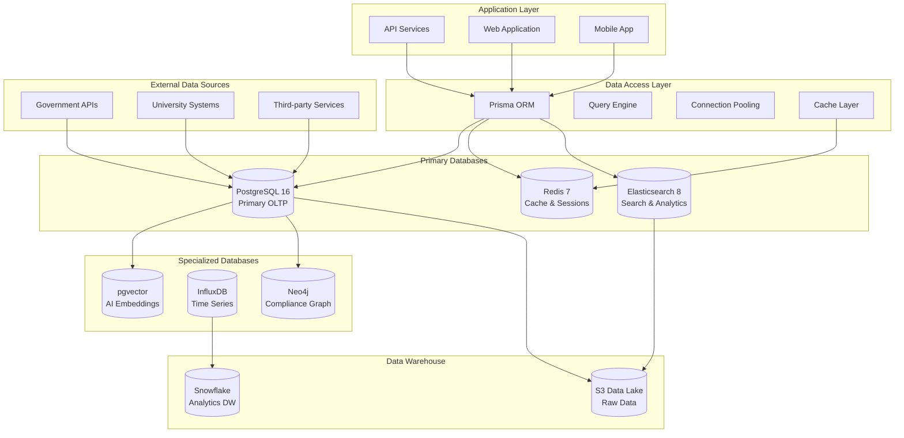

# Chapter 06: Database Design & Data Architecture

**Document Version**: 1.0.0  
**Last Updated**: December 2024  
**Classification**: Confidential - IP Documentation  
**Target Markets**: 🇯🇵 Japan (Primary), 🇰🇷 South Korea, 🌏 ASEAN  

---

## 6.1 Database Architecture Overview

### Multi-Database Strategy

**Database Architecture Diagram**


### Database Technology Selection

**Strategic Database Choices**
```yaml
database_architecture:
  primary_oltp:
    technology: "PostgreSQL 16 with pgvector extension"
    purpose: "Primary transactional database with vector similarity search"
    features:
      - "ACID compliance for data integrity"
      - "Advanced indexing (B-tree, GIN, GiST, BRIN)"
      - "Full-text search with Japanese support"
      - "Vector similarity search for AI embeddings"
      - "JSON/JSONB for flexible schema"
      - "Row-level security for data isolation"
    
  caching_layer:
    technology: "Redis 7 with clustering"
    purpose: "High-performance caching and session storage"
    features:
      - "In-memory key-value storage"
      - "Pub/Sub for real-time updates"
      - "Redis Modules (RedisSearch, RedisGraph)"
      - "Persistence options (RDB, AOF)"
      - "Cluster mode for horizontal scaling"
    
  search_analytics:
    technology: "Elasticsearch 8.11 with security"
    purpose: "Full-text search and analytics"
    features:
      - "Distributed search and analytics"
      - "Real-time indexing and search"
      - "Multilingual analysis (Japanese, English)"
      - "Aggregations for analytics"
      - "Security features (authentication, authorization)"
    
  time_series:
    technology: "InfluxDB 2.7"
    purpose: "Metrics, events, and time-series data"
    features:
      - "High-performance time-series storage"
      - "Built-in analytics and visualization"
      - "Retention policies for data lifecycle"
      - "Continuous queries for real-time processing"
    
  graph_database:
    technology: "Neo4j 5.x"
    purpose: "Compliance relationships and knowledge graphs"
    features:
      - "Native graph storage and processing"
      - "Cypher query language"
      - "ACID transactions"
      - "Graph algorithms library"
      - "Relationship-based queries"
```

## 6.2 Core Database Schema Design

### PostgreSQL Primary Schema

**Complete Database Schema with Japanese Market Optimizations**
```sql
-- ============================================================================
-- iWORKZ Database Schema v1.0
-- Optimized for Japanese Employment Market
-- ============================================================================

-- Enable required extensions
CREATE EXTENSION IF NOT EXISTS "uuid-ossp";
CREATE EXTENSION IF NOT EXISTS "pgcrypto";
CREATE EXTENSION IF NOT EXISTS "vector";
CREATE EXTENSION IF NOT EXISTS "pg_trgm";
CREATE EXTENSION IF NOT EXISTS "unaccent";

-- Custom Types and Enums
CREATE TYPE user_role AS ENUM (
    'candidate', 'employer', 'recruiter', 'admin', 'hr_manager'
);

CREATE TYPE user_status AS ENUM (
    'active', 'inactive', 'suspended', 'pending_verification'
);

CREATE TYPE visa_status AS ENUM (
    'none', 'tourist', 'student', 'work_visa', 'permanent_resident',
    'engineer_humanities', 'highly_skilled_professional', 'skilled_worker',
    'business_manager', 'researcher', 'instructor', 'specialist'
);

CREATE TYPE employment_type AS ENUM (
    'full_time', 'part_time', 'contract', 'temporary', 'internship', 'freelance'
);

CREATE TYPE work_style AS ENUM (
    'office', 'remote', 'hybrid', 'flexible'
);

CREATE TYPE job_status AS ENUM (
    'draft', 'published', 'paused', 'closed', 'archived'
);

CREATE TYPE match_status AS ENUM (
    'generated', 'viewed', 'interested', 'applied', 'interviewed', 
    'offered', 'hired', 'rejected', 'withdrawn'
);

CREATE TYPE compliance_status AS ENUM (
    'pending', 'compliant', 'non_compliant', 'requires_review', 'exempt'
);

CREATE TYPE application_status AS ENUM (
    'submitted', 'screening', 'interview_scheduled', 'interviewing',
    'reference_check', 'offer_extended', 'offer_accepted', 'offer_declined',
    'hired', 'rejected', 'withdrawn'
);

-- ============================================================================
-- CORE USER MANAGEMENT
-- ============================================================================

-- Users table with comprehensive profile support
CREATE TABLE users (
    id UUID PRIMARY KEY DEFAULT uuid_generate_v4(),
    email VARCHAR(255) UNIQUE NOT NULL,
    password_hash VARCHAR(255),
    
    -- Basic Information
    first_name VARCHAR(100) NOT NULL,
    last_name VARCHAR(100) NOT NULL,
    first_name_kana VARCHAR(100), -- Japanese phonetic reading
    last_name_kana VARCHAR(100),  -- Japanese phonetic reading
    display_name VARCHAR(200),
    
    -- Account Management
    role user_role NOT NULL DEFAULT 'candidate',
    status user_status NOT NULL DEFAULT 'active',
    email_verified BOOLEAN DEFAULT FALSE,
    phone VARCHAR(20),
    phone_verified BOOLEAN DEFAULT FALSE,
    
    -- Preferences
    language_preference VARCHAR(5) DEFAULT 'ja',
    timezone VARCHAR(50) DEFAULT 'Asia/Tokyo',
    currency_preference VARCHAR(3) DEFAULT 'JPY',
    
    -- Security
    two_factor_enabled BOOLEAN DEFAULT FALSE,
    two_factor_secret VARCHAR(255),
    backup_codes TEXT[],
    last_password_change TIMESTAMP WITH TIME ZONE DEFAULT NOW(),
    failed_login_attempts INTEGER DEFAULT 0,
    account_locked_until TIMESTAMP WITH TIME ZONE,
    
    -- Activity Tracking
    last_login_at TIMESTAMP WITH TIME ZONE,
    last_activity_at TIMESTAMP WITH TIME ZONE,
    login_count INTEGER DEFAULT 0,
    
    -- Privacy and Consent
    privacy_consent BOOLEAN DEFAULT FALSE,
    marketing_consent BOOLEAN DEFAULT FALSE,
    data_processing_consent BOOLEAN DEFAULT FALSE,
    consent_timestamp TIMESTAMP WITH TIME ZONE,
    
    -- Timestamps
    created_at TIMESTAMP WITH TIME ZONE DEFAULT NOW(),
    updated_at TIMESTAMP WITH TIME ZONE DEFAULT NOW(),
    deleted_at TIMESTAMP WITH TIME ZONE,
    
    -- Full-text search optimization
    search_vector tsvector GENERATED ALWAYS AS (
        to_tsvector('japanese', 
            coalesce(first_name, '') || ' ' || 
            coalesce(last_name, '') || ' ' ||
            coalesce(first_name_kana, '') || ' ' ||
            coalesce(last_name_kana, '') || ' ' ||
            coalesce(display_name, '') || ' ' ||
            coalesce(email, '')
        )
    ) STORED,
    
    -- Constraints
    CONSTRAINT valid_email CHECK (email ~* '^[A-Za-z0-9._%-]+@[A-Za-z0-9.-]+\.[A-Za-z]{2,}$'),
    CONSTRAINT valid_phone CHECK (phone IS NULL OR phone ~ '^\+?[0-9\-\(\)\s]+$')
);

-- User Authentication Sessions
CREATE TABLE user_sessions (
    id UUID PRIMARY KEY DEFAULT uuid_generate_v4(),
    user_id UUID REFERENCES users(id) ON DELETE CASCADE,
    session_token VARCHAR(255) UNIQUE NOT NULL,
    ip_address INET,
    user_agent TEXT,
    device_info JSONB DEFAULT '{}',
    location_info JSONB DEFAULT '{}',
    expires_at TIMESTAMP WITH TIME ZONE NOT NULL,
    created_at TIMESTAMP WITH TIME ZONE DEFAULT NOW(),
    last_accessed_at TIMESTAMP WITH TIME ZONE DEFAULT NOW(),
    is_active BOOLEAN DEFAULT TRUE
);

-- ============================================================================
-- CANDIDATE PROFILES
-- ============================================================================

CREATE TABLE candidate_profiles (
    id UUID PRIMARY KEY DEFAULT uuid_generate_v4(),
    user_id UUID UNIQUE REFERENCES users(id) ON DELETE CASCADE,
    
    -- Personal Information
    date_of_birth DATE,
    gender VARCHAR(20),
    nationality VARCHAR(50),
    country_of_birth VARCHAR(50),
    
    -- Location Information
    current_country VARCHAR(50) DEFAULT 'Japan',
    current_prefecture VARCHAR(50),
    current_city VARCHAR(100),
    current_address TEXT,
    postal_code VARCHAR(10),
    nearest_station VARCHAR(100),
    
    -- Visa and Work Authorization
    current_visa_status visa_status DEFAULT 'none',
    visa_expiry_date DATE,
    visa_sponsor VARCHAR(200),
    work_authorization BOOLEAN DEFAULT FALSE,
    work_authorization_details JSONB DEFAULT '{}',
    
    -- Professional Summary
    professional_summary TEXT,
    professional_summary_ja TEXT,
    career_objective TEXT,
    career_objective_ja TEXT,
    
    -- Experience and Skills
    years_of_experience INTEGER DEFAULT 0,
    career_level VARCHAR(50), -- 'entry', 'mid', 'senior', 'executive'
    industry_experience JSONB DEFAULT '[]',
    technical_skills JSONB DEFAULT '[]',
    soft_skills JSONB DEFAULT '[]',
    certifications JSONB DEFAULT '[]',
    
    -- Language Proficiency
    languages JSONB DEFAULT '[]', -- [{"language": "ja", "level": "N2", "verified": true}]
    
    -- Salary and Compensation
    current_salary_min INTEGER,
    current_salary_max INTEGER,
    desired_salary_min INTEGER,
    desired_salary_max INTEGER,
    salary_currency VARCHAR(3) DEFAULT 'JPY',
    
    -- Job Preferences
    preferred_locations JSONB DEFAULT '[]',
    preferred_industries JSONB DEFAULT '[]',
    preferred_job_types JSONB DEFAULT '[]',
    work_style_preference work_style DEFAULT 'hybrid',
    relocation_willingness BOOLEAN DEFAULT FALSE,
    remote_work_preference BOOLEAN DEFAULT TRUE,
    
    -- Availability
    availability_date DATE,
    notice_period_weeks INTEGER DEFAULT 4,
    
    -- Cultural Assessment
    cultural_assessment_score DECIMAL(3,2),
    cultural_assessment_date TIMESTAMP WITH TIME ZONE,
    cultural_preferences JSONB DEFAULT '{}',
    work_culture_preferences JSONB DEFAULT '{}',
    
    -- AI and Matching
    profile_completeness DECIMAL(3,2) DEFAULT 0.0,
    matching_preferences JSONB DEFAULT '{}',
    ai_insights JSONB DEFAULT '{}',
    
    -- Privacy Settings
    profile_visibility VARCHAR(20) DEFAULT 'public', -- 'public', 'private', 'recruiter_only'
    contact_preferences JSONB DEFAULT '{}',
    
    -- Timestamps
    created_at TIMESTAMP WITH TIME ZONE DEFAULT NOW(),
    updated_at TIMESTAMP WITH TIME ZONE DEFAULT NOW(),
    last_profile_update TIMESTAMP WITH TIME ZONE DEFAULT NOW(),
    
    -- AI Embeddings for Semantic Search
    embedding_vector vector(768),
    skills_embedding vector(384),
    experience_embedding vector(384),
    
    -- Full-text search
    search_vector tsvector GENERATED ALWAYS AS (
        to_tsvector('japanese',
            coalesce(professional_summary, '') || ' ' ||
            coalesce(professional_summary_ja, '') || ' ' ||
            coalesce(career_objective, '') || ' ' ||
            coalesce(career_objective_ja, '') || ' ' ||
            coalesce(current_city, '') || ' ' ||
            coalesce(nationality, '') || ' ' ||
            coalesce(technical_skills::text, '') || ' ' ||
            coalesce(soft_skills::text, '') || ' ' ||
            coalesce(industry_experience::text, '')
        )
    ) STORED
);

-- Candidate Education History
CREATE TABLE candidate_education (
    id UUID PRIMARY KEY DEFAULT uuid_generate_v4(),
    candidate_id UUID REFERENCES candidate_profiles(id) ON DELETE CASCADE,
    
    -- Institution Information
    institution_name VARCHAR(200) NOT NULL,
    institution_name_ja VARCHAR(200),
    institution_country VARCHAR(50),
    institution_type VARCHAR(50), -- 'university', 'college', 'technical_school', 'high_school'
    
    -- Degree Information
    degree_type VARCHAR(100), -- 'bachelor', 'master', 'phd', 'associate', 'certificate'
    degree_name VARCHAR(200),
    degree_name_ja VARCHAR(200),
    field_of_study VARCHAR(200),
    field_of_study_ja VARCHAR(200),
    
    -- Timeline
    start_date DATE,
    end_date DATE,
    is_current BOOLEAN DEFAULT FALSE,
    
    -- Academic Performance
    gpa DECIMAL(3,2),
    gpa_scale DECIMAL(3,2) DEFAULT 4.0,
    honors JSONB DEFAULT '[]',
    
    -- Verification
    verified BOOLEAN DEFAULT FALSE,
    verification_date TIMESTAMP WITH TIME ZONE,
    verification_source VARCHAR(100),
    
    -- Additional Information
    thesis_title TEXT,
    thesis_title_ja TEXT,
    relevant_coursework JSONB DEFAULT '[]',
    extracurricular_activities JSONB DEFAULT '[]',
    
    -- Timestamps
    created_at TIMESTAMP WITH TIME ZONE DEFAULT NOW(),
    updated_at TIMESTAMP WITH TIME ZONE DEFAULT NOW(),
    
    -- Ordering
    display_order INTEGER DEFAULT 0
);

-- Candidate Work Experience
CREATE TABLE candidate_experience (
    id UUID PRIMARY KEY DEFAULT uuid_generate_v4(),
    candidate_id UUID REFERENCES candidate_profiles(id) ON DELETE CASCADE,
    
    -- Company Information
    company_name VARCHAR(200) NOT NULL,
    company_name_ja VARCHAR(200),
    company_industry VARCHAR(100),
    company_size VARCHAR(50),
    company_location VARCHAR(200),
    
    -- Position Information
    job_title VARCHAR(200) NOT NULL,
    job_title_ja VARCHAR(200),
    department VARCHAR(100),
    employment_type employment_type DEFAULT 'full_time',
    
    -- Timeline
    start_date DATE NOT NULL,
    end_date DATE,
    is_current BOOLEAN DEFAULT FALSE,
    
    -- Job Description and Achievements
    job_description TEXT,
    job_description_ja TEXT,
    key_achievements JSONB DEFAULT '[]',
    technologies_used JSONB DEFAULT '[]',
    
    -- Skills and Responsibilities
    skills_gained JSONB DEFAULT '[]',
    responsibilities JSONB DEFAULT '[]',
    team_size INTEGER,
    budget_managed DECIMAL(15,2),
    
    -- Verification
    verified BOOLEAN DEFAULT FALSE,
    verification_contact JSONB DEFAULT '{}',
    
    -- Timestamps
    created_at TIMESTAMP WITH TIME ZONE DEFAULT NOW(),
    updated_at TIMESTAMP WITH TIME ZONE DEFAULT NOW(),
    
    -- Ordering
    display_order INTEGER DEFAULT 0
);

-- ============================================================================
-- COMPANY PROFILES
-- ============================================================================

CREATE TABLE company_profiles (
    id UUID PRIMARY KEY DEFAULT uuid_generate_v4(),
    user_id UUID UNIQUE REFERENCES users(id) ON DELETE CASCADE,
    
    -- Company Basic Information
    company_name VARCHAR(200) NOT NULL,
    company_name_ja VARCHAR(200),
    company_name_kana VARCHAR(200),
    legal_name VARCHAR(200),
    
    -- Business Information
    industry VARCHAR(100),
    sub_industry VARCHAR(100),
    business_description TEXT,
    business_description_ja TEXT,
    company_mission TEXT,
    company_mission_ja TEXT,
    
    -- Company Size and Structure
    company_size VARCHAR(50), -- 'startup', 'small', 'medium', 'large', 'enterprise'
    employee_count_min INTEGER,
    employee_count_max INTEGER,
    annual_revenue_min BIGINT,
    annual_revenue_max BIGINT,
    founded_year INTEGER,
    
    -- Location Information
    headquarters_country VARCHAR(50) DEFAULT 'Japan',
    headquarters_prefecture VARCHAR(50),
    headquarters_city VARCHAR(100),
    headquarters_address TEXT,
    office_locations JSONB DEFAULT '[]',
    
    -- Contact Information
    website_url VARCHAR(500),
    linkedin_url VARCHAR(500),
    twitter_url VARCHAR(500),
    facebook_url VARCHAR(500),
    main_phone VARCHAR(20),
    main_email VARCHAR(255),
    
    -- Employment and HR Information
    total_employees INTEGER,
    international_employees INTEGER,
    international_employee_percentage DECIMAL(5,2),
    visa_sponsorship_available BOOLEAN DEFAULT FALSE,
    supported_visa_types JSONB DEFAULT '[]',
    
    -- Company Culture and Benefits
    company_culture JSONB DEFAULT '{}',
    work_environment work_style DEFAULT 'office',
    benefits JSONB DEFAULT '[]',
    perks JSONB DEFAULT '[]',
    diversity_commitment TEXT,
    
    -- Compliance and Certifications
    employment_agency_license VARCHAR(50),
    license_expiry_date DATE,
    business_registration_number VARCHAR(50),
    tax_registration_number VARCHAR(50),
    compliance_certifications JSONB DEFAULT '[]',
    
    -- Hiring Information
    hiring_process JSONB DEFAULT '{}',
    interview_process TEXT,
    onboarding_process TEXT,
    
    -- Verification and Trust
    verified BOOLEAN DEFAULT FALSE,
    verification_date TIMESTAMP WITH TIME ZONE,
    verification_documents JSONB DEFAULT '[]',
    trust_score DECIMAL(3,2) DEFAULT 0.0,
    
    -- AI and Matching
    company_culture_embedding vector(384),
    requirements_embedding vector(384),
    
    -- Timestamps
    created_at TIMESTAMP WITH TIME ZONE DEFAULT NOW(),
    updated_at TIMESTAMP WITH TIME ZONE DEFAULT NOW(),
    
    -- Full-text search
    search_vector tsvector GENERATED ALWAYS AS (
        to_tsvector('japanese',
            coalesce(company_name, '') || ' ' ||
            coalesce(company_name_ja, '') || ' ' ||
            coalesce(company_name_kana, '') || ' ' ||
            coalesce(industry, '') || ' ' ||
            coalesce(business_description, '') || ' ' ||
            coalesce(business_description_ja, '')
        )
    ) STORED
);

-- ============================================================================
-- JOB POSTINGS
-- ============================================================================

CREATE TABLE job_postings (
    id UUID PRIMARY KEY DEFAULT uuid_generate_v4(),
    company_id UUID REFERENCES company_profiles(id) ON DELETE CASCADE,
    posted_by UUID REFERENCES users(id),
    
    -- Job Basic Information
    title VARCHAR(200) NOT NULL,
    title_ja VARCHAR(200),
    internal_job_id VARCHAR(100),
    
    -- Job Description
    description TEXT NOT NULL,
    description_ja TEXT,
    responsibilities JSONB DEFAULT '[]',
    responsibilities_ja JSONB DEFAULT '[]',
    
    -- Job Classification
    department VARCHAR(100),
    job_function VARCHAR(100),
    job_level VARCHAR(50), -- 'entry', 'mid', 'senior', 'executive', 'manager'
    employment_type employment_type DEFAULT 'full_time',
    
    -- Location and Remote Work
    location VARCHAR(200),
    location_ja VARCHAR(200),
    prefecture VARCHAR(50),
    city VARCHAR(100),
    nearest_station VARCHAR(100),
    remote_work_option work_style DEFAULT 'office',
    relocation_assistance BOOLEAN DEFAULT FALSE,
    relocation_package JSONB DEFAULT '{}',
    
    -- Compensation
    salary_min INTEGER,
    salary_max INTEGER,
    salary_currency VARCHAR(3) DEFAULT 'JPY',
    salary_type VARCHAR(20) DEFAULT 'annual', -- 'annual', 'monthly', 'hourly'
    bonus_structure TEXT,
    equity_offered BOOLEAN DEFAULT FALSE,
    benefits JSONB DEFAULT '[]',
    
    -- Requirements
    min_experience_years INTEGER DEFAULT 0,
    max_experience_years INTEGER,
    required_skills JSONB DEFAULT '[]',
    preferred_skills JSONB DEFAULT '[]',
    required_languages JSONB DEFAULT '[]', -- [{"language": "ja", "min_level": "N3"}]
    education_requirements JSONB DEFAULT '[]',
    certifications_required JSONB DEFAULT '[]',
    
    -- Visa and Legal Requirements
    visa_sponsorship BOOLEAN DEFAULT FALSE,
    supported_visa_types JSONB DEFAULT '[]',
    work_authorization_required BOOLEAN DEFAULT TRUE,
    security_clearance_required BOOLEAN DEFAULT FALSE,
    background_check_required BOOLEAN DEFAULT TRUE,
    
    -- Application Process
    application_instructions TEXT,
    application_instructions_ja TEXT,
    required_documents JSONB DEFAULT '[]',
    application_questions JSONB DEFAULT '[]',
    
    -- Job Status and Timeline
    status job_status DEFAULT 'draft',
    urgency_level VARCHAR(20) DEFAULT 'normal', -- 'low', 'normal', 'high', 'urgent'
    application_deadline DATE,
    start_date DATE,
    contract_duration_months INTEGER, -- for contract positions
    
    -- Application Settings
    max_applications INTEGER,
    auto_reject_unqualified BOOLEAN DEFAULT FALSE,
    screening_questions JSONB DEFAULT '[]',
    
    -- Analytics and Performance
    view_count INTEGER DEFAULT 0,
    application_count INTEGER DEFAULT 0,
    qualified_application_count INTEGER DEFAULT 0,
    
    -- AI and Matching
    job_requirements_embedding vector(768),
    skills_embedding vector(384),
    culture_fit_embedding vector(384),
    matching_criteria JSONB DEFAULT '{}',
    ai_screening_enabled BOOLEAN DEFAULT TRUE,
    
    -- Timestamps
    created_at TIMESTAMP WITH TIME ZONE DEFAULT NOW(),
    updated_at TIMESTAMP WITH TIME ZONE DEFAULT NOW(),
    published_at TIMESTAMP WITH TIME ZONE,
    closed_at TIMESTAMP WITH TIME ZONE,
    
    -- Full-text search
    search_vector tsvector GENERATED ALWAYS AS (
        to_tsvector('japanese',
            coalesce(title, '') || ' ' ||
            coalesce(title_ja, '') || ' ' ||
            coalesce(description, '') || ' ' ||
            coalesce(description_ja, '') || ' ' ||
            coalesce(location, '') || ' ' ||
            coalesce(location_ja, '') || ' ' ||
            coalesce(department, '') || ' ' ||
            coalesce(required_skills::text, '') || ' ' ||
            coalesce(preferred_skills::text, '')
        )
    ) STORED
);

-- ============================================================================
-- MATCHING AND APPLICATIONS
-- ============================================================================

-- AI-Generated Candidate-Job Matches
CREATE TABLE matching_results (
    id UUID PRIMARY KEY DEFAULT uuid_generate_v4(),
    job_posting_id UUID REFERENCES job_postings(id) ON DELETE CASCADE,
    candidate_id UUID REFERENCES candidate_profiles(id) ON DELETE CASCADE,
    
    -- Matching Scores (0.0000 to 1.0000)
    overall_score DECIMAL(6,4) NOT NULL,
    skill_match_score DECIMAL(6,4),
    experience_match_score DECIMAL(6,4),
    cultural_fit_score DECIMAL(6,4),
    location_match_score DECIMAL(6,4),
    salary_match_score DECIMAL(6,4),
    language_match_score DECIMAL(6,4),
    
    -- AI Explanation and Insights
    match_explanation JSONB DEFAULT '{}',
    confidence_score DECIMAL(6,4),
    risk_factors JSONB DEFAULT '[]',
    strength_areas JSONB DEFAULT '[]',
    improvement_areas JSONB DEFAULT '[]',
    
    -- Compliance and Legal
    compliance_status compliance_status DEFAULT 'pending',
    compliance_details JSONB DEFAULT '{}',
    visa_eligibility BOOLEAN,
    visa_recommendations JSONB DEFAULT '[]',
    
    -- Matching Metadata
    matching_algorithm_version VARCHAR(20),
    matching_model_id VARCHAR(50),
    matching_timestamp TIMESTAMP WITH TIME ZONE DEFAULT NOW(),
    
    -- Status and Workflow
    status match_status DEFAULT 'generated',
    viewed_by_company BOOLEAN DEFAULT FALSE,
    viewed_by_candidate BOOLEAN DEFAULT FALSE,
    company_feedback JSONB DEFAULT '{}',
    candidate_feedback JSONB DEFAULT '{}',
    
    -- Performance Tracking
    prediction_accuracy DECIMAL(6,4), -- Updated post-outcome
    actual_outcome VARCHAR(50),        -- For model improvement
    
    -- Timestamps
    created_at TIMESTAMP WITH TIME ZONE DEFAULT NOW(),
    updated_at TIMESTAMP WITH TIME ZONE DEFAULT NOW(),
    
    -- Unique constraint
    UNIQUE(job_posting_id, candidate_id),
    
    -- Constraints
    CONSTRAINT valid_scores CHECK (
        overall_score >= 0 AND overall_score <= 1 AND
        (skill_match_score IS NULL OR (skill_match_score >= 0 AND skill_match_score <= 1)) AND
        (experience_match_score IS NULL OR (experience_match_score >= 0 AND experience_match_score <= 1)) AND
        (cultural_fit_score IS NULL OR (cultural_fit_score >= 0 AND cultural_fit_score <= 1))
    )
);

-- Job Applications
CREATE TABLE job_applications (
    id UUID PRIMARY KEY DEFAULT uuid_generate_v4(),
    job_posting_id UUID REFERENCES job_postings(id) ON DELETE CASCADE,
    candidate_id UUID REFERENCES candidate_profiles(id) ON DELETE CASCADE,
    matching_result_id UUID REFERENCES matching_results(id),
    
    -- Application Information
    cover_letter TEXT,
    cover_letter_ja TEXT,
    custom_responses JSONB DEFAULT '{}', -- Responses to application questions
    
    -- Application Status
    status application_status DEFAULT 'submitted',
    status_updated_at TIMESTAMP WITH TIME ZONE DEFAULT NOW(),
    status_updated_by UUID REFERENCES users(id),
    
    -- Screening and Assessment
    screening_score DECIMAL(6,4),
    screening_notes TEXT,
    hr_notes TEXT,
    hiring_manager_notes TEXT,
    
    -- Interview Process
    interviews_scheduled INTEGER DEFAULT 0,
    interviews_completed INTEGER DEFAULT 0,
    interview_feedback JSONB DEFAULT '[]',
    
    -- Decision and Outcome
    final_decision VARCHAR(50),
    decision_reason TEXT,
    decision_date TIMESTAMP WITH TIME ZONE,
    decision_made_by UUID REFERENCES users(id),
    
    -- Offer Information (if applicable)
    offer_extended BOOLEAN DEFAULT FALSE,
    offer_details JSONB DEFAULT '{}',
    offer_expiry_date TIMESTAMP WITH TIME ZONE,
    offer_response VARCHAR(20), -- 'accepted', 'declined', 'negotiating'
    offer_response_date TIMESTAMP WITH TIME ZONE,
    
    -- Analytics
    time_to_application INTERVAL, -- Time from match to application
    time_to_decision INTERVAL,    -- Time from application to decision
    
    -- Timestamps
    created_at TIMESTAMP WITH TIME ZONE DEFAULT NOW(),
    updated_at TIMESTAMP WITH TIME ZONE DEFAULT NOW(),
    
    -- Unique constraint
    UNIQUE(job_posting_id, candidate_id)
);

-- ============================================================================
-- COMPLIANCE AND REGULATORY
-- ============================================================================

-- Compliance Checks and Results
CREATE TABLE compliance_checks (
    id UUID PRIMARY KEY DEFAULT uuid_generate_v4(),
    
    -- Entity Information
    entity_type VARCHAR(50) NOT NULL, -- 'job_posting', 'candidate_profile', 'application'
    entity_id UUID NOT NULL,
    
    -- Check Details
    check_type VARCHAR(100) NOT NULL, -- 'visa_eligibility', 'discrimination_check', 'salary_compliance'
    check_algorithm VARCHAR(50),
    check_version VARCHAR(20),
    
    -- Results
    compliance_status compliance_status NOT NULL,
    compliance_score DECIMAL(6,4),
    violations JSONB DEFAULT '[]',
    warnings JSONB DEFAULT '[]',
    recommendations JSONB DEFAULT '[]',
    
    -- Regulatory Context
    applicable_regulations JSONB DEFAULT '[]',
    jurisdiction VARCHAR(50) DEFAULT 'Japan',
    
    -- Audit Information
    checked_by VARCHAR(50), -- 'system', 'manual', 'third_party'
    checker_id UUID, -- User ID if manual check
    check_timestamp TIMESTAMP WITH TIME ZONE DEFAULT NOW(),
    
    -- Follow-up
    remediation_required BOOLEAN DEFAULT FALSE,
    remediation_actions JSONB DEFAULT '[]',
    remediation_deadline TIMESTAMP WITH TIME ZONE,
    remediation_status VARCHAR(50),
    
    -- Timestamps
    created_at TIMESTAMP WITH TIME ZONE DEFAULT NOW(),
    updated_at TIMESTAMP WITH TIME ZONE DEFAULT NOW()
);

-- Regulatory Knowledge Base
CREATE TABLE regulatory_rules (
    id UUID PRIMARY KEY DEFAULT uuid_generate_v4(),
    
    -- Rule Identification
    rule_code VARCHAR(100) UNIQUE NOT NULL,
    rule_name VARCHAR(200) NOT NULL,
    rule_name_ja VARCHAR(200),
    
    -- Rule Classification
    category VARCHAR(100), -- 'employment_law', 'immigration_law', 'anti_discrimination'
    subcategory VARCHAR(100),
    jurisdiction VARCHAR(50) DEFAULT 'Japan',
    authority VARCHAR(100), -- 'MHLW', 'MOJ', 'Cabinet Office'
    
    -- Rule Content
    rule_description TEXT NOT NULL,
    rule_description_ja TEXT,
    rule_text TEXT,
    legal_reference VARCHAR(200),
    
    -- Implementation
    implementation_logic JSONB DEFAULT '{}',
    validation_function VARCHAR(100),
    severity_level VARCHAR(20) DEFAULT 'medium',
    
    -- Effective Dates
    effective_from DATE NOT NULL,
    effective_until DATE,
    
    -- Metadata
    last_updated_by UUID REFERENCES users(id),
    
    -- Timestamps
    created_at TIMESTAMP WITH TIME ZONE DEFAULT NOW(),
    updated_at TIMESTAMP WITH TIME ZONE DEFAULT NOW()
);

-- ============================================================================
-- PERFORMANCE INDEXES
-- ============================================================================

-- Users table indexes
CREATE INDEX idx_users_email ON users USING btree (email);
CREATE INDEX idx_users_role_status ON users USING btree (role, status);
CREATE INDEX idx_users_search ON users USING gin (search_vector);
CREATE INDEX idx_users_last_activity ON users USING btree (last_activity_at);

-- Candidate profiles indexes
CREATE INDEX idx_candidates_user_id ON candidate_profiles USING btree (user_id);
CREATE INDEX idx_candidates_visa_status ON candidate_profiles USING btree (current_visa_status);
CREATE INDEX idx_candidates_availability ON candidate_profiles USING btree (availability_date);
CREATE INDEX idx_candidates_experience ON candidate_profiles USING btree (years_of_experience);
CREATE INDEX idx_candidates_location ON candidate_profiles USING btree (current_prefecture, current_city);
CREATE INDEX idx_candidates_salary ON candidate_profiles USING btree (desired_salary_min, desired_salary_max);
CREATE INDEX idx_candidates_embedding ON candidate_profiles USING ivfflat (embedding_vector vector_cosine_ops) WITH (lists = 100);
CREATE INDEX idx_candidates_skills_embedding ON candidate_profiles USING ivfflat (skills_embedding vector_cosine_ops) WITH (lists = 100);
CREATE INDEX idx_candidates_search ON candidate_profiles USING gin (search_vector);

-- Company profiles indexes
CREATE INDEX idx_companies_user_id ON company_profiles USING btree (user_id);
CREATE INDEX idx_companies_industry ON company_profiles USING btree (industry);
CREATE INDEX idx_companies_size ON company_profiles USING btree (company_size);
CREATE INDEX idx_companies_location ON company_profiles USING btree (headquarters_prefecture, headquarters_city);
CREATE INDEX idx_companies_visa_sponsor ON company_profiles USING btree (visa_sponsorship_available);
CREATE INDEX idx_companies_verified ON company_profiles USING btree (verified);
CREATE INDEX idx_companies_search ON company_profiles USING gin (search_vector);

-- Job postings indexes
CREATE INDEX idx_jobs_company_id ON job_postings USING btree (company_id);
CREATE INDEX idx_jobs_status_published ON job_postings USING btree (status, published_at);
CREATE INDEX idx_jobs_location ON job_postings USING btree (prefecture, city);
CREATE INDEX idx_jobs_salary ON job_postings USING btree (salary_min, salary_max);
CREATE INDEX idx_jobs_experience ON job_postings USING btree (min_experience_years, max_experience_years);
CREATE INDEX idx_jobs_visa_sponsor ON job_postings USING btree (visa_sponsorship);
CREATE INDEX idx_jobs_employment_type ON job_postings USING btree (employment_type);
CREATE INDEX idx_jobs_deadline ON job_postings USING btree (application_deadline);
CREATE INDEX idx_jobs_embedding ON job_postings USING ivfflat (job_requirements_embedding vector_cosine_ops) WITH (lists = 100);
CREATE INDEX idx_jobs_search ON job_postings USING gin (search_vector);

-- Matching results indexes
CREATE INDEX idx_matches_job_id ON matching_results USING btree (job_posting_id);
CREATE INDEX idx_matches_candidate_id ON matching_results USING btree (candidate_id);
CREATE INDEX idx_matches_score ON matching_results USING btree (overall_score DESC);
CREATE INDEX idx_matches_status ON matching_results USING btree (status);
CREATE INDEX idx_matches_compliance ON matching_results USING btree (compliance_status);
CREATE INDEX idx_matches_timestamp ON matching_results USING btree (matching_timestamp);

-- Applications indexes
CREATE INDEX idx_applications_job_id ON job_applications USING btree (job_posting_id);
CREATE INDEX idx_applications_candidate_id ON job_applications USING btree (candidate_id);
CREATE INDEX idx_applications_status ON job_applications USING btree (status);
CREATE INDEX idx_applications_created_at ON job_applications USING btree (created_at);

-- Compliance checks indexes
CREATE INDEX idx_compliance_entity ON compliance_checks USING btree (entity_type, entity_id);
CREATE INDEX idx_compliance_status ON compliance_checks USING btree (compliance_status);
CREATE INDEX idx_compliance_type ON compliance_checks USING btree (check_type);
CREATE INDEX idx_compliance_timestamp ON compliance_checks USING btree (check_timestamp);

-- ============================================================================
-- TRIGGERS AND FUNCTIONS
-- ============================================================================

-- Function to update updated_at timestamp
CREATE OR REPLACE FUNCTION update_updated_at_column()
RETURNS TRIGGER AS $$
BEGIN
    NEW.updated_at = NOW();
    RETURN NEW;
END;
$$ language 'plpgsql';

-- Apply updated_at trigger to all relevant tables
CREATE TRIGGER update_users_updated_at BEFORE UPDATE ON users
    FOR EACH ROW EXECUTE FUNCTION update_updated_at_column();

CREATE TRIGGER update_candidate_profiles_updated_at BEFORE UPDATE ON candidate_profiles
    FOR EACH ROW EXECUTE FUNCTION update_updated_at_column();

CREATE TRIGGER update_company_profiles_updated_at BEFORE UPDATE ON company_profiles
    FOR EACH ROW EXECUTE FUNCTION update_updated_at_column();

CREATE TRIGGER update_job_postings_updated_at BEFORE UPDATE ON job_postings
    FOR EACH ROW EXECUTE FUNCTION update_updated_at_column();

CREATE TRIGGER update_matching_results_updated_at BEFORE UPDATE ON matching_results
    FOR EACH ROW EXECUTE FUNCTION update_updated_at_column();

CREATE TRIGGER update_job_applications_updated_at BEFORE UPDATE ON job_applications
    FOR EACH ROW EXECUTE FUNCTION update_updated_at_column();

-- Function to calculate profile completeness
CREATE OR REPLACE FUNCTION calculate_profile_completeness()
RETURNS TRIGGER AS $$
DECLARE
    completeness_score DECIMAL(3,2) := 0.0;
    field_count INTEGER := 0;
    completed_fields INTEGER := 0;
BEGIN
    -- Count total fields and completed fields
    field_count := 20; -- Total important fields
    
    -- Check each important field
    IF NEW.professional_summary IS NOT NULL AND LENGTH(NEW.professional_summary) > 10 THEN
        completed_fields := completed_fields + 1;
    END IF;
    
    IF NEW.years_of_experience IS NOT NULL AND NEW.years_of_experience >= 0 THEN
        completed_fields := completed_fields + 1;
    END IF;
    
    IF NEW.technical_skills IS NOT NULL AND jsonb_array_length(NEW.technical_skills) > 0 THEN
        completed_fields := completed_fields + 1;
    END IF;
    
    IF NEW.languages IS NOT NULL AND jsonb_array_length(NEW.languages) > 0 THEN
        completed_fields := completed_fields + 1;
    END IF;
    
    IF NEW.desired_salary_min IS NOT NULL THEN
        completed_fields := completed_fields + 1;
    END IF;
    
    IF NEW.preferred_locations IS NOT NULL AND jsonb_array_length(NEW.preferred_locations) > 0 THEN
        completed_fields := completed_fields + 1;
    END IF;
    
    IF NEW.current_city IS NOT NULL THEN
        completed_fields := completed_fields + 1;
    END IF;
    
    IF NEW.current_visa_status IS NOT NULL AND NEW.current_visa_status != 'none' THEN
        completed_fields := completed_fields + 1;
    END IF;
    
    -- Add more field checks...
    -- (Implementation would continue for all 20 fields)
    
    -- Calculate completeness percentage
    completeness_score := (completed_fields::DECIMAL / field_count::DECIMAL);
    NEW.profile_completeness := completeness_score;
    
    RETURN NEW;
END;
$$ language 'plpgsql';

-- Apply profile completeness trigger
CREATE TRIGGER calculate_candidate_profile_completeness
    BEFORE INSERT OR UPDATE ON candidate_profiles
    FOR EACH ROW EXECUTE FUNCTION calculate_profile_completeness();

-- ============================================================================
-- ROW LEVEL SECURITY (RLS)
-- ============================================================================

-- Enable RLS on sensitive tables
ALTER TABLE users ENABLE ROW LEVEL SECURITY;
ALTER TABLE candidate_profiles ENABLE ROW LEVEL SECURITY;
ALTER TABLE company_profiles ENABLE ROW LEVEL SECURITY;
ALTER TABLE job_applications ENABLE ROW LEVEL SECURITY;

-- RLS Policies for users table
CREATE POLICY user_self_access ON users
    FOR ALL USING (auth.uid() = id);

CREATE POLICY admin_access ON users
    FOR ALL USING (auth.role() = 'admin');

-- RLS Policies for candidate profiles
CREATE POLICY candidate_self_access ON candidate_profiles
    FOR ALL USING (
        user_id = auth.uid() OR 
        profile_visibility = 'public' OR
        (profile_visibility = 'recruiter_only' AND auth.role() IN ('recruiter', 'hr_manager', 'admin'))
    );

-- RLS Policies for company profiles
CREATE POLICY company_self_access ON company_profiles
    FOR ALL USING (user_id = auth.uid() OR auth.role() = 'admin');

CREATE POLICY company_public_read ON company_profiles
    FOR SELECT USING (verified = true);
```

## 6.3 Redis Caching Architecture

### Caching Strategy Implementation

**Redis Cluster Configuration for High Performance**
```typescript
// Redis caching implementation for iWORKZ platform
import Redis from 'ioredis';
import { promisify } from 'util';

interface CacheConfig {
  keyPrefix: string;
  defaultTTL: number;
  maxRetries: number;
  retryDelayOnFailover: number;
}

class iWORKZCacheManager {
  private redisCluster: Redis.Cluster;
  private redisStandalone: Redis;
  private config: CacheConfig;
  
  constructor(config: CacheConfig) {
    this.config = config;
    this.initializeRedisCluster();
    this.initializeRedisStandalone();
  }
  
  private initializeRedisCluster(): void {
    this.redisCluster = new Redis.Cluster([
      {
        host: process.env.REDIS_CLUSTER_HOST_1 || 'localhost',
        port: parseInt(process.env.REDIS_CLUSTER_PORT_1 || '6379'),
      },
      {
        host: process.env.REDIS_CLUSTER_HOST_2 || 'localhost',
        port: parseInt(process.env.REDIS_CLUSTER_PORT_2 || '6380'),
      },
      {
        host: process.env.REDIS_CLUSTER_HOST_3 || 'localhost',
        port: parseInt(process.env.REDIS_CLUSTER_PORT_3 || '6381'),
      },
    ], {
      redisOptions: {
        password: process.env.REDIS_PASSWORD,
        retryDelayOnFailover: this.config.retryDelayOnFailover,
        maxRetriesPerRequest: this.config.maxRetries,
        keyPrefix: this.config.keyPrefix,
      },
      enableOfflineQueue: false,
      slotsRefreshTimeout: 10000,
    });
  }
  
  private initializeRedisStandalone(): void {
    this.redisStandalone = new Redis({
      host: process.env.REDIS_HOST || 'localhost',
      port: parseInt(process.env.REDIS_PORT || '6379'),
      password: process.env.REDIS_PASSWORD,
      retryDelayOnFailover: this.config.retryDelayOnFailover,
      maxRetriesPerRequest: this.config.maxRetries,
      keyPrefix: this.config.keyPrefix,
    });
  }
  
  // ============================================================================
  // USER PROFILE CACHING
  // ============================================================================
  
  async cacheUserProfile(
    userId: string,
    profile: UserProfile,
    ttl: number = 3600
  ): Promise<void> {
    const key = this.buildKey('user:profile', userId);
    await this.setWithExpiry(key, profile, ttl);
  }
  
  async getUserProfile(userId: string): Promise<UserProfile | null> {
    const key = this.buildKey('user:profile', userId);
    return await this.get<UserProfile>(key);
  }
  
  async invalidateUserProfile(userId: string): Promise<void> {
    const patterns = [
      this.buildKey('user:profile', userId),
      this.buildKey('user:settings', userId),
      this.buildKey('user:permissions', userId),
    ];
    
    await Promise.all(patterns.map(pattern => this.delete(pattern)));
  }
  
  // ============================================================================
  // CANDIDATE CACHING
  // ============================================================================
  
  async cacheCandidateProfile(
    candidateId: string,
    profile: CandidateProfile,
    ttl: number = 1800
  ): Promise<void> {
    const key = this.buildKey('candidate:profile', candidateId);
    await this.setWithExpiry(key, profile, ttl);
    
    // Cache frequently accessed profile fields separately
    await this.cacheCandidateSkills(candidateId, profile.technicalSkills, ttl);
    await this.cacheCandidateExperience(candidateId, profile.experience, ttl);
  }
  
  async cacheCandidateSkills(
    candidateId: string,
    skills: Skill[],
    ttl: number = 3600
  ): Promise<void> {
    const key = this.buildKey('candidate:skills', candidateId);
    await this.setWithExpiry(key, skills, ttl);
  }
  
  async cacheCandidateJobRecommendations(
    candidateId: string,
    recommendations: JobRecommendation[],
    ttl: number = 900 // 15 minutes for dynamic recommendations
  ): Promise<void> {
    const key = this.buildKey('candidate:recommendations', candidateId);
    await this.setWithExpiry(key, recommendations, ttl);
  }
  
  // ============================================================================
  // JOB POSTING CACHING
  // ============================================================================
  
  async cacheJobPosting(
    jobId: string,
    jobPosting: JobPosting,
    ttl: number = 3600
  ): Promise<void> {
    const key = this.buildKey('job:posting', jobId);
    await this.setWithExpiry(key, jobPosting, ttl);
    
    // Cache job search filters
    await this.cacheJobSearchFilters(jobId, jobPosting);
  }
  
  async cacheJobSearchFilters(
    jobId: string,
    jobPosting: JobPosting
  ): Promise<void> {
    const filterKey = this.buildKey('job:filters', jobId);
    const filters = {
      location: jobPosting.location,
      salaryRange: `${jobPosting.salaryMin}-${jobPosting.salaryMax}`,
      employmentType: jobPosting.employmentType,
      requiredSkills: jobPosting.requiredSkills,
      experienceLevel: jobPosting.experienceLevel,
    };
    
    await this.setWithExpiry(filterKey, filters, 7200); // 2 hours
  }
  
  async cacheJobSearchResults(
    searchQuery: JobSearchQuery,
    results: JobSearchResult[],
    ttl: number = 600 // 10 minutes for search results
  ): Promise<void> {
    const searchKey = this.buildSearchKey(searchQuery);
    const key = this.buildKey('search:jobs', searchKey);
    
    await this.setWithExpiry(key, {
      query: searchQuery,
      results,
      resultCount: results.length,
      searchTimestamp: new Date().toISOString(),
    }, ttl);
  }
  
  // ============================================================================
  // MATCHING RESULTS CACHING
  // ============================================================================
  
  async cacheCandidateMatches(
    jobId: string,
    matches: CandidateMatch[],
    ttl: number = 1800 // 30 minutes
  ): Promise<void> {
    const key = this.buildKey('matches:candidates', jobId);
    await this.setWithExpiry(key, matches, ttl);
    
    // Cache top matches separately for quick access
    const topMatches = matches.slice(0, 10);
    const topKey = this.buildKey('matches:top', jobId);
    await this.setWithExpiry(topKey, topMatches, ttl);
  }
  
  async cacheJobMatches(
    candidateId: string,
    matches: JobMatch[],
    ttl: number = 1800
  ): Promise<void> {
    const key = this.buildKey('matches:jobs', candidateId);
    await this.setWithExpiry(key, matches, ttl);
  }
  
  async cacheMatchingInsights(
    matchId: string,
    insights: MatchingInsights,
    ttl: number = 7200 // 2 hours for insights
  ): Promise<void> {
    const key = this.buildKey('insights:match', matchId);
    await this.setWithExpiry(key, insights, ttl);
  }
  
  // ============================================================================
  // COMPLIANCE CACHING
  // ============================================================================
  
  async cacheComplianceCheck(
    candidateId: string,
    jobId: string,
    result: ComplianceCheckResult,
    ttl: number = 14400 // 4 hours for compliance checks
  ): Promise<void> {
    const key = this.buildKey('compliance', `${candidateId}:${jobId}`);
    await this.setWithExpiry(key, result, ttl);
  }
  
  async cacheVisaEligibility(
    candidateId: string,
    visaType: string,
    eligibility: VisaEligibilityResult,
    ttl: number = 86400 // 24 hours
  ): Promise<void> {
    const key = this.buildKey('visa:eligibility', `${candidateId}:${visaType}`);
    await this.setWithExpiry(key, eligibility, ttl);
  }
  
  async cacheRegulatoryRules(
    jurisdiction: string,
    rules: RegulatoryRule[],
    ttl: number = 604800 // 1 week for regulatory rules
  ): Promise<void> {
    const key = this.buildKey('regulatory:rules', jurisdiction);
    await this.setWithExpiry(key, rules, ttl);
  }
  
  // ============================================================================
  // SESSION AND AUTHENTICATION
  // ============================================================================
  
  async createUserSession(
    userId: string,
    sessionData: UserSession,
    ttl: number = 86400 // 24 hours
  ): Promise<string> {
    const sessionId = this.generateSessionId();
    const key = this.buildKey('session', sessionId);
    
    const sessionRecord = {
      userId,
      ...sessionData,
      createdAt: new Date().toISOString(),
      lastAccessed: new Date().toISOString(),
    };
    
    await this.setWithExpiry(key, sessionRecord, ttl);
    
    // Track user's active sessions
    const userSessionsKey = this.buildKey('user:sessions', userId);
    await this.redisCluster.sadd(userSessionsKey, sessionId);
    await this.redisCluster.expire(userSessionsKey, ttl);
    
    return sessionId;
  }
  
  async getUserSession(sessionId: string): Promise<UserSession | null> {
    const key = this.buildKey('session', sessionId);
    const session = await this.get<UserSession>(key);
    
    if (session) {
      // Update last accessed timestamp
      session.lastAccessed = new Date().toISOString();
      await this.setWithExpiry(key, session, 86400);
    }
    
    return session;
  }
  
  async invalidateUserSessions(userId: string): Promise<void> {
    const userSessionsKey = this.buildKey('user:sessions', userId);
    const sessionIds = await this.redisCluster.smembers(userSessionsKey);
    
    const deletePromises = sessionIds.map(sessionId => {
      const sessionKey = this.buildKey('session', sessionId);
      return this.delete(sessionKey);
    });
    
    await Promise.all(deletePromises);
    await this.delete(userSessionsKey);
  }
  
  // ============================================================================
  // RATE LIMITING
  // ============================================================================
  
  async checkRateLimit(
    identifier: string,
    limit: number,
    windowSeconds: number
  ): Promise<RateLimitResult> {
    const key = this.buildKey('rate_limit', identifier);
    const now = Date.now();
    const windowStart = now - (windowSeconds * 1000);
    
    // Use Redis sorted sets for sliding window rate limiting
    const pipeline = this.redisCluster.pipeline();
    
    // Remove expired entries
    pipeline.zremrangebyscore(key, '-inf', windowStart);
    
    // Count current requests in window
    pipeline.zcard(key);
    
    // Add current request
    pipeline.zadd(key, now, `${now}-${Math.random()}`);
    
    // Set expiry
    pipeline.expire(key, windowSeconds);
    
    const results = await pipeline.exec();
    const currentCount = results[1][1] as number;
    
    const allowed = currentCount < limit;
    const remaining = Math.max(0, limit - currentCount - 1);
    const resetTime = now + (windowSeconds * 1000);
    
    return {
      allowed,
      remaining,
      resetTime,
      currentCount: currentCount + 1,
    };
  }
  
  // ============================================================================
  // ANALYTICS CACHING
  // ============================================================================
  
  async cacheAnalyticsMetrics(
    metricType: string,
    timeframe: string,
    metrics: AnalyticsMetrics,
    ttl: number = 3600
  ): Promise<void> {
    const key = this.buildKey('analytics', `${metricType}:${timeframe}`);
    await this.setWithExpiry(key, metrics, ttl);
  }
  
  async incrementCounter(
    counterName: string,
    increment: number = 1,
    windowSeconds: number = 3600
  ): Promise<number> {
    const key = this.buildKey('counter', counterName);
    const count = await this.redisCluster.incrby(key, increment);
    
    // Set expiry if this is a new counter
    if (count === increment) {
      await this.redisCluster.expire(key, windowSeconds);
    }
    
    return count;
  }
  
  // ============================================================================
  // UTILITY METHODS
  // ============================================================================
  
  private buildKey(...parts: string[]): string {
    return parts.join(':');
  }
  
  private buildSearchKey(query: JobSearchQuery): string {
    const queryString = JSON.stringify(query);
    const crypto = require('crypto');
    return crypto.createHash('md5').update(queryString).digest('hex');
  }
  
  private generateSessionId(): string {
    const crypto = require('crypto');
    return crypto.randomBytes(32).toString('hex');
  }
  
  private async get<T>(key: string): Promise<T | null> {
    try {
      const value = await this.redisCluster.get(key);
      return value ? JSON.parse(value) : null;
    } catch (error) {
      console.error(`Redis GET error for key ${key}:`, error);
      return null;
    }
  }
  
  private async setWithExpiry(
    key: string,
    value: any,
    ttl: number
  ): Promise<void> {
    try {
      const serializedValue = JSON.stringify(value);
      await this.redisCluster.setex(key, ttl, serializedValue);
    } catch (error) {
      console.error(`Redis SET error for key ${key}:`, error);
      throw error;
    }
  }
  
  private async delete(key: string): Promise<void> {
    try {
      await this.redisCluster.del(key);
    } catch (error) {
      console.error(`Redis DELETE error for key ${key}:`, error);
    }
  }
  
  // ============================================================================
  // CACHE WARMING AND PRELOADING
  // ============================================================================
  
  async warmupCacheForUser(userId: string): Promise<void> {
    // Preload frequently accessed user data
    const user = await this.loadUserFromDatabase(userId);
    if (!user) return;
    
    await this.cacheUserProfile(userId, user.profile);
    
    if (user.role === 'candidate') {
      // Preload candidate-specific data
      const candidateProfile = await this.loadCandidateProfile(userId);
      if (candidateProfile) {
        await this.cacheCandidateProfile(candidateProfile.id, candidateProfile);
        
        // Preload job recommendations
        const recommendations = await this.generateJobRecommendations(candidateProfile.id);
        await this.cacheCandidateJobRecommendations(candidateProfile.id, recommendations);
      }
    } else if (user.role === 'employer') {
      // Preload employer-specific data
      const companyProfile = await this.loadCompanyProfile(userId);
      if (companyProfile) {
        const activeJobs = await this.loadActiveJobPostings(companyProfile.id);
        for (const job of activeJobs) {
          await this.cacheJobPosting(job.id, job);
          
          // Preload candidate matches
          const matches = await this.generateCandidateMatches(job.id);
          await this.cacheCandidateMatches(job.id, matches);
        }
      }
    }
  }
  
  async warmupPopularContent(): Promise<void> {
    // Cache frequently accessed job postings
    const popularJobs = await this.getPopularJobPostings();
    for (const job of popularJobs) {
      await this.cacheJobPosting(job.id, job, 7200); // 2 hour TTL
    }
    
    // Cache popular search results
    const popularSearches = await this.getPopularSearchQueries();
    for (const query of popularSearches) {
      const results = await this.executeJobSearch(query);
      await this.cacheJobSearchResults(query, results, 3600); // 1 hour TTL
    }
    
    // Cache regulatory rules
    const jurisdictions = ['Japan', 'Korea'];
    for (const jurisdiction of jurisdictions) {
      const rules = await this.loadRegulatoryRules(jurisdiction);
      await this.cacheRegulatoryRules(jurisdiction, rules);
    }
  }
  
  // Placeholder methods for database operations
  private async loadUserFromDatabase(userId: string): Promise<any> {
    // Implementation would fetch from PostgreSQL
    return null;
  }
  
  private async loadCandidateProfile(userId: string): Promise<any> {
    return null;
  }
  
  private async loadCompanyProfile(userId: string): Promise<any> {
    return null;
  }
  
  private async loadActiveJobPostings(companyId: string): Promise<any[]> {
    return [];
  }
  
  private async generateJobRecommendations(candidateId: string): Promise<any[]> {
    return [];
  }
  
  private async generateCandidateMatches(jobId: string): Promise<any[]> {
    return [];
  }
  
  private async getPopularJobPostings(): Promise<any[]> {
    return [];
  }
  
  private async getPopularSearchQueries(): Promise<any[]> {
    return [];
  }
  
  private async executeJobSearch(query: any): Promise<any[]> {
    return [];
  }
  
  private async loadRegulatoryRules(jurisdiction: string): Promise<any[]> {
    return [];
  }
}

// Usage Example
const cacheManager = new iWORKZCacheManager({
  keyPrefix: 'iworkz:',
  defaultTTL: 3600,
  maxRetries: 3,
  retryDelayOnFailover: 100,
});

export default cacheManager;
```

## 6.4 Elasticsearch Search Architecture

### Advanced Search and Analytics

**Elasticsearch Configuration for Japanese Employment Search**
```json
{
  "settings": {
    "index": {
      "number_of_shards": 3,
      "number_of_replicas": 1,
      "refresh_interval": "5s",
      "max_result_window": 50000
    },
    "analysis": {
      "analyzer": {
        "japanese_analyzer": {
          "type": "custom",
          "tokenizer": "kuromoji_tokenizer",
          "char_filter": ["html_strip", "icu_normalizer"],
          "filter": [
            "kuromoji_baseform",
            "kuromoji_part_of_speech",
            "ja_stop",
            "kuromoji_stemmer",
            "lowercase",
            "asciifolding"
          ]
        },
        "english_analyzer": {
          "type": "custom",
          "tokenizer": "standard",
          "char_filter": ["html_strip"],
          "filter": [
            "lowercase",
            "stop",
            "stemmer",
            "asciifolding"
          ]
        },
        "skill_analyzer": {
          "type": "custom",
          "tokenizer": "keyword",
          "filter": ["lowercase", "trim"]
        },
        "location_analyzer": {
          "type": "custom",
          "tokenizer": "kuromoji_tokenizer",
          "filter": [
            "kuromoji_baseform",
            "lowercase",
            "asciifolding"
          ]
        }
      },
      "tokenizer": {
        "kuromoji_tokenizer": {
          "type": "kuromoji_tokenizer",
          "mode": "search",
          "discard_punctuation": true,
          "user_dictionary_rules": [
            "iWORKZ,iWORKZ,アイワークス,カスタム名詞",
            "AI,AI,エーアイ,カスタム名詞",
            "機械学習,機械学習,キカイガクシュウ,カスタム名詞"
          ]
        }
      },
      "filter": {
        "ja_stop": {
          "type": "stop",
          "stopwords": "_japanese_"
        },
        "kuromoji_stemmer": {
          "type": "kuromoji_stemmer",
          "minimum_length": 4
        }
      }
    }
  },
  "mappings": {
    "properties": {
      "id": {
        "type": "keyword"
      },
      "type": {
        "type": "keyword"
      },
      "title": {
        "type": "text",
        "analyzer": "japanese_analyzer",
        "fields": {
          "raw": {
            "type": "keyword"
          },
          "english": {
            "type": "text",
            "analyzer": "english_analyzer"
          }
        }
      },
      "description": {
        "type": "text",
        "analyzer": "japanese_analyzer",
        "fields": {
          "english": {
            "type": "text",
            "analyzer": "english_analyzer"
          }
        }
      },
      "skills": {
        "type": "text",
        "analyzer": "skill_analyzer",
        "fields": {
          "keyword": {
            "type": "keyword"
          }
        }
      },
      "location": {
        "type": "object",
        "properties": {
          "prefecture": {
            "type": "text",
            "analyzer": "location_analyzer",
            "fields": {
              "keyword": {
                "type": "keyword"
              }
            }
          },
          "city": {
            "type": "text",
            "analyzer": "location_analyzer",
            "fields": {
              "keyword": {
                "type": "keyword"
              }
            }
          },
          "coordinates": {
            "type": "geo_point"
          }
        }
      },
      "salary": {
        "type": "object",
        "properties": {
          "min": {
            "type": "integer"
          },
          "max": {
            "type": "integer"
          },
          "currency": {
            "type": "keyword"
          }
        }
      },
      "experience": {
        "type": "object",
        "properties": {
          "years": {
            "type": "integer"
          },
          "level": {
            "type": "keyword"
          }
        }
      },
      "employment_type": {
        "type": "keyword"
      },
      "visa_sponsorship": {
        "type": "boolean"
      },
      "remote_work": {
        "type": "keyword"
      },
      "company": {
        "type": "object",
        "properties": {
          "name": {
            "type": "text",
            "analyzer": "japanese_analyzer",
            "fields": {
              "keyword": {
                "type": "keyword"
              }
            }
          },
          "industry": {
            "type": "keyword"
          },
          "size": {
            "type": "keyword"
          }
        }
      },
      "created_at": {
        "type": "date"
      },
      "updated_at": {
        "type": "date"
      },
      "boost_score": {
        "type": "float"
      },
      "ai_embedding": {
        "type": "dense_vector",
        "dims": 768
      }
    }
  }
}
```

**Advanced Search Service Implementation**
```typescript
// Advanced Elasticsearch search service for iWORKZ
import { Client } from '@elastic/elasticsearch';
import { SearchRequest, SearchResponse } from '@elastic/elasticsearch/lib/api/types';

interface JobSearchFilters {
  keywords?: string;
  location?: LocationFilter;
  salaryRange?: SalaryRange;
  experienceLevel?: string[];
  employmentType?: string[];
  skills?: string[];
  visaSponsorship?: boolean;
  remoteWork?: string[];
  companySize?: string[];
  industry?: string[];
}

interface LocationFilter {
  prefecture?: string;
  city?: string;
  coordinates?: {
    lat: number;
    lon: number;
    radius: string;
  };
}

interface SalaryRange {
  min?: number;
  max?: number;
  currency?: string;
}

class AdvancedSearchService {
  private esClient: Client;
  private jobsIndex = 'iworkz_jobs';
  private candidatesIndex = 'iworkz_candidates';
  
  constructor() {
    this.esClient = new Client({
      node: process.env.ELASTICSEARCH_URL || 'http://localhost:9200',
      auth: {
        username: process.env.ELASTICSEARCH_USERNAME || 'elastic',
        password: process.env.ELASTICSEARCH_PASSWORD || 'password',
      },
      tls: {
        rejectUnauthorized: false,
      },
    });
  }
  
  // ============================================================================
  // JOB SEARCH
  // ============================================================================
  
  async searchJobs(
    filters: JobSearchFilters,
    page: number = 0,
    size: number = 20,
    sortBy: string = 'relevance'
  ): Promise<SearchResponse> {
    const searchBody = this.buildJobSearchQuery(filters, sortBy);
    
    const searchParams: SearchRequest = {
      index: this.jobsIndex,
      body: searchBody,
      from: page * size,
      size,
      track_total_hits: true,
    };
    
    // Add highlighting for matched terms
    searchParams.body.highlight = {
      fields: {
        title: {
          pre_tags: ['<mark>'],
          post_tags: ['</mark>'],
          fragment_size: 150,
          number_of_fragments: 3,
        },
        description: {
          pre_tags: ['<mark>'],
          post_tags: ['</mark>'],
          fragment_size: 150,
          number_of_fragments: 3,
        },
        'skills.keyword': {
          pre_tags: ['<mark>'],
          post_tags: ['</mark>'],
        },
      },
    };
    
    try {
      const response = await this.esClient.search(searchParams);
      
      // Log search analytics
      await this.logSearchAnalytics(filters, response.body.hits.total);
      
      return response.body;
    } catch (error) {
      console.error('Job search error:', error);
      throw new Error('Search service unavailable');
    }
  }
  
  private buildJobSearchQuery(filters: JobSearchFilters, sortBy: string): any {
    const query: any = {
      bool: {
        must: [],
        filter: [],
        should: [],
        minimum_should_match: 0,
      },
    };
    
    // Keywords search with multi-field matching
    if (filters.keywords) {
      query.bool.must.push({
        multi_match: {
          query: filters.keywords,
          fields: [
            'title^3',
            'title.english^2',
            'description^2',
            'description.english',
            'skills^2',
            'company.name',
          ],
          type: 'best_fields',
          fuzziness: 'AUTO',
          prefix_length: 1,
        },
      });
      
      // Boost exact matches
      query.bool.should.push({
        multi_match: {
          query: filters.keywords,
          fields: ['title.raw^5', 'skills.keyword^3'],
          type: 'phrase',
          boost: 2,
        },
      });
    }
    
    // Location filtering
    if (filters.location) {
      if (filters.location.coordinates) {
        query.bool.filter.push({
          geo_distance: {
            distance: filters.location.coordinates.radius,
            'location.coordinates': {
              lat: filters.location.coordinates.lat,
              lon: filters.location.coordinates.lon,
            },
          },
        });
      }
      
      if (filters.location.prefecture) {
        query.bool.filter.push({
          term: {
            'location.prefecture.keyword': filters.location.prefecture,
          },
        });
      }
      
      if (filters.location.city) {
        query.bool.filter.push({
          term: {
            'location.city.keyword': filters.location.city,
          },
        });
      }
    }
    
    // Salary range filtering
    if (filters.salaryRange) {
      const salaryFilter: any = {};
      
      if (filters.salaryRange.min) {
        salaryFilter.gte = filters.salaryRange.min;
      }
      
      if (filters.salaryRange.max) {
        salaryFilter.lte = filters.salaryRange.max;
      }
      
      if (Object.keys(salaryFilter).length > 0) {
        query.bool.filter.push({
          range: {
            'salary.max': salaryFilter,
          },
        });
      }
    }
    
    // Skills filtering
    if (filters.skills && filters.skills.length > 0) {
      query.bool.filter.push({
        terms: {
          'skills.keyword': filters.skills,
        },
      });
    }
    
    // Experience level filtering
    if (filters.experienceLevel && filters.experienceLevel.length > 0) {
      query.bool.filter.push({
        terms: {
          'experience.level': filters.experienceLevel,
        },
      });
    }
    
    // Employment type filtering
    if (filters.employmentType && filters.employmentType.length > 0) {
      query.bool.filter.push({
        terms: {
          employment_type: filters.employmentType,
        },
      });
    }
    
    // Visa sponsorship filtering
    if (filters.visaSponsorship !== undefined) {
      query.bool.filter.push({
        term: {
          visa_sponsorship: filters.visaSponsorship,
        },
      });
    }
    
    // Remote work filtering
    if (filters.remoteWork && filters.remoteWork.length > 0) {
      query.bool.filter.push({
        terms: {
          remote_work: filters.remoteWork,
        },
      });
    }
    
    // Company size filtering
    if (filters.companySize && filters.companySize.length > 0) {
      query.bool.filter.push({
        terms: {
          'company.size': filters.companySize,
        },
      });
    }
    
    // Industry filtering
    if (filters.industry && filters.industry.length > 0) {
      query.bool.filter.push({
        terms: {
          'company.industry': filters.industry,
        },
      });
    }
    
    // Build sort configuration
    const sort = this.buildSortConfiguration(sortBy);
    
    return {
      query,
      sort,
      aggs: this.buildSearchAggregations(),
    };
  }
  
  private buildSortConfiguration(sortBy: string): any[] {
    const sortConfigs: Record<string, any[]> = {
      relevance: [
        '_score',
        { created_at: { order: 'desc' } },
      ],
      date: [
        { created_at: { order: 'desc' } },
        '_score',
      ],
      salary: [
        { 'salary.max': { order: 'desc' } },
        '_score',
      ],
      company: [
        { 'company.name.keyword': { order: 'asc' } },
        '_score',
      ],
    };
    
    return sortConfigs[sortBy] || sortConfigs.relevance;
  }
  
  private buildSearchAggregations(): any {
    return {
      locations: {
        terms: {
          field: 'location.prefecture.keyword',
          size: 20,
        },
      },
      industries: {
        terms: {
          field: 'company.industry',
          size: 15,
        },
      },
      employment_types: {
        terms: {
          field: 'employment_type',
          size: 10,
        },
      },
      experience_levels: {
        terms: {
          field: 'experience.level',
          size: 10,
        },
      },
      salary_ranges: {
        range: {
          field: 'salary.max',
          ranges: [
            { to: 3000000, key: '< ¥3M' },
            { from: 3000000, to: 5000000, key: '¥3M - ¥5M' },
            { from: 5000000, to: 8000000, key: '¥5M - ¥8M' },
            { from: 8000000, to: 12000000, key: '¥8M - ¥12M' },
            { from: 12000000, key: '> ¥12M' },
          ],
        },
      },
      top_skills: {
        terms: {
          field: 'skills.keyword',
          size: 20,
        },
      },
      company_sizes: {
        terms: {
          field: 'company.size',
          size: 10,
        },
      },
      visa_sponsorship: {
        terms: {
          field: 'visa_sponsorship',
          size: 2,
        },
      },
      remote_work: {
        terms: {
          field: 'remote_work',
          size: 5,
        },
      },
    };
  }
  
  // ============================================================================
  // SEMANTIC SEARCH WITH AI EMBEDDINGS
  // ============================================================================
  
  async semanticJobSearch(
    queryText: string,
    embedding: number[],
    filters: JobSearchFilters = {},
    page: number = 0,
    size: number = 20
  ): Promise<SearchResponse> {
    const searchBody = {
      query: {
        script_score: {
          query: this.buildJobSearchQuery(filters, 'relevance').query,
          script: {
            source: "cosineSimilarity(params.query_vector, 'ai_embedding') + 1.0",
            params: {
              query_vector: embedding,
            },
          },
        },
      },
      from: page * size,
      size,
      highlight: {
        fields: {
          title: {},
          description: {},
          'skills.keyword': {},
        },
      },
    };
    
    try {
      const response = await this.esClient.search({
        index: this.jobsIndex,
        body: searchBody,
      });
      
      return response.body;
    } catch (error) {
      console.error('Semantic search error:', error);
      throw new Error('Semantic search service unavailable');
    }
  }
  
  // ============================================================================
  // AUTOCOMPLETE AND SUGGESTIONS
  // ============================================================================
  
  async getJobSuggestions(
    query: string,
    field: 'title' | 'skills' | 'company' | 'location' = 'title'
  ): Promise<string[]> {
    const fieldMapping = {
      title: 'title.raw',
      skills: 'skills.keyword',
      company: 'company.name.keyword',
      location: 'location.city.keyword',
    };
    
    const searchBody = {
      suggest: {
        suggestions: {
          prefix: query,
          completion: {
            field: fieldMapping[field],
            size: 10,
            skip_duplicates: true,
          },
        },
      },
    };
    
    try {
      const response = await this.esClient.search({
        index: this.jobsIndex,
        body: searchBody,
      });
      
      return response.body.suggest.suggestions[0].options.map(
        (option: any) => option.text
      );
    } catch (error) {
      console.error('Suggestion error:', error);
      return [];
    }
  }
  
  // ============================================================================
  // ANALYTICS AND INSIGHTS
  // ============================================================================
  
  async getJobMarketInsights(
    timeframe: string = '30d',
    location?: string
  ): Promise<JobMarketInsights> {
    const searchBody = {
      size: 0,
      query: {
        bool: {
          filter: [
            {
              range: {
                created_at: {
                  gte: `now-${timeframe}`,
                },
              },
            },
          ],
        },
      },
      aggs: {
        job_trends: {
          date_histogram: {
            field: 'created_at',
            calendar_interval: '1d',
          },
        },
        top_skills_demand: {
          terms: {
            field: 'skills.keyword',
            size: 20,
          },
          aggs: {
            avg_salary: {
              avg: {
                field: 'salary.max',
              },
            },
          },
        },
        industry_distribution: {
          terms: {
            field: 'company.industry',
            size: 15,
          },
        },
        salary_trends: {
          date_histogram: {
            field: 'created_at',
            calendar_interval: '1w',
          },
          aggs: {
            avg_salary: {
              avg: {
                field: 'salary.max',
              },
            },
          },
        },
        location_demand: {
          terms: {
            field: 'location.prefecture.keyword',
            size: 10,
          },
        },
        visa_sponsorship_trends: {
          date_histogram: {
            field: 'created_at',
            calendar_interval: '1w',
          },
          aggs: {
            sponsorship_rate: {
              avg: {
                field: 'visa_sponsorship',
              },
            },
          },
        },
      },
    };
    
    // Add location filter if specified
    if (location) {
      searchBody.query.bool.filter.push({
        term: {
          'location.prefecture.keyword': location,
        },
      });
    }
    
    try {
      const response = await this.esClient.search({
        index: this.jobsIndex,
        body: searchBody,
      });
      
      return this.processMarketInsights(response.body.aggregations);
    } catch (error) {
      console.error('Market insights error:', error);
      throw new Error('Analytics service unavailable');
    }
  }
  
  private processMarketInsights(aggregations: any): JobMarketInsights {
    return {
      jobTrends: aggregations.job_trends.buckets.map((bucket: any) => ({
        date: bucket.key_as_string,
        jobCount: bucket.doc_count,
      })),
      topSkillsInDemand: aggregations.top_skills_demand.buckets.map((bucket: any) => ({
        skill: bucket.key,
        demandCount: bucket.doc_count,
        averageSalary: Math.round(bucket.avg_salary.value || 0),
      })),
      industryDistribution: aggregations.industry_distribution.buckets.map((bucket: any) => ({
        industry: bucket.key,
        jobCount: bucket.doc_count,
      })),
      salaryTrends: aggregations.salary_trends.buckets.map((bucket: any) => ({
        date: bucket.key_as_string,
        averageSalary: Math.round(bucket.avg_salary.value || 0),
      })),
      locationDemand: aggregations.location_demand.buckets.map((bucket: any) => ({
        location: bucket.key,
        jobCount: bucket.doc_count,
      })),
      visaSponsorshipTrends: aggregations.visa_sponsorship_trends.buckets.map((bucket: any) => ({
        date: bucket.key_as_string,
        sponsorshipRate: Math.round((bucket.sponsorship_rate.value || 0) * 100),
      })),
    };
  }
  
  private async logSearchAnalytics(
    filters: JobSearchFilters,
    totalHits: any
  ): Promise<void> {
    // Log search analytics for business intelligence
    const searchEvent = {
      timestamp: new Date(),
      filters,
      resultCount: totalHits.value,
      searchType: 'job_search',
    };
    
    // Send to analytics service (implementation depends on analytics stack)
    // This could be sent to InfluxDB, Google Analytics, or custom analytics service
  }
}

interface JobMarketInsights {
  jobTrends: Array<{ date: string; jobCount: number }>;
  topSkillsInDemand: Array<{ skill: string; demandCount: number; averageSalary: number }>;
  industryDistribution: Array<{ industry: string; jobCount: number }>;
  salaryTrends: Array<{ date: string; averageSalary: number }>;
  locationDemand: Array<{ location: string; jobCount: number }>;
  visaSponsorshipTrends: Array<{ date: string; sponsorshipRate: number }>;
}

export default AdvancedSearchService;
```

---

**This comprehensive Database Design & Data Architecture documentation provides detailed implementation of the multi-database strategy, PostgreSQL schema optimized for the Japanese employment market, Redis caching architecture, and Elasticsearch search capabilities. The design ensures high performance, scalability, and compliance with Japanese data protection requirements.**

---

*Database architecture designed with Japanese market requirements, including support for Japanese language processing, cultural preferences, visa status tracking, and regulatory compliance. All implementations follow data protection best practices and include comprehensive indexing strategies for optimal performance.*