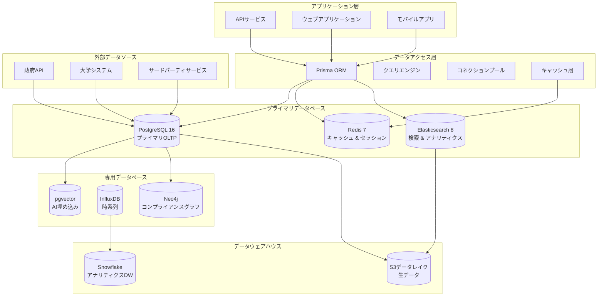

# 第06章: データベース設計 & データアーキテクチャ

**ドキュメントバージョン**: 1.0.0  
**最終更新日**: 2024年12月  
**分類**: 機密 - IP ドキュメント  
**対象市場**: 🇯🇵 日本（メイン）、🇰🇷 韓国、🌏 ASEAN  

---

## 6.1 データベース アーキテクチャ概要

### マルチデータベース戦略

**データベース アーキテクチャ図**


### データベース技術選択

**戦略的データベース選択**
```yaml
database_architecture:
  primary_oltp:
    technology: "PostgreSQL 16 with pgvector extension"
    purpose: "ベクター類似検索を含むプライマリトランザクションデータベース"
    features:
      - "データ整合性のためのACIDコンプライアンス"
      - "高度なインデックス（B-tree、GIN、GiST、BRIN）"
      - "日本語サポート付きの全文検索"
      - "AI埋め込みのためのベクター類似検索"
      - "柔軟なスキーマのためのJSON/JSONB"
      - "データ分離のための行レベルセキュリティ"
    
  caching_layer:
    technology: "Redis 7 with clustering"
    purpose: "高性能キャッシュとセッションストレージ"
    features:
      - "インメモリキーバリューストレージ"
      - "リアルタイム更新のためのPub/Sub"
      - "Redisモジュール（RedisSearch、RedisGraph）"
      - "永続化オプション（RDB、AOF）"
      - "水平スケーリングのためのクラスターモード"
    
  search_analytics:
    technology: "Elasticsearch 8.11 with security"
    purpose: "全文検索とアナリティクス"
    features:
      - "分散検索とアナリティクス"
      - "リアルタイムインデックスと検索"
      - "多言語解析（日本語、英語）"
      - "アナリティクスのための集約"
      - "セキュリティ機能（認証、認可）"
    
  time_series:
    technology: "InfluxDB 2.7"
    purpose: "メトリクス、イベント、時系列データ"
    features:
      - "高性能時系列ストレージ"
      - "内蔵アナリティクスと可視化"
      - "データライフサイクルのための保持ポリシー"
      - "リアルタイム処理のための連続クエリ"
    
  graph_database:
    technology: "Neo4j 5.x"
    purpose: "コンプライアンス関係とナレッジグラフ"
    features:
      - "ネイティブグラフストレージと処理"
      - "Cypherクエリ言語"
      - "ACIDトランザクション"
      - "グラフアルゴリズムライブラリ"
      - "関係ベースクエリ"
```

## 6.2 コアデータベーススキーマ設計

### PostgreSQL プライマリスキーマ

**日本市場最適化を含む完全なデータベーススキーマ**
```sql
-- ============================================================================
-- iWORKZ データベーススキーマ v1.0
-- 日本の雇用市場向けに最適化
-- ============================================================================

-- 必要な拡張機能を有効化
CREATE EXTENSION IF NOT EXISTS "uuid-ossp";
CREATE EXTENSION IF NOT EXISTS "pgcrypto";
CREATE EXTENSION IF NOT EXISTS "vector";
CREATE EXTENSION IF NOT EXISTS "pg_trgm";
CREATE EXTENSION IF NOT EXISTS "unaccent";

-- カスタムタイプと列挙型
CREATE TYPE user_role AS ENUM (
    'candidate', 'employer', 'recruiter', 'admin', 'hr_manager'
);

CREATE TYPE user_status AS ENUM (
    'active', 'inactive', 'suspended', 'pending_verification'
);

CREATE TYPE visa_status AS ENUM (
    'none', 'tourist', 'student', 'work_visa', 'permanent_resident',
    'engineer_humanities', 'highly_skilled_professional', 'skilled_worker',
    'business_manager', 'researcher', 'instructor', 'specialist'
);

CREATE TYPE employment_type AS ENUM (
    'full_time', 'part_time', 'contract', 'temporary', 'internship', 'freelance'
);

CREATE TYPE work_style AS ENUM (
    'office', 'remote', 'hybrid', 'flexible'
);

CREATE TYPE job_status AS ENUM (
    'draft', 'published', 'paused', 'closed', 'archived'
);

CREATE TYPE match_status AS ENUM (
    'generated', 'viewed', 'interested', 'applied', 'interviewed', 
    'offered', 'hired', 'rejected', 'withdrawn'
);

CREATE TYPE compliance_status AS ENUM (
    'pending', 'compliant', 'non_compliant', 'requires_review', 'exempt'
);

CREATE TYPE application_status AS ENUM (
    'submitted', 'screening', 'interview_scheduled', 'interviewing',
    'reference_check', 'offer_extended', 'offer_accepted', 'offer_declined',
    'hired', 'rejected', 'withdrawn'
);

-- ============================================================================
-- コア ユーザー管理
-- ============================================================================

-- 包括的なプロファイルサポート付きユーザーテーブル
CREATE TABLE users (
    id UUID PRIMARY KEY DEFAULT uuid_generate_v4(),
    email VARCHAR(255) UNIQUE NOT NULL,
    password_hash VARCHAR(255),
    
    -- 基本情報
    first_name VARCHAR(100) NOT NULL,
    last_name VARCHAR(100) NOT NULL,
    first_name_kana VARCHAR(100), -- 日本語の読み仮名
    last_name_kana VARCHAR(100),  -- 日本語の読み仮名
    display_name VARCHAR(200),
    
    -- アカウント管理
    role user_role NOT NULL DEFAULT 'candidate',
    status user_status NOT NULL DEFAULT 'active',
    email_verified BOOLEAN DEFAULT FALSE,
    phone VARCHAR(20),
    phone_verified BOOLEAN DEFAULT FALSE,
    
    -- 設定
    language_preference VARCHAR(5) DEFAULT 'ja',
    timezone VARCHAR(50) DEFAULT 'Asia/Tokyo',
    currency_preference VARCHAR(3) DEFAULT 'JPY',
    
    -- セキュリティ
    two_factor_enabled BOOLEAN DEFAULT FALSE,
    two_factor_secret VARCHAR(255),
    backup_codes TEXT[],
    last_password_change TIMESTAMP WITH TIME ZONE DEFAULT NOW(),
    failed_login_attempts INTEGER DEFAULT 0,
    account_locked_until TIMESTAMP WITH TIME ZONE,
    
    -- アクティビティ追跡
    last_login_at TIMESTAMP WITH TIME ZONE,
    last_activity_at TIMESTAMP WITH TIME ZONE,
    login_count INTEGER DEFAULT 0,
    
    -- プライバシーと同意
    privacy_consent BOOLEAN DEFAULT FALSE,
    marketing_consent BOOLEAN DEFAULT FALSE,
    data_processing_consent BOOLEAN DEFAULT FALSE,
    consent_timestamp TIMESTAMP WITH TIME ZONE,
    
    -- タイムスタンプ
    created_at TIMESTAMP WITH TIME ZONE DEFAULT NOW(),
    updated_at TIMESTAMP WITH TIME ZONE DEFAULT NOW(),
    deleted_at TIMESTAMP WITH TIME ZONE,
    
    -- 全文検索最適化
    search_vector tsvector GENERATED ALWAYS AS (
        to_tsvector('japanese', 
            coalesce(first_name, '') || ' ' || 
            coalesce(last_name, '') || ' ' ||
            coalesce(first_name_kana, '') || ' ' ||
            coalesce(last_name_kana, '') || ' ' ||
            coalesce(display_name, '') || ' ' ||
            coalesce(email, '')
        )
    ) STORED,
    
    -- 制約
    CONSTRAINT valid_email CHECK (email ~* '^[A-Za-z0-9._%-]+@[A-Za-z0-9.-]+\.[A-Za-z]{2,}$'),
    CONSTRAINT valid_phone CHECK (phone IS NULL OR phone ~ '^\+?[0-9\-\(\)\s]+$')
);

-- ユーザー認証セッション
CREATE TABLE user_sessions (
    id UUID PRIMARY KEY DEFAULT uuid_generate_v4(),
    user_id UUID REFERENCES users(id) ON DELETE CASCADE,
    session_token VARCHAR(255) UNIQUE NOT NULL,
    ip_address INET,
    user_agent TEXT,
    device_info JSONB DEFAULT '{}',
    location_info JSONB DEFAULT '{}',
    expires_at TIMESTAMP WITH TIME ZONE NOT NULL,
    created_at TIMESTAMP WITH TIME ZONE DEFAULT NOW(),
    last_accessed_at TIMESTAMP WITH TIME ZONE DEFAULT NOW(),
    is_active BOOLEAN DEFAULT TRUE
);

-- ============================================================================
-- 候補者プロファイル
-- ============================================================================

CREATE TABLE candidate_profiles (
    id UUID PRIMARY KEY DEFAULT uuid_generate_v4(),
    user_id UUID UNIQUE REFERENCES users(id) ON DELETE CASCADE,
    
    -- 個人情報
    date_of_birth DATE,
    gender VARCHAR(20),
    nationality VARCHAR(50),
    country_of_birth VARCHAR(50),
    
    -- 所在地情報
    current_country VARCHAR(50) DEFAULT 'Japan',
    current_prefecture VARCHAR(50),
    current_city VARCHAR(100),
    current_address TEXT,
    postal_code VARCHAR(10),
    nearest_station VARCHAR(100),
    
    -- ビザと就労許可
    current_visa_status visa_status DEFAULT 'none',
    visa_expiry_date DATE,
    visa_sponsor VARCHAR(200),
    work_authorization BOOLEAN DEFAULT FALSE,
    work_authorization_details JSONB DEFAULT '{}',
    
    -- 職歴要約
    professional_summary TEXT,
    professional_summary_ja TEXT,
    career_objective TEXT,
    career_objective_ja TEXT,
    
    -- 経験とスキル
    years_of_experience INTEGER DEFAULT 0,
    career_level VARCHAR(50), -- 'entry', 'mid', 'senior', 'executive'
    industry_experience JSONB DEFAULT '[]',
    technical_skills JSONB DEFAULT '[]',
    soft_skills JSONB DEFAULT '[]',
    certifications JSONB DEFAULT '[]',
    
    -- 言語能力
    languages JSONB DEFAULT '[]', -- [{"language": "ja", "level": "N2", "verified": true}]
    
    -- 給与と報酬
    current_salary_min INTEGER,
    current_salary_max INTEGER,
    desired_salary_min INTEGER,
    desired_salary_max INTEGER,
    salary_currency VARCHAR(3) DEFAULT 'JPY',
    
    -- 求職設定
    preferred_locations JSONB DEFAULT '[]',
    preferred_industries JSONB DEFAULT '[]',
    preferred_job_types JSONB DEFAULT '[]',
    work_style_preference work_style DEFAULT 'hybrid',
    relocation_willingness BOOLEAN DEFAULT FALSE,
    remote_work_preference BOOLEAN DEFAULT TRUE,
    
    -- 可用性
    availability_date DATE,
    notice_period_weeks INTEGER DEFAULT 4,
    
    -- 文化的評価
    cultural_assessment_score DECIMAL(3,2),
    cultural_assessment_date TIMESTAMP WITH TIME ZONE,
    cultural_preferences JSONB DEFAULT '{}',
    work_culture_preferences JSONB DEFAULT '{}',
    
    -- AIとマッチング
    profile_completeness DECIMAL(3,2) DEFAULT 0.0,
    matching_preferences JSONB DEFAULT '{}',
    ai_insights JSONB DEFAULT '{}',
    
    -- プライバシー設定
    profile_visibility VARCHAR(20) DEFAULT 'public', -- 'public', 'private', 'recruiter_only'
    contact_preferences JSONB DEFAULT '{}',
    
    -- タイムスタンプ
    created_at TIMESTAMP WITH TIME ZONE DEFAULT NOW(),
    updated_at TIMESTAMP WITH TIME ZONE DEFAULT NOW(),
    last_profile_update TIMESTAMP WITH TIME ZONE DEFAULT NOW(),
    
    -- セマンティック検索のためのAI埋め込み
    embedding_vector vector(768),
    skills_embedding vector(384),
    experience_embedding vector(384),
    
    -- 全文検索
    search_vector tsvector GENERATED ALWAYS AS (
        to_tsvector('japanese',
            coalesce(professional_summary, '') || ' ' ||
            coalesce(professional_summary_ja, '') || ' ' ||
            coalesce(career_objective, '') || ' ' ||
            coalesce(career_objective_ja, '') || ' ' ||
            coalesce(current_city, '') || ' ' ||
            coalesce(nationality, '') || ' ' ||
            coalesce(technical_skills::text, '') || ' ' ||
            coalesce(soft_skills::text, '') || ' ' ||
            coalesce(industry_experience::text, '')
        )
    ) STORED
);

-- 候補者学歴
CREATE TABLE candidate_education (
    id UUID PRIMARY KEY DEFAULT uuid_generate_v4(),
    candidate_id UUID REFERENCES candidate_profiles(id) ON DELETE CASCADE,
    
    -- 教育機関情報
    institution_name VARCHAR(200) NOT NULL,
    institution_name_ja VARCHAR(200),
    institution_country VARCHAR(50),
    institution_type VARCHAR(50), -- 'university', 'college', 'technical_school', 'high_school'
    
    -- 学位情報
    degree_type VARCHAR(100), -- 'bachelor', 'master', 'phd', 'associate', 'certificate'
    degree_name VARCHAR(200),
    degree_name_ja VARCHAR(200),
    field_of_study VARCHAR(200),
    field_of_study_ja VARCHAR(200),
    
    -- 期間
    start_date DATE,
    end_date DATE,
    is_current BOOLEAN DEFAULT FALSE,
    
    -- 学業成績
    gpa DECIMAL(3,2),
    gpa_scale DECIMAL(3,2) DEFAULT 4.0,
    honors JSONB DEFAULT '[]',
    
    -- 認証
    verified BOOLEAN DEFAULT FALSE,
    verification_date TIMESTAMP WITH TIME ZONE,
    verification_source VARCHAR(100),
    
    -- 追加情報
    thesis_title TEXT,
    thesis_title_ja TEXT,
    relevant_coursework JSONB DEFAULT '[]',
    extracurricular_activities JSONB DEFAULT '[]',
    
    -- タイムスタンプ
    created_at TIMESTAMP WITH TIME ZONE DEFAULT NOW(),
    updated_at TIMESTAMP WITH TIME ZONE DEFAULT NOW(),
    
    -- 並び順
    display_order INTEGER DEFAULT 0
);

-- 候補者職歴
CREATE TABLE candidate_experience (
    id UUID PRIMARY KEY DEFAULT uuid_generate_v4(),
    candidate_id UUID REFERENCES candidate_profiles(id) ON DELETE CASCADE,
    
    -- 企業情報
    company_name VARCHAR(200) NOT NULL,
    company_name_ja VARCHAR(200),
    company_industry VARCHAR(100),
    company_size VARCHAR(50),
    company_location VARCHAR(200),
    
    -- 職位情報
    job_title VARCHAR(200) NOT NULL,
    job_title_ja VARCHAR(200),
    department VARCHAR(100),
    employment_type employment_type DEFAULT 'full_time',
    
    -- 期間
    start_date DATE NOT NULL,
    end_date DATE,
    is_current BOOLEAN DEFAULT FALSE,
    
    -- 職務内容と成果
    job_description TEXT,
    job_description_ja TEXT,
    key_achievements JSONB DEFAULT '[]',
    technologies_used JSONB DEFAULT '[]',
    
    -- スキルと責任
    skills_gained JSONB DEFAULT '[]',
    responsibilities JSONB DEFAULT '[]',
    team_size INTEGER,
    budget_managed DECIMAL(15,2),
    
    -- 認証
    verified BOOLEAN DEFAULT FALSE,
    verification_contact JSONB DEFAULT '{}',
    
    -- タイムスタンプ
    created_at TIMESTAMP WITH TIME ZONE DEFAULT NOW(),
    updated_at TIMESTAMP WITH TIME ZONE DEFAULT NOW(),
    
    -- 並び順
    display_order INTEGER DEFAULT 0
);

-- ============================================================================
-- 企業プロファイル
-- ============================================================================

CREATE TABLE company_profiles (
    id UUID PRIMARY KEY DEFAULT uuid_generate_v4(),
    user_id UUID UNIQUE REFERENCES users(id) ON DELETE CASCADE,
    
    -- 企業基本情報
    company_name VARCHAR(200) NOT NULL,
    company_name_ja VARCHAR(200),
    company_name_kana VARCHAR(200),
    legal_name VARCHAR(200),
    
    -- 事業情報
    industry VARCHAR(100),
    sub_industry VARCHAR(100),
    business_description TEXT,
    business_description_ja TEXT,
    company_mission TEXT,
    company_mission_ja TEXT,
    
    -- 企業規模と構造
    company_size VARCHAR(50), -- 'startup', 'small', 'medium', 'large', 'enterprise'
    employee_count_min INTEGER,
    employee_count_max INTEGER,
    annual_revenue_min BIGINT,
    annual_revenue_max BIGINT,
    founded_year INTEGER,
    
    -- 所在地情報
    headquarters_country VARCHAR(50) DEFAULT 'Japan',
    headquarters_prefecture VARCHAR(50),
    headquarters_city VARCHAR(100),
    headquarters_address TEXT,
    office_locations JSONB DEFAULT '[]',
    
    -- 連絡先情報
    website_url VARCHAR(500),
    linkedin_url VARCHAR(500),
    twitter_url VARCHAR(500),
    facebook_url VARCHAR(500),
    main_phone VARCHAR(20),
    main_email VARCHAR(255),
    
    -- 雇用・人事情報
    total_employees INTEGER,
    international_employees INTEGER,
    international_employee_percentage DECIMAL(5,2),
    visa_sponsorship_available BOOLEAN DEFAULT FALSE,
    supported_visa_types JSONB DEFAULT '[]',
    
    -- 企業文化と福利厚生
    company_culture JSONB DEFAULT '{}',
    work_environment work_style DEFAULT 'office',
    benefits JSONB DEFAULT '[]',
    perks JSONB DEFAULT '[]',
    diversity_commitment TEXT,
    
    -- コンプライアンスと認証
    employment_agency_license VARCHAR(50),
    license_expiry_date DATE,
    business_registration_number VARCHAR(50),
    tax_registration_number VARCHAR(50),
    compliance_certifications JSONB DEFAULT '[]',
    
    -- 採用情報
    hiring_process JSONB DEFAULT '{}',
    interview_process TEXT,
    onboarding_process TEXT,
    
    -- 認証と信頼
    verified BOOLEAN DEFAULT FALSE,
    verification_date TIMESTAMP WITH TIME ZONE,
    verification_documents JSONB DEFAULT '[]',
    trust_score DECIMAL(3,2) DEFAULT 0.0,
    
    -- AIとマッチング
    company_culture_embedding vector(384),
    requirements_embedding vector(384),
    
    -- タイムスタンプ
    created_at TIMESTAMP WITH TIME ZONE DEFAULT NOW(),
    updated_at TIMESTAMP WITH TIME ZONE DEFAULT NOW(),
    
    -- 全文検索
    search_vector tsvector GENERATED ALWAYS AS (
        to_tsvector('japanese',
            coalesce(company_name, '') || ' ' ||
            coalesce(company_name_ja, '') || ' ' ||
            coalesce(company_name_kana, '') || ' ' ||
            coalesce(industry, '') || ' ' ||
            coalesce(business_description, '') || ' ' ||
            coalesce(business_description_ja, '')
        )
    ) STORED
);

-- ============================================================================
-- 求人投稿
-- ============================================================================

CREATE TABLE job_postings (
    id UUID PRIMARY KEY DEFAULT uuid_generate_v4(),
    company_id UUID REFERENCES company_profiles(id) ON DELETE CASCADE,
    posted_by UUID REFERENCES users(id),
    
    -- 求人基本情報
    title VARCHAR(200) NOT NULL,
    title_ja VARCHAR(200),
    internal_job_id VARCHAR(100),
    
    -- 求人説明
    description TEXT NOT NULL,
    description_ja TEXT,
    responsibilities JSONB DEFAULT '[]',
    responsibilities_ja JSONB DEFAULT '[]',
    
    -- 求人分類
    department VARCHAR(100),
    job_function VARCHAR(100),
    job_level VARCHAR(50), -- 'entry', 'mid', 'senior', 'executive', 'manager'
    employment_type employment_type DEFAULT 'full_time',
    
    -- 勤務地とリモートワーク
    location VARCHAR(200),
    location_ja VARCHAR(200),
    prefecture VARCHAR(50),
    city VARCHAR(100),
    nearest_station VARCHAR(100),
    remote_work_option work_style DEFAULT 'office',
    relocation_assistance BOOLEAN DEFAULT FALSE,
    relocation_package JSONB DEFAULT '{}',
    
    -- 報酬
    salary_min INTEGER,
    salary_max INTEGER,
    salary_currency VARCHAR(3) DEFAULT 'JPY',
    salary_type VARCHAR(20) DEFAULT 'annual', -- 'annual', 'monthly', 'hourly'
    bonus_structure TEXT,
    equity_offered BOOLEAN DEFAULT FALSE,
    benefits JSONB DEFAULT '[]',
    
    -- 要件
    min_experience_years INTEGER DEFAULT 0,
    max_experience_years INTEGER,
    required_skills JSONB DEFAULT '[]',
    preferred_skills JSONB DEFAULT '[]',
    required_languages JSONB DEFAULT '[]', -- [{"language": "ja", "min_level": "N3"}]
    education_requirements JSONB DEFAULT '[]',
    certifications_required JSONB DEFAULT '[]',
    
    -- ビザと法的要件
    visa_sponsorship BOOLEAN DEFAULT FALSE,
    supported_visa_types JSONB DEFAULT '[]',
    work_authorization_required BOOLEAN DEFAULT TRUE,
    security_clearance_required BOOLEAN DEFAULT FALSE,
    background_check_required BOOLEAN DEFAULT TRUE,
    
    -- 応募プロセス
    application_instructions TEXT,
    application_instructions_ja TEXT,
    required_documents JSONB DEFAULT '[]',
    application_questions JSONB DEFAULT '[]',
    
    -- 求人ステータスとタイムライン
    status job_status DEFAULT 'draft',
    urgency_level VARCHAR(20) DEFAULT 'normal', -- 'low', 'normal', 'high', 'urgent'
    application_deadline DATE,
    start_date DATE,
    contract_duration_months INTEGER, -- 契約職位用
    
    -- 応募設定
    max_applications INTEGER,
    auto_reject_unqualified BOOLEAN DEFAULT FALSE,
    screening_questions JSONB DEFAULT '[]',
    
    -- アナリティクスとパフォーマンス
    view_count INTEGER DEFAULT 0,
    application_count INTEGER DEFAULT 0,
    qualified_application_count INTEGER DEFAULT 0,
    
    -- AIとマッチング
    job_requirements_embedding vector(768),
    skills_embedding vector(384),
    culture_fit_embedding vector(384),
    matching_criteria JSONB DEFAULT '{}',
    ai_screening_enabled BOOLEAN DEFAULT TRUE,
    
    -- タイムスタンプ
    created_at TIMESTAMP WITH TIME ZONE DEFAULT NOW(),
    updated_at TIMESTAMP WITH TIME ZONE DEFAULT NOW(),
    published_at TIMESTAMP WITH TIME ZONE,
    closed_at TIMESTAMP WITH TIME ZONE,
    
    -- 全文検索
    search_vector tsvector GENERATED ALWAYS AS (
        to_tsvector('japanese',
            coalesce(title, '') || ' ' ||
            coalesce(title_ja, '') || ' ' ||
            coalesce(description, '') || ' ' ||
            coalesce(description_ja, '') || ' ' ||
            coalesce(location, '') || ' ' ||
            coalesce(location_ja, '') || ' ' ||
            coalesce(department, '') || ' ' ||
            coalesce(required_skills::text, '') || ' ' ||
            coalesce(preferred_skills::text, '')
        )
    ) STORED
);

-- ============================================================================
-- マッチングと応募
-- ============================================================================

-- AI生成候補者-求人マッチ
CREATE TABLE matching_results (
    id UUID PRIMARY KEY DEFAULT uuid_generate_v4(),
    job_posting_id UUID REFERENCES job_postings(id) ON DELETE CASCADE,
    candidate_id UUID REFERENCES candidate_profiles(id) ON DELETE CASCADE,
    
    -- マッチングスコア（0.0000から1.0000）
    overall_score DECIMAL(6,4) NOT NULL,
    skill_match_score DECIMAL(6,4),
    experience_match_score DECIMAL(6,4),
    cultural_fit_score DECIMAL(6,4),
    location_match_score DECIMAL(6,4),
    salary_match_score DECIMAL(6,4),
    language_match_score DECIMAL(6,4),
    
    -- AI説明とインサイト
    match_explanation JSONB DEFAULT '{}',
    confidence_score DECIMAL(6,4),
    risk_factors JSONB DEFAULT '[]',
    strength_areas JSONB DEFAULT '[]',
    improvement_areas JSONB DEFAULT '[]',
    
    -- コンプライアンスと法的事項
    compliance_status compliance_status DEFAULT 'pending',
    compliance_details JSONB DEFAULT '{}',
    visa_eligibility BOOLEAN,
    visa_recommendations JSONB DEFAULT '[]',
    
    -- マッチングメタデータ
    matching_algorithm_version VARCHAR(20),
    matching_model_id VARCHAR(50),
    matching_timestamp TIMESTAMP WITH TIME ZONE DEFAULT NOW(),
    
    -- ステータスとワークフロー
    status match_status DEFAULT 'generated',
    viewed_by_company BOOLEAN DEFAULT FALSE,
    viewed_by_candidate BOOLEAN DEFAULT FALSE,
    company_feedback JSONB DEFAULT '{}',
    candidate_feedback JSONB DEFAULT '{}',
    
    -- パフォーマンス追跡
    prediction_accuracy DECIMAL(6,4), -- 結果後に更新
    actual_outcome VARCHAR(50),        -- モデル改善用
    
    -- タイムスタンプ
    created_at TIMESTAMP WITH TIME ZONE DEFAULT NOW(),
    updated_at TIMESTAMP WITH TIME ZONE DEFAULT NOW(),
    
    -- 一意制約
    UNIQUE(job_posting_id, candidate_id),
    
    -- 制約
    CONSTRAINT valid_scores CHECK (
        overall_score >= 0 AND overall_score <= 1 AND
        (skill_match_score IS NULL OR (skill_match_score >= 0 AND skill_match_score <= 1)) AND
        (experience_match_score IS NULL OR (experience_match_score >= 0 AND experience_match_score <= 1)) AND
        (cultural_fit_score IS NULL OR (cultural_fit_score >= 0 AND cultural_fit_score <= 1))
    )
);

-- 求人応募
CREATE TABLE job_applications (
    id UUID PRIMARY KEY DEFAULT uuid_generate_v4(),
    job_posting_id UUID REFERENCES job_postings(id) ON DELETE CASCADE,
    candidate_id UUID REFERENCES candidate_profiles(id) ON DELETE CASCADE,
    matching_result_id UUID REFERENCES matching_results(id),
    
    -- 応募情報
    cover_letter TEXT,
    cover_letter_ja TEXT,
    custom_responses JSONB DEFAULT '{}', -- 応募質問への回答
    
    -- 応募ステータス
    status application_status DEFAULT 'submitted',
    status_updated_at TIMESTAMP WITH TIME ZONE DEFAULT NOW(),
    status_updated_by UUID REFERENCES users(id),
    
    -- スクリーニングと評価
    screening_score DECIMAL(6,4),
    screening_notes TEXT,
    hr_notes TEXT,
    hiring_manager_notes TEXT,
    
    -- 面接プロセス
    interviews_scheduled INTEGER DEFAULT 0,
    interviews_completed INTEGER DEFAULT 0,
    interview_feedback JSONB DEFAULT '[]',
    
    -- 決定と結果
    final_decision VARCHAR(50),
    decision_reason TEXT,
    decision_date TIMESTAMP WITH TIME ZONE,
    decision_made_by UUID REFERENCES users(id),
    
    -- オファー情報（該当する場合）
    offer_extended BOOLEAN DEFAULT FALSE,
    offer_details JSONB DEFAULT '{}',
    offer_expiry_date TIMESTAMP WITH TIME ZONE,
    offer_response VARCHAR(20), -- 'accepted', 'declined', 'negotiating'
    offer_response_date TIMESTAMP WITH TIME ZONE,
    
    -- アナリティクス
    time_to_application INTERVAL, -- マッチから応募までの時間
    time_to_decision INTERVAL,    -- 応募から決定までの時間
    
    -- タイムスタンプ
    created_at TIMESTAMP WITH TIME ZONE DEFAULT NOW(),
    updated_at TIMESTAMP WITH TIME ZONE DEFAULT NOW(),
    
    -- 一意制約
    UNIQUE(job_posting_id, candidate_id)
);

-- ============================================================================
-- パフォーマンス インデックス
-- ============================================================================

-- ユーザーテーブルのインデックス
CREATE INDEX idx_users_email ON users USING btree (email);
CREATE INDEX idx_users_role_status ON users USING btree (role, status);
CREATE INDEX idx_users_search ON users USING gin (search_vector);
CREATE INDEX idx_users_last_activity ON users USING btree (last_activity_at);

-- 候補者プロファイルのインデックス
CREATE INDEX idx_candidates_user_id ON candidate_profiles USING btree (user_id);
CREATE INDEX idx_candidates_visa_status ON candidate_profiles USING btree (current_visa_status);
CREATE INDEX idx_candidates_availability ON candidate_profiles USING btree (availability_date);
CREATE INDEX idx_candidates_experience ON candidate_profiles USING btree (years_of_experience);
CREATE INDEX idx_candidates_location ON candidate_profiles USING btree (current_prefecture, current_city);
CREATE INDEX idx_candidates_salary ON candidate_profiles USING btree (desired_salary_min, desired_salary_max);
CREATE INDEX idx_candidates_embedding ON candidate_profiles USING ivfflat (embedding_vector vector_cosine_ops) WITH (lists = 100);
CREATE INDEX idx_candidates_skills_embedding ON candidate_profiles USING ivfflat (skills_embedding vector_cosine_ops) WITH (lists = 100);
CREATE INDEX idx_candidates_search ON candidate_profiles USING gin (search_vector);

-- 企業プロファイルのインデックス
CREATE INDEX idx_companies_user_id ON company_profiles USING btree (user_id);
CREATE INDEX idx_companies_industry ON company_profiles USING btree (industry);
CREATE INDEX idx_companies_size ON company_profiles USING btree (company_size);
CREATE INDEX idx_companies_location ON company_profiles USING btree (headquarters_prefecture, headquarters_city);
CREATE INDEX idx_companies_visa_sponsor ON company_profiles USING btree (visa_sponsorship_available);
CREATE INDEX idx_companies_verified ON company_profiles USING btree (verified);
CREATE INDEX idx_companies_search ON company_profiles USING gin (search_vector);

-- 求人投稿のインデックス
CREATE INDEX idx_jobs_company_id ON job_postings USING btree (company_id);
CREATE INDEX idx_jobs_status_published ON job_postings USING btree (status, published_at);
CREATE INDEX idx_jobs_location ON job_postings USING btree (prefecture, city);
CREATE INDEX idx_jobs_salary ON job_postings USING btree (salary_min, salary_max);
CREATE INDEX idx_jobs_experience ON job_postings USING btree (min_experience_years, max_experience_years);
CREATE INDEX idx_jobs_visa_sponsor ON job_postings USING btree (visa_sponsorship);
CREATE INDEX idx_jobs_employment_type ON job_postings USING btree (employment_type);
CREATE INDEX idx_jobs_deadline ON job_postings USING btree (application_deadline);
CREATE INDEX idx_jobs_embedding ON job_postings USING ivfflat (job_requirements_embedding vector_cosine_ops) WITH (lists = 100);
CREATE INDEX idx_jobs_search ON job_postings USING gin (search_vector);

-- マッチング結果のインデックス
CREATE INDEX idx_matches_job_id ON matching_results USING btree (job_posting_id);
CREATE INDEX idx_matches_candidate_id ON matching_results USING btree (candidate_id);
CREATE INDEX idx_matches_score ON matching_results USING btree (overall_score DESC);
CREATE INDEX idx_matches_status ON matching_results USING btree (status);
CREATE INDEX idx_matches_compliance ON matching_results USING btree (compliance_status);
CREATE INDEX idx_matches_timestamp ON matching_results USING btree (matching_timestamp);

-- 応募のインデックス
CREATE INDEX idx_applications_job_id ON job_applications USING btree (job_posting_id);
CREATE INDEX idx_applications_candidate_id ON job_applications USING btree (candidate_id);
CREATE INDEX idx_applications_status ON job_applications USING btree (status);
CREATE INDEX idx_applications_created_at ON job_applications USING btree (created_at);

-- ============================================================================
-- トリガーと関数
-- ============================================================================

-- updated_atタイムスタンプを更新する関数
CREATE OR REPLACE FUNCTION update_updated_at_column()
RETURNS TRIGGER AS $$
BEGIN
    NEW.updated_at = NOW();
    RETURN NEW;
END;
$$ language 'plpgsql';

-- 関連するすべてのテーブルにupdated_atトリガーを適用
CREATE TRIGGER update_users_updated_at BEFORE UPDATE ON users
    FOR EACH ROW EXECUTE FUNCTION update_updated_at_column();

CREATE TRIGGER update_candidate_profiles_updated_at BEFORE UPDATE ON candidate_profiles
    FOR EACH ROW EXECUTE FUNCTION update_updated_at_column();

CREATE TRIGGER update_company_profiles_updated_at BEFORE UPDATE ON company_profiles
    FOR EACH ROW EXECUTE FUNCTION update_updated_at_column();

CREATE TRIGGER update_job_postings_updated_at BEFORE UPDATE ON job_postings
    FOR EACH ROW EXECUTE FUNCTION update_updated_at_column();

CREATE TRIGGER update_matching_results_updated_at BEFORE UPDATE ON matching_results
    FOR EACH ROW EXECUTE FUNCTION update_updated_at_column();

CREATE TRIGGER update_job_applications_updated_at BEFORE UPDATE ON job_applications
    FOR EACH ROW EXECUTE FUNCTION update_updated_at_column();

-- プロファイル完成度を計算する関数
CREATE OR REPLACE FUNCTION calculate_profile_completeness()
RETURNS TRIGGER AS $$
DECLARE
    completeness_score DECIMAL(3,2) := 0.0;
    field_count INTEGER := 0;
    completed_fields INTEGER := 0;
BEGIN
    -- 総フィールドと完了フィールドをカウント
    field_count := 20; -- 重要フィールドの総数
    
    -- 各重要フィールドをチェック
    IF NEW.professional_summary IS NOT NULL AND LENGTH(NEW.professional_summary) > 10 THEN
        completed_fields := completed_fields + 1;
    END IF;
    
    IF NEW.years_of_experience IS NOT NULL AND NEW.years_of_experience >= 0 THEN
        completed_fields := completed_fields + 1;
    END IF;
    
    IF NEW.technical_skills IS NOT NULL AND jsonb_array_length(NEW.technical_skills) > 0 THEN
        completed_fields := completed_fields + 1;
    END IF;
    
    IF NEW.languages IS NOT NULL AND jsonb_array_length(NEW.languages) > 0 THEN
        completed_fields := completed_fields + 1;
    END IF;
    
    IF NEW.desired_salary_min IS NOT NULL THEN
        completed_fields := completed_fields + 1;
    END IF;
    
    IF NEW.preferred_locations IS NOT NULL AND jsonb_array_length(NEW.preferred_locations) > 0 THEN
        completed_fields := completed_fields + 1;
    END IF;
    
    IF NEW.current_city IS NOT NULL THEN
        completed_fields := completed_fields + 1;
    END IF;
    
    IF NEW.current_visa_status IS NOT NULL AND NEW.current_visa_status != 'none' THEN
        completed_fields := completed_fields + 1;
    END IF;
    
    -- より多くのフィールドチェックを追加...
    -- （実装では全20フィールドについて継続）
    
    -- 完成度パーセンテージを計算
    completeness_score := (completed_fields::DECIMAL / field_count::DECIMAL);
    NEW.profile_completeness := completeness_score;
    
    RETURN NEW;
END;
$$ language 'plpgsql';

-- プロファイル完成度トリガーを適用
CREATE TRIGGER calculate_candidate_profile_completeness
    BEFORE INSERT OR UPDATE ON candidate_profiles
    FOR EACH ROW EXECUTE FUNCTION calculate_profile_completeness();
```

## 6.3 Redis キャッシュアーキテクチャ

### キャッシュ戦略実装

**高性能のためのRedisクラスター設定**
```typescript
// iWORKZプラットフォーム用Redisキャッシュ実装
import Redis from 'ioredis';
import { promisify } from 'util';

interface CacheConfig {
  keyPrefix: string;
  defaultTTL: number;
  maxRetries: number;
  retryDelayOnFailover: number;
}

class iWORKZCacheManager {
  private redisCluster: Redis.Cluster;
  private redisStandalone: Redis;
  private config: CacheConfig;
  
  constructor(config: CacheConfig) {
    this.config = config;
    this.initializeRedisCluster();
    this.initializeRedisStandalone();
  }
  
  private initializeRedisCluster(): void {
    this.redisCluster = new Redis.Cluster([
      {
        host: process.env.REDIS_CLUSTER_HOST_1 || 'localhost',
        port: parseInt(process.env.REDIS_CLUSTER_PORT_1 || '6379'),
      },
      {
        host: process.env.REDIS_CLUSTER_HOST_2 || 'localhost',
        port: parseInt(process.env.REDIS_CLUSTER_PORT_2 || '6380'),
      },
      {
        host: process.env.REDIS_CLUSTER_HOST_3 || 'localhost',
        port: parseInt(process.env.REDIS_CLUSTER_PORT_3 || '6381'),
      },
    ], {
      redisOptions: {
        password: process.env.REDIS_PASSWORD,
        retryDelayOnFailover: this.config.retryDelayOnFailover,
        maxRetriesPerRequest: this.config.maxRetries,
        keyPrefix: this.config.keyPrefix,
      },
      enableOfflineQueue: false,
      slotsRefreshTimeout: 10000,
    });
  }
  
  // ============================================================================
  // ユーザープロファイル キャッシュ
  // ============================================================================
  
  async cacheUserProfile(
    userId: string,
    profile: UserProfile,
    ttl: number = 3600
  ): Promise<void> {
    const key = this.buildKey('user:profile', userId);
    await this.setWithExpiry(key, profile, ttl);
  }
  
  async getUserProfile(userId: string): Promise<UserProfile | null> {
    const key = this.buildKey('user:profile', userId);
    return await this.get<UserProfile>(key);
  }
  
  async invalidateUserProfile(userId: string): Promise<void> {
    const patterns = [
      this.buildKey('user:profile', userId),
      this.buildKey('user:settings', userId),
      this.buildKey('user:permissions', userId),
    ];
    
    await Promise.all(patterns.map(pattern => this.delete(pattern)));
  }
  
  // ============================================================================
  // 候補者 キャッシュ
  // ============================================================================
  
  async cacheCandidateProfile(
    candidateId: string,
    profile: CandidateProfile,
    ttl: number = 1800
  ): Promise<void> {
    const key = this.buildKey('candidate:profile', candidateId);
    await this.setWithExpiry(key, profile, ttl);
    
    // 頻繁にアクセスされるプロファイルフィールドを個別にキャッシュ
    await this.cacheCandidateSkills(candidateId, profile.technicalSkills, ttl);
    await this.cacheCandidateExperience(candidateId, profile.experience, ttl);
  }
  
  async cacheCandidateJobRecommendations(
    candidateId: string,
    recommendations: JobRecommendation[],
    ttl: number = 900 // 動的推薦のため15分
  ): Promise<void> {
    const key = this.buildKey('candidate:recommendations', candidateId);
    await this.setWithExpiry(key, recommendations, ttl);
  }
  
  // ============================================================================
  // 求人投稿 キャッシュ
  // ============================================================================
  
  async cacheJobPosting(
    jobId: string,
    jobPosting: JobPosting,
    ttl: number = 3600
  ): Promise<void> {
    const key = this.buildKey('job:posting', jobId);
    await this.setWithExpiry(key, jobPosting, ttl);
    
    // 求人検索フィルターをキャッシュ
    await this.cacheJobSearchFilters(jobId, jobPosting);
  }
  
  async cacheJobSearchResults(
    searchQuery: JobSearchQuery,
    results: JobSearchResult[],
    ttl: number = 600 // 検索結果のため10分
  ): Promise<void> {
    const searchKey = this.buildSearchKey(searchQuery);
    const key = this.buildKey('search:jobs', searchKey);
    
    await this.setWithExpiry(key, {
      query: searchQuery,
      results,
      resultCount: results.length,
      searchTimestamp: new Date().toISOString(),
    }, ttl);
  }
  
  // ============================================================================
  // マッチング結果 キャッシュ
  // ============================================================================
  
  async cacheCandidateMatches(
    jobId: string,
    matches: CandidateMatch[],
    ttl: number = 1800 // 30分
  ): Promise<void> {
    const key = this.buildKey('matches:candidates', jobId);
    await this.setWithExpiry(key, matches, ttl);
    
    // 迅速なアクセスのためトップマッチを個別にキャッシュ
    const topMatches = matches.slice(0, 10);
    const topKey = this.buildKey('matches:top', jobId);
    await this.setWithExpiry(topKey, topMatches, ttl);
  }
  
  async cacheJobMatches(
    candidateId: string,
    matches: JobMatch[],
    ttl: number = 1800
  ): Promise<void> {
    const key = this.buildKey('matches:jobs', candidateId);
    await this.setWithExpiry(key, matches, ttl);
  }
  
  // ============================================================================
  // コンプライアンス キャッシュ
  // ============================================================================
  
  async cacheComplianceCheck(
    candidateId: string,
    jobId: string,
    result: ComplianceCheckResult,
    ttl: number = 14400 // コンプライアンスチェックのため4時間
  ): Promise<void> {
    const key = this.buildKey('compliance', `${candidateId}:${jobId}`);
    await this.setWithExpiry(key, result, ttl);
  }
  
  async cacheVisaEligibility(
    candidateId: string,
    visaType: string,
    eligibility: VisaEligibilityResult,
    ttl: number = 86400 // 24時間
  ): Promise<void> {
    const key = this.buildKey('visa:eligibility', `${candidateId}:${visaType}`);
    await this.setWithExpiry(key, eligibility, ttl);
  }
  
  // ============================================================================
  // セッションと認証
  // ============================================================================
  
  async createUserSession(
    userId: string,
    sessionData: UserSession,
    ttl: number = 86400 // 24時間
  ): Promise<string> {
    const sessionId = this.generateSessionId();
    const key = this.buildKey('session', sessionId);
    
    const sessionRecord = {
      userId,
      ...sessionData,
      createdAt: new Date().toISOString(),
      lastAccessed: new Date().toISOString(),
    };
    
    await this.setWithExpiry(key, sessionRecord, ttl);
    
    // ユーザーのアクティブセッションを追跡
    const userSessionsKey = this.buildKey('user:sessions', userId);
    await this.redisCluster.sadd(userSessionsKey, sessionId);
    await this.redisCluster.expire(userSessionsKey, ttl);
    
    return sessionId;
  }
  
  async getUserSession(sessionId: string): Promise<UserSession | null> {
    const key = this.buildKey('session', sessionId);
    const session = await this.get<UserSession>(key);
    
    if (session) {
      // 最終アクセスタイムスタンプを更新
      session.lastAccessed = new Date().toISOString();
      await this.setWithExpiry(key, session, 86400);
    }
    
    return session;
  }
  
  // ============================================================================
  // レート制限
  // ============================================================================
  
  async checkRateLimit(
    identifier: string,
    limit: number,
    windowSeconds: number
  ): Promise<RateLimitResult> {
    const key = this.buildKey('rate_limit', identifier);
    const now = Date.now();
    const windowStart = now - (windowSeconds * 1000);
    
    // スライディングウィンドウレート制限にRedisソート集合を使用
    const pipeline = this.redisCluster.pipeline();
    
    // 期限切れエントリを削除
    pipeline.zremrangebyscore(key, '-inf', windowStart);
    
    // ウィンドウ内の現在のリクエストをカウント
    pipeline.zcard(key);
    
    // 現在のリクエストを追加
    pipeline.zadd(key, now, `${now}-${Math.random()}`);
    
    // 有効期限を設定
    pipeline.expire(key, windowSeconds);
    
    const results = await pipeline.exec();
    const currentCount = results[1][1] as number;
    
    const allowed = currentCount < limit;
    const remaining = Math.max(0, limit - currentCount - 1);
    const resetTime = now + (windowSeconds * 1000);
    
    return {
      allowed,
      remaining,
      resetTime,
      currentCount: currentCount + 1,
    };
  }
  
  // ============================================================================
  // ユーティリティメソッド
  // ============================================================================
  
  private buildKey(...parts: string[]): string {
    return parts.join(':');
  }
  
  private buildSearchKey(query: JobSearchQuery): string {
    const queryString = JSON.stringify(query);
    const crypto = require('crypto');
    return crypto.createHash('md5').update(queryString).digest('hex');
  }
  
  private generateSessionId(): string {
    const crypto = require('crypto');
    return crypto.randomBytes(32).toString('hex');
  }
  
  private async get<T>(key: string): Promise<T | null> {
    try {
      const value = await this.redisCluster.get(key);
      return value ? JSON.parse(value) : null;
    } catch (error) {
      console.error(`キー ${key} のRedis GET エラー:`, error);
      return null;
    }
  }
  
  private async setWithExpiry(
    key: string,
    value: any,
    ttl: number
  ): Promise<void> {
    try {
      const serializedValue = JSON.stringify(value);
      await this.redisCluster.setex(key, ttl, serializedValue);
    } catch (error) {
      console.error(`キー ${key} のRedis SET エラー:`, error);
      throw error;
    }
  }
  
  private async delete(key: string): Promise<void> {
    try {
      await this.redisCluster.del(key);
    } catch (error) {
      console.error(`キー ${key} のRedis DELETE エラー:`, error);
    }
  }
}

// 使用例
const cacheManager = new iWORKZCacheManager({
  keyPrefix: 'iworkz:',
  defaultTTL: 3600,
  maxRetries: 3,
  retryDelayOnFailover: 100,
});

export default cacheManager;
```

## 6.4 Elasticsearch 検索アーキテクチャ

### 高度な検索とアナリティクス

**日本の雇用検索向けElasticsearch設定**
```json
{
  "settings": {
    "index": {
      "number_of_shards": 3,
      "number_of_replicas": 1,
      "refresh_interval": "5s",
      "max_result_window": 50000
    },
    "analysis": {
      "analyzer": {
        "japanese_analyzer": {
          "type": "custom",
          "tokenizer": "kuromoji_tokenizer",
          "char_filter": ["html_strip", "icu_normalizer"],
          "filter": [
            "kuromoji_baseform",
            "kuromoji_part_of_speech",
            "ja_stop",
            "kuromoji_stemmer",
            "lowercase",
            "asciifolding"
          ]
        },
        "english_analyzer": {
          "type": "custom",
          "tokenizer": "standard",
          "char_filter": ["html_strip"],
          "filter": [
            "lowercase",
            "stop",
            "stemmer",
            "asciifolding"
          ]
        },
        "skill_analyzer": {
          "type": "custom",
          "tokenizer": "keyword",
          "filter": ["lowercase", "trim"]
        },
        "location_analyzer": {
          "type": "custom",
          "tokenizer": "kuromoji_tokenizer",
          "filter": [
            "kuromoji_baseform",
            "lowercase",
            "asciifolding"
          ]
        }
      },
      "tokenizer": {
        "kuromoji_tokenizer": {
          "type": "kuromoji_tokenizer",
          "mode": "search",
          "discard_punctuation": true,
          "user_dictionary_rules": [
            "iWORKZ,iWORKZ,アイワークス,カスタム名詞",
            "AI,AI,エーアイ,カスタム名詞",
            "機械学習,機械学習,キカイガクシュウ,カスタム名詞"
          ]
        }
      }
    }
  },
  "mappings": {
    "properties": {
      "id": {
        "type": "keyword"
      },
      "type": {
        "type": "keyword"
      },
      "title": {
        "type": "text",
        "analyzer": "japanese_analyzer",
        "fields": {
          "raw": {
            "type": "keyword"
          },
          "english": {
            "type": "text",
            "analyzer": "english_analyzer"
          }
        }
      },
      "description": {
        "type": "text",
        "analyzer": "japanese_analyzer",
        "fields": {
          "english": {
            "type": "text",
            "analyzer": "english_analyzer"
          }
        }
      },
      "skills": {
        "type": "text",
        "analyzer": "skill_analyzer",
        "fields": {
          "keyword": {
            "type": "keyword"
          }
        }
      },
      "location": {
        "type": "object",
        "properties": {
          "prefecture": {
            "type": "text",
            "analyzer": "location_analyzer",
            "fields": {
              "keyword": {
                "type": "keyword"
              }
            }
          },
          "city": {
            "type": "text",
            "analyzer": "location_analyzer",
            "fields": {
              "keyword": {
                "type": "keyword"
              }
            }
          },
          "coordinates": {
            "type": "geo_point"
          }
        }
      },
      "salary": {
        "type": "object",
        "properties": {
          "min": {
            "type": "integer"
          },
          "max": {
            "type": "integer"
          },
          "currency": {
            "type": "keyword"
          }
        }
      },
      "experience": {
        "type": "object",
        "properties": {
          "years": {
            "type": "integer"
          },
          "level": {
            "type": "keyword"
          }
        }
      },
      "employment_type": {
        "type": "keyword"
      },
      "visa_sponsorship": {
        "type": "boolean"
      },
      "remote_work": {
        "type": "keyword"
      },
      "company": {
        "type": "object",
        "properties": {
          "name": {
            "type": "text",
            "analyzer": "japanese_analyzer",
            "fields": {
              "keyword": {
                "type": "keyword"
              }
            }
          },
          "industry": {
            "type": "keyword"
          },
          "size": {
            "type": "keyword"
          }
        }
      },
      "created_at": {
        "type": "date"
      },
      "updated_at": {
        "type": "date"
      },
      "boost_score": {
        "type": "float"
      },
      "ai_embedding": {
        "type": "dense_vector",
        "dims": 768
      }
    }
  }
}
```

---

**この包括的なデータベース設計 & データアーキテクチャドキュメントは、マルチデータベース戦略、日本の雇用市場向けに最適化されたPostgreSQLスキーマ、Redisキャッシュアーキテクチャ、Elasticsearch検索機能の詳細な実装を提供します。設計では高性能、スケーラビリティ、日本のデータ保護要件への準拠を確保しています。**

---

*データベースアーキテクチャは、日本語処理、文化的嗜好、ビザステータス追跡、規制遵守のサポートを含む日本市場要件を考慮して設計されています。すべての実装はデータ保護のベストプラクティスに従い、最適なパフォーマンスのための包括的なインデックス戦略を含んでいます。*