# Chapter 07: API Specifications & Integration Protocols

**Document Version**: 1.0.3  
**Last Updated**: June 2025  
**Classification**: Confidential - IP Documentation  
**Target Markets**: 🇯🇵 Japan (Primary), 🇰🇷 South Korea, 🌏 ASEAN  

---

## 7.1 API Architecture Overview

### RESTful API Design with GraphQL Federation

**API Architecture Diagram**

```mermaid
graph TB
    subgraph "Client Applications"
        WEB[Web Frontend]
        MOBILE[Mobile App]
        PARTNERS[Partner Systems]
        WEBHOOKS[Webhook Consumers]
    end
    
    subgraph "API Gateway Layer"
        KONG[Kong Gateway]
        AUTH[Authentication Service]
        RATE_LIMIT[Rate Limiting]
        TRANSFORM[Request/Response Transform]
    end
    
    subgraph "GraphQL Federation"
        APOLLO[Apollo Federation Gateway]
        SCHEMA_REGISTRY[Schema Registry]
        QUERY_PLANNER[Query Planner]
    end
    
    subgraph "Microservice APIs"
        USER_API[User Management API]
        JOB_API[Job Posting API]
        MATCH_API[Matching Engine API]
        COMPLIANCE_API[Compliance API]
        AI_API[AI Services API]
        NOTIFICATION_API[Notification API]
        ANALYTICS_API[Analytics API]
        INTEGRATION_API[Integration API]
    end
    
    subgraph "External Integrations"
        GOVT_API[Government APIs<br/>🇯🇵 Japan]
        UNIV_API[University Systems]
        PAYMENT_API[Payment Gateways]
        EMAIL_API[Email Services]
        SMS_API[SMS Gateways]
    end
    
    WEB --> KONG
    MOBILE --> KONG
    PARTNERS --> KONG
    
    KONG --> APOLLO
    KONG --> USER_API
    KONG --> JOB_API
    
    APOLLO --> USER_API
    APOLLO --> JOB_API
    APOLLO --> MATCH_API
    APOLLO --> COMPLIANCE_API
    
    COMPLIANCE_API --> GOVT_API
    NOTIFICATION_API --> EMAIL_API
    NOTIFICATION_API --> SMS_API
    INTEGRATION_API --> UNIV_API
```


### API Design Principles

**Core API Design Philosophy**
```yaml
api_design_principles:
  consistency:
    principle: "Consistent patterns across all endpoints"
    implementation: "Standardized response formats, error codes, pagination"
    benefits: ["Reduced learning curve", "Easier integration", "Better DX"]
    
  versioning:
    principle: "Semantic versioning with backward compatibility"
    implementation: "Header-based versioning with graceful deprecation"
    strategy: "v1.x.x support for minimum 2 years"
    
  security:
    principle: "Security-first API design"
    implementation: "OAuth 2.0, JWT tokens, rate limiting, input validation"
    compliance: "OWASP API Security Top 10"
    
  performance:
    principle: "High-performance API responses"
    implementation: "Caching, pagination, field selection, compression"
    targets: "< 200ms response time, 99.9% uptime"
    
  documentation:
    principle: "Self-documenting APIs with comprehensive examples"
    implementation: "OpenAPI 3.0 specifications, interactive docs"
    languages: "English and Japanese documentation"
    
  observability:
    principle: "Full traceability and monitoring"
    implementation: "Request tracing, metrics, logging, alerting"
    tools: "Jaeger, Prometheus, Grafana"
```

## 7.2 Authentication & Authorization

### OAuth 2.0 + JWT Implementation

**Authentication Flow Architecture**
```typescript
// OAuth 2.0 + JWT Authentication Service
interface AuthenticationService {
  // OAuth 2.0 flows
  authorizationCodeFlow: "Standard web application flow";
  clientCredentialsFlow: "Server-to-server authentication";
  deviceCodeFlow: "Mobile and IoT device authentication";
  
  // JWT token structure
  accessToken: {
    algorithm: "RS256";
    expiry: "15 minutes";
    claims: ["sub", "iat", "exp", "aud", "iss", "scope", "permissions"];
  };
  
  refreshToken: {
    algorithm: "RS256";
    expiry: "7 days";
    rotation: "Automatic on use";
  };
  
  // Multi-factor authentication
  mfaSupport: {
    totp: "Time-based OTP";
    sms: "SMS verification";
    email: "Email verification";
    biometric: "Mobile biometric authentication";
  };
}

// JWT Token Structure
interface JWTPayload {
  // Standard claims
  sub: string;          // Subject (user ID)
  iat: number;          // Issued at
  exp: number;          // Expiration time
  aud: string;          // Audience
  iss: string;          // Issuer
  jti: string;          // JWT ID
  
  // Custom claims
  scope: string[];      // OAuth scopes
  permissions: string[]; // Fine-grained permissions
  role: UserRole;       // User role
  tenant?: string;      // Multi-tenant support
  
  // iWORKZ-specific claims
  profile_id?: string;  // Candidate/Company profile ID
  compliance_level: ComplianceLevel;
  data_residency: string; // Japan, Korea, etc.
}

// Authentication middleware implementation
import jwt from 'jsonwebtoken';
import { Request, Response, NextFunction } from 'express';

class AuthenticationMiddleware {
  private publicKey: string;
  private issuer: string;
  private audience: string;
  
  constructor() {
    this.publicKey = process.env.JWT_PUBLIC_KEY!;
    this.issuer = 'https://auth.iworkz.com';
    this.audience = 'iworkz-api';
  }
  
  authenticate = async (
    req: Request,
    res: Response,
    next: NextFunction
  ): Promise<void> => {
    try {
      // Extract token from Authorization header
      const authHeader = req.headers.authorization;
      if (!authHeader || !authHeader.startsWith('Bearer ')) {
        res.status(401).json({
          error: 'AUTHENTICATION_REQUIRED',
          message: 'Valid authentication token required',
          code: 'AUTH_001'
        });
        return;
      }
      
      const token = authHeader.substring(7);
      
      // Verify JWT token
      const decoded = jwt.verify(token, this.publicKey, {
        algorithms: ['RS256'],
        issuer: this.issuer,
        audience: this.audience,
      }) as JWTPayload;
      
      // Check token blacklist
      const isBlacklisted = await this.checkTokenBlacklist(decoded.jti);
      if (isBlacklisted) {
        res.status(401).json({
          error: 'TOKEN_REVOKED',
          message: 'Authentication token has been revoked',
          code: 'AUTH_002'
        });
        return;
      }
      
      // Validate permissions and compliance
      await this.validatePermissions(decoded);
      await this.validateCompliance(decoded);
      
      // Add user context to request
      req.user = {
        id: decoded.sub,
        role: decoded.role,
        permissions: decoded.permissions,
        complianceLevel: decoded.compliance_level,
        profileId: decoded.profile_id,
        dataResidency: decoded.data_residency,
      };
      
      // Update last activity
      await this.updateLastActivity(decoded.sub);
      
      next();
    } catch (error) {
      if (error instanceof jwt.TokenExpiredError) {
        res.status(401).json({
          error: 'TOKEN_EXPIRED',
          message: 'Authentication token has expired',
          code: 'AUTH_003'
        });
      } else if (error instanceof jwt.JsonWebTokenError) {
        res.status(401).json({
          error: 'INVALID_TOKEN',
          message: 'Invalid authentication token',
          code: 'AUTH_004'
        });
      } else {
        res.status(500).json({
          error: 'AUTHENTICATION_ERROR',
          message: 'Authentication service error',
          code: 'AUTH_500'
        });
      }
    }
  };
  
  requirePermission = (permission: string) => {
    return (req: Request, res: Response, next: NextFunction): void => {
      if (!req.user) {
        res.status(401).json({
          error: 'AUTHENTICATION_REQUIRED',
          message: 'Authentication required',
          code: 'AUTH_001'
        });
        return;
      }
      
      if (!req.user.permissions.includes(permission) && 
          !req.user.permissions.includes('*')) {
        res.status(403).json({
          error: 'INSUFFICIENT_PERMISSIONS',
          message: `Permission '${permission}' required`,
          code: 'AUTH_005'
        });
        return;
      }
      
      next();
    };
  };
  
  requireRole = (roles: UserRole[]) => {
    return (req: Request, res: Response, next: NextFunction): void => {
      if (!req.user) {
        res.status(401).json({
          error: 'AUTHENTICATION_REQUIRED',
          message: 'Authentication required',
          code: 'AUTH_001'
        });
        return;
      }
      
      if (!roles.includes(req.user.role)) {
        res.status(403).json({
          error: 'INSUFFICIENT_ROLE',
          message: `One of roles [${roles.join(', ')}] required`,
          code: 'AUTH_006'
        });
        return;
      }
      
      next();
    };
  };
  
  private async checkTokenBlacklist(jti: string): Promise<boolean> {
    // Check Redis blacklist
    const redisClient = getRedisClient();
    return await redisClient.exists(`blacklist:${jti}`);
  }
  
  private async validatePermissions(payload: JWTPayload): Promise<void> {
    // Validate permissions against current user state
    // This could check for role changes, account suspension, etc.
  }
  
  private async validateCompliance(payload: JWTPayload): Promise<void> {
    // Validate compliance level for Japan-specific requirements
    if (payload.data_residency === 'Japan') {
      // Check Japan-specific compliance requirements
    }
  }
  
  private async updateLastActivity(userId: string): Promise<void> {
    // Update user's last activity timestamp
    const userService = getUserService();
    await userService.updateLastActivity(userId);
  }
}

// Usage in routes
const auth = new AuthenticationMiddleware();

router.get('/jobs',
  auth.authenticate,
  auth.requirePermission('jobs:read'),
  jobController.getJobs
);

router.post('/jobs',
  auth.authenticate,
  auth.requireRole(['employer', 'hr_manager']),
  auth.requirePermission('jobs:create'),
  jobController.createJob
);
```

## 7.3 Core API Endpoints

### User Management API

**Complete User Management API Specification**
```yaml
# OpenAPI 3.0 Specification for User Management API
openapi: 3.0.3
info:
  title: iWORKZ User Management API
  description: User registration, authentication, and profile management
  version: 1.0.0
  contact:
    name: iWORKZ API Support
    email: api-support@iworkz.com
    url: https://docs.iworkz.com
  license:
    name: Proprietary
    url: https://iworkz.com/license

servers:
  - url: https://api.iworkz.com/v1
    description: Production server
  - url: https://api-staging.iworkz.com/v1
    description: Staging server

security:
  - BearerAuth: []

paths:
  /auth/register:
    post:
      summary: Register new user
      description: Register a new user account with email verification
      tags: [Authentication]
      security: [] # Public endpoint
      requestBody:
        required: true
        content:
          application/json:
            schema:
              type: object
              required: [email, password, firstName, lastName, role]
              properties:
                email:
                  type: string
                  format: email
                  example: "tanaka@example.com"
                password:
                  type: string
                  minLength: 8
                  pattern: "^(?=.*[a-z])(?=.*[A-Z])(?=.*\\d)(?=.*[@$!%*?&])[A-Za-z\\d@$!%*?&]"
                  example: "SecurePass123!"
                firstName:
                  type: string
                  minLength: 1
                  maxLength: 100
                  example: "太郎"
                lastName:
                  type: string
                  minLength: 1
                  maxLength: 100
                  example: "田中"
                firstNameKana:
                  type: string
                  maxLength: 100
                  example: "タロウ"
                lastNameKana:
                  type: string
                  maxLength: 100
                  example: "タナカ"
                role:
                  type: string
                  enum: [candidate, employer, recruiter]
                  example: "candidate"
                languagePreference:
                  type: string
                  enum: [ja, en]
                  default: "ja"
                  example: "ja"
                privacyConsent:
                  type: boolean
                  example: true
                marketingConsent:
                  type: boolean
                  default: false
                  example: false
      responses:
        '201':
          description: User registered successfully
          content:
            application/json:
              schema:
                type: object
                properties:
                  success:
                    type: boolean
                    example: true
                  message:
                    type: string
                    example: "Registration successful. Please check your email for verification."
                  user:
                    $ref: '#/components/schemas/User'
                  verification:
                    type: object
                    properties:
                      required:
                        type: boolean
                        example: true
                      expiresAt:
                        type: string
                        format: date-time
        '400':
          $ref: '#/components/responses/BadRequest'
        '409':
          description: Email already exists
          content:
            application/json:
              schema:
                $ref: '#/components/schemas/Error'
                example:
                  error: "EMAIL_EXISTS"
                  message: "An account with this email already exists"
                  code: "USER_001"

  /auth/login:
    post:
      summary: User login
      description: Authenticate user and return access/refresh tokens
      tags: [Authentication]
      security: [] # Public endpoint
      requestBody:
        required: true
        content:
          application/json:
            schema:
              type: object
              required: [email, password]
              properties:
                email:
                  type: string
                  format: email
                  example: "tanaka@example.com"
                password:
                  type: string
                  example: "SecurePass123!"
                rememberMe:
                  type: boolean
                  default: false
                  example: false
                mfaCode:
                  type: string
                  pattern: "^\\d{6}$"
                  example: "123456"
                  description: "Required if MFA is enabled"
      responses:
        '200':
          description: Login successful
          content:
            application/json:
              schema:
                type: object
                properties:
                  success:
                    type: boolean
                    example: true
                  tokens:
                    type: object
                    properties:
                      accessToken:
                        type: string
                        example: "eyJhbGciOiJSUzI1NiIsInR5cCI6IkpXVCJ9..."
                      refreshToken:
                        type: string
                        example: "eyJhbGciOiJSUzI1NiIsInR5cCI6IkpXVCJ9..."
                      expiresIn:
                        type: integer
                        example: 900
                        description: "Access token expiry in seconds"
                  user:
                    $ref: '#/components/schemas/User'
        '400':
          $ref: '#/components/responses/BadRequest'
        '401':
          description: Invalid credentials
          content:
            application/json:
              schema:
                $ref: '#/components/schemas/Error'
                example:
                  error: "INVALID_CREDENTIALS"
                  message: "Invalid email or password"
                  code: "AUTH_001"
        '423':
          description: Account locked
          content:
            application/json:
              schema:
                $ref: '#/components/schemas/Error'
                example:
                  error: "ACCOUNT_LOCKED"
                  message: "Account locked due to multiple failed login attempts"
                  code: "AUTH_002"

  /auth/refresh:
    post:
      summary: Refresh access token
      description: Exchange refresh token for new access token
      tags: [Authentication]
      security: [] # Uses refresh token
      requestBody:
        required: true
        content:
          application/json:
            schema:
              type: object
              required: [refreshToken]
              properties:
                refreshToken:
                  type: string
                  example: "eyJhbGciOiJSUzI1NiIsInR5cCI6IkpXVCJ9..."
      responses:
        '200':
          description: Token refreshed successfully
          content:
            application/json:
              schema:
                type: object
                properties:
                  success:
                    type: boolean
                    example: true
                  tokens:
                    type: object
                    properties:
                      accessToken:
                        type: string
                      refreshToken:
                        type: string
                      expiresIn:
                        type: integer
        '401':
          description: Invalid refresh token
          content:
            application/json:
              schema:
                $ref: '#/components/schemas/Error'

  /users/me:
    get:
      summary: Get current user profile
      description: Retrieve the authenticated user's profile information
      tags: [Users]
      responses:
        '200':
          description: User profile retrieved successfully
          content:
            application/json:
              schema:
                type: object
                properties:
                  success:
                    type: boolean
                    example: true
                  user:
                    $ref: '#/components/schemas/UserProfile'
        '401':
          $ref: '#/components/responses/Unauthorized'
        '404':
          $ref: '#/components/responses/NotFound'
    
    put:
      summary: Update current user profile
      description: Update the authenticated user's profile information
      tags: [Users]
      requestBody:
        required: true
        content:
          application/json:
            schema:
              $ref: '#/components/schemas/UserProfileUpdate'
      responses:
        '200':
          description: Profile updated successfully
          content:
            application/json:
              schema:
                type: object
                properties:
                  success:
                    type: boolean
                    example: true
                  user:
                    $ref: '#/components/schemas/UserProfile'
                  validationWarnings:
                    type: array
                    items:
                      type: string
                    example: ["Profile completeness is 75%. Consider adding more skills."]
        '400':
          $ref: '#/components/responses/BadRequest'
        '401':
          $ref: '#/components/responses/Unauthorized'

  /users/me/password:
    put:
      summary: Change password
      description: Change the authenticated user's password
      tags: [Users]
      requestBody:
        required: true
        content:
          application/json:
            schema:
              type: object
              required: [currentPassword, newPassword]
              properties:
                currentPassword:
                  type: string
                  example: "OldPass123!"
                newPassword:
                  type: string
                  minLength: 8
                  pattern: "^(?=.*[a-z])(?=.*[A-Z])(?=.*\\d)(?=.*[@$!%*?&])[A-Za-z\\d@$!%*?&]"
                  example: "NewSecurePass456!"
      responses:
        '200':
          description: Password changed successfully
          content:
            application/json:
              schema:
                type: object
                properties:
                  success:
                    type: boolean
                    example: true
                  message:
                    type: string
                    example: "Password changed successfully"
        '400':
          $ref: '#/components/responses/BadRequest'
        '401':
          description: Current password incorrect
          content:
            application/json:
              schema:
                $ref: '#/components/schemas/Error'

components:
  securitySchemes:
    BearerAuth:
      type: http
      scheme: bearer
      bearerFormat: JWT

  schemas:
    User:
      type: object
      properties:
        id:
          type: string
          format: uuid
          example: "123e4567-e89b-12d3-a456-426614174000"
        email:
          type: string
          format: email
          example: "tanaka@example.com"
        firstName:
          type: string
          example: "太郎"
        lastName:
          type: string
          example: "田中"
        firstNameKana:
          type: string
          example: "タロウ"
        lastNameKana:
          type: string
          example: "タナカ"
        displayName:
          type: string
          example: "田中太郎"
        role:
          type: string
          enum: [candidate, employer, recruiter, admin]
          example: "candidate"
        status:
          type: string
          enum: [active, inactive, suspended, pending_verification]
          example: "active"
        emailVerified:
          type: boolean
          example: true
        phoneVerified:
          type: boolean
          example: false
        languagePreference:
          type: string
          enum: [ja, en]
          example: "ja"
        timezone:
          type: string
          example: "Asia/Tokyo"
        createdAt:
          type: string
          format: date-time
          example: "2024-01-15T09:30:00Z"
        updatedAt:
          type: string
          format: date-time
          example: "2024-01-15T09:30:00Z"
        lastLoginAt:
          type: string
          format: date-time
          example: "2024-01-15T09:30:00Z"

    UserProfile:
      allOf:
        - $ref: '#/components/schemas/User'
        - type: object
          properties:
            profile:
              type: object
              properties:
                profileCompleteness:
                  type: number
                  format: float
                  minimum: 0
                  maximum: 1
                  example: 0.85
                profileVisibility:
                  type: string
                  enum: [public, private, recruiter_only]
                  example: "public"
                bio:
                  type: string
                  maxLength: 1000
                  example: "Experienced software engineer with 5 years in web development"
                website:
                  type: string
                  format: uri
                  example: "https://tanaka.dev"
                linkedinUrl:
                  type: string
                  format: uri
                  example: "https://linkedin.com/in/tanaka-taro"

    UserProfileUpdate:
      type: object
      properties:
        firstName:
          type: string
          minLength: 1
          maxLength: 100
        lastName:
          type: string
          minLength: 1
          maxLength: 100
        firstNameKana:
          type: string
          maxLength: 100
        lastNameKana:
          type: string
          maxLength: 100
        displayName:
          type: string
          maxLength: 200
        languagePreference:
          type: string
          enum: [ja, en]
        timezone:
          type: string
        phone:
          type: string
          pattern: "^\\+?[0-9\\-\\(\\)\\s]+$"
        profile:
          type: object
          properties:
            bio:
              type: string
              maxLength: 1000
            website:
              type: string
              format: uri
            linkedinUrl:
              type: string
              format: uri
            profileVisibility:
              type: string
              enum: [public, private, recruiter_only]

    Error:
      type: object
      required: [error, message, code]
      properties:
        error:
          type: string
          example: "VALIDATION_ERROR"
        message:
          type: string
          example: "Invalid input data"
        code:
          type: string
          example: "VAL_001"
        details:
          type: object
          additionalProperties: true
        timestamp:
          type: string
          format: date-time
          example: "2024-01-15T09:30:00Z"
        requestId:
          type: string
          example: "req_123e4567e89b12d3a456426614174000"

  responses:
    BadRequest:
      description: Bad request - invalid input
      content:
        application/json:
          schema:
            $ref: '#/components/schemas/Error'
            example:
              error: "VALIDATION_ERROR"
              message: "Invalid input data"
              code: "VAL_001"
              details:
                email: "Invalid email format"
                password: "Password must contain at least one uppercase letter"

    Unauthorized:
      description: Unauthorized - authentication required
      content:
        application/json:
          schema:
            $ref: '#/components/schemas/Error'
            example:
              error: "AUTHENTICATION_REQUIRED"
              message: "Valid authentication token required"
              code: "AUTH_001"

    Forbidden:
      description: Forbidden - insufficient permissions
      content:
        application/json:
          schema:
            $ref: '#/components/schemas/Error'
            example:
              error: "INSUFFICIENT_PERMISSIONS"
              message: "Permission 'users:read' required"
              code: "AUTH_005"

    NotFound:
      description: Resource not found
      content:
        application/json:
          schema:
            $ref: '#/components/schemas/Error'
            example:
              error: "RESOURCE_NOT_FOUND"
              message: "User not found"
              code: "RES_001"

    InternalServerError:
      description: Internal server error
      content:
        application/json:
          schema:
            $ref: '#/components/schemas/Error'
            example:
              error: "INTERNAL_SERVER_ERROR"
              message: "An unexpected error occurred"
              code: "SRV_001"
```

### Job Posting API Implementation

**Job Management API with Advanced Features**
```typescript
// Job Posting API Controller Implementation
import { Request, Response } from 'express';
import { validationResult } from 'express-validator';
import JobService from '../services/JobService';
import MatchingService from '../services/MatchingService';
import ComplianceService from '../services/ComplianceService';

class JobController {
  private jobService: JobService;
  private matchingService: MatchingService;
  private complianceService: ComplianceService;
  
  constructor() {
    this.jobService = new JobService();
    this.matchingService = new MatchingService();
    this.complianceService = new ComplianceService();
  }
  
  // ============================================================================
  // GET /jobs - Search and filter jobs
  // ============================================================================
  getJobs = async (req: Request, res: Response): Promise<void> => {
    try {
      const {
        q: keywords,
        location,
        salaryMin,
        salaryMax,
        experienceLevel,
        employmentType,
        skills,
        visaSponsorship,
        remoteWork,
        industry,
        companySize,
        page = 1,
        limit = 20,
        sortBy = 'relevance'
      } = req.query;
      
      // Build search filters
      const filters = {
        keywords: keywords as string,
        location: location as string,
        salaryRange: {
          min: salaryMin ? parseInt(salaryMin as string) : undefined,
          max: salaryMax ? parseInt(salaryMax as string) : undefined,
        },
        experienceLevel: this.parseArrayParam(experienceLevel),
        employmentType: this.parseArrayParam(employmentType),
        skills: this.parseArrayParam(skills),
        visaSponsorship: visaSponsorship === 'true',
        remoteWork: this.parseArrayParam(remoteWork),
        industry: this.parseArrayParam(industry),
        companySize: this.parseArrayParam(companySize),
      };
      
      // Pagination
      const pageNum = Math.max(1, parseInt(page as string));
      const limitNum = Math.min(100, Math.max(1, parseInt(limit as string)));
      const offset = (pageNum - 1) * limitNum;
      
      // Execute search
      const searchResult = await this.jobService.searchJobs(
        filters,
        offset,
        limitNum,
        sortBy as string,
        req.user?.id
      );
      
      // Add matching scores for authenticated candidates
      let jobsWithScores = searchResult.jobs;
      if (req.user?.role === 'candidate' && req.user.profileId) {
        jobsWithScores = await this.matchingService.addMatchingScores(
          searchResult.jobs,
          req.user.profileId
        );
      }
      
      res.json({
        success: true,
        data: {
          jobs: jobsWithScores,
          pagination: {
            page: pageNum,
            limit: limitNum,
            total: searchResult.total,
            totalPages: Math.ceil(searchResult.total / limitNum),
            hasNext: pageNum * limitNum < searchResult.total,
            hasPrev: pageNum > 1,
          },
          aggregations: searchResult.aggregations,
          searchMeta: {
            query: filters,
            executionTime: searchResult.executionTime,
            resultsFound: searchResult.total,
          }
        }
      });
    } catch (error) {
      console.error('Job search error:', error);
      res.status(500).json({
        success: false,
        error: 'SEARCH_ERROR',
        message: 'Failed to search jobs',
        code: 'JOB_001'
      });
    }
  };
  
  // ============================================================================
  // GET /jobs/:id - Get specific job details
  // ============================================================================
  getJobById = async (req: Request, res: Response): Promise<void> => {
    try {
      const { id } = req.params;
      const { includeMatching = false } = req.query;
      
      // Get job details
      const job = await this.jobService.getJobById(id, req.user?.id);
      
      if (!job) {
        res.status(404).json({
          success: false,
          error: 'JOB_NOT_FOUND',
          message: 'Job posting not found',
          code: 'JOB_002'
        });
        return;
      }
      
      // Check visibility permissions
      if (!await this.jobService.canUserViewJob(job, req.user)) {
        res.status(403).json({
          success: false,
          error: 'INSUFFICIENT_PERMISSIONS',
          message: 'You do not have permission to view this job',
          code: 'JOB_003'
        });
        return;
      }
      
      let matchingData = {};
      
      // Include matching data for candidates
      if (includeMatching === 'true' && 
          req.user?.role === 'candidate' && 
          req.user.profileId) {
        
        const matchResult = await this.matchingService.calculateJobMatch(
          req.user.profileId,
          job.id
        );
        
        const complianceCheck = await this.complianceService.checkJobCompliance(
          req.user.profileId,
          job.id
        );
        
        matchingData = {
          matchScore: matchResult.overallScore,
          matchBreakdown: {
            skillMatch: matchResult.skillMatch,
            experienceMatch: matchResult.experienceMatch,
            locationMatch: matchResult.locationMatch,
            salaryMatch: matchResult.salaryMatch,
            culturalFit: matchResult.culturalFit,
          },
          compliance: {
            eligible: complianceCheck.eligible,
            visaStatus: complianceCheck.visaEligibility,
            requirements: complianceCheck.requirements,
            recommendations: complianceCheck.recommendations,
          },
          applicationStatus: await this.jobService.getApplicationStatus(
            req.user.profileId,
            job.id
          ),
        };
      }
      
      // Track job view for analytics
      await this.jobService.trackJobView(job.id, req.user?.id);
      
      res.json({
        success: true,
        data: {
          job,
          matching: matchingData,
          relatedJobs: await this.jobService.getRelatedJobs(job.id, 5),
          company: await this.jobService.getJobCompanyInfo(job.id),
        }
      });
    } catch (error) {
      console.error('Get job error:', error);
      res.status(500).json({
        success: false,
        error: 'FETCH_ERROR',
        message: 'Failed to fetch job details',
        code: 'JOB_004'
      });
    }
  };
  
  // ============================================================================
  // POST /jobs - Create new job posting
  // ============================================================================
  createJob = async (req: Request, res: Response): Promise<void> => {
    try {
      // Validate input
      const errors = validationResult(req);
      if (!errors.isEmpty()) {
        res.status(400).json({
          success: false,
          error: 'VALIDATION_ERROR',
          message: 'Invalid job posting data',
          code: 'JOB_005',
          details: errors.array()
        });
        return;
      }
      
      const jobData = req.body;
      
      // Add metadata
      jobData.postedBy = req.user!.id;
      jobData.companyId = req.user!.profileId; // Company profile ID
      
      // Compliance pre-check
      const complianceResult = await this.complianceService.validateJobPosting(jobData);
      if (!complianceResult.compliant) {
        res.status(400).json({
          success: false,
          error: 'COMPLIANCE_VIOLATION',
          message: 'Job posting violates compliance requirements',
          code: 'JOB_006',
          details: complianceResult.violations
        });
        return;
      }
      
      // Create job posting
      const job = await this.jobService.createJob(jobData);
      
      // Generate AI-powered job insights
      const insights = await this.jobService.generateJobInsights(job.id);
      
      // Trigger candidate matching (async)
      this.matchingService.generateJobMatches(job.id).catch(error => {
        console.error('Async matching generation failed:', error);
      });
      
      res.status(201).json({
        success: true,
        data: {
          job,
          insights,
          complianceReport: complianceResult,
        },
        message: 'Job posting created successfully'
      });
    } catch (error) {
      console.error('Create job error:', error);
      res.status(500).json({
        success: false,
        error: 'CREATE_ERROR',
        message: 'Failed to create job posting',
        code: 'JOB_007'
      });
    }
  };
  
  // ============================================================================
  // PUT /jobs/:id - Update job posting
  // ============================================================================
  updateJob = async (req: Request, res: Response): Promise<void> => {
    try {
      const { id } = req.params;
      const updateData = req.body;
      
      // Validate input
      const errors = validationResult(req);
      if (!errors.isEmpty()) {
        res.status(400).json({
          success: false,
          error: 'VALIDATION_ERROR',
          message: 'Invalid job update data',
          code: 'JOB_008',
          details: errors.array()
        });
        return;
      }
      
      // Check ownership
      const job = await this.jobService.getJobById(id);
      if (!job) {
        res.status(404).json({
          success: false,
          error: 'JOB_NOT_FOUND',
          message: 'Job posting not found',
          code: 'JOB_002'
        });
        return;
      }
      
      if (!await this.jobService.canUserEditJob(job, req.user)) {
        res.status(403).json({
          success: false,
          error: 'INSUFFICIENT_PERMISSIONS',
          message: 'You do not have permission to edit this job',
          code: 'JOB_009'
        });
        return;
      }
      
      // Compliance check for updates
      const complianceResult = await this.complianceService.validateJobPosting({
        ...job,
        ...updateData
      });
      
      if (!complianceResult.compliant) {
        res.status(400).json({
          success: false,
          error: 'COMPLIANCE_VIOLATION',
          message: 'Job update violates compliance requirements',
          code: 'JOB_006',
          details: complianceResult.violations
        });
        return;
      }
      
      // Update job
      const updatedJob = await this.jobService.updateJob(id, updateData);
      
      // Regenerate matching if significant changes
      if (this.hasSignificantChanges(job, updateData)) {
        this.matchingService.regenerateJobMatches(id).catch(error => {
          console.error('Async matching regeneration failed:', error);
        });
      }
      
      res.json({
        success: true,
        data: {
          job: updatedJob,
          complianceReport: complianceResult,
        },
        message: 'Job posting updated successfully'
      });
    } catch (error) {
      console.error('Update job error:', error);
      res.status(500).json({
        success: false,
        error: 'UPDATE_ERROR',
        message: 'Failed to update job posting',
        code: 'JOB_010'
      });
    }
  };
  
  // ============================================================================
  // GET /jobs/:id/matches - Get candidate matches for job
  // ============================================================================
  getJobMatches = async (req: Request, res: Response): Promise<void> => {
    try {
      const { id } = req.params;
      const { 
        minScore = 0.5,
        maxResults = 50,
        includeContacted = false 
      } = req.query;
      
      // Check job ownership/permissions
      const job = await this.jobService.getJobById(id);
      if (!job) {
        res.status(404).json({
          success: false,
          error: 'JOB_NOT_FOUND',
          message: 'Job posting not found',
          code: 'JOB_002'
        });
        return;
      }
      
      if (!await this.jobService.canUserViewJobMatches(job, req.user)) {
        res.status(403).json({
          success: false,
          error: 'INSUFFICIENT_PERMISSIONS',
          message: 'You do not have permission to view job matches',
          code: 'JOB_011'
        });
        return;
      }
      
      // Get matches
      const matches = await this.matchingService.getJobMatches(
        id,
        {
          minScore: parseFloat(minScore as string),
          maxResults: parseInt(maxResults as string),
          includeContacted: includeContacted === 'true',
        }
      );
      
      // Add compliance information
      const matchesWithCompliance = await Promise.all(
        matches.map(async (match) => ({
          ...match,
          compliance: await this.complianceService.checkCandidateJobCompliance(
            match.candidateId,
            id
          ),
        }))
      );
      
      res.json({
        success: true,
        data: {
          matches: matchesWithCompliance,
          summary: {
            totalMatches: matches.length,
            averageScore: matches.reduce((sum, m) => sum + m.score, 0) / matches.length,
            topSkillsMatched: this.extractTopSkills(matches),
            complianceDistribution: this.calculateComplianceDistribution(matchesWithCompliance),
          }
        }
      });
    } catch (error) {
      console.error('Get job matches error:', error);
      res.status(500).json({
        success: false,
        error: 'MATCHES_ERROR',
        message: 'Failed to fetch job matches',
        code: 'JOB_012'
      });
    }
  };
  
  // ============================================================================
  // Helper Methods
  // ============================================================================
  
  private parseArrayParam(param: any): string[] {
    if (!param) return [];
    if (Array.isArray(param)) return param;
    return param.split(',').map((s: string) => s.trim());
  }
  
  private hasSignificantChanges(original: any, updates: any): boolean {
    const significantFields = [
      'title', 'description', 'requiredSkills', 'preferredSkills',
      'salaryMin', 'salaryMax', 'location', 'employmentType',
      'experienceRequired', 'visaSponsorship'
    ];
    
    return significantFields.some(field => 
      updates[field] !== undefined && updates[field] !== original[field]
    );
  }
  
  private extractTopSkills(matches: any[]): string[] {
    const skillCounts = new Map<string, number>();
    
    matches.forEach(match => {
      match.matchedSkills?.forEach((skill: string) => {
        skillCounts.set(skill, (skillCounts.get(skill) || 0) + 1);
      });
    });
    
    return Array.from(skillCounts.entries())
      .sort((a, b) => b[1] - a[1])
      .slice(0, 10)
      .map(entry => entry[0]);
  }
  
  private calculateComplianceDistribution(matches: any[]): any {
    const distribution = {
      compliant: 0,
      nonCompliant: 0,
      requiresReview: 0,
    };
    
    matches.forEach(match => {
      if (match.compliance.eligible) {
        distribution.compliant++;
      } else if (match.compliance.requiresReview) {
        distribution.requiresReview++;
      } else {
        distribution.nonCompliant++;
      }
    });
    
    return distribution;
  }
}

export default JobController;
```

## 7.4 GraphQL Federation

### Unified API with GraphQL

**GraphQL Schema Federation Implementation**
```graphql
# User Management Service Schema
type User @key(fields: "id") {
  id: ID!
  email: String!
  firstName: String!
  lastName: String!
  firstNameKana: String
  lastNameKana: String
  displayName: String
  role: UserRole!
  status: UserStatus!
  emailVerified: Boolean!
  phoneVerified: Boolean!
  languagePreference: Language!
  timezone: String!
  createdAt: DateTime!
  updatedAt: DateTime!
  lastLoginAt: DateTime
  
  # Extended by other services
  candidateProfile: CandidateProfile @requires(fields: "id role")
  companyProfile: CompanyProfile @requires(fields: "id role")
  applications: [JobApplication!]! @requires(fields: "id")
}

enum UserRole {
  CANDIDATE
  EMPLOYER
  RECRUITER
  HR_MANAGER
  ADMIN
}

enum UserStatus {
  ACTIVE
  INACTIVE
  SUSPENDED
  PENDING_VERIFICATION
}

enum Language {
  JA
  EN
}

type UserProfile {
  profileCompleteness: Float!
  profileVisibility: ProfileVisibility!
  bio: String
  website: String
  linkedinUrl: String
}

enum ProfileVisibility {
  PUBLIC
  PRIVATE
  RECRUITER_ONLY
}

# Job Management Service Schema
type JobPosting @key(fields: "id") {
  id: ID!
  title: String!
  titleJa: String
  description: String!
  descriptionJa: String
  company: Company! @provides(fields: "id name industry")
  postedBy: User! @provides(fields: "id firstName lastName")
  
  # Job Details
  department: String
  jobFunction: String
  jobLevel: JobLevel
  employmentType: EmploymentType!
  
  # Location
  location: Location!
  remoteWorkOption: RemoteWorkOption!
  relocationAssistance: Boolean!
  
  # Compensation
  salary: SalaryRange
  benefits: [Benefit!]!
  
  # Requirements
  experienceRequired: ExperienceRange
  requiredSkills: [Skill!]!
  preferredSkills: [Skill!]!
  languageRequirements: [LanguageRequirement!]!
  educationRequirements: [EducationRequirement!]!
  
  # Visa and Legal
  visaSponsorship: Boolean!
  supportedVisaTypes: [VisaType!]!
  workAuthorizationRequired: Boolean!
  
  # Status and Dates
  status: JobStatus!
  applicationDeadline: Date
  startDate: Date
  createdAt: DateTime!
  updatedAt: DateTime!
  publishedAt: DateTime
  
  # Analytics
  viewCount: Int!
  applicationCount: Int!
  
  # Extended by other services
  matches: [CandidateMatch!]! @requires(fields: "id")
  applications: [JobApplication!]! @requires(fields: "id")
  complianceStatus: ComplianceStatus! @requires(fields: "id")
}

type Company @key(fields: "id") {
  id: ID!
  name: String!
  nameJa: String
  industry: String!
  size: CompanySize!
  location: Location!
  website: String
  description: String
  verified: Boolean!
  
  # Employment Info
  visaSponsorshipAvailable: Boolean!
  supportedVisaTypes: [VisaType!]!
  
  # Extended relationships
  jobs: [JobPosting!]! @requires(fields: "id")
  profile: CompanyProfile @requires(fields: "id")
}

# Candidate Management Service Schema
type CandidateProfile @key(fields: "id") {
  id: ID!
  user: User! @provides(fields: "id email firstName lastName")
  
  # Personal Information
  dateOfBirth: Date
  nationality: String
  currentLocation: Location
  
  # Visa Status
  currentVisaStatus: VisaStatus
  visaExpiryDate: Date
  workAuthorization: Boolean!
  
  # Professional Information
  professionalSummary: String
  professionalSummaryJa: String
  careerObjective: String
  yearsOfExperience: Int!
  careerLevel: CareerLevel!
  
  # Skills and Experience
  technicalSkills: [Skill!]!
  softSkills: [Skill!]!
  languages: [LanguageProfile!]!
  certifications: [Certification!]!
  
  # Preferences
  desiredSalary: SalaryRange
  preferredLocations: [Location!]!
  preferredIndustries: [String!]!
  workStylePreference: WorkStyle!
  availabilityDate: Date
  
  # Profile Metadata
  profileCompleteness: Float!
  profileVisibility: ProfileVisibility!
  
  # Extended by other services
  education: [Education!]! @requires(fields: "id")
  workExperience: [WorkExperience!]! @requires(fields: "id")
  jobMatches: [JobMatch!]! @requires(fields: "id")
  applications: [JobApplication!]! @requires(fields: "id")
}

# Matching Service Schema
type CandidateMatch @key(fields: "jobId candidateId") {
  jobId: ID!
  candidateId: ID!
  job: JobPosting! @provides(fields: "id title company")
  candidate: CandidateProfile! @provides(fields: "id user")
  
  # Matching Scores
  overallScore: Float!
  skillMatchScore: Float
  experienceMatchScore: Float
  culturalFitScore: Float
  locationMatchScore: Float
  salaryMatchScore: Float
  languageMatchScore: Float
  
  # AI Insights
  matchExplanation: MatchExplanation!
  confidenceScore: Float!
  riskFactors: [RiskFactor!]!
  strengthAreas: [StrengthArea!]!
  
  # Compliance
  complianceStatus: ComplianceStatus!
  visaEligibility: Boolean
  
  # Status
  status: MatchStatus!
  viewedByCompany: Boolean!
  viewedByCandidate: Boolean!
  
  createdAt: DateTime!
  updatedAt: DateTime!
}

type JobMatch @key(fields: "candidateId jobId") {
  candidateId: ID!
  jobId: ID!
  candidate: CandidateProfile! @provides(fields: "id user")
  job: JobPosting! @provides(fields: "id title company")
  
  # Same matching fields as CandidateMatch
  overallScore: Float!
  matchExplanation: MatchExplanation!
  complianceStatus: ComplianceStatus!
  
  status: MatchStatus!
  createdAt: DateTime!
}

# Application Service Schema
type JobApplication @key(fields: "id") {
  id: ID!
  job: JobPosting! @provides(fields: "id title company")
  candidate: CandidateProfile! @provides(fields: "id user")
  
  # Application Content
  coverLetter: String
  coverLetterJa: String
  customResponses: JSON
  
  # Status and Timeline
  status: ApplicationStatus!
  statusUpdatedAt: DateTime!
  
  # Assessment
  screeningScore: Float
  screeningNotes: String
  hrNotes: String
  
  # Interview Process
  interviews: [Interview!]! @requires(fields: "id")
  
  # Decision
  finalDecision: String
  decisionReason: String
  decisionDate: DateTime
  
  # Offer (if applicable)
  offer: JobOffer @requires(fields: "id")
  
  createdAt: DateTime!
  updatedAt: DateTime!
}

# Root Query Type
type Query {
  # User queries
  me: User
  user(id: ID!): User
  
  # Job queries
  jobs(
    filter: JobFilter
    pagination: PaginationInput
    sort: JobSortInput
  ): JobSearchResult!
  
  job(id: ID!): JobPosting
  
  # Candidate queries
  candidates(
    filter: CandidateFilter
    pagination: PaginationInput
    sort: CandidateSortInput
  ): CandidateSearchResult!
  
  candidate(id: ID!): CandidateProfile
  
  # Matching queries
  jobMatches(
    candidateId: ID!
    filter: MatchFilter
    pagination: PaginationInput
  ): [JobMatch!]!
  
  candidateMatches(
    jobId: ID!
    filter: MatchFilter
    pagination: PaginationInput
  ): [CandidateMatch!]!
  
  # Application queries
  applications(
    filter: ApplicationFilter
    pagination: PaginationInput
  ): [JobApplication!]!
  
  application(id: ID!): JobApplication
  
  # Analytics queries
  jobMarketInsights(
    timeframe: String!
    location: String
  ): JobMarketInsights!
  
  matchingAnalytics(
    entityId: ID!
    entityType: AnalyticsEntityType!
    timeframe: String!
  ): MatchingAnalytics!
}

# Root Mutation Type
type Mutation {
  # User mutations
  updateProfile(input: UserProfileUpdateInput!): User!
  changePassword(input: ChangePasswordInput!): Boolean!
  
  # Job mutations
  createJob(input: CreateJobInput!): JobPosting!
  updateJob(id: ID!, input: UpdateJobInput!): JobPosting!
  publishJob(id: ID!): JobPosting!
  closeJob(id: ID!): JobPosting!
  
  # Application mutations
  submitApplication(input: SubmitApplicationInput!): JobApplication!
  updateApplicationStatus(
    id: ID!
    status: ApplicationStatus!
    notes: String
  ): JobApplication!
  
  # Matching mutations
  triggerMatching(
    entityId: ID!
    entityType: MatchingEntityType!
  ): Boolean!
  
  updateMatchStatus(
    jobId: ID!
    candidateId: ID!
    status: MatchStatus!
  ): CandidateMatch!
  
  # Compliance mutations
  requestComplianceReview(
    entityId: ID!
    entityType: ComplianceEntityType!
  ): ComplianceStatus!
}

# Root Subscription Type
type Subscription {
  # Real-time notifications
  notifications(userId: ID!): Notification!
  
  # Job updates
  jobUpdates(companyId: ID!): JobUpdateNotification!
  
  # Application updates
  applicationUpdates(
    userId: ID!
    role: UserRole!
  ): ApplicationUpdateNotification!
  
  # Matching updates
  newMatches(
    userId: ID!
    role: UserRole!
  ): MatchNotification!
}

# Input Types
input JobFilter {
  keywords: String
  location: LocationInput
  salaryRange: SalaryRangeInput
  experienceLevel: [JobLevel!]
  employmentType: [EmploymentType!]
  skills: [String!]
  visaSponsorship: Boolean
  remoteWork: [RemoteWorkOption!]
  industry: [String!]
  companySize: [CompanySize!]
}

input LocationInput {
  prefecture: String
  city: String
  coordinates: GeoPointInput
  radius: String
}

input GeoPointInput {
  lat: Float!
  lon: Float!
}

input SalaryRangeInput {
  min: Int
  max: Int
  currency: Currency
}

input PaginationInput {
  page: Int = 1
  limit: Int = 20
}

input JobSortInput {
  field: JobSortField!
  direction: SortDirection!
}

enum JobSortField {
  RELEVANCE
  DATE
  SALARY
  COMPANY
  LOCATION
}

enum SortDirection {
  ASC
  DESC
}

# Complex Types
type JobSearchResult {
  jobs: [JobPosting!]!
  pagination: PaginationResult!
  aggregations: SearchAggregations!
  executionTime: Int!
}

type PaginationResult {
  page: Int!
  limit: Int!
  total: Int!
  totalPages: Int!
  hasNext: Boolean!
  hasPrev: Boolean!
}

type SearchAggregations {
  locations: [AggregationBucket!]!
  industries: [AggregationBucket!]!
  employmentTypes: [AggregationBucket!]!
  experienceLevels: [AggregationBucket!]!
  salaryRanges: [AggregationBucket!]!
  skills: [AggregationBucket!]!
}

type AggregationBucket {
  key: String!
  count: Int!
}

scalar DateTime
scalar Date
scalar JSON
scalar Currency
```

**GraphQL Federation Gateway Implementation**
```typescript
// Apollo Federation Gateway Implementation
import { ApolloGateway, IntrospectAndCompose } from '@apollo/gateway';
import { ApolloServer } from 'apollo-server-express';
import express from 'express';
import { buildContext } from './context';
import { formatError } from './errorHandling';
import { authDirective } from './directives/auth';
import { rateLimitDirective } from './directives/rateLimit';
import { cacheControlDirective } from './directives/cacheControl';

class GraphQLFederationGateway {
  private gateway: ApolloGateway;
  private server: ApolloServer;
  private app: express.Application;
  
  constructor() {
    this.initializeGateway();
    this.setupServer();
  }
  
  private initializeGateway(): void {
    this.gateway = new ApolloGateway({
      supergraphSdl: new IntrospectAndCompose({
        subgraphs: [
          {
            name: 'users',
            url: process.env.USER_SERVICE_URL || 'http://localhost:4001/graphql',
          },
          {
            name: 'jobs',
            url: process.env.JOB_SERVICE_URL || 'http://localhost:4002/graphql',
          },
          {
            name: 'candidates',
            url: process.env.CANDIDATE_SERVICE_URL || 'http://localhost:4003/graphql',
          },
          {
            name: 'matching',
            url: process.env.MATCHING_SERVICE_URL || 'http://localhost:4004/graphql',
          },
          {
            name: 'applications',
            url: process.env.APPLICATION_SERVICE_URL || 'http://localhost:4005/graphql',
          },
          {
            name: 'compliance',
            url: process.env.COMPLIANCE_SERVICE_URL || 'http://localhost:4006/graphql',
          },
          {
            name: 'analytics',
            url: process.env.ANALYTICS_SERVICE_URL || 'http://localhost:4007/graphql',
          },
        ],
      }),
      
      // Advanced gateway configuration
      buildService: ({ url }) => {
        return new RemoteGraphQLDataSource({
          url,
          willSendRequest: ({ request, context }) => {
            // Forward authentication headers
            if (context.user) {
              request.http?.headers.set('user-id', context.user.id);
              request.http?.headers.set('user-role', context.user.role);
              request.http?.headers.set('permissions', JSON.stringify(context.user.permissions));
            }
            
            // Forward request metadata
            request.http?.headers.set('request-id', context.requestId);
            request.http?.headers.set('client-type', context.clientType);
          },
        });
      },
      
      // Enable query planning debugging in development
      debug: process.env.NODE_ENV === 'development',
      
      // Error handling
      didEncounterError: ({ error, request, operationName }) => {
        console.error('GraphQL Gateway Error:', {
          error: error.message,
          operation: operationName,
          query: request.query,
          variables: request.variables,
        });
      },
    });
  }
  
  private setupServer(): void {
    this.server = new ApolloServer({
      gateway: this.gateway,
      
      // Context building
      context: buildContext,
      
      // Error formatting
      formatError,
      
      // Introspection and playground
      introspection: process.env.NODE_ENV !== 'production',
      playground: process.env.NODE_ENV !== 'production',
      
      // Performance and caching
      cacheControl: {
        defaultMaxAge: 300, // 5 minutes default cache
      },
      
      // Request parsing
      bodyParserConfig: {
        limit: '10mb',
      },
      
      // Plugins
      plugins: [
        // Query complexity analysis
        require('./plugins/queryComplexity'),
        
        // Request logging
        require('./plugins/requestLogging'),
        
        // Metrics collection
        require('./plugins/metricsCollection'),
        
        // Response caching
        require('./plugins/responseCaching'),
      ],
      
      // Schema directives
      schemaDirectives: {
        auth: authDirective,
        rateLimit: rateLimitDirective,
        cacheControl: cacheControlDirective,
      },
    });
  }
  
  async start(port: number = 4000): Promise<void> {
    this.app = express();
    
    // Health check endpoint
    this.app.get('/health', (req, res) => {
      res.json({
        status: 'healthy',
        timestamp: new Date().toISOString(),
        gateway: 'operational',
        services: this.getServiceHealthStatus(),
      });
    });
    
    // GraphQL endpoint
    this.server.applyMiddleware({
      app: this.app,
      path: '/graphql',
      cors: {
        origin: process.env.ALLOWED_ORIGINS?.split(',') || '*',
        credentials: true,
      },
    });
    
    await this.server.start();
    
    this.app.listen(port, () => {
      console.log(`🚀 GraphQL Gateway ready at http://localhost:${port}${this.server.graphqlPath}`);
    });
  }
  
  private getServiceHealthStatus(): Record<string, string> {
    // This would typically check the health of each subgraph
    return {
      users: 'healthy',
      jobs: 'healthy',
      candidates: 'healthy',
      matching: 'healthy',
      applications: 'healthy',
      compliance: 'healthy',
      analytics: 'healthy',
    };
  }
}

// Context building for authentication and authorization
export const buildContext = async ({ req, connection }) => {
  // Handle WebSocket connections (subscriptions)
  if (connection) {
    return {
      ...connection.context,
      requestId: generateRequestId(),
    };
  }
  
  // Handle HTTP requests
  const requestId = generateRequestId();
  const clientType = req.headers['client-type'] || 'web';
  
  // Extract user from JWT token
  const user = await extractUserFromRequest(req);
  
  // Build request context
  return {
    user,
    requestId,
    clientType,
    req,
    // Add other context data as needed
    dataLoaders: createDataLoaders(user),
    cache: createCacheInstance(),
  };
};

// Start the gateway
const gateway = new GraphQLFederationGateway();
gateway.start(parseInt(process.env.PORT || '4000'));

export default GraphQLFederationGateway;
```

---

**This comprehensive API Specifications & Integration Protocols documentation provides detailed implementation of the RESTful APIs, GraphQL federation, authentication & authorization systems, and integration patterns optimized for the Japanese employment market with multi-language support and compliance automation.**

---

*API architecture designed with enterprise-grade security, performance optimization, and comprehensive documentation suitable for both internal development teams and external partner integrations. All endpoints include proper error handling, validation, and audit logging for regulatory compliance.*