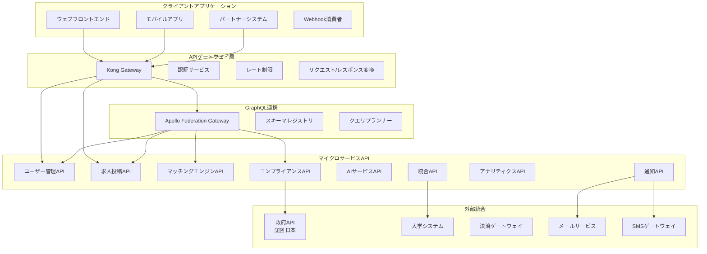

# 第07章: API仕様書 & 統合プロトコル

**ドキュメントバージョン**: 1.0.3  
**最終更新日**: 2025年6月  
**分類**: 機密 - IP ドキュメント  
**対象市場**: 🇯🇵 日本（メイン）、🇰🇷 韓国、🌏 ASEAN  

---

## 7.1 API アーキテクチャ概要

### GraphQL連携によるRESTful API設計

**API アーキテクチャ図**


### API設計原則

**コアAPI設計理念**
```yaml
api_design_principles:
  consistency:
    principle: "全エンドポイント間での一貫したパターン"
    implementation: "標準化されたレスポンス形式、エラーコード、ページネーション"
    benefits: ["学習コストの削減", "統合の簡易化", "優れた開発者体験"]
    
  versioning:
    principle: "下位互換性を持つセマンティックバージョニング"
    implementation: "ヘッダーベースのバージョニングと優雅な廃止予定"
    strategy: "v1.x.xサポートを最低2年間維持"
    
  security:
    principle: "セキュリティファーストのAPI設計"
    implementation: "OAuth 2.0、JWTトークン、レート制限、入力検証"
    compliance: "OWASP API Security Top 10"
    
  performance:
    principle: "高性能APIレスポンス"
    implementation: "キャッシュ、ページネーション、フィールド選択、圧縮"
    targets: "< 200msレスポンス時間、99.9%稼働率"
    
  documentation:
    principle: "包括的な例を持つ自己文書化API"
    implementation: "OpenAPI 3.0仕様、インタラクティブドキュメント"
    languages: "英語および日本語ドキュメント"
    
  observability:
    principle: "完全なトレーサビリティと監視"
    implementation: "リクエストトレーシング、メトリクス、ログ、アラート"
    tools: "Jaeger、Prometheus、Grafana"
```

## 7.2 認証・認可

### OAuth 2.0 + JWT実装

**認証フローアーキテクチャ**
```typescript
// OAuth 2.0 + JWT認証サービス
interface AuthenticationService {
  // OAuth 2.0フロー
  authorizationCodeFlow: "標準ウェブアプリケーションフロー";
  clientCredentialsFlow: "サーバー間認証";
  deviceCodeFlow: "モバイル・IoTデバイス認証";
  
  // JWTトークン構造
  accessToken: {
    algorithm: "RS256";
    expiry: "15分";
    claims: ["sub", "iat", "exp", "aud", "iss", "scope", "permissions"];
  };
  
  refreshToken: {
    algorithm: "RS256";
    expiry: "7日";
    rotation: "使用時の自動ローテーション";
  };
  
  // 多要素認証
  mfaSupport: {
    totp: "時間ベースOTP";
    sms: "SMS認証";
    email: "メール認証";
    biometric: "モバイル生体認証";
  };
}

// JWTトークン構造
interface JWTPayload {
  // 標準クレーム
  sub: string;          // 主体（ユーザーID）
  iat: number;          // 発行時刻
  exp: number;          // 有効期限
  aud: string;          // 対象者
  iss: string;          // 発行者
  jti: string;          // JWT ID
  
  // カスタムクレーム
  scope: string[];      // OAuthスコープ
  permissions: string[]; // 細かい権限
  role: UserRole;       // ユーザーロール
  tenant?: string;      // マルチテナントサポート
  
  // iWORKZ固有クレーム
  profile_id?: string;  // 候補者/企業プロファイルID
  compliance_level: ComplianceLevel;
  data_residency: string; // 日本、韓国など
}

// 認証ミドルウェア実装
import jwt from 'jsonwebtoken';
import { Request, Response, NextFunction } from 'express';

class AuthenticationMiddleware {
  private publicKey: string;
  private issuer: string;
  private audience: string;
  
  constructor() {
    this.publicKey = process.env.JWT_PUBLIC_KEY!;
    this.issuer = 'https://auth.iworkz.com';
    this.audience = 'iworkz-api';
  }
  
  authenticate = async (
    req: Request,
    res: Response,
    next: NextFunction
  ): Promise<void> => {
    try {
      // Authorizationヘッダーからトークンを抽出
      const authHeader = req.headers.authorization;
      if (!authHeader || !authHeader.startsWith('Bearer ')) {
        res.status(401).json({
          error: 'AUTHENTICATION_REQUIRED',
          message: '有効な認証トークンが必要です',
          code: 'AUTH_001'
        });
        return;
      }
      
      const token = authHeader.substring(7);
      
      // JWTトークンを検証
      const decoded = jwt.verify(token, this.publicKey, {
        algorithms: ['RS256'],
        issuer: this.issuer,
        audience: this.audience,
      }) as JWTPayload;
      
      // トークンブラックリストをチェック
      const isBlacklisted = await this.checkTokenBlacklist(decoded.jti);
      if (isBlacklisted) {
        res.status(401).json({
          error: 'TOKEN_REVOKED',
          message: '認証トークンが無効化されています',
          code: 'AUTH_002'
        });
        return;
      }
      
      // 権限とコンプライアンスを検証
      await this.validatePermissions(decoded);
      await this.validateCompliance(decoded);
      
      // リクエストにユーザーコンテキストを追加
      req.user = {
        id: decoded.sub,
        role: decoded.role,
        permissions: decoded.permissions,
        complianceLevel: decoded.compliance_level,
        profileId: decoded.profile_id,
        dataResidency: decoded.data_residency,
      };
      
      // 最終アクティビティを更新
      await this.updateLastActivity(decoded.sub);
      
      next();
    } catch (error) {
      if (error instanceof jwt.TokenExpiredError) {
        res.status(401).json({
          error: 'TOKEN_EXPIRED',
          message: '認証トークンの有効期限が切れています',
          code: 'AUTH_003'
        });
      } else if (error instanceof jwt.JsonWebTokenError) {
        res.status(401).json({
          error: 'INVALID_TOKEN',
          message: '無効な認証トークンです',
          code: 'AUTH_004'
        });
      } else {
        res.status(500).json({
          error: 'AUTHENTICATION_ERROR',
          message: '認証サービスエラー',
          code: 'AUTH_500'
        });
      }
    }
  };
  
  requirePermission = (permission: string) => {
    return (req: Request, res: Response, next: NextFunction): void => {
      if (!req.user) {
        res.status(401).json({
          error: 'AUTHENTICATION_REQUIRED',
          message: '認証が必要です',
          code: 'AUTH_001'
        });
        return;
      }
      
      if (!req.user.permissions.includes(permission) && 
          !req.user.permissions.includes('*')) {
        res.status(403).json({
          error: 'INSUFFICIENT_PERMISSIONS',
          message: `権限 '${permission}' が必要です`,
          code: 'AUTH_005'
        });
        return;
      }
      
      next();
    };
  };
  
  requireRole = (roles: UserRole[]) => {
    return (req: Request, res: Response, next: NextFunction): void => {
      if (!req.user) {
        res.status(401).json({
          error: 'AUTHENTICATION_REQUIRED',
          message: '認証が必要です',
          code: 'AUTH_001'
        });
        return;
      }
      
      if (!roles.includes(req.user.role)) {
        res.status(403).json({
          error: 'INSUFFICIENT_ROLE',
          message: `ロール [${roles.join(', ')}] のいずれかが必要です`,
          code: 'AUTH_006'
        });
        return;
      }
      
      next();
    };
  };
  
  private async checkTokenBlacklist(jti: string): Promise<boolean> {
    // Redisブラックリストをチェック
    const redisClient = getRedisClient();
    return await redisClient.exists(`blacklist:${jti}`);
  }
  
  private async validatePermissions(payload: JWTPayload): Promise<void> {
    // 現在のユーザー状態に対して権限を検証
    // これはロール変更、アカウント停止などをチェックできる
  }
  
  private async validateCompliance(payload: JWTPayload): Promise<void> {
    // 日本固有の要件のコンプライアンスレベルを検証
    if (payload.data_residency === 'Japan') {
      // 日本固有のコンプライアンス要件をチェック
    }
  }
  
  private async updateLastActivity(userId: string): Promise<void> {
    // ユーザーの最終アクティビティタイムスタンプを更新
    const userService = getUserService();
    await userService.updateLastActivity(userId);
  }
}

// ルートでの使用例
const auth = new AuthenticationMiddleware();

router.get('/jobs',
  auth.authenticate,
  auth.requirePermission('jobs:read'),
  jobController.getJobs
);

router.post('/jobs',
  auth.authenticate,
  auth.requireRole(['employer', 'hr_manager']),
  auth.requirePermission('jobs:create'),
  jobController.createJob
);
```

## 7.3 コアAPIエンドポイント

### ユーザー管理API

**完全なユーザー管理API仕様**
```yaml
# ユーザー管理APIのOpenAPI 3.0仕様
openapi: 3.0.3
info:
  title: iWORKZ ユーザー管理API
  description: ユーザー登録、認証、プロファイル管理
  version: 1.0.0
  contact:
    name: iWORKZ APIサポート
    email: api-support@iworkz.com
    url: https://docs.iworkz.com
  license:
    name: プロプライエタリ
    url: https://iworkz.com/license

servers:
  - url: https://api.iworkz.com/v1
    description: 本番サーバー
  - url: https://api-staging.iworkz.com/v1
    description: ステージングサーバー

security:
  - BearerAuth: []

paths:
  /auth/register:
    post:
      summary: 新規ユーザー登録
      description: メール認証付きの新規ユーザーアカウント登録
      tags: [認証]
      security: [] # パブリックエンドポイント
      requestBody:
        required: true
        content:
          application/json:
            schema:
              type: object
              required: [email, password, firstName, lastName, role]
              properties:
                email:
                  type: string
                  format: email
                  example: "tanaka@example.com"
                password:
                  type: string
                  minLength: 8
                  pattern: "^(?=.*[a-z])(?=.*[A-Z])(?=.*\\d)(?=.*[@$!%*?&])[A-Za-z\\d@$!%*?&]"
                  example: "SecurePass123!"
                firstName:
                  type: string
                  minLength: 1
                  maxLength: 100
                  example: "太郎"
                lastName:
                  type: string
                  minLength: 1
                  maxLength: 100
                  example: "田中"
                firstNameKana:
                  type: string
                  maxLength: 100
                  example: "タロウ"
                lastNameKana:
                  type: string
                  maxLength: 100
                  example: "タナカ"
                role:
                  type: string
                  enum: [candidate, employer, recruiter]
                  example: "candidate"
                languagePreference:
                  type: string
                  enum: [ja, en]
                  default: "ja"
                  example: "ja"
                privacyConsent:
                  type: boolean
                  example: true
                marketingConsent:
                  type: boolean
                  default: false
                  example: false
      responses:
        '201':
          description: ユーザー登録が正常に完了しました
          content:
            application/json:
              schema:
                type: object
                properties:
                  success:
                    type: boolean
                    example: true
                  message:
                    type: string
                    example: "登録が完了しました。認証のためメールをご確認ください。"
                  user:
                    $ref: '#/components/schemas/User'
                  verification:
                    type: object
                    properties:
                      required:
                        type: boolean
                        example: true
                      expiresAt:
                        type: string
                        format: date-time
        '400':
          $ref: '#/components/responses/BadRequest'
        '409':
          description: メールアドレスが既に存在します
          content:
            application/json:
              schema:
                $ref: '#/components/schemas/Error'
                example:
                  error: "EMAIL_EXISTS"
                  message: "このメールアドレスのアカウントが既に存在します"
                  code: "USER_001"

  /auth/login:
    post:
      summary: ユーザーログイン
      description: ユーザー認証とアクセス/リフレッシュトークンの返却
      tags: [認証]
      security: [] # パブリックエンドポイント
      requestBody:
        required: true
        content:
          application/json:
            schema:
              type: object
              required: [email, password]
              properties:
                email:
                  type: string
                  format: email
                  example: "tanaka@example.com"
                password:
                  type: string
                  example: "SecurePass123!"
                rememberMe:
                  type: boolean
                  default: false
                  example: false
                mfaCode:
                  type: string
                  pattern: "^\\d{6}$"
                  example: "123456"
                  description: "MFAが有効な場合は必須"
      responses:
        '200':
          description: ログイン成功
          content:
            application/json:
              schema:
                type: object
                properties:
                  success:
                    type: boolean
                    example: true
                  tokens:
                    type: object
                    properties:
                      accessToken:
                        type: string
                        example: "eyJhbGciOiJSUzI1NiIsInR5cCI6IkpXVCJ9..."
                      refreshToken:
                        type: string
                        example: "eyJhbGciOiJSUzI1NiIsInR5cCI6IkpXVCJ9..."
                      expiresIn:
                        type: integer
                        example: 900
                        description: "アクセストークンの有効期限（秒）"
                  user:
                    $ref: '#/components/schemas/User'
        '400':
          $ref: '#/components/responses/BadRequest'
        '401':
          description: 認証情報が無効です
          content:
            application/json:
              schema:
                $ref: '#/components/schemas/Error'
                example:
                  error: "INVALID_CREDENTIALS"
                  message: "メールアドレスまたはパスワードが無効です"
                  code: "AUTH_001"
        '423':
          description: アカウントがロックされています
          content:
            application/json:
              schema:
                $ref: '#/components/schemas/Error'
                example:
                  error: "ACCOUNT_LOCKED"
                  message: "複数回のログイン失敗によりアカウントがロックされています"
                  code: "AUTH_002"

  /users/me:
    get:
      summary: 現在のユーザープロファイル取得
      description: 認証されたユーザーのプロファイル情報を取得
      tags: [ユーザー]
      responses:
        '200':
          description: ユーザープロファイルの取得に成功しました
          content:
            application/json:
              schema:
                type: object
                properties:
                  success:
                    type: boolean
                    example: true
                  user:
                    $ref: '#/components/schemas/UserProfile'
        '401':
          $ref: '#/components/responses/Unauthorized'
        '404':
          $ref: '#/components/responses/NotFound'
    
    put:
      summary: 現在のユーザープロファイル更新
      description: 認証されたユーザーのプロファイル情報を更新
      tags: [ユーザー]
      requestBody:
        required: true
        content:
          application/json:
            schema:
              $ref: '#/components/schemas/UserProfileUpdate'
      responses:
        '200':
          description: プロファイルの更新に成功しました
          content:
            application/json:
              schema:
                type: object
                properties:
                  success:
                    type: boolean
                    example: true
                  user:
                    $ref: '#/components/schemas/UserProfile'
                  validationWarnings:
                    type: array
                    items:
                      type: string
                    example: ["プロファイル完成度は75%です。より多くのスキルを追加することを検討してください。"]
        '400':
          $ref: '#/components/responses/BadRequest'
        '401':
          $ref: '#/components/responses/Unauthorized'

components:
  securitySchemes:
    BearerAuth:
      type: http
      scheme: bearer
      bearerFormat: JWT

  schemas:
    User:
      type: object
      properties:
        id:
          type: string
          format: uuid
          example: "123e4567-e89b-12d3-a456-426614174000"
        email:
          type: string
          format: email
          example: "tanaka@example.com"
        firstName:
          type: string
          example: "太郎"
        lastName:
          type: string
          example: "田中"
        firstNameKana:
          type: string
          example: "タロウ"
        lastNameKana:
          type: string
          example: "タナカ"
        displayName:
          type: string
          example: "田中太郎"
        role:
          type: string
          enum: [candidate, employer, recruiter, admin]
          example: "candidate"
        status:
          type: string
          enum: [active, inactive, suspended, pending_verification]
          example: "active"
        emailVerified:
          type: boolean
          example: true
        phoneVerified:
          type: boolean
          example: false
        languagePreference:
          type: string
          enum: [ja, en]
          example: "ja"
        timezone:
          type: string
          example: "Asia/Tokyo"
        createdAt:
          type: string
          format: date-time
          example: "2024-01-15T09:30:00Z"
        updatedAt:
          type: string
          format: date-time
          example: "2024-01-15T09:30:00Z"
        lastLoginAt:
          type: string
          format: date-time
          example: "2024-01-15T09:30:00Z"

    Error:
      type: object
      required: [error, message, code]
      properties:
        error:
          type: string
          example: "VALIDATION_ERROR"
        message:
          type: string
          example: "入力データが無効です"
        code:
          type: string
          example: "VAL_001"
        details:
          type: object
          additionalProperties: true
        timestamp:
          type: string
          format: date-time
          example: "2024-01-15T09:30:00Z"
        requestId:
          type: string
          example: "req_123e4567e89b12d3a456426614174000"

  responses:
    BadRequest:
      description: リクエストが無効です - 入力が無効
      content:
        application/json:
          schema:
            $ref: '#/components/schemas/Error'
            example:
              error: "VALIDATION_ERROR"
              message: "入力データが無効です"
              code: "VAL_001"
              details:
                email: "メールアドレスの形式が無効です"
                password: "パスワードには大文字が1文字以上必要です"

    Unauthorized:
      description: 認証が必要です
      content:
        application/json:
          schema:
            $ref: '#/components/schemas/Error'
            example:
              error: "AUTHENTICATION_REQUIRED"
              message: "有効な認証トークンが必要です"
              code: "AUTH_001"
```

### 求人投稿API実装

**高度な機能を持つ求人管理API**
```typescript
// 求人投稿APIコントローラー実装
import { Request, Response } from 'express';
import { validationResult } from 'express-validator';
import JobService from '../services/JobService';
import MatchingService from '../services/MatchingService';
import ComplianceService from '../services/ComplianceService';

class JobController {
  private jobService: JobService;
  private matchingService: MatchingService;
  private complianceService: ComplianceService;
  
  constructor() {
    this.jobService = new JobService();
    this.matchingService = new MatchingService();
    this.complianceService = new ComplianceService();
  }
  
  // ============================================================================
  // GET /jobs - 求人の検索とフィルタリング
  // ============================================================================
  getJobs = async (req: Request, res: Response): Promise<void> => {
    try {
      const {
        q: keywords,
        location,
        salaryMin,
        salaryMax,
        experienceLevel,
        employmentType,
        skills,
        visaSponsorship,
        remoteWork,
        industry,
        companySize,
        page = 1,
        limit = 20,
        sortBy = 'relevance'
      } = req.query;
      
      // 検索フィルターを構築
      const filters = {
        keywords: keywords as string,
        location: location as string,
        salaryRange: {
          min: salaryMin ? parseInt(salaryMin as string) : undefined,
          max: salaryMax ? parseInt(salaryMax as string) : undefined,
        },
        experienceLevel: this.parseArrayParam(experienceLevel),
        employmentType: this.parseArrayParam(employmentType),
        skills: this.parseArrayParam(skills),
        visaSponsorship: visaSponsorship === 'true',
        remoteWork: this.parseArrayParam(remoteWork),
        industry: this.parseArrayParam(industry),
        companySize: this.parseArrayParam(companySize),
      };
      
      // ページネーション
      const pageNum = Math.max(1, parseInt(page as string));
      const limitNum = Math.min(100, Math.max(1, parseInt(limit as string)));
      const offset = (pageNum - 1) * limitNum;
      
      // 検索実行
      const searchResult = await this.jobService.searchJobs(
        filters,
        offset,
        limitNum,
        sortBy as string,
        req.user?.id
      );
      
      // 認証された候補者にはマッチングスコアを追加
      let jobsWithScores = searchResult.jobs;
      if (req.user?.role === 'candidate' && req.user.profileId) {
        jobsWithScores = await this.matchingService.addMatchingScores(
          searchResult.jobs,
          req.user.profileId
        );
      }
      
      res.json({
        success: true,
        data: {
          jobs: jobsWithScores,
          pagination: {
            page: pageNum,
            limit: limitNum,
            total: searchResult.total,
            totalPages: Math.ceil(searchResult.total / limitNum),
            hasNext: pageNum * limitNum < searchResult.total,
            hasPrev: pageNum > 1,
          },
          aggregations: searchResult.aggregations,
          searchMeta: {
            query: filters,
            executionTime: searchResult.executionTime,
            resultsFound: searchResult.total,
          }
        }
      });
    } catch (error) {
      console.error('求人検索エラー:', error);
      res.status(500).json({
        success: false,
        error: 'SEARCH_ERROR',
        message: '求人検索に失敗しました',
        code: 'JOB_001'
      });
    }
  };
  
  // ============================================================================
  // GET /jobs/:id - 特定の求人詳細取得
  // ============================================================================
  getJobById = async (req: Request, res: Response): Promise<void> => {
    try {
      const { id } = req.params;
      const { includeMatching = false } = req.query;
      
      // 求人詳細を取得
      const job = await this.jobService.getJobById(id, req.user?.id);
      
      if (!job) {
        res.status(404).json({
          success: false,
          error: 'JOB_NOT_FOUND',
          message: '求人が見つかりません',
          code: 'JOB_002'
        });
        return;
      }
      
      // 表示権限をチェック
      if (!await this.jobService.canUserViewJob(job, req.user)) {
        res.status(403).json({
          success: false,
          error: 'INSUFFICIENT_PERMISSIONS',
          message: 'この求人を表示する権限がありません',
          code: 'JOB_003'
        });
        return;
      }
      
      let matchingData = {};
      
      // 候補者にはマッチングデータを含める
      if (includeMatching === 'true' && 
          req.user?.role === 'candidate' && 
          req.user.profileId) {
        
        const matchResult = await this.matchingService.calculateJobMatch(
          req.user.profileId,
          job.id
        );
        
        const complianceCheck = await this.complianceService.checkJobCompliance(
          req.user.profileId,
          job.id
        );
        
        matchingData = {
          matchScore: matchResult.overallScore,
          matchBreakdown: {
            skillMatch: matchResult.skillMatch,
            experienceMatch: matchResult.experienceMatch,
            locationMatch: matchResult.locationMatch,
            salaryMatch: matchResult.salaryMatch,
            culturalFit: matchResult.culturalFit,
          },
          compliance: {
            eligible: complianceCheck.eligible,
            visaStatus: complianceCheck.visaEligibility,
            requirements: complianceCheck.requirements,
            recommendations: complianceCheck.recommendations,
          },
          applicationStatus: await this.jobService.getApplicationStatus(
            req.user.profileId,
            job.id
          ),
        };
      }
      
      // 求人閲覧をアナリティクス用に追跡
      await this.jobService.trackJobView(job.id, req.user?.id);
      
      res.json({
        success: true,
        data: {
          job,
          matching: matchingData,
          relatedJobs: await this.jobService.getRelatedJobs(job.id, 5),
          company: await this.jobService.getJobCompanyInfo(job.id),
        }
      });
    } catch (error) {
      console.error('求人取得エラー:', error);
      res.status(500).json({
        success: false,
        error: 'FETCH_ERROR',
        message: '求人詳細の取得に失敗しました',
        code: 'JOB_004'
      });
    }
  };
  
  // ============================================================================
  // POST /jobs - 新規求人投稿作成
  // ============================================================================
  createJob = async (req: Request, res: Response): Promise<void> => {
    try {
      // 入力を検証
      const errors = validationResult(req);
      if (!errors.isEmpty()) {
        res.status(400).json({
          success: false,
          error: 'VALIDATION_ERROR',
          message: '求人投稿データが無効です',
          code: 'JOB_005',
          details: errors.array()
        });
        return;
      }
      
      const jobData = req.body;
      
      // メタデータを追加
      jobData.postedBy = req.user!.id;
      jobData.companyId = req.user!.profileId; // 企業プロファイルID
      
      // コンプライアンス事前チェック
      const complianceResult = await this.complianceService.validateJobPosting(jobData);
      if (!complianceResult.compliant) {
        res.status(400).json({
          success: false,
          error: 'COMPLIANCE_VIOLATION',
          message: '求人投稿がコンプライアンス要件に違反しています',
          code: 'JOB_006',
          details: complianceResult.violations
        });
        return;
      }
      
      // 求人投稿を作成
      const job = await this.jobService.createJob(jobData);
      
      // AI活用の求人インサイトを生成
      const insights = await this.jobService.generateJobInsights(job.id);
      
      // 候補者マッチングをトリガー（非同期）
      this.matchingService.generateJobMatches(job.id).catch(error => {
        console.error('非同期マッチング生成に失敗:', error);
      });
      
      res.status(201).json({
        success: true,
        data: {
          job,
          insights,
          complianceReport: complianceResult,
        },
        message: '求人投稿が正常に作成されました'
      });
    } catch (error) {
      console.error('求人作成エラー:', error);
      res.status(500).json({
        success: false,
        error: 'CREATE_ERROR',
        message: '求人投稿の作成に失敗しました',
        code: 'JOB_007'
      });
    }
  };
  
  // ============================================================================
  // ヘルパーメソッド
  // ============================================================================
  
  private parseArrayParam(param: any): string[] {
    if (!param) return [];
    if (Array.isArray(param)) return param;
    return param.split(',').map((s: string) => s.trim());
  }
}

export default JobController;
```

## 7.4 GraphQL連携

### GraphQLによる統合API

**GraphQLスキーマ連携実装**
```graphql
# ユーザー管理サービススキーマ
type User @key(fields: "id") {
  id: ID!
  email: String!
  firstName: String!
  lastName: String!
  firstNameKana: String
  lastNameKana: String
  displayName: String
  role: UserRole!
  status: UserStatus!
  emailVerified: Boolean!
  phoneVerified: Boolean!
  languagePreference: Language!
  timezone: String!
  createdAt: DateTime!
  updatedAt: DateTime!
  lastLoginAt: DateTime
  
  # 他のサービスによる拡張
  candidateProfile: CandidateProfile @requires(fields: "id role")
  companyProfile: CompanyProfile @requires(fields: "id role")
  applications: [JobApplication!]! @requires(fields: "id")
}

enum UserRole {
  CANDIDATE
  EMPLOYER
  RECRUITER
  HR_MANAGER
  ADMIN
}

enum UserStatus {
  ACTIVE
  INACTIVE
  SUSPENDED
  PENDING_VERIFICATION
}

enum Language {
  JA
  EN
}

# 求人管理サービススキーマ
type JobPosting @key(fields: "id") {
  id: ID!
  title: String!
  titleJa: String
  description: String!
  descriptionJa: String
  company: Company! @provides(fields: "id name industry")
  postedBy: User! @provides(fields: "id firstName lastName")
  
  # 求人詳細
  department: String
  jobFunction: String
  jobLevel: JobLevel
  employmentType: EmploymentType!
  
  # 場所
  location: Location!
  remoteWorkOption: RemoteWorkOption!
  relocationAssistance: Boolean!
  
  # 報酬
  salary: SalaryRange
  benefits: [Benefit!]!
  
  # 要件
  experienceRequired: ExperienceRange
  requiredSkills: [Skill!]!
  preferredSkills: [Skill!]!
  languageRequirements: [LanguageRequirement!]!
  educationRequirements: [EducationRequirement!]!
  
  # ビザと法的要件
  visaSponsorship: Boolean!
  supportedVisaTypes: [VisaType!]!
  workAuthorizationRequired: Boolean!
  
  # ステータスと日付
  status: JobStatus!
  applicationDeadline: Date
  startDate: Date
  createdAt: DateTime!
  updatedAt: DateTime!
  publishedAt: DateTime
  
  # アナリティクス
  viewCount: Int!
  applicationCount: Int!
  
  # 他のサービスによる拡張
  matches: [CandidateMatch!]! @requires(fields: "id")
  applications: [JobApplication!]! @requires(fields: "id")
  complianceStatus: ComplianceStatus! @requires(fields: "id")
}

# マッチングサービススキーマ
type CandidateMatch @key(fields: "jobId candidateId") {
  jobId: ID!
  candidateId: ID!
  job: JobPosting! @provides(fields: "id title company")
  candidate: CandidateProfile! @provides(fields: "id user")
  
  # マッチングスコア
  overallScore: Float!
  skillMatchScore: Float
  experienceMatchScore: Float
  culturalFitScore: Float
  locationMatchScore: Float
  salaryMatchScore: Float
  languageMatchScore: Float
  
  # AIインサイト
  matchExplanation: MatchExplanation!
  confidenceScore: Float!
  riskFactors: [RiskFactor!]!
  strengthAreas: [StrengthArea!]!
  
  # コンプライアンス
  complianceStatus: ComplianceStatus!
  visaEligibility: Boolean
  
  # ステータス
  status: MatchStatus!
  viewedByCompany: Boolean!
  viewedByCandidate: Boolean!
  
  createdAt: DateTime!
  updatedAt: DateTime!
}

# ルートクエリタイプ
type Query {
  # ユーザークエリ
  me: User
  user(id: ID!): User
  
  # 求人クエリ
  jobs(
    filter: JobFilter
    pagination: PaginationInput
    sort: JobSortInput
  ): JobSearchResult!
  
  job(id: ID!): JobPosting
  
  # 候補者クエリ
  candidates(
    filter: CandidateFilter
    pagination: PaginationInput
    sort: CandidateSortInput
  ): CandidateSearchResult!
  
  candidate(id: ID!): CandidateProfile
  
  # マッチングクエリ
  jobMatches(
    candidateId: ID!
    filter: MatchFilter
    pagination: PaginationInput
  ): [JobMatch!]!
  
  candidateMatches(
    jobId: ID!
    filter: MatchFilter
    pagination: PaginationInput
  ): [CandidateMatch!]!
}

# ルートミューテーションタイプ
type Mutation {
  # ユーザーミューテーション
  updateProfile(input: UserProfileUpdateInput!): User!
  changePassword(input: ChangePasswordInput!): Boolean!
  
  # 求人ミューテーション
  createJob(input: CreateJobInput!): JobPosting!
  updateJob(id: ID!, input: UpdateJobInput!): JobPosting!
  publishJob(id: ID!): JobPosting!
  closeJob(id: ID!): JobPosting!
  
  # 応募ミューテーション
  submitApplication(input: SubmitApplicationInput!): JobApplication!
  updateApplicationStatus(
    id: ID!
    status: ApplicationStatus!
    notes: String
  ): JobApplication!
  
  # マッチングミューテーション
  triggerMatching(
    entityId: ID!
    entityType: MatchingEntityType!
  ): Boolean!
}

# ルートサブスクリプションタイプ
type Subscription {
  # リアルタイム通知
  notifications(userId: ID!): Notification!
  
  # 求人更新
  jobUpdates(companyId: ID!): JobUpdateNotification!
  
  # 応募更新
  applicationUpdates(
    userId: ID!
    role: UserRole!
  ): ApplicationUpdateNotification!
  
  # マッチング更新
  newMatches(
    userId: ID!
    role: UserRole!
  ): MatchNotification!
}

scalar DateTime
scalar Date
scalar JSON
scalar Currency
```

---

**この包括的なAPI仕様書 & 統合プロトコルドキュメントは、RESTful API、GraphQL連携、認証・認可システム、日本の雇用市場向けに最適化された多言語サポートとコンプライアンス自動化を含む統合パターンの詳細な実装を提供します。**

---

*API アーキテクチャは、エンタープライズグレードのセキュリティ、パフォーマンス最適化、内部開発チームと外部パートナー統合の両方に適した包括的なドキュメントを備えて設計されています。すべてのエンドポイントには、規制遵守のための適切なエラーハンドリング、検証、監査ログが含まれています。*