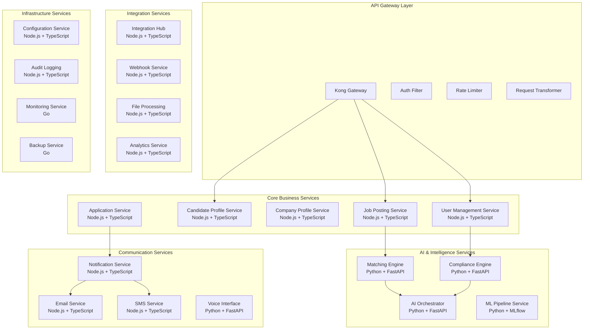

# Chapter 08: Backend Services Implementation

**Document Version**: 1.0.0  
**Last Updated**: December 2024  
**Classification**: Confidential - IP Documentation  
**Target Markets**: 🇯🇵 Japan (Primary), 🇰🇷 South Korea, 🌏 ASEAN  

---

## 8.1 Microservices Architecture Overview

### Service Decomposition Strategy

**Backend Services Architecture**


### Service Communication Patterns

**Inter-Service Communication Strategy**
```typescript
// Service Communication Patterns Implementation
interface ServiceCommunication {
  // Synchronous patterns
  restApiCalls: "HTTP/REST for real-time operations";
  graphqlQueries: "GraphQL for complex data fetching";
  grpcCalls: "gRPC for high-performance internal communication";
  
  // Asynchronous patterns
  eventStreaming: "Apache Kafka for event-driven architecture";
  messagePassing: "Redis Pub/Sub for real-time notifications";
  taskQueues: "Bull Queue with Redis for background jobs";
  
  // Data synchronization
  eventSourcing: "Event store for audit and replay capabilities";
  cqrs: "Command Query Responsibility Segregation";
  saga: "Distributed transaction management";
}

// Event-Driven Architecture Implementation
import { EventEmitter } from 'events';
import { Kafka, Producer, Consumer } from 'kafkajs';

class EventBus extends EventEmitter {
  private kafka: Kafka;
  private producer: Producer;
  private consumers: Map<string, Consumer> = new Map();
  
  constructor() {
    super();
    this.kafka = new Kafka({
      clientId: 'iworkz-backend',
      brokers: process.env.KAFKA_BROKERS?.split(',') || ['localhost:9092'],
    });
    this.producer = this.kafka.producer();
  }
  
  async publishEvent(
    topic: string,
    event: DomainEvent,
    partition?: string
  ): Promise<void> {
    await this.producer.send({
      topic,
      messages: [{
        key: partition || event.aggregateId,
        value: JSON.stringify({
          ...event,
          timestamp: new Date().toISOString(),
          version: '1.0.0',
        }),
        headers: {
          'event-type': event.type,
          'source-service': event.sourceService,
          'correlation-id': event.correlationId,
        },
      }],
    });
    
    // Also emit locally for same-service listeners
    this.emit(event.type, event);
  }
  
  async subscribeToEvents(
    topic: string,
    groupId: string,
    handler: EventHandler
  ): Promise<void> {
    const consumer = this.kafka.consumer({ groupId });
    await consumer.connect();
    await consumer.subscribe({ topic, fromBeginning: false });
    
    await consumer.run({
      eachMessage: async ({ topic, partition, message }) => {
        try {
          const event = JSON.parse(message.value?.toString() || '{}');
          await handler(event, {
            topic,
            partition,
            offset: message.offset,
            headers: message.headers,
          });
        } catch (error) {
          console.error('Event handling error:', error);
          // Send to dead letter queue
          await this.handleFailedEvent(message, error);
        }
      },
    });
    
    this.consumers.set(`${topic}-${groupId}`, consumer);
  }
  
  private async handleFailedEvent(message: any, error: Error): Promise<void> {
    // Implementation for dead letter queue
    await this.publishEvent('failed-events', {
      type: 'EVENT_PROCESSING_FAILED',
      aggregateId: 'system',
      sourceService: 'event-bus',
      correlationId: generateId(),
      data: {
        originalMessage: message,
        error: error.message,
        timestamp: new Date().toISOString(),
      },
    });
  }
}

// Domain Events Definition
interface DomainEvent {
  type: string;
  aggregateId: string;
  sourceService: string;
  correlationId: string;
  data: any;
  metadata?: any;
}

// Common domain events
const DomainEvents = {
  USER_REGISTERED: 'user.registered',
  USER_PROFILE_UPDATED: 'user.profile.updated',
  JOB_POSTED: 'job.posted',
  JOB_APPLIED: 'job.application.submitted',
  MATCH_GENERATED: 'matching.match.generated',
  COMPLIANCE_CHECK_COMPLETED: 'compliance.check.completed',
  NOTIFICATION_SENT: 'notification.sent',
} as const;

type EventHandler = (event: DomainEvent, context: any) => Promise<void>;
```

## 8.2 User Management Service

### Complete User Service Implementation

**User Management Service with Advanced Features**
```typescript
// User Management Service - Complete Implementation
import express from 'express';
import bcrypt from 'bcrypt';
import jwt from 'jsonwebtoken';
import { PrismaClient } from '@prisma/client';
import { UserRepository } from '../repositories/UserRepository';
import { EventBus } from '../infrastructure/EventBus';
import { CacheManager } from '../infrastructure/CacheManager';
import { AuditLogger } from '../infrastructure/AuditLogger';
import { ComplianceChecker } from '../infrastructure/ComplianceChecker';

interface UserServiceConfig {
  jwtSecret: string;
  bcryptRounds: number;
  sessionTTL: number;
  maxLoginAttempts: number;
  lockoutDuration: number;
}

class UserManagementService {
  private prisma: PrismaClient;
  private userRepository: UserRepository;
  private eventBus: EventBus;
  private cache: CacheManager;
  private auditLogger: AuditLogger;
  private complianceChecker: ComplianceChecker;
  private config: UserServiceConfig;
  
  constructor(config: UserServiceConfig) {
    this.config = config;
    this.prisma = new PrismaClient();
    this.userRepository = new UserRepository(this.prisma);
    this.eventBus = new EventBus();
    this.cache = new CacheManager();
    this.auditLogger = new AuditLogger();
    this.complianceChecker = new ComplianceChecker();
    
    this.setupEventListeners();
  }
  
  // ============================================================================
  // USER REGISTRATION
  // ============================================================================
  
  async registerUser(registrationData: UserRegistrationData): Promise<RegisterUserResult> {
    try {
      // Input validation and sanitization
      const validatedData = await this.validateRegistrationData(registrationData);
      
      // Check for existing user
      const existingUser = await this.userRepository.findByEmail(validatedData.email);
      if (existingUser) {
        throw new Error('USER_ALREADY_EXISTS');
      }
      
      // Compliance and security checks
      await this.complianceChecker.validateUserRegistration(validatedData);
      
      // Password hashing
      const passwordHash = await bcrypt.hash(
        validatedData.password,
        this.config.bcryptRounds
      );
      
      // Create user record
      const userData = {
        ...validatedData,
        passwordHash,
        status: 'pending_verification',
        emailVerified: false,
        createdAt: new Date(),
        updatedAt: new Date(),
      };
      
      const user = await this.userRepository.create(userData);
      
      // Generate email verification token
      const verificationToken = await this.generateEmailVerificationToken(user.id);
      
      // Publish user registration event
      await this.eventBus.publishEvent('user-events', {
        type: DomainEvents.USER_REGISTERED,
        aggregateId: user.id,
        sourceService: 'user-service',
        correlationId: generateCorrelationId(),
        data: {
          userId: user.id,
          email: user.email,
          role: user.role,
          verificationToken,
          languagePreference: user.languagePreference,
        },
      });
      
      // Audit logging
      await this.auditLogger.log({
        action: 'USER_REGISTERED',
        entityId: user.id,
        entityType: 'user',
        performedBy: user.id,
        details: {
          email: user.email,
          role: user.role,
        },
      });
      
      // Cache user data
      await this.cache.cacheUserProfile(user.id, user);
      
      return {
        success: true,
        user: this.sanitizeUserData(user),
        verificationRequired: true,
        verificationToken,
      };
    } catch (error) {
      console.error('User registration error:', error);
      throw error;
    }
  }
  
  private async validateRegistrationData(data: UserRegistrationData): Promise<UserRegistrationData> {
    const validator = new UserDataValidator();
    
    // Email validation
    if (!validator.isValidEmail(data.email)) {
      throw new Error('INVALID_EMAIL');
    }
    
    // Password strength validation
    if (!validator.isStrongPassword(data.password)) {
      throw new Error('WEAK_PASSWORD');
    }
    
    // Name validation (support for Japanese names)
    if (!validator.isValidName(data.firstName) || !validator.isValidName(data.lastName)) {
      throw new Error('INVALID_NAME');
    }
    
    // Japanese name validation (if provided)
    if (data.firstNameKana && !validator.isValidKana(data.firstNameKana)) {
      throw new Error('INVALID_KANA');
    }
    
    if (data.lastNameKana && !validator.isValidKana(data.lastNameKana)) {
      throw new Error('INVALID_KANA');
    }
    
    // Role validation
    if (!validator.isValidRole(data.role)) {
      throw new Error('INVALID_ROLE');
    }
    
    return data;
  }
  
  // ============================================================================
  // USER AUTHENTICATION
  // ============================================================================
  
  async authenticateUser(credentials: LoginCredentials): Promise<AuthenticationResult> {
    try {
      const { email, password, mfaCode, rememberMe = false } = credentials;
      
      // Rate limiting check
      await this.checkLoginRateLimit(email);
      
      // Find user by email
      const user = await this.userRepository.findByEmail(email);
      if (!user) {
        await this.handleFailedLoginAttempt(email, 'USER_NOT_FOUND');
        throw new Error('INVALID_CREDENTIALS');
      }
      
      // Account status checks
      if (user.status === 'suspended') {
        throw new Error('ACCOUNT_SUSPENDED');
      }
      
      if (user.status === 'inactive') {
        throw new Error('ACCOUNT_INACTIVE');
      }
      
      // Check if account is locked
      if (await this.isAccountLocked(user.id)) {
        throw new Error('ACCOUNT_LOCKED');
      }
      
      // Password verification
      const isPasswordValid = await bcrypt.compare(password, user.passwordHash);
      if (!isPasswordValid) {
        await this.handleFailedLoginAttempt(user.id, 'INVALID_PASSWORD');
        throw new Error('INVALID_CREDENTIALS');
      }
      
      // MFA verification (if enabled)
      if (user.twoFactorEnabled) {
        if (!mfaCode) {
          return {
            success: false,
            requiresMFA: true,
            tempToken: await this.generateTempMFAToken(user.id),
          };
        }
        
        const isMFAValid = await this.verifyMFACode(user.id, mfaCode);
        if (!isMFAValid) {
          await this.handleFailedLoginAttempt(user.id, 'INVALID_MFA');
          throw new Error('INVALID_MFA_CODE');
        }
      }
      
      // Generate authentication tokens
      const tokens = await this.generateAuthTokens(user, rememberMe);
      
      // Update user login information
      await this.userRepository.updateLoginInfo(user.id, {
        lastLoginAt: new Date(),
        loginCount: user.loginCount + 1,
        failedLoginAttempts: 0, // Reset failed attempts
      });
      
      // Create user session
      const sessionId = await this.cache.createUserSession(user.id, {
        deviceInfo: credentials.deviceInfo,
        ipAddress: credentials.ipAddress,
        userAgent: credentials.userAgent,
      });
      
      // Publish login event
      await this.eventBus.publishEvent('user-events', {
        type: 'USER_LOGGED_IN',
        aggregateId: user.id,
        sourceService: 'user-service',
        correlationId: generateCorrelationId(),
        data: {
          userId: user.id,
          sessionId,
          deviceInfo: credentials.deviceInfo,
          ipAddress: credentials.ipAddress,
        },
      });
      
      // Audit logging
      await this.auditLogger.log({
        action: 'USER_LOGIN',
        entityId: user.id,
        entityType: 'user',
        performedBy: user.id,
        ipAddress: credentials.ipAddress,
        userAgent: credentials.userAgent,
      });
      
      return {
        success: true,
        tokens,
        user: this.sanitizeUserData(user),
        sessionId,
      };
    } catch (error) {
      console.error('Authentication error:', error);
      throw error;
    }
  }
  
  private async generateAuthTokens(
    user: User,
    rememberMe: boolean
  ): Promise<AuthTokens> {
    const payload = {
      sub: user.id,
      email: user.email,
      role: user.role,
      permissions: await this.getUserPermissions(user),
      profileId: await this.getUserProfileId(user),
      complianceLevel: await this.getUserComplianceLevel(user),
      dataResidency: 'Japan', // Default for Japan market
    };
    
    const accessTokenExpiry = rememberMe ? '7d' : '15m';
    const refreshTokenExpiry = rememberMe ? '30d' : '7d';
    
    const accessToken = jwt.sign(payload, this.config.jwtSecret, {
      expiresIn: accessTokenExpiry,
      issuer: 'iworkz.com',
      audience: 'iworkz-api',
    });
    
    const refreshToken = jwt.sign(
      { sub: user.id, type: 'refresh' },
      this.config.jwtSecret,
      {
        expiresIn: refreshTokenExpiry,
        issuer: 'iworkz.com',
        audience: 'iworkz-api',
      }
    );
    
    // Store refresh token
    await this.cache.storeRefreshToken(user.id, refreshToken);
    
    return {
      accessToken,
      refreshToken,
      expiresIn: this.getTokenExpirySeconds(accessTokenExpiry),
      tokenType: 'Bearer',
    };
  }
  
  // ============================================================================
  // USER PROFILE MANAGEMENT
  // ============================================================================
  
  async updateUserProfile(
    userId: string,
    updateData: UserProfileUpdate,
    performedBy: string
  ): Promise<User> {
    try {
      // Authorization check
      if (userId !== performedBy && !await this.hasPermission(performedBy, 'users:update')) {
        throw new Error('INSUFFICIENT_PERMISSIONS');
      }
      
      // Get current user
      const currentUser = await this.userRepository.findById(userId);
      if (!currentUser) {
        throw new Error('USER_NOT_FOUND');
      }
      
      // Validate update data
      const validatedData = await this.validateProfileUpdateData(updateData);
      
      // Compliance check for sensitive updates
      if (this.isSensitiveUpdate(updateData)) {
        await this.complianceChecker.validateProfileUpdate(userId, validatedData);
      }
      
      // Update user profile
      const updatedUser = await this.userRepository.update(userId, validatedData);
      
      // Calculate profile completeness
      const profileCompleteness = await this.calculateProfileCompleteness(updatedUser);
      await this.userRepository.updateProfileCompleteness(userId, profileCompleteness);
      
      // Invalidate cache
      await this.cache.invalidateUserProfile(userId);
      
      // Publish profile update event
      await this.eventBus.publishEvent('user-events', {
        type: DomainEvents.USER_PROFILE_UPDATED,
        aggregateId: userId,
        sourceService: 'user-service',
        correlationId: generateCorrelationId(),
        data: {
          userId,
          updatedFields: Object.keys(validatedData),
          profileCompleteness,
          performedBy,
        },
      });
      
      // Audit logging
      await this.auditLogger.log({
        action: 'USER_PROFILE_UPDATED',
        entityId: userId,
        entityType: 'user',
        performedBy,
        details: {
          updatedFields: Object.keys(validatedData),
          changes: this.calculateChanges(currentUser, updatedUser),
        },
      });
      
      return this.sanitizeUserData(updatedUser);
    } catch (error) {
      console.error('Profile update error:', error);
      throw error;
    }
  }
  
  // ============================================================================
  // PASSWORD MANAGEMENT
  // ============================================================================
  
  async changePassword(
    userId: string,
    passwordChangeData: PasswordChangeData
  ): Promise<void> {
    try {
      const { currentPassword, newPassword } = passwordChangeData;
      
      // Get user
      const user = await this.userRepository.findById(userId);
      if (!user) {
        throw new Error('USER_NOT_FOUND');
      }
      
      // Verify current password
      const isCurrentPasswordValid = await bcrypt.compare(
        currentPassword,
        user.passwordHash
      );
      
      if (!isCurrentPasswordValid) {
        throw new Error('INVALID_CURRENT_PASSWORD');
      }
      
      // Validate new password
      const validator = new UserDataValidator();
      if (!validator.isStrongPassword(newPassword)) {
        throw new Error('WEAK_PASSWORD');
      }
      
      // Check password history (prevent reuse of recent passwords)
      const isPasswordReused = await this.checkPasswordHistory(userId, newPassword);
      if (isPasswordReused) {
        throw new Error('PASSWORD_RECENTLY_USED');
      }
      
      // Hash new password
      const newPasswordHash = await bcrypt.hash(newPassword, this.config.bcryptRounds);
      
      // Update password
      await this.userRepository.updatePassword(userId, newPasswordHash);
      
      // Store password in history
      await this.storePasswordHistory(userId, newPasswordHash);
      
      // Invalidate all user sessions (force re-login)
      await this.cache.invalidateUserSessions(userId);
      
      // Publish password change event
      await this.eventBus.publishEvent('user-events', {
        type: 'USER_PASSWORD_CHANGED',
        aggregateId: userId,
        sourceService: 'user-service',
        correlationId: generateCorrelationId(),
        data: { userId },
      });
      
      // Audit logging
      await this.auditLogger.log({
        action: 'PASSWORD_CHANGED',
        entityId: userId,
        entityType: 'user',
        performedBy: userId,
      });
    } catch (error) {
      console.error('Password change error:', error);
      throw error;
    }
  }
  
  // ============================================================================
  // MULTI-FACTOR AUTHENTICATION
  // ============================================================================
  
  async setupMFA(userId: string): Promise<MFASetupResult> {
    try {
      const user = await this.userRepository.findById(userId);
      if (!user) {
        throw new Error('USER_NOT_FOUND');
      }
      
      if (user.twoFactorEnabled) {
        throw new Error('MFA_ALREADY_ENABLED');
      }
      
      // Generate MFA secret
      const mfaService = new MFAService();
      const { secret, qrCodeUrl, backupCodes } = await mfaService.setupMFA(
        userId,
        user.email
      );
      
      // Store MFA secret (temporarily until verified)
      await this.cache.storeTempMFASecret(userId, secret);
      
      return {
        secret,
        qrCodeUrl,
        backupCodes,
      };
    } catch (error) {
      console.error('MFA setup error:', error);
      throw error;
    }
  }
  
  async verifyMFASetup(
    userId: string,
    verificationCode: string
  ): Promise<void> {
    try {
      // Get temporary MFA secret
      const tempSecret = await this.cache.getTempMFASecret(userId);
      if (!tempSecret) {
        throw new Error('MFA_SETUP_NOT_FOUND');
      }
      
      // Verify the code
      const mfaService = new MFAService();
      const isValid = await mfaService.verifyTOTPCode(tempSecret, verificationCode);
      
      if (!isValid) {
        throw new Error('INVALID_MFA_CODE');
      }
      
      // Enable MFA for user
      await this.userRepository.enableMFA(userId, tempSecret);
      
      // Clear temporary secret
      await this.cache.deleteTempMFASecret(userId);
      
      // Publish MFA enabled event
      await this.eventBus.publishEvent('user-events', {
        type: 'USER_MFA_ENABLED',
        aggregateId: userId,
        sourceService: 'user-service',
        correlationId: generateCorrelationId(),
        data: { userId },
      });
      
      // Audit logging
      await this.auditLogger.log({
        action: 'MFA_ENABLED',
        entityId: userId,
        entityType: 'user',
        performedBy: userId,
      });
    } catch (error) {
      console.error('MFA verification error:', error);
      throw error;
    }
  }
  
  // ============================================================================
  // EMAIL VERIFICATION
  // ============================================================================
  
  async verifyEmail(verificationToken: string): Promise<void> {
    try {
      // Decode verification token
      const decoded = jwt.verify(verificationToken, this.config.jwtSecret) as any;
      const userId = decoded.sub;
      
      // Get user
      const user = await this.userRepository.findById(userId);
      if (!user) {
        throw new Error('USER_NOT_FOUND');
      }
      
      if (user.emailVerified) {
        throw new Error('EMAIL_ALREADY_VERIFIED');
      }
      
      // Mark email as verified and activate account
      await this.userRepository.verifyEmail(userId);
      
      // Publish email verified event
      await this.eventBus.publishEvent('user-events', {
        type: 'USER_EMAIL_VERIFIED',
        aggregateId: userId,
        sourceService: 'user-service',
        correlationId: generateCorrelationId(),
        data: {
          userId,
          email: user.email,
        },
      });
      
      // Audit logging
      await this.auditLogger.log({
        action: 'EMAIL_VERIFIED',
        entityId: userId,
        entityType: 'user',
        performedBy: userId,
      });
    } catch (error) {
      console.error('Email verification error:', error);
      throw error;
    }
  }
  
  // ============================================================================
  // HELPER METHODS
  // ============================================================================
  
  private async checkLoginRateLimit(identifier: string): Promise<void> {
    const rateLimitResult = await this.cache.checkRateLimit(
      `login:${identifier}`,
      5, // max attempts
      900 // 15 minutes window
    );
    
    if (!rateLimitResult.allowed) {
      throw new Error('TOO_MANY_LOGIN_ATTEMPTS');
    }
  }
  
  private async handleFailedLoginAttempt(
    identifier: string,
    reason: string
  ): Promise<void> {
    // Increment failed attempts counter
    await this.cache.incrementCounter(`failed_login:${identifier}`);
    
    // Audit failed attempt
    await this.auditLogger.log({
      action: 'FAILED_LOGIN_ATTEMPT',
      entityId: identifier,
      entityType: 'user',
      details: { reason },
    });
  }
  
  private sanitizeUserData(user: User): SafeUser {
    const { passwordHash, twoFactorSecret, ...safeUser } = user;
    return safeUser;
  }
  
  private async calculateProfileCompleteness(user: User): Promise<number> {
    const requiredFields = [
      'firstName', 'lastName', 'email', 'role',
    ];
    
    const optionalFields = [
      'firstNameKana', 'lastNameKana', 'phone', 'bio', 'website',
    ];
    
    let completedRequired = 0;
    let completedOptional = 0;
    
    requiredFields.forEach(field => {
      if (user[field]) completedRequired++;
    });
    
    optionalFields.forEach(field => {
      if (user[field]) completedOptional++;
    });
    
    // Required fields: 80% weight, Optional fields: 20% weight
    const requiredScore = (completedRequired / requiredFields.length) * 0.8;
    const optionalScore = (completedOptional / optionalFields.length) * 0.2;
    
    return Math.round((requiredScore + optionalScore) * 100) / 100;
  }
  
  private setupEventListeners(): void {
    // Listen for profile completion events
    this.eventBus.on(DomainEvents.USER_PROFILE_UPDATED, async (event) => {
      if (event.data.profileCompleteness === 1.0) {
        await this.eventBus.publishEvent('user-events', {
          type: 'USER_PROFILE_COMPLETED',
          aggregateId: event.aggregateId,
          sourceService: 'user-service',
          correlationId: generateCorrelationId(),
          data: {
            userId: event.aggregateId,
          },
        });
      }
    });
    
    // Listen for security events
    this.eventBus.on('SUSPICIOUS_ACTIVITY_DETECTED', async (event) => {
      await this.handleSuspiciousActivity(event.data);
    });
  }
  
  private async handleSuspiciousActivity(data: any): Promise<void> {
    // Implementation for handling suspicious activity
    // Could include temporary account suspension, additional verification, etc.
  }
}

// Type definitions
interface UserRegistrationData {
  email: string;
  password: string;
  firstName: string;
  lastName: string;
  firstNameKana?: string;
  lastNameKana?: string;
  role: 'candidate' | 'employer' | 'recruiter';
  languagePreference?: 'ja' | 'en';
  privacyConsent: boolean;
  marketingConsent?: boolean;
}

interface LoginCredentials {
  email: string;
  password: string;
  mfaCode?: string;
  rememberMe?: boolean;
  deviceInfo?: any;
  ipAddress?: string;
  userAgent?: string;
}

interface AuthenticationResult {
  success: boolean;
  tokens?: AuthTokens;
  user?: SafeUser;
  sessionId?: string;
  requiresMFA?: boolean;
  tempToken?: string;
}

interface AuthTokens {
  accessToken: string;
  refreshToken: string;
  expiresIn: number;
  tokenType: string;
}

interface RegisterUserResult {
  success: boolean;
  user: SafeUser;
  verificationRequired: boolean;
  verificationToken: string;
}

export default UserManagementService;
```

## 8.3 Job Management Service

### Job Posting Service Implementation

**Comprehensive Job Management with AI Integration**
```typescript
// Job Management Service - Complete Implementation
import express from 'express';
import { PrismaClient } from '@prisma/client';
import { JobRepository } from '../repositories/JobRepository';
import { CompanyRepository } from '../repositories/CompanyRepository';
import { EventBus } from '../infrastructure/EventBus';
import { CacheManager } from '../infrastructure/CacheManager';
import { SearchService } from '../infrastructure/SearchService';
import { AIService } from '../services/AIService';
import { ComplianceService } from '../services/ComplianceService';

class JobManagementService {
  private prisma: PrismaClient;
  private jobRepository: JobRepository;
  private companyRepository: CompanyRepository;
  private eventBus: EventBus;
  private cache: CacheManager;
  private searchService: SearchService;
  private aiService: AIService;
  private complianceService: ComplianceService;
  
  constructor() {
    this.prisma = new PrismaClient();
    this.jobRepository = new JobRepository(this.prisma);
    this.companyRepository = new CompanyRepository(this.prisma);
    this.eventBus = new EventBus();
    this.cache = new CacheManager();
    this.searchService = new SearchService();
    this.aiService = new AIService();
    this.complianceService = new ComplianceService();
    
    this.setupEventListeners();
  }
  
  // ============================================================================
  // JOB POSTING CREATION
  // ============================================================================
  
  async createJobPosting(
    jobData: CreateJobData,
    companyId: string,
    createdBy: string
  ): Promise<JobPosting> {
    try {
      // Validate company exists and user has permission
      await this.validateCompanyAccess(companyId, createdBy);
      
      // Validate and sanitize job data
      const validatedData = await this.validateJobData(jobData);
      
      // Compliance pre-screening
      const complianceResult = await this.complianceService.validateJobPosting(
        validatedData
      );
      
      if (!complianceResult.compliant) {
        throw new JobComplianceError(
          'Job posting violates compliance requirements',
          complianceResult.violations
        );
      }
      
      // AI-powered job optimization suggestions
      const aiSuggestions = await this.aiService.generateJobOptimizationSuggestions(
        validatedData
      );
      
      // Generate AI embeddings for semantic search
      const jobEmbedding = await this.aiService.generateJobEmbedding(validatedData);
      const skillsEmbedding = await this.aiService.generateSkillsEmbedding(
        validatedData.requiredSkills
      );
      
      // Create job posting
      const jobPostingData = {
        ...validatedData,
        companyId,
        postedBy: createdBy,
        status: 'draft',
        jobRequirementsEmbedding: jobEmbedding,
        skillsEmbedding,
        aiSuggestions,
        complianceStatus: complianceResult.status,
        createdAt: new Date(),
        updatedAt: new Date(),
      };
      
      const jobPosting = await this.jobRepository.create(jobPostingData);
      
      // Index job for search
      await this.searchService.indexJobPosting(jobPosting);
      
      // Cache job data
      await this.cache.cacheJobPosting(jobPosting.id, jobPosting);
      
      // Publish job created event
      await this.eventBus.publishEvent('job-events', {
        type: DomainEvents.JOB_POSTED,
        aggregateId: jobPosting.id,
        sourceService: 'job-service',
        correlationId: generateCorrelationId(),
        data: {
          jobId: jobPosting.id,
          companyId,
          title: jobPosting.title,
          status: jobPosting.status,
          createdBy,
          aiSuggestions,
        },
      });
      
      return jobPosting;
    } catch (error) {
      console.error('Job creation error:', error);
      throw error;
    }
  }
  
  private async validateJobData(jobData: CreateJobData): Promise<CreateJobData> {
    const validator = new JobDataValidator();
    
    // Title validation
    if (!validator.isValidJobTitle(jobData.title)) {
      throw new Error('INVALID_JOB_TITLE');
    }
    
    // Description validation
    if (!validator.isValidJobDescription(jobData.description)) {
      throw new Error('INVALID_JOB_DESCRIPTION');
    }
    
    // Salary validation
    if (jobData.salaryMin && jobData.salaryMax) {
      if (jobData.salaryMin > jobData.salaryMax) {
        throw new Error('INVALID_SALARY_RANGE');
      }
      
      if (!validator.isValidSalaryRange(jobData.salaryMin, jobData.salaryMax)) {
        throw new Error('UNREALISTIC_SALARY_RANGE');
      }
    }
    
    // Skills validation
    if (!validator.areValidSkills(jobData.requiredSkills)) {
      throw new Error('INVALID_REQUIRED_SKILLS');
    }
    
    // Location validation
    if (!validator.isValidLocation(jobData.location)) {
      throw new Error('INVALID_LOCATION');
    }
    
    // Experience requirements validation
    if (jobData.minExperienceYears && jobData.minExperienceYears < 0) {
      throw new Error('INVALID_EXPERIENCE_REQUIREMENT');
    }
    
    return jobData;
  }
  
  // ============================================================================
  // JOB SEARCH AND FILTERING
  // ============================================================================
  
  async searchJobs(
    searchParams: JobSearchParams,
    userId?: string
  ): Promise<JobSearchResult> {
    try {
      const {
        keywords,
        location,
        salaryRange,
        experienceLevel,
        employmentType,
        skills,
        visaSponsorship,
        remoteWork,
        industry,
        companySize,
        page = 1,
        limit = 20,
        sortBy = 'relevance',
      } = searchParams;
      
      // Build search filters
      const searchFilters = {
        keywords,
        location: this.parseLocationFilter(location),
        salaryRange: this.parseSalaryRange(salaryRange),
        experienceLevel: this.parseArrayFilter(experienceLevel),
        employmentType: this.parseArrayFilter(employmentType),
        skills: this.parseArrayFilter(skills),
        visaSponsorship,
        remoteWork: this.parseArrayFilter(remoteWork),
        industry: this.parseArrayFilter(industry),
        companySize: this.parseArrayFilter(companySize),
      };
      
      // Execute search with Elasticsearch
      const searchResult = await this.searchService.searchJobs(
        searchFilters,
        page - 1,
        limit,
        sortBy
      );
      
      // Enhance results with additional data
      const enhancedJobs = await this.enhanceJobSearchResults(
        searchResult.hits,
        userId
      );
      
      // Add user-specific matching scores if authenticated candidate
      if (userId) {
        const userProfile = await this.getUserProfile(userId);
        if (userProfile?.role === 'candidate') {
          enhancedJobs.forEach(async (job) => {
            const matchScore = await this.aiService.calculateJobMatch(
              userProfile.candidateProfile.id,
              job.id
            );
            job.matchScore = matchScore;
          });
        }
      }
      
      // Cache search results for performance
      await this.cache.cacheJobSearchResults(searchParams, enhancedJobs);
      
      return {
        jobs: enhancedJobs,
        total: searchResult.total,
        page,
        limit,
        totalPages: Math.ceil(searchResult.total / limit),
        aggregations: searchResult.aggregations,
        executionTime: searchResult.executionTime,
      };
    } catch (error) {
      console.error('Job search error:', error);
      throw error;
    }
  }
  
  private async enhanceJobSearchResults(
    jobs: any[],
    userId?: string
  ): Promise<EnhancedJobResult[]> {
    return Promise.all(
      jobs.map(async (job) => {
        // Get company information
        const company = await this.companyRepository.findById(job.companyId);
        
        // Get application status for user
        let applicationStatus = null;
        if (userId) {
          applicationStatus = await this.getApplicationStatus(userId, job.id);
        }
        
        // Calculate job popularity metrics
        const popularityMetrics = await this.calculateJobPopularityMetrics(job.id);
        
        return {
          ...job,
          company: {
            id: company.id,
            name: company.name,
            nameJa: company.nameJa,
            industry: company.industry,
            size: company.size,
            verified: company.verified,
            logo: company.logo,
          },
          applicationStatus,
          popularityMetrics,
          aiInsights: await this.getJobAIInsights(job.id),
        };
      })
    );
  }
  
  // ============================================================================
  // AI-POWERED JOB INSIGHTS
  // ============================================================================
  
  async generateJobInsights(jobId: string): Promise<JobInsights> {
    try {
      const job = await this.jobRepository.findById(jobId);
      if (!job) {
        throw new Error('JOB_NOT_FOUND');
      }
      
      // Market analysis
      const marketAnalysis = await this.aiService.analyzeJobMarket(job);
      
      // Salary benchmarking
      const salaryBenchmark = await this.aiService.benchmarkJobSalary(job);
      
      // Skills demand analysis
      const skillsDemand = await this.aiService.analyzeSkillsDemand(
        job.requiredSkills
      );
      
      // Competition analysis
      const competitionAnalysis = await this.aiService.analyzeJobCompetition(job);
      
      // Candidate pool estimation
      const candidatePoolEstimate = await this.aiService.estimateCandidatePool(job);
      
      // Success probability prediction
      const successProbability = await this.aiService.predictJobSuccessProbability(job);
      
      // Optimization recommendations
      const optimizationRecommendations = await this.aiService.generateJobOptimizationRecommendations(job);
      
      const insights = {
        jobId,
        marketAnalysis,
        salaryBenchmark,
        skillsDemand,
        competitionAnalysis,
        candidatePoolEstimate,
        successProbability,
        optimizationRecommendations,
        generatedAt: new Date(),
      };
      
      // Cache insights
      await this.cache.cacheJobInsights(jobId, insights);
      
      // Publish insights generated event
      await this.eventBus.publishEvent('job-events', {
        type: 'JOB_INSIGHTS_GENERATED',
        aggregateId: jobId,
        sourceService: 'job-service',
        correlationId: generateCorrelationId(),
        data: {
          jobId,
          insightsGenerated: Object.keys(insights),
        },
      });
      
      return insights;
    } catch (error) {
      console.error('Job insights generation error:', error);
      throw error;
    }
  }
  
  // ============================================================================
  // JOB PUBLISHING AND STATUS MANAGEMENT
  // ============================================================================
  
  async publishJobPosting(
    jobId: string,
    publishedBy: string
  ): Promise<JobPosting> {
    try {
      const job = await this.jobRepository.findById(jobId);
      if (!job) {
        throw new Error('JOB_NOT_FOUND');
      }
      
      // Verify user can publish job
      await this.verifyJobEditPermission(job, publishedBy);
      
      // Final compliance check before publishing
      const complianceResult = await this.complianceService.validateJobPosting(job);
      if (!complianceResult.compliant) {
        throw new JobComplianceError(
          'Job cannot be published due to compliance issues',
          complianceResult.violations
        );
      }
      
      // Update job status
      const publishedJob = await this.jobRepository.updateStatus(
        jobId,
        'published',
        {
          publishedAt: new Date(),
          publishedBy,
        }
      );
      
      // Re-index for search
      await this.searchService.indexJobPosting(publishedJob);
      
      // Generate candidate matches asynchronously
      this.generateCandidateMatches(jobId).catch(error => {
        console.error('Async candidate matching failed:', error);
      });
      
      // Notify relevant candidates
      this.notifyRelevantCandidates(jobId).catch(error => {
        console.error('Candidate notification failed:', error);
      });
      
      // Update cache
      await this.cache.cacheJobPosting(jobId, publishedJob);
      
      // Publish job published event
      await this.eventBus.publishEvent('job-events', {
        type: 'JOB_PUBLISHED',
        aggregateId: jobId,
        sourceService: 'job-service',
        correlationId: generateCorrelationId(),
        data: {
          jobId,
          companyId: job.companyId,
          title: job.title,
          publishedBy,
          publishedAt: publishedJob.publishedAt,
        },
      });
      
      return publishedJob;
    } catch (error) {
      console.error('Job publishing error:', error);
      throw error;
    }
  }
  
  private async generateCandidateMatches(jobId: string): Promise<void> {
    try {
      // This would call the matching service to generate matches
      const matchingResult = await this.aiService.generateJobMatches(jobId);
      
      // Store matches
      await this.jobRepository.storeJobMatches(jobId, matchingResult.matches);
      
      // Cache top matches
      await this.cache.cacheCandidateMatches(
        jobId,
        matchingResult.matches.slice(0, 50)
      );
      
      // Publish matches generated event
      await this.eventBus.publishEvent('matching-events', {
        type: 'JOB_MATCHES_GENERATED',
        aggregateId: jobId,
        sourceService: 'job-service',
        correlationId: generateCorrelationId(),
        data: {
          jobId,
          matchCount: matchingResult.matches.length,
          topMatchScore: matchingResult.matches[0]?.score || 0,
        },
      });
    } catch (error) {
      console.error('Candidate matching error:', error);
      // Don't throw - this is a background process
    }
  }
  
  private async notifyRelevantCandidates(jobId: string): Promise<void> {
    try {
      // Get job details
      const job = await this.jobRepository.findById(jobId);
      if (!job) return;
      
      // Find candidates matching job criteria
      const relevantCandidates = await this.findRelevantCandidates(job);
      
      // Send notifications
      for (const candidate of relevantCandidates) {
        await this.eventBus.publishEvent('notification-events', {
          type: 'NEW_JOB_NOTIFICATION',
          aggregateId: candidate.id,
          sourceService: 'job-service',
          correlationId: generateCorrelationId(),
          data: {
            candidateId: candidate.id,
            jobId,
            jobTitle: job.title,
            companyName: job.company?.name,
            matchScore: candidate.matchScore,
            notificationType: 'job_recommendation',
          },
        });
      }
    } catch (error) {
      console.error('Candidate notification error:', error);
      // Don't throw - this is a background process
    }
  }
  
  // ============================================================================
  // JOB ANALYTICS AND METRICS
  // ============================================================================
  
  async getJobAnalytics(
    jobId: string,
    timeframe: string = '30d'
  ): Promise<JobAnalytics> {
    try {
      const job = await this.jobRepository.findById(jobId);
      if (!job) {
        throw new Error('JOB_NOT_FOUND');
      }
      
      // Get analytics data from multiple sources
      const [
        viewMetrics,
        applicationMetrics,
        sourceMetrics,
        conversionMetrics,
        matchingMetrics,
      ] = await Promise.all([
        this.getJobViewMetrics(jobId, timeframe),
        this.getJobApplicationMetrics(jobId, timeframe),
        this.getJobSourceMetrics(jobId, timeframe),
        this.getJobConversionMetrics(jobId, timeframe),
        this.getJobMatchingMetrics(jobId, timeframe),
      ]);
      
      // Calculate derived metrics
      const conversionRate = applicationMetrics.totalApplications / viewMetrics.totalViews;
      const qualityScore = matchingMetrics.averageMatchScore;
      const competitivenessScore = await this.calculateJobCompetitivenessScore(job);
      
      return {
        jobId,
        timeframe,
        viewMetrics,
        applicationMetrics,
        sourceMetrics,
        conversionMetrics,
        matchingMetrics,
        derivedMetrics: {
          conversionRate,
          qualityScore,
          competitivenessScore,
        },
        lastUpdated: new Date(),
      };
    } catch (error) {
      console.error('Job analytics error:', error);
      throw error;
    }
  }
  
  // ============================================================================
  // HELPER METHODS
  // ============================================================================
  
  private async validateCompanyAccess(
    companyId: string,
    userId: string
  ): Promise<void> {
    const company = await this.companyRepository.findById(companyId);
    if (!company) {
      throw new Error('COMPANY_NOT_FOUND');
    }
    
    // Check if user has permission to post jobs for this company
    const hasAccess = await this.checkCompanyAccess(companyId, userId);
    if (!hasAccess) {
      throw new Error('INSUFFICIENT_COMPANY_ACCESS');
    }
  }
  
  private setupEventListeners(): void {
    // Listen for job application events
    this.eventBus.on('JOB_APPLICATION_SUBMITTED', async (event) => {
      await this.updateJobApplicationCount(event.data.jobId);
    });
    
    // Listen for job view events
    this.eventBus.on('JOB_VIEWED', async (event) => {
      await this.updateJobViewCount(event.data.jobId);
    });
    
    // Listen for compliance updates
    this.eventBus.on('COMPLIANCE_RULES_UPDATED', async (event) => {
      await this.recheckJobCompliance(event.data.affectedJobs);
    });
  }
  
  private parseLocationFilter(location: any): LocationFilter | undefined {
    if (!location) return undefined;
    
    if (typeof location === 'string') {
      return { city: location };
    }
    
    return location;
  }
  
  private parseSalaryRange(salaryRange: any): SalaryRangeFilter | undefined {
    if (!salaryRange) return undefined;
    
    return {
      min: salaryRange.min ? parseInt(salaryRange.min) : undefined,
      max: salaryRange.max ? parseInt(salaryRange.max) : undefined,
      currency: salaryRange.currency || 'JPY',
    };
  }
  
  private parseArrayFilter(filter: any): string[] {
    if (!filter) return [];
    if (Array.isArray(filter)) return filter;
    if (typeof filter === 'string') return filter.split(',').map(s => s.trim());
    return [];
  }
}

// Type definitions
interface CreateJobData {
  title: string;
  titleJa?: string;
  description: string;
  descriptionJa?: string;
  department?: string;
  jobFunction?: string;
  jobLevel?: string;
  employmentType: string;
  location: string;
  locationJa?: string;
  remoteWorkOption?: string;
  salaryMin?: number;
  salaryMax?: number;
  requiredSkills: string[];
  preferredSkills?: string[];
  minExperienceYears?: number;
  educationRequirements?: string[];
  languageRequirements?: any[];
  visaSponsorship?: boolean;
  supportedVisaTypes?: string[];
  benefits?: string[];
  applicationDeadline?: Date;
  startDate?: Date;
}

interface JobSearchParams {
  keywords?: string;
  location?: any;
  salaryRange?: any;
  experienceLevel?: any;
  employmentType?: any;
  skills?: any;
  visaSponsorship?: boolean;
  remoteWork?: any;
  industry?: any;
  companySize?: any;
  page?: number;
  limit?: number;
  sortBy?: string;
}

interface JobSearchResult {
  jobs: EnhancedJobResult[];
  total: number;
  page: number;
  limit: number;
  totalPages: number;
  aggregations: any;
  executionTime: number;
}

interface EnhancedJobResult {
  id: string;
  title: string;
  description: string;
  company: CompanyInfo;
  location: string;
  salaryRange?: SalaryRange;
  employmentType: string;
  requiredSkills: string[];
  visaSponsorship: boolean;
  remoteWorkOption: string;
  publishedAt: Date;
  applicationStatus?: string;
  matchScore?: number;
  popularityMetrics: PopularityMetrics;
  aiInsights: JobAIInsights;
}

export default JobManagementService;
```

---

**This comprehensive Backend Services Implementation documentation provides detailed implementation of the core microservices architecture, including the User Management Service and Job Management Service with advanced AI integration, compliance checking, and event-driven communication patterns optimized for the Japanese employment market.**

---

*Backend implementation follows enterprise-grade patterns with comprehensive error handling, event-driven architecture, caching strategies, and AI-powered features specifically designed for the Japanese employment market requirements.*