# Chapter 09: Frontend Applications & User Interfaces

**Document Version**: 1.0.2  
**Last Updated**: May 2025  
**Classification**: Confidential - IP Documentation  
**Target Markets**: 🇯🇵 Japan (Primary), 🇰🇷 South Korea, 🌏 ASEAN  

---

## 9.1 Frontend Architecture Overview

### Multi-Platform Frontend Strategy

**Frontend Architecture Diagram**

```mermaid
graph TB
    subgraph "User Interfaces"
        WEB[Web Application<br/>Next.js 14]
        MOBILE[Mobile App<br/>React Native]
        DESKTOP[Desktop App<br/>Electron]
        PWA[Progressive Web App<br/>Next.js PWA]
    end
    
    subgraph "Shared Frontend Infrastructure"
        DESIGN_SYSTEM[Design System<br/>Storybook + Figma]
        STATE_MGMT[State Management<br/>Redux Toolkit]
        API_CLIENT[API Client<br/>RTK Query + GraphQL]
        I18N[Internationalization<br/>Next-i18next]
    end
    
    subgraph "Core Features"
        AUTH[Authentication<br/>OAuth + JWT]
        PROFILE[Profile Management<br/>Multi-step Forms]
        JOB_SEARCH[Job Search<br/>Advanced Filters]
        MATCHING[AI Matching<br/>Real-time Updates]
        APPLICATIONS[Application Flow<br/>Document Upload]
        VOICE[Voice Interface<br/>Speech Recognition]
    end
    
    subgraph "Japan-Specific Features"
        JAPANESE_INPUT[Japanese Input<br/>IME Support]
        CULTURAL_PREFS[Cultural Preferences<br/>Localized UI]
        VISA_HELPER[Visa Assistant<br/>Compliance Guide]
        BUSINESS_CARDS[Business Card Scanner<br/>OCR + ML]
    end
    
    WEB --> DESIGN_SYSTEM
    MOBILE --> DESIGN_SYSTEM
    DESKTOP --> DESIGN_SYSTEM
    
    WEB --> STATE_MGMT
    MOBILE --> STATE_MGMT
    
    AUTH --> API_CLIENT
    PROFILE --> API_CLIENT
    JOB_SEARCH --> API_CLIENT
    
    JAPANESE_INPUT --> I18N
    CULTURAL_PREFS --> I18N
```


### Technology Stack & Architecture Decisions

**Frontend Technology Choices**
```yaml
web_application:
  framework: "Next.js 14 with App Router"
  language: "TypeScript 5.0"
  styling: "Tailwind CSS + Headless UI"
  state_management: "Redux Toolkit + RTK Query"
  forms: "React Hook Form + Zod validation"
  animations: "Framer Motion"
  testing: "Jest + React Testing Library + Playwright"
  
mobile_application:
  framework: "React Native 0.73"
  navigation: "React Navigation 6"
  state_management: "Redux Toolkit"
  native_modules: "Expo 50 + Custom Native Modules"
  styling: "Styled Components + NativeWind"
  testing: "Jest + Detox"
  
desktop_application:
  framework: "Electron 28 + React"
  packaging: "Electron Builder"
  auto_updates: "Electron Updater"
  native_integration: "Node.js APIs"
  
shared_libraries:
  design_system: "Storybook 7 + Custom Components"
  internationalization: "react-i18next + ICU MessageFormat"
  api_client: "Apollo Client + RTK Query"
  error_tracking: "Sentry"
  analytics: "Google Analytics 4 + Custom Events"
```

## 9.2 Web Application Implementation

### Next.js 14 Application Architecture

**Complete Web Application Structure**
```typescript
// Next.js App Router Structure
src/
├── app/                          # App Router (Next.js 14)
│   ├── (auth)/                   # Auth route group
│   │   ├── login/
│   │   │   ├── page.tsx
│   │   │   └── loading.tsx
│   │   ├── register/
│   │   │   ├── page.tsx
│   │   │   └── loading.tsx
│   │   └── layout.tsx            # Auth layout
│   ├── (dashboard)/              # Dashboard route group
│   │   ├── candidates/
│   │   │   ├── page.tsx
│   │   │   ├── [id]/
│   │   │   │   ├── page.tsx
│   │   │   │   └── edit/page.tsx
│   │   │   └── loading.tsx
│   │   ├── jobs/
│   │   │   ├── page.tsx
│   │   │   ├── [id]/
│   │   │   │   ├── page.tsx
│   │   │   │   └── edit/page.tsx
│   │   │   ├── create/page.tsx
│   │   │   └── loading.tsx
│   │   ├── applications/
│   │   │   ├── page.tsx
│   │   │   └── [id]/page.tsx
│   │   ├── analytics/
│   │   │   ├── page.tsx
│   │   │   └── loading.tsx
│   │   └── layout.tsx            # Dashboard layout
│   ├── (public)/                 # Public route group
│   │   ├── about/page.tsx
│   │   ├── careers/page.tsx
│   │   ├── privacy/page.tsx
│   │   └── terms/page.tsx
│   ├── api/                      # API routes
│   │   ├── auth/
│   │   │   ├── login/route.ts
│   │   │   ├── register/route.ts
│   │   │   └── refresh/route.ts
│   │   ├── upload/
│   │   │   └── route.ts
│   │   └── webhook/
│   │       └── route.ts
│   ├── globals.css               # Global styles
│   ├── layout.tsx                # Root layout
│   ├── page.tsx                  # Home page
│   ├── loading.tsx               # Global loading
│   ├── error.tsx                 # Global error
│   └── not-found.tsx             # 404 page
├── components/                   # Reusable components
│   ├── ui/                       # Base UI components
│   │   ├── Button.tsx
│   │   ├── Input.tsx
│   │   ├── Modal.tsx
│   │   ├── Card.tsx
│   │   ├── Badge.tsx
│   │   ├── Avatar.tsx
│   │   ├── Dropdown.tsx
│   │   ├── Tooltip.tsx
│   │   ├── Toast.tsx
│   │   └── DataTable.tsx
│   ├── forms/                    # Form components
│   │   ├── JobPostingForm.tsx
│   │   ├── CandidateProfileForm.tsx
│   │   ├── ApplicationForm.tsx
│   │   ├── SearchForm.tsx
│   │   └── ContactForm.tsx
│   ├── layout/                   # Layout components
│   │   ├── Header.tsx
│   │   ├── Sidebar.tsx
│   │   ├── Footer.tsx
│   │   ├── Navigation.tsx
│   │   └── Breadcrumbs.tsx
│   ├── features/                 # Feature-specific components
│   │   ├── authentication/
│   │   ├── job-search/
│   │   ├── candidate-profiles/
│   │   ├── applications/
│   │   ├── matching/
│   │   ├── analytics/
│   │   └── voice-interface/
│   └── japan-specific/           # Japan market features
│       ├── BusinessCardScanner.tsx
│       ├── VisaAssistant.tsx
│       ├── CulturalPreferences.tsx
│       ├── JapaneseInput.tsx
│       └── ComplianceChecker.tsx
├── lib/                          # Utility libraries
│   ├── api.ts                    # API client
│   ├── auth.ts                   # Authentication utilities
│   ├── utils.ts                  # General utilities
│   ├── validations.ts            # Form validations
│   ├── constants.ts              # App constants
│   ├── hooks.ts                  # Custom hooks
│   └── japanese-utils.ts         # Japanese text utilities
├── store/                        # Redux store
│   ├── index.ts                  # Store configuration
│   ├── slices/                   # Redux slices
│   │   ├── authSlice.ts
│   │   ├── userSlice.ts
│   │   ├── jobsSlice.ts
│   │   ├── candidatesSlice.ts
│   │   ├── applicationsSlice.ts
│   │   ├── matchingSlice.ts
│   │   └── uiSlice.ts
│   └── api/                      # RTK Query APIs
│       ├── authApi.ts
│       ├── userApi.ts
│       ├── jobsApi.ts
│       ├── candidatesApi.ts
│       ├── applicationsApi.ts
│       └── matchingApi.ts
├── types/                        # TypeScript types
│   ├── api.ts
│   ├── auth.ts
│   ├── user.ts
│   ├── job.ts
│   ├── candidate.ts
│   ├── application.ts
│   └── common.ts
├── hooks/                        # Custom React hooks
│   ├── useAuth.ts
│   ├── useLocalStorage.ts
│   ├── useDebounce.ts
│   ├── useInfiniteScroll.ts
│   ├── useVoiceRecognition.ts
│   └── useJapaneseInput.ts
├── styles/                       # Styling files
│   ├── globals.css
│   ├── components.css
│   └── tailwind.config.js
└── locales/                      # Internationalization
    ├── en/
    │   ├── common.json
    │   ├── auth.json
    │   ├── jobs.json
    │   └── candidates.json
    └── ja/
        ├── common.json
        ├── auth.json
        ├── jobs.json
        └── candidates.json

// Main Application Layout Component
import React, { Suspense } from 'react';
import { Inter, Noto_Sans_JP } from 'next/font/google';
import { Providers } from '@/components/Providers';
import { Header } from '@/components/layout/Header';
import { Footer } from '@/components/layout/Footer';
import { Toaster } from '@/components/ui/Toast';
import { LoadingSpinner } from '@/components/ui/LoadingSpinner';
import { ErrorBoundary } from '@/components/ErrorBoundary';

const inter = Inter({
  subsets: ['latin'],
  variable: '--font-inter',
  display: 'swap',
});

const notoSansJP = Noto_Sans_JP({
  subsets: ['latin'],
  variable: '--font-noto-sans-jp',
  display: 'swap',
});

interface RootLayoutProps {
  children: React.ReactNode;
  params: { locale: string };
}

export default function RootLayout({ children, params: { locale } }: RootLayoutProps) {
  return (
    <html 
      lang={locale} 
      className={`${inter.variable} ${notoSansJP.variable}`}
      suppressHydrationWarning
    >
      <head>
        <meta charSet="utf-8" />
        <meta name="viewport" content="width=device-width, initial-scale=1" />
        <meta name="theme-color" content="#0F172A" />
        <link rel="icon" href="/favicon.ico" />
        <link rel="apple-touch-icon" href="/apple-touch-icon.png" />
        <link rel="manifest" href="/manifest.json" />
        
        {/* Preconnect to external domains */}
        <link rel="preconnect" href="https://api.iworkz.com" />
        <link rel="preconnect" href="https://cdn.iworkz.com" />
        
        {/* PWA meta tags */}
        <meta name="apple-mobile-web-app-capable" content="yes" />
        <meta name="apple-mobile-web-app-status-bar-style" content="default" />
        <meta name="apple-mobile-web-app-title" content="iWORKZ" />
      </head>
      
      <body className="min-h-screen bg-gray-50 font-sans antialiased">
        <ErrorBoundary>
          <Providers locale={locale}>
            <div className="flex min-h-screen flex-col">
              <Header />
              
              <main className="flex-1">
                <Suspense fallback={<LoadingSpinner />}>
                  {children}
                </Suspense>
              </main>
              
              <Footer />
            </div>
            
            <Toaster />
          </Providers>
        </ErrorBoundary>
        
        {/* Analytics and monitoring scripts */}
        {process.env.NODE_ENV === 'production' && (
          <>
            {/* Google Analytics */}
            <script
              async
              src={`https://www.googletagmanager.com/gtag/js?id=${process.env.NEXT_PUBLIC_GA_ID}`}
            />
            <script
              dangerouslySetInnerHTML={{
                __html: `
                  window.dataLayer = window.dataLayer || [];
                  function gtag(){dataLayer.push(arguments);}
                  gtag('js', new Date());
                  gtag('config', '${process.env.NEXT_PUBLIC_GA_ID}');
                `,
              }}
            />
            
            {/* Sentry */}
            <script
              dangerouslySetInnerHTML={{
                __html: `
                  import * as Sentry from "@sentry/nextjs";
                  Sentry.init({
                    dsn: "${process.env.NEXT_PUBLIC_SENTRY_DSN}",
                  });
                `,
              }}
            />
          </>
        )}
      </body>
    </html>
  );
}
```

### Advanced Job Search Interface

**Intelligent Job Search Component with AI Features**
```typescript
// Advanced Job Search Component
import React, { useState, useCallback, useMemo } from 'react';
import { useDebounce } from '@/hooks/useDebounce';
import { useInfiniteScroll } from '@/hooks/useInfiniteScroll';
import { useTranslation } from 'react-i18next';
import { useSearchJobsQuery } from '@/store/api/jobsApi';
import { SearchFilters } from '@/components/forms/SearchFilters';
import { JobCard } from '@/components/features/job-search/JobCard';
import { SavedSearches } from '@/components/features/job-search/SavedSearches';
import { VoiceSearch } from '@/components/features/voice-interface/VoiceSearch';
import { AIJobRecommendations } from '@/components/features/matching/AIJobRecommendations';
import { SearchAnalytics } from '@/components/features/analytics/SearchAnalytics';

interface JobSearchFilters {
  keywords: string;
  location: LocationFilter;
  salaryRange: SalaryRange;
  experienceLevel: string[];
  employmentType: string[];
  skills: string[];
  visaSponsorship: boolean;
  remoteWork: string[];
  industry: string[];
  companySize: string[];
}

interface LocationFilter {
  prefecture?: string;
  city?: string;
  coordinates?: { lat: number; lon: number };
  radius?: number;
}

const JobSearchPage: React.FC = () => {
  const { t } = useTranslation(['jobs', 'common']);
  
  // Search state
  const [filters, setFilters] = useState<JobSearchFilters>({
    keywords: '',
    location: {},
    salaryRange: { min: 0, max: 0 },
    experienceLevel: [],
    employmentType: [],
    skills: [],
    visaSponsorship: false,
    remoteWork: [],
    industry: [],
    companySize: [],
  });
  
  const [sortBy, setSortBy] = useState<string>('relevance');
  const [viewMode, setViewMode] = useState<'list' | 'grid'>('list');
  const [showFilters, setShowFilters] = useState<boolean>(false);
  const [isVoiceSearchActive, setIsVoiceSearchActive] = useState<boolean>(false);
  
  // Debounce search terms to avoid excessive API calls
  const debouncedKeywords = useDebounce(filters.keywords, 500);
  const debouncedFilters = useMemo(() => ({
    ...filters,
    keywords: debouncedKeywords,
  }), [filters, debouncedKeywords]);
  
  // Search query with infinite loading
  const {
    data,
    isLoading,
    isFetching,
    error,
    fetchNextPage,
    hasNextPage,
    refetch,
  } = useSearchJobsQuery(
    {
      filters: debouncedFilters,
      sortBy,
      page: 1,
      limit: 20,
    },
    {
      keepPreviousData: true,
      refetchOnWindowFocus: false,
    }
  );
  
  // Infinite scroll hook
  const { loadMoreRef } = useInfiniteScroll({
    hasNextPage,
    fetchNextPage,
    isLoading: isFetching,
  });
  
  // Event handlers
  const handleFilterChange = useCallback((newFilters: Partial<JobSearchFilters>) => {
    setFilters(prev => ({ ...prev, ...newFilters }));
  }, []);
  
  const handleSaveSearch = useCallback(async () => {
    try {
      // Save search to user's saved searches
      // Implementation would call API to save search
      console.log('Saving search:', debouncedFilters);
    } catch (error) {
      console.error('Failed to save search:', error);
    }
  }, [debouncedFilters]);
  
  const handleVoiceSearchResult = useCallback((speechResult: string) => {
    // Process voice search result with AI
    handleFilterChange({ keywords: speechResult });
    setIsVoiceSearchActive(false);
  }, [handleFilterChange]);
  
  // Prepare job results
  const jobs = useMemo(() => {
    return data?.pages.flatMap(page => page.jobs) || [];
  }, [data]);
  
  const totalResults = data?.pages[0]?.total || 0;
  const aggregations = data?.pages[0]?.aggregations;
  
  return (
    <div className="min-h-screen bg-gray-50">
      {/* Search Header */}
      <div className="bg-white shadow-sm border-b">
        <div className="max-w-7xl mx-auto px-4 sm:px-6 lg:px-8 py-6">
          <div className="flex flex-col lg:flex-row lg:items-center lg:justify-between gap-4">
            {/* Main Search Bar */}
            <div className="flex-1 max-w-3xl">
              <div className="relative">
                <div className="absolute inset-y-0 left-0 pl-3 flex items-center pointer-events-none">
                  <SearchIcon className="h-5 w-5 text-gray-400" />
                </div>
                
                <input
                  type="text"
                  placeholder={t('search.placeholder')}
                  value={filters.keywords}
                  onChange={(e) => handleFilterChange({ keywords: e.target.value })}
                  className="block w-full pl-10 pr-12 py-3 border border-gray-300 rounded-lg focus:ring-2 focus:ring-blue-500 focus:border-transparent text-lg"
                />
                
                {/* Voice Search Button */}
                <button
                  onClick={() => setIsVoiceSearchActive(true)}
                  className="absolute inset-y-0 right-0 pr-3 flex items-center"
                  title={t('search.voiceSearch')}
                >
                  <MicrophoneIcon
                    className={`h-5 w-5 ${
                      isVoiceSearchActive ? 'text-red-500' : 'text-gray-400'
                    }`}
                  />
                </button>
              </div>
            </div>
            
            {/* Search Actions */}
            <div className="flex items-center gap-3">
              <button
                onClick={() => setShowFilters(!showFilters)}
                className="inline-flex items-center px-4 py-2 border border-gray-300 rounded-lg text-sm font-medium text-gray-700 bg-white hover:bg-gray-50"
              >
                <FilterIcon className="h-4 w-4 mr-2" />
                {t('search.filters')}
                {Object.values(filters).some(v => 
                  Array.isArray(v) ? v.length > 0 : 
                  typeof v === 'object' ? Object.keys(v).length > 0 : 
                  v
                ) && (
                  <span className="ml-2 inline-flex items-center px-2 py-0.5 rounded-full text-xs bg-blue-100 text-blue-800">
                    {t('search.filtersActive')}
                  </span>
                )}
              </button>
              
              <button
                onClick={handleSaveSearch}
                className="inline-flex items-center px-4 py-2 border border-gray-300 rounded-lg text-sm font-medium text-gray-700 bg-white hover:bg-gray-50"
              >
                <BookmarkIcon className="h-4 w-4 mr-2" />
                {t('search.saveSearch')}
              </button>
              
              {/* View Mode Toggle */}
              <div className="flex rounded-lg border border-gray-300 bg-white">
                <button
                  onClick={() => setViewMode('list')}
                  className={`px-3 py-2 text-sm font-medium ${
                    viewMode === 'list'
                      ? 'bg-blue-500 text-white'
                      : 'text-gray-500 hover:text-gray-700'
                  }`}
                >
                  <ListIcon className="h-4 w-4" />
                </button>
                <button
                  onClick={() => setViewMode('grid')}
                  className={`px-3 py-2 text-sm font-medium ${
                    viewMode === 'grid'
                      ? 'bg-blue-500 text-white'
                      : 'text-gray-500 hover:text-gray-700'
                  }`}
                >
                  <GridIcon className="h-4 w-4" />
                </button>
              </div>
            </div>
          </div>
          
          {/* Quick Filters */}
          <div className="mt-4 flex flex-wrap gap-2">
            {POPULAR_SEARCHES.map((search) => (
              <button
                key={search.id}
                onClick={() => handleFilterChange({ keywords: search.query })}
                className="inline-flex items-center px-3 py-1 rounded-full text-sm bg-gray-100 text-gray-700 hover:bg-gray-200"
              >
                {t(`search.popular.${search.key}`)}
              </button>
            ))}
          </div>
        </div>
      </div>
      
      <div className="max-w-7xl mx-auto px-4 sm:px-6 lg:px-8 py-6">
        <div className="flex gap-6">
          {/* Sidebar */}
          <div className="hidden lg:block w-80 flex-shrink-0">
            {/* Advanced Filters */}
            {showFilters && (
              <div className="bg-white rounded-lg shadow-sm border p-6 mb-6">
                <SearchFilters
                  filters={filters}
                  aggregations={aggregations}
                  onChange={handleFilterChange}
                />
              </div>
            )}
            
            {/* Saved Searches */}
            <div className="bg-white rounded-lg shadow-sm border p-6 mb-6">
              <SavedSearches />
            </div>
            
            {/* AI Recommendations */}
            <div className="bg-white rounded-lg shadow-sm border p-6">
              <AIJobRecommendations />
            </div>
          </div>
          
          {/* Main Content */}
          <div className="flex-1">
            {/* Results Header */}
            <div className="flex items-center justify-between mb-6">
              <div>
                <h1 className="text-2xl font-bold text-gray-900">
                  {t('search.results.title')}
                </h1>
                <p className="text-gray-600 mt-1">
                  {t('search.results.count', { count: totalResults })}
                </p>
              </div>
              
              {/* Sort Options */}
              <div className="flex items-center gap-4">
                <label htmlFor="sort" className="text-sm font-medium text-gray-700">
                  {t('search.sortBy')}
                </label>
                <select
                  id="sort"
                  value={sortBy}
                  onChange={(e) => setSortBy(e.target.value)}
                  className="border border-gray-300 rounded-lg px-3 py-2 text-sm focus:ring-2 focus:ring-blue-500 focus:border-transparent"
                >
                  <option value="relevance">{t('search.sort.relevance')}</option>
                  <option value="date">{t('search.sort.date')}</option>
                  <option value="salary">{t('search.sort.salary')}</option>
                  <option value="company">{t('search.sort.company')}</option>
                </select>
              </div>
            </div>
            
            {/* Loading State */}
            {isLoading && (
              <div className="space-y-4">
                {[...Array(5)].map((_, i) => (
                  <JobCardSkeleton key={i} />
                ))}
              </div>
            )}
            
            {/* Error State */}
            {error && (
              <div className="bg-red-50 border border-red-200 rounded-lg p-6 text-center">
                <ExclamationTriangleIcon className="h-12 w-12 text-red-400 mx-auto mb-4" />
                <h3 className="text-lg font-medium text-red-900 mb-2">
                  {t('search.error.title')}
                </h3>
                <p className="text-red-700 mb-4">
                  {t('search.error.message')}
                </p>
                <button
                  onClick={() => refetch()}
                  className="inline-flex items-center px-4 py-2 border border-transparent rounded-lg text-sm font-medium text-white bg-red-600 hover:bg-red-700"
                >
                  {t('search.retry')}
                </button>
              </div>
            )}
            
            {/* Job Results */}
            {jobs.length > 0 && (
              <div className={viewMode === 'grid' ? 'grid grid-cols-1 md:grid-cols-2 gap-6' : 'space-y-4'}>
                {jobs.map((job) => (
                  <JobCard
                    key={job.id}
                    job={job}
                    viewMode={viewMode}
                    showMatchScore={true}
                  />
                ))}
              </div>
            )}
            
            {/* Load More Trigger */}
            {hasNextPage && (
              <div ref={loadMoreRef} className="mt-8 text-center">
                {isFetching ? (
                  <div className="inline-flex items-center">
                    <LoadingSpinner className="h-5 w-5 mr-2" />
                    {t('search.loadingMore')}
                  </div>
                ) : (
                  <button
                    onClick={() => fetchNextPage()}
                    className="inline-flex items-center px-6 py-3 border border-transparent rounded-lg text-base font-medium text-white bg-blue-600 hover:bg-blue-700"
                  >
                    {t('search.loadMore')}
                  </button>
                )}
              </div>
            )}
            
            {/* No Results */}
            {!isLoading && jobs.length === 0 && (
              <div className="text-center py-12">
                <BriefcaseIcon className="h-16 w-16 text-gray-300 mx-auto mb-6" />
                <h3 className="text-xl font-medium text-gray-900 mb-2">
                  {t('search.noResults.title')}
                </h3>
                <p className="text-gray-600 mb-6">
                  {t('search.noResults.message')}
                </p>
                <div className="space-y-2">
                  <p className="text-sm text-gray-500">
                    {t('search.noResults.suggestions')}
                  </p>
                  <ul className="text-sm text-gray-500 space-y-1">
                    <li>• {t('search.noResults.suggestion1')}</li>
                    <li>• {t('search.noResults.suggestion2')}</li>
                    <li>• {t('search.noResults.suggestion3')}</li>
                  </ul>
                </div>
              </div>
            )}
          </div>
        </div>
      </div>
      
      {/* Voice Search Modal */}
      {isVoiceSearchActive && (
        <VoiceSearch
          isOpen={isVoiceSearchActive}
          onClose={() => setIsVoiceSearchActive(false)}
          onResult={handleVoiceSearchResult}
          language={locale}
        />
      )}
      
      {/* Search Analytics */}
      <SearchAnalytics
        searchQuery={debouncedFilters}
        resultCount={totalResults}
        userInteractions={{
          filtersUsed: Object.keys(filters).filter(key => {
            const value = filters[key];
            return Array.isArray(value) ? value.length > 0 : 
                   typeof value === 'object' ? Object.keys(value).length > 0 : 
                   value;
          }),
          sortMethod: sortBy,
          viewMode,
        }}
      />
    </div>
  );
};

// Popular search queries for Japanese market
const POPULAR_SEARCHES = [
  { id: 1, key: 'software_engineer', query: 'ソフトウェアエンジニア' },
  { id: 2, key: 'ai_engineer', query: 'AI エンジニア' },
  { id: 3, key: 'project_manager', query: 'プロジェクトマネージャー' },
  { id: 4, key: 'data_scientist', query: 'データサイエンティスト' },
  { id: 5, key: 'ui_designer', query: 'UI デザイナー' },
  { id: 6, key: 'business_analyst', query: 'ビジネスアナリスト' },
];

export default JobSearchPage;
```

### Japan-Specific UI Components

**Cultural Adaptation and Japanese UX Features**
```typescript
// Japanese Input Component with IME Support
import React, { useState, useRef, useEffect } from 'react';
import { useTranslation } from 'react-i18next';

interface JapaneseInputProps {
  value: string;
  onChange: (value: string) => void;
  placeholder?: string;
  showKanaConversion?: boolean;
  autoKanaConversion?: boolean;
  className?: string;
}

export const JapaneseInput: React.FC<JapaneseInputProps> = ({
  value,
  onChange,
  placeholder,
  showKanaConversion = true,
  autoKanaConversion = false,
  className = '',
}) => {
  const { t } = useTranslation('common');
  const [isComposing, setIsComposing] = useState(false);
  const [kanaValue, setKanaValue] = useState('');
  const inputRef = useRef<HTMLInputElement>(null);
  
  // Handle IME composition events
  const handleCompositionStart = () => {
    setIsComposing(true);
  };
  
  const handleCompositionEnd = (e: React.CompositionEvent<HTMLInputElement>) => {
    setIsComposing(false);
    const newValue = e.currentTarget.value;
    onChange(newValue);
    
    // Auto-generate kana if enabled
    if (autoKanaConversion && showKanaConversion) {
      const kana = convertToKana(newValue);
      setKanaValue(kana);
    }
  };
  
  const handleChange = (e: React.ChangeEvent<HTMLInputElement>) => {
    const newValue = e.target.value;
    
    // Only update during non-IME input
    if (!isComposing) {
      onChange(newValue);
    }
  };
  
  // Convert Kanji/Hiragana to Katakana approximation
  const convertToKana = (text: string): string => {
    // This is a simplified conversion - in production, you'd use a proper library
    return text
      .replace(/あ/g, 'ア')
      .replace(/い/g, 'イ')
      .replace(/う/g, 'ウ')
      .replace(/え/g, 'エ')
      .replace(/お/g, 'オ')
      // ... more conversions would be needed
  };
  
  return (
    <div className={`space-y-2 ${className}`}>
      <div className="relative">
        <input
          ref={inputRef}
          type="text"
          value={value}
          onChange={handleChange}
          onCompositionStart={handleCompositionStart}
          onCompositionEnd={handleCompositionEnd}
          placeholder={placeholder}
          className="block w-full px-3 py-2 border border-gray-300 rounded-lg focus:ring-2 focus:ring-blue-500 focus:border-transparent"
          lang="ja"
          dir="ltr"
        />
        
        {/* IME Composition Indicator */}
        {isComposing && (
          <div className="absolute right-2 top-2">
            <span className="inline-flex items-center px-2 py-1 rounded text-xs bg-blue-100 text-blue-800">
              {t('input.composing')}
            </span>
          </div>
        )}
      </div>
      
      {/* Kana Input Field */}
      {showKanaConversion && (
        <input
          type="text"
          value={kanaValue}
          onChange={(e) => setKanaValue(e.target.value)}
          placeholder={t('input.kanaPlaceholder')}
          className="block w-full px-3 py-2 border border-gray-300 rounded-lg focus:ring-2 focus:ring-blue-500 focus:border-transparent text-sm"
          lang="ja"
        />
      )}
    </div>
  );
};

// Business Card Scanner Component
import React, { useState, useRef } from 'react';
import { Camera } from '@/components/ui/Camera';
import { OCRService } from '@/lib/ocr-service';
import { ContactInfoExtractor } from '@/lib/contact-extractor';

interface BusinessCardScannerProps {
  onContactExtracted: (contact: ExtractedContact) => void;
  onClose: () => void;
}

export const BusinessCardScanner: React.FC<BusinessCardScannerProps> = ({
  onContactExtracted,
  onClose,
}) => {
  const [isScanning, setIsScanning] = useState(false);
  const [extractedText, setExtractedText] = useState<string>('');
  const [isProcessing, setIsProcessing] = useState(false);
  const canvasRef = useRef<HTMLCanvasElement>(null);
  
  const handleCapture = async (imageData: string) => {
    setIsProcessing(true);
    
    try {
      // Process image with OCR
      const ocrService = new OCRService();
      const extractedText = await ocrService.extractTextFromImage(imageData, {
        language: 'jpn+eng', // Japanese and English
        extractionMode: 'business_card',
      });
      
      setExtractedText(extractedText);
      
      // Extract contact information
      const contactExtractor = new ContactInfoExtractor();
      const contact = await contactExtractor.extractFromBusinessCard(extractedText);
      
      if (contact) {
        onContactExtracted(contact);
      }
    } catch (error) {
      console.error('Business card processing error:', error);
    } finally {
      setIsProcessing(false);
    }
  };
  
  return (
    <div className="fixed inset-0 bg-black bg-opacity-75 flex items-center justify-center z-50">
      <div className="bg-white rounded-lg p-6 max-w-md w-full mx-4">
        <div className="flex justify-between items-center mb-6">
          <h2 className="text-xl font-semibold">
            {t('businessCard.scanTitle')}
          </h2>
          <button
            onClick={onClose}
            className="text-gray-400 hover:text-gray-600"
          >
            <XIcon className="h-6 w-6" />
          </button>
        </div>
        
        {!isScanning ? (
          <div className="space-y-4">
            <div className="text-center">
              <CameraIcon className="h-16 w-16 text-gray-300 mx-auto mb-4" />
              <p className="text-gray-600 mb-6">
                {t('businessCard.instructions')}
              </p>
              <button
                onClick={() => setIsScanning(true)}
                className="inline-flex items-center px-6 py-3 border border-transparent rounded-lg text-base font-medium text-white bg-blue-600 hover:bg-blue-700"
              >
                <CameraIcon className="h-5 w-5 mr-2" />
                {t('businessCard.startScanning')}
              </button>
            </div>
          </div>
        ) : (
          <div className="space-y-4">
            <Camera
              onCapture={handleCapture}
              isProcessing={isProcessing}
              overlayComponent={<BusinessCardOverlay />}
            />
            
            {isProcessing && (
              <div className="text-center py-4">
                <LoadingSpinner className="h-8 w-8 mx-auto mb-2" />
                <p className="text-sm text-gray-600">
                  {t('businessCard.processing')}
                </p>
              </div>
            )}
            
            {extractedText && (
              <div className="mt-4 p-4 bg-gray-50 rounded-lg">
                <h3 className="font-medium mb-2">
                  {t('businessCard.extractedText')}
                </h3>
                <pre className="text-sm text-gray-700 whitespace-pre-wrap">
                  {extractedText}
                </pre>
              </div>
            )}
          </div>
        )}
      </div>
    </div>
  );
};

// Business Card Overlay Component
const BusinessCardOverlay: React.FC = () => {
  return (
    <div className="absolute inset-0 flex items-center justify-center">
      <div className="border-2 border-white rounded-lg w-80 h-48 flex items-center justify-center">
        <div className="text-white text-center">
          <CreditCardIcon className="h-12 w-12 mx-auto mb-2" />
          <p className="text-sm">名刺を枠内に収めてください</p>
          <p className="text-xs opacity-75">Position business card within frame</p>
        </div>
      </div>
    </div>
  );
};

// Cultural Preferences Component
import React from 'react';
import { useForm } from 'react-hook-form';
import { zodResolver } from '@hookform/resolvers/zod';
import { z } from 'zod';

const culturalPreferencesSchema = z.object({
  workStyle: z.enum(['traditional', 'modern', 'flexible']),
  communicationStyle: z.enum(['direct', 'indirect', 'adaptive']),
  hierarchyPreference: z.enum(['flat', 'structured', 'mixed']),
  meetingStyle: z.enum(['formal', 'informal', 'mixed']),
  feedbackStyle: z.enum(['immediate', 'scheduled', 'written']),
  socialActivities: z.enum(['active', 'minimal', 'optional']),
  workLifeBalance: z.enum(['strict', 'flexible', 'integrated']),
  languagePreference: z.enum(['japanese', 'english', 'bilingual']),
});

type CulturalPreferencesData = z.infer<typeof culturalPreferencesSchema>;

interface CulturalPreferencesProps {
  initialValues?: Partial<CulturalPreferencesData>;
  onSave: (preferences: CulturalPreferencesData) => void;
}

export const CulturalPreferences: React.FC<CulturalPreferencesProps> = ({
  initialValues,
  onSave,
}) => {
  const { t } = useTranslation('profile');
  
  const {
    register,
    handleSubmit,
    formState: { errors },
    watch,
  } = useForm<CulturalPreferencesData>({
    resolver: zodResolver(culturalPreferencesSchema),
    defaultValues: initialValues,
  });
  
  const watchedValues = watch();
  
  const onSubmit = (data: CulturalPreferencesData) => {
    onSave(data);
  };
  
  return (
    <form onSubmit={handleSubmit(onSubmit)} className="space-y-8">
      <div>
        <h2 className="text-2xl font-bold text-gray-900 mb-6">
          {t('cultural.title')}
        </h2>
        <p className="text-gray-600 mb-8">
          {t('cultural.description')}
        </p>
      </div>
      
      {/* Work Style Preference */}
      <div className="space-y-4">
        <h3 className="text-lg font-medium text-gray-900">
          {t('cultural.workStyle.title')}
        </h3>
        <div className="grid grid-cols-1 md:grid-cols-3 gap-4">
          {['traditional', 'modern', 'flexible'].map((style) => (
            <label
              key={style}
              className={`relative border rounded-lg p-4 cursor-pointer hover:bg-gray-50 ${
                watchedValues.workStyle === style
                  ? 'border-blue-500 bg-blue-50'
                  : 'border-gray-300'
              }`}
            >
              <input
                type="radio"
                value={style}
                {...register('workStyle')}
                className="sr-only"
              />
              <div className="text-center">
                <div className="mb-2">
                  {style === 'traditional' && <BuildingOfficeIcon className="h-8 w-8 mx-auto text-gray-600" />}
                  {style === 'modern' && <ComputerDesktopIcon className="h-8 w-8 mx-auto text-gray-600" />}
                  {style === 'flexible' && <ClockIcon className="h-8 w-8 mx-auto text-gray-600" />}
                </div>
                <div className="font-medium text-gray-900">
                  {t(`cultural.workStyle.${style}.title`)}
                </div>
                <div className="text-sm text-gray-600 mt-1">
                  {t(`cultural.workStyle.${style}.description`)}
                </div>
              </div>
              
              {watchedValues.workStyle === style && (
                <div className="absolute top-2 right-2">
                  <CheckIcon className="h-5 w-5 text-blue-500" />
                </div>
              )}
            </label>
          ))}
        </div>
      </div>
      
      {/* Communication Style */}
      <div className="space-y-4">
        <h3 className="text-lg font-medium text-gray-900">
          {t('cultural.communication.title')}
        </h3>
        <div className="space-y-3">
          {['direct', 'indirect', 'adaptive'].map((style) => (
            <label
              key={style}
              className={`flex items-center p-4 border rounded-lg cursor-pointer hover:bg-gray-50 ${
                watchedValues.communicationStyle === style
                  ? 'border-blue-500 bg-blue-50'
                  : 'border-gray-300'
              }`}
            >
              <input
                type="radio"
                value={style}
                {...register('communicationStyle')}
                className="mr-4"
              />
              <div className="flex-1">
                <div className="font-medium text-gray-900">
                  {t(`cultural.communication.${style}.title`)}
                </div>
                <div className="text-sm text-gray-600">
                  {t(`cultural.communication.${style}.description`)}
                </div>
              </div>
            </label>
          ))}
        </div>
      </div>
      
      {/* Additional Cultural Dimensions */}
      {[
        'hierarchyPreference',
        'meetingStyle',
        'feedbackStyle',
        'socialActivities',
        'workLifeBalance',
        'languagePreference',
      ].map((dimension) => (
        <div key={dimension} className="space-y-4">
          <h3 className="text-lg font-medium text-gray-900">
            {t(`cultural.${dimension}.title`)}
          </h3>
          <div className="space-y-2">
            {culturalPreferencesSchema.shape[dimension]._def.values.map((option) => (
              <label
                key={option}
                className="flex items-center p-3 border rounded-lg cursor-pointer hover:bg-gray-50"
              >
                <input
                  type="radio"
                  value={option}
                  {...register(dimension)}
                  className="mr-3"
                />
                <div>
                  <div className="font-medium text-gray-900">
                    {t(`cultural.${dimension}.${option}.title`)}
                  </div>
                  <div className="text-sm text-gray-600">
                    {t(`cultural.${dimension}.${option}.description`)}
                  </div>
                </div>
              </label>
            ))}
          </div>
        </div>
      ))}
      
      {/* Submit Button */}
      <div className="pt-6 border-t">
        <button
          type="submit"
          className="w-full flex justify-center py-3 px-4 border border-transparent rounded-lg shadow-sm text-base font-medium text-white bg-blue-600 hover:bg-blue-700 focus:outline-none focus:ring-2 focus:ring-offset-2 focus:ring-blue-500"
        >
          {t('cultural.save')}
        </button>
      </div>
    </form>
  );
};

export default JobSearchPage;
```

---

**This comprehensive Frontend Applications & User Interfaces documentation provides detailed implementation of the multi-platform frontend strategy, including advanced job search interfaces, Japan-specific UI components, and cultural adaptation features optimized for the Japanese employment market.**

---

*Frontend implementation emphasizes accessibility, performance, and cultural sensitivity with comprehensive internationalization support, Japanese input methods, and AI-powered user experiences tailored for the Japanese market.*