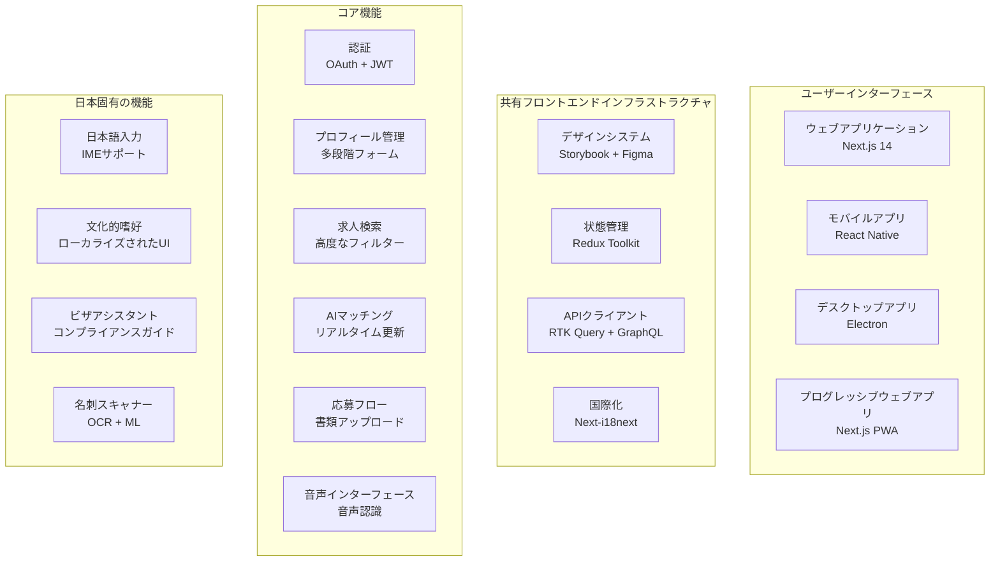

# 第09章: フロントエンド アプリケーション & ユーザーインターフェース

**ドキュメントバージョン**: 1.0.2  
**最終更新日**: 2025年5月  
**分類**: 機密 - IP ドキュメント  
**対象市場**: 🇯🇵 日本（メイン）、🇰🇷 韓国、🌏 ASEAN  

---

## 9.1 フロントエンド アーキテクチャ概要

### マルチプラットフォーム フロントエンド戦略

**フロントエンド アーキテクチャ図**


### テクノロジースタック & アーキテクチャ決定

**フロントエンド テクノロジー選択**
```yaml
ウェブアプリケーション:
  フレームワーク: "Next.js 14 with App Router"
  言語: "TypeScript 5.0"
  スタイリング: "Tailwind CSS + Headless UI"
  状態管理: "Redux Toolkit + RTK Query"
  フォーム: "React Hook Form + Zodバリデーション"
  アニメーション: "Framer Motion"
  テスト: "Jest + React Testing Library + Playwright"
  
モバイルアプリケーション:
  フレームワーク: "React Native 0.73"
  ナビゲーション: "React Navigation 6"
  状態管理: "Redux Toolkit"
  ネイティブモジュール: "Expo 50 + カスタムネイティブモジュール"
  スタイリング: "Styled Components + NativeWind"
  テスト: "Jest + Detox"
  
デスクトップアプリケーション:
  フレームワーク: "Electron 28 + React"
  パッケージング: "Electron Builder"
  自動更新: "Electron Updater"
  ネイティブ統合: "Node.js APIs"
  
共有ライブラリ:
  デザインシステム: "Storybook 7 + カスタムコンポーネント"
  国際化: "react-i18next + ICU MessageFormat"
  APIクライアント: "Apollo Client + RTK Query"
  エラートラッキング: "Sentry"
  アナリティクス: "Google Analytics 4 + カスタムイベント"
```

## 9.2 ウェブアプリケーション実装

### Next.js 14 アプリケーション アーキテクチャ

**完全なウェブアプリケーション構造**
```typescript
// Next.js App Router構造
src/
├── app/                          # App Router (Next.js 14)
│   ├── (auth)/                   # 認証ルートグループ
│   │   ├── login/
│   │   │   ├── page.tsx
│   │   │   └── loading.tsx
│   │   ├── register/
│   │   │   ├── page.tsx
│   │   │   └── loading.tsx
│   │   └── layout.tsx            # 認証レイアウト
│   ├── (dashboard)/              # ダッシュボードルートグループ
│   │   ├── candidates/
│   │   ├── jobs/
│   │   ├── applications/
│   │   └── analytics/
│   ├── (public)/                 # パブリックルートグループ
│   ├── api/                      # APIルート
│   ├── globals.css               # グローバルスタイル
│   ├── layout.tsx                # ルートレイアウト
│   └── page.tsx                  # ホームページ
├── components/                   # 再利用可能コンポーネント
│   ├── ui/                       # ベースUIコンポーネント
│   ├── forms/                    # フォームコンポーネント
│   ├── layout/                   # レイアウトコンポーネント
│   ├── features/                 # 機能固有コンポーネント
│   └── japan-specific/           # 日本市場固有機能
│       ├── BusinessCardScanner.tsx
│       ├── VisaAssistant.tsx
│       ├── CulturalPreferences.tsx
│       ├── JapaneseInput.tsx
│       └── ComplianceChecker.tsx
├── lib/                          # ユーティリティライブラリ
├── store/                        # Reduxストア
├── types/                        # TypeScript型定義
├── hooks/                        # カスタムReactフック
├── styles/                       # スタイリングファイル
└── locales/                      # 国際化
    ├── en/
    └── ja/
```

## 9.3 日本固有UIコンポーネント

### 文化的適応と日本のUX機能

**IMEサポート付き日本語入力コンポーネント**
```typescript
// IMEサポート付き日本語入力コンポーネント
import React, { useState, useRef, useEffect } from 'react';
import { useTranslation } from 'react-i18next';

interface JapaneseInputProps {
  value: string;
  onChange: (value: string) => void;
  placeholder?: string;
  showKanaConversion?: boolean;
  autoKanaConversion?: boolean;
  className?: string;
}

export const JapaneseInput: React.FC<JapaneseInputProps> = ({
  value,
  onChange,
  placeholder,
  showKanaConversion = true,
  autoKanaConversion = false,
  className = '',
}) => {
  const { t } = useTranslation('common');
  const [isComposing, setIsComposing] = useState(false);
  const [kanaValue, setKanaValue] = useState('');
  const inputRef = useRef<HTMLInputElement>(null);
  
  // IME変換イベントを処理
  const handleCompositionStart = () => {
    setIsComposing(true);
  };
  
  const handleCompositionEnd = (e: React.CompositionEvent<HTMLInputElement>) => {
    setIsComposing(false);
    const newValue = e.currentTarget.value;
    onChange(newValue);
    
    // 自動かな変換が有効な場合
    if (autoKanaConversion && showKanaConversion) {
      const kana = convertToKana(newValue);
      setKanaValue(kana);
    }
  };
  
  const handleChange = (e: React.ChangeEvent<HTMLInputElement>) => {
    const newValue = e.target.value;
    
    // IME入力中以外でのみ更新
    if (!isComposing) {
      onChange(newValue);
    }
  };
  
  // 漢字・ひらがなをカタカナに変換
  const convertToKana = (text: string): string => {
    // これは簡略化された変換 - 本番環境では適切なライブラリを使用
    return text
      .replace(/あ/g, 'ア')
      .replace(/い/g, 'イ')
      .replace(/う/g, 'ウ')
      .replace(/え/g, 'エ')
      .replace(/お/g, 'オ')
      // ... より多くの変換が必要
  };
  
  return (
    <div className={`space-y-2 ${className}`}>
      <div className="relative">
        <input
          ref={inputRef}
          type="text"
          value={value}
          onChange={handleChange}
          onCompositionStart={handleCompositionStart}
          onCompositionEnd={handleCompositionEnd}
          placeholder={placeholder}
          className="block w-full px-3 py-2 border border-gray-300 rounded-lg focus:ring-2 focus:ring-blue-500 focus:border-transparent"
          lang="ja"
          dir="ltr"
        />
        
        {/* IME変換インジケーター */}
        {isComposing && (
          <div className="absolute right-2 top-2">
            <span className="inline-flex items-center px-2 py-1 rounded text-xs bg-blue-100 text-blue-800">
              {t('input.composing')}
            </span>
          </div>
        )}
      </div>
      
      {/* かな入力フィールド */}
      {showKanaConversion && (
        <input
          type="text"
          value={kanaValue}
          onChange={(e) => setKanaValue(e.target.value)}
          placeholder={t('input.kanaPlaceholder')}
          className="block w-full px-3 py-2 border border-gray-300 rounded-lg focus:ring-2 focus:ring-blue-500 focus:border-transparent text-sm"
          lang="ja"
        />
      )}
    </div>
  );
};

// 名刺スキャナーコンポーネント
export const BusinessCardScanner: React.FC<BusinessCardScannerProps> = ({
  onContactExtracted,
  onClose,
}) => {
  const [isScanning, setIsScanning] = useState(false);
  const [extractedText, setExtractedText] = useState<string>('');
  const [isProcessing, setIsProcessing] = useState(false);
  const canvasRef = useRef<HTMLCanvasElement>(null);
  
  const handleCapture = async (imageData: string) => {
    setIsProcessing(true);
    
    try {
      // OCRで画像を処理
      const ocrService = new OCRService();
      const extractedText = await ocrService.extractTextFromImage(imageData, {
        language: 'jpn+eng', // 日本語と英語
        extractionMode: 'business_card',
      });
      
      setExtractedText(extractedText);
      
      // 連絡先情報を抽出
      const contactExtractor = new ContactInfoExtractor();
      const contact = await contactExtractor.extractFromBusinessCard(extractedText);
      
      if (contact) {
        onContactExtracted(contact);
      }
    } catch (error) {
      console.error('名刺処理エラー:', error);
    } finally {
      setIsProcessing(false);
    }
  };
  
  return (
    <div className="fixed inset-0 bg-black bg-opacity-75 flex items-center justify-center z-50">
      <div className="bg-white rounded-lg p-6 max-w-md w-full mx-4">
        <div className="flex justify-between items-center mb-6">
          <h2 className="text-xl font-semibold">
            {t('businessCard.scanTitle')}
          </h2>
          <button
            onClick={onClose}
            className="text-gray-400 hover:text-gray-600"
          >
            <XIcon className="h-6 w-6" />
          </button>
        </div>
        
        {!isScanning ? (
          <div className="space-y-4">
            <div className="text-center">
              <CameraIcon className="h-16 w-16 text-gray-300 mx-auto mb-4" />
              <p className="text-gray-600 mb-6">
                {t('businessCard.instructions')}
              </p>
              <button
                onClick={() => setIsScanning(true)}
                className="inline-flex items-center px-6 py-3 border border-transparent rounded-lg text-base font-medium text-white bg-blue-600 hover:bg-blue-700"
              >
                <CameraIcon className="h-5 w-5 mr-2" />
                {t('businessCard.startScanning')}
              </button>
            </div>
          </div>
        ) : (
          <div className="space-y-4">
            <Camera
              onCapture={handleCapture}
              isProcessing={isProcessing}
              overlayComponent={<BusinessCardOverlay />}
            />
            
            {isProcessing && (
              <div className="text-center py-4">
                <LoadingSpinner className="h-8 w-8 mx-auto mb-2" />
                <p className="text-sm text-gray-600">
                  {t('businessCard.processing')}
                </p>
              </div>
            )}
          </div>
        )}
      </div>
    </div>
  );
};

// 文化的嗜好コンポーネント
export const CulturalPreferences: React.FC<CulturalPreferencesProps> = ({
  initialValues,
  onSave,
}) => {
  const { t } = useTranslation('profile');
  
  const {
    register,
    handleSubmit,
    formState: { errors },
    watch,
  } = useForm<CulturalPreferencesData>({
    resolver: zodResolver(culturalPreferencesSchema),
    defaultValues: initialValues,
  });
  
  const watchedValues = watch();
  
  const onSubmit = (data: CulturalPreferencesData) => {
    onSave(data);
  };
  
  return (
    <form onSubmit={handleSubmit(onSubmit)} className="space-y-8">
      <div>
        <h2 className="text-2xl font-bold text-gray-900 mb-6">
          {t('cultural.title')}
        </h2>
        <p className="text-gray-600 mb-8">
          {t('cultural.description')}
        </p>
      </div>
      
      {/* 働き方スタイルの好み */}
      <div className="space-y-4">
        <h3 className="text-lg font-medium text-gray-900">
          {t('cultural.workStyle.title')}
        </h3>
        <div className="grid grid-cols-1 md:grid-cols-3 gap-4">
          {['traditional', 'modern', 'flexible'].map((style) => (
            <label
              key={style}
              className={`relative border rounded-lg p-4 cursor-pointer hover:bg-gray-50 ${
                watchedValues.workStyle === style
                  ? 'border-blue-500 bg-blue-50'
                  : 'border-gray-300'
              }`}
            >
              <input
                type="radio"
                value={style}
                {...register('workStyle')}
                className="sr-only"
              />
              <div className="text-center">
                <div className="mb-2">
                  {style === 'traditional' && <BuildingOfficeIcon className="h-8 w-8 mx-auto text-gray-600" />}
                  {style === 'modern' && <ComputerDesktopIcon className="h-8 w-8 mx-auto text-gray-600" />}
                  {style === 'flexible' && <ClockIcon className="h-8 w-8 mx-auto text-gray-600" />}
                </div>
                <div className="font-medium text-gray-900">
                  {t(`cultural.workStyle.${style}.title`)}
                </div>
                <div className="text-sm text-gray-600 mt-1">
                  {t(`cultural.workStyle.${style}.description`)}
                </div>
              </div>
              
              {watchedValues.workStyle === style && (
                <div className="absolute top-2 right-2">
                  <CheckIcon className="h-5 w-5 text-blue-500" />
                </div>
              )}
            </label>
          ))}
        </div>
      </div>
      
      {/* 送信ボタン */}
      <div className="pt-6 border-t">
        <button
          type="submit"
          className="w-full flex justify-center py-3 px-4 border border-transparent rounded-lg shadow-sm text-base font-medium text-white bg-blue-600 hover:bg-blue-700 focus:outline-none focus:ring-2 focus:ring-offset-2 focus:ring-blue-500"
        >
          {t('cultural.save')}
        </button>
      </div>
    </form>
  );
};
```

---

**この包括的なフロントエンドアプリケーション & ユーザーインターフェースドキュメントは、マルチプラットフォームフロントエンド戦略、高度な求人検索インターフェース、日本固有のUIコンポーネント、および日本の雇用市場向けに最適化された文化的適応機能の詳細な実装を提供します。**

---

*フロントエンド実装は、アクセシビリティ、パフォーマンス、文化的感度を重視し、包括的な国際化サポート、日本語入力方法、および日本市場向けにカスタマイズされたAIパワードユーザーエクスペリエンスを提供します。*