# Chapter 10: AI Agent Implementation & Orchestration

**Document Version**: 1.0.0  
**Last Updated**: December 2024  
**Classification**: Confidential - IP Documentation  
**Target Markets**: 🇯🇵 Japan (Primary), 🇰🇷 South Korea, 🌏 ASEAN  

---

## 10.1 Multi-Agent Architecture Overview

### Agentic AI Framework

**Advanced Multi-Agent Orchestration System**

```mermaid
graph TB
    subgraph "Agent Orchestration Layer"
        ORCHESTRATOR[AI Orchestrator<br/>Central Command & Control]
        SCHEDULER[Task Scheduler<br/>Dynamic Workload Management]
        COORDINATOR[Agent Coordinator<br/>Resource Allocation]
        MONITOR[Performance Monitor<br/>Real-time Metrics]
    end
    
    subgraph "Core Business Agents"
        MATCHING_AGENT[Matching Agent<br/>Candidate-Job Pairing]
        COMPLIANCE_AGENT[Compliance Agent<br/>Legal & Regulatory]
        CULTURAL_AGENT[Cultural Intelligence Agent<br/>Cross-Cultural Assessment]
        QUALITY_AGENT[Quality Assurance Agent<br/>Result Validation]
    end
    
    subgraph "Specialized Service Agents"
        CV_AGENT[CV Processing Agent<br/>Document Analysis]
        INTERVIEW_AGENT[Interview Assistant Agent<br/>Scheduling & Evaluation]
        NOTIFICATION_AGENT[Notification Agent<br/>Communication Management]
        ANALYTICS_AGENT[Analytics Agent<br/>Business Intelligence]
    end
    
    subgraph "External Integration Agents"
        GOVT_AGENT[Government API Agent<br/>Official Data Integration]
        UNIVERSITY_AGENT[University System Agent<br/>Academic Verification]
        PAYMENT_AGENT[Payment Processing Agent<br/>Financial Transactions]
        EMAIL_AGENT[Email Service Agent<br/>Communication Delivery]
    end
    
    subgraph "Learning & Adaptation"
        META_LEARNER[Meta-Learning Agent<br/>System Optimization]
        FEEDBACK_AGENT[Feedback Processing Agent<br/>Continuous Improvement]
        BIAS_DETECTOR[Bias Detection Agent<br/>Fairness Monitoring]
        DRIFT_DETECTOR[Data Drift Agent<br/>Model Performance]
    end
    
    ORCHESTRATOR --> SCHEDULER
    ORCHESTRATOR --> COORDINATOR
    ORCHESTRATOR --> MONITOR
    
    SCHEDULER --> MATCHING_AGENT
    SCHEDULER --> COMPLIANCE_AGENT
    SCHEDULER --> CULTURAL_AGENT
    SCHEDULER --> QUALITY_AGENT
    
    COORDINATOR --> CV_AGENT
    COORDINATOR --> INTERVIEW_AGENT
    COORDINATOR --> NOTIFICATION_AGENT
    COORDINATOR --> ANALYTICS_AGENT
    
    MONITOR --> GOVT_AGENT
    MONITOR --> UNIVERSITY_AGENT
    MONITOR --> PAYMENT_AGENT
    MONITOR --> EMAIL_AGENT
    
    META_LEARNER --> FEEDBACK_AGENT
    META_LEARNER --> BIAS_DETECTOR
    META_LEARNER --> DRIFT_DETECTOR
```


### Agent Framework Architecture

**Core Agent Infrastructure (Patent Application JP2024-XXXXX5)**
```python
# Advanced Multi-Agent Orchestration Framework
import asyncio
import uuid
from typing import Dict, List, Any, Optional, Union
from dataclasses import dataclass, field
from enum import Enum
from abc import ABC, abstractmethod
import logging
from datetime import datetime, timedelta
import json

class AgentState(Enum):
    IDLE = "idle"
    BUSY = "busy"
    ERROR = "error"
    OFFLINE = "offline"
    MAINTENANCE = "maintenance"

class TaskPriority(Enum):
    LOW = 1
    MEDIUM = 2
    HIGH = 3
    CRITICAL = 4
    EMERGENCY = 5

class AgentType(Enum):
    BUSINESS_LOGIC = "business_logic"
    SERVICE_INTEGRATION = "service_integration"
    LEARNING_ADAPTATION = "learning_adaptation"
    MONITORING_CONTROL = "monitoring_control"

@dataclass
class AgentCapability:
    name: str
    version: str
    supported_operations: List[str]
    resource_requirements: Dict[str, Any]
    performance_metrics: Dict[str, float]
    confidence_threshold: float = 0.8

@dataclass
class Task:
    id: str = field(default_factory=lambda: str(uuid.uuid4()))
    type: str = ""
    priority: TaskPriority = TaskPriority.MEDIUM
    payload: Dict[str, Any] = field(default_factory=dict)
    dependencies: List[str] = field(default_factory=list)
    timeout: Optional[timedelta] = None
    retry_count: int = 0
    max_retries: int = 3
    created_at: datetime = field(default_factory=datetime.now)
    deadline: Optional[datetime] = None
    context: Dict[str, Any] = field(default_factory=dict)

@dataclass
class AgentResult:
    agent_id: str
    task_id: str
    success: bool
    result: Any = None
    error: Optional[str] = None
    confidence: float = 0.0
    execution_time: float = 0.0
    metadata: Dict[str, Any] = field(default_factory=dict)
    created_at: datetime = field(default_factory=datetime.now)

class BaseAgent(ABC):
    """
    Abstract base class for all AI agents in the iWORKZ platform
    """
    
    def __init__(self, agent_id: str, agent_type: AgentType):
        self.agent_id = agent_id
        self.agent_type = agent_type
        self.state = AgentState.IDLE
        self.capabilities: List[AgentCapability] = []
        self.current_task: Optional[Task] = None
        self.task_queue: asyncio.Queue = asyncio.Queue()
        self.performance_history: List[AgentResult] = []
        self.logger = logging.getLogger(f"agent.{agent_id}")
        self.health_metrics = {
            "last_heartbeat": datetime.now(),
            "task_success_rate": 1.0,
            "average_response_time": 0.0,
            "error_count": 0,
            "uptime": 0.0
        }
        
    @abstractmethod
    async def process_task(self, task: Task) -> AgentResult:
        """
        Process a task and return the result
        """
        pass
    
    @abstractmethod
    async def initialize(self) -> bool:
        """
        Initialize the agent and its dependencies
        """
        pass
    
    @abstractmethod
    async def shutdown(self) -> bool:
        """
        Gracefully shutdown the agent
        """
        pass
    
    @abstractmethod
    def get_capabilities(self) -> List[AgentCapability]:
        """
        Return the agent's capabilities
        """
        pass
    
    async def start(self):
        """
        Start the agent's main processing loop
        """
        self.logger.info(f"Starting agent {self.agent_id}")
        
        if not await self.initialize():
            self.logger.error(f"Failed to initialize agent {self.agent_id}")
            self.state = AgentState.ERROR
            return
        
        self.state = AgentState.IDLE
        
        # Start heartbeat task
        heartbeat_task = asyncio.create_task(self._heartbeat_loop())
        
        # Start main processing loop
        processing_task = asyncio.create_task(self._processing_loop())
        
        try:
            await asyncio.gather(heartbeat_task, processing_task)
        except Exception as e:
            self.logger.error(f"Agent {self.agent_id} encountered error: {e}")
            self.state = AgentState.ERROR
    
    async def _processing_loop(self):
        """
        Main processing loop for handling tasks
        """
        while self.state != AgentState.OFFLINE:
            try:
                if self.state == AgentState.MAINTENANCE:
                    await asyncio.sleep(1)
                    continue
                
                # Get next task from queue
                try:
                    task = await asyncio.wait_for(
                        self.task_queue.get(), 
                        timeout=1.0
                    )
                except asyncio.TimeoutError:
                    continue
                
                # Check if task has expired
                if task.deadline and datetime.now() > task.deadline:
                    self.logger.warning(f"Task {task.id} has expired, skipping")
                    continue
                
                # Process the task
                self.state = AgentState.BUSY
                self.current_task = task
                
                start_time = datetime.now()
                result = await self._execute_task_with_timeout(task)
                execution_time = (datetime.now() - start_time).total_seconds()
                
                # Update performance metrics
                result.execution_time = execution_time
                self.performance_history.append(result)
                self._update_health_metrics(result)
                
                # Reset state
                self.current_task = None
                self.state = AgentState.IDLE
                
                self.logger.info(f"Completed task {task.id} with success={result.success}")
                
            except Exception as e:
                self.logger.error(f"Error in processing loop: {e}")
                self.state = AgentState.ERROR
                await asyncio.sleep(5)  # Brief recovery pause
                self.state = AgentState.IDLE
    
    async def _execute_task_with_timeout(self, task: Task) -> AgentResult:
        """
        Execute task with timeout and retry logic
        """
        timeout = task.timeout or timedelta(minutes=5)
        
        for attempt in range(task.max_retries + 1):
            try:
                result = await asyncio.wait_for(
                    self.process_task(task),
                    timeout=timeout.total_seconds()
                )
                
                if result.success or attempt == task.max_retries:
                    return result
                    
                # Wait before retry
                await asyncio.sleep(2 ** attempt)
                
            except asyncio.TimeoutError:
                error_msg = f"Task {task.id} timed out after {timeout}"
                self.logger.warning(error_msg)
                
                if attempt == task.max_retries:
                    return AgentResult(
                        agent_id=self.agent_id,
                        task_id=task.id,
                        success=False,
                        error=error_msg
                    )
            except Exception as e:
                error_msg = f"Task {task.id} failed on attempt {attempt + 1}: {e}"
                self.logger.error(error_msg)
                
                if attempt == task.max_retries:
                    return AgentResult(
                        agent_id=self.agent_id,
                        task_id=task.id,
                        success=False,
                        error=error_msg
                    )
        
        return AgentResult(
            agent_id=self.agent_id,
            task_id=task.id,
            success=False,
            error="Max retries exceeded"
        )
    
    async def _heartbeat_loop(self):
        """
        Send periodic heartbeats to maintain agent health status
        """
        while self.state != AgentState.OFFLINE:
            self.health_metrics["last_heartbeat"] = datetime.now()
            await asyncio.sleep(30)  # Heartbeat every 30 seconds
    
    def _update_health_metrics(self, result: AgentResult):
        """
        Update agent health metrics based on task result
        """
        # Update success rate
        recent_results = self.performance_history[-100:]  # Last 100 tasks
        success_count = sum(1 for r in recent_results if r.success)
        self.health_metrics["task_success_rate"] = success_count / len(recent_results) if recent_results else 1.0
        
        # Update average response time
        response_times = [r.execution_time for r in recent_results if r.execution_time > 0]
        self.health_metrics["average_response_time"] = sum(response_times) / len(response_times) if response_times else 0.0
        
        # Update error count
        if not result.success:
            self.health_metrics["error_count"] += 1
    
    async def add_task(self, task: Task) -> bool:
        """
        Add a task to the agent's queue
        """
        try:
            await self.task_queue.put(task)
            self.logger.debug(f"Added task {task.id} to queue")
            return True
        except Exception as e:
            self.logger.error(f"Failed to add task {task.id}: {e}")
            return False
    
    def get_status(self) -> Dict[str, Any]:
        """
        Get current agent status and metrics
        """
        return {
            "agent_id": self.agent_id,
            "agent_type": self.agent_type.value,
            "state": self.state.value,
            "queue_size": self.task_queue.qsize(),
            "current_task": self.current_task.id if self.current_task else None,
            "capabilities": [cap.name for cap in self.capabilities],
            "health_metrics": self.health_metrics,
            "performance_summary": {
                "total_tasks": len(self.performance_history),
                "recent_success_rate": self.health_metrics["task_success_rate"],
                "average_response_time": self.health_metrics["average_response_time"]
            }
        }

class AIOrchestrator:
    """
    Central orchestrator for managing all AI agents
    """
    
    def __init__(self):
        self.agents: Dict[str, BaseAgent] = {}
        self.task_registry: Dict[str, Task] = {}
        self.agent_registry: Dict[str, AgentCapability] = {}
        self.task_scheduler = TaskScheduler()
        self.load_balancer = AgentLoadBalancer()
        self.health_monitor = AgentHealthMonitor()
        self.logger = logging.getLogger("orchestrator")
        
    async def register_agent(self, agent: BaseAgent) -> bool:
        """
        Register a new agent with the orchestrator
        """
        try:
            self.agents[agent.agent_id] = agent
            
            # Register agent capabilities
            for capability in agent.get_capabilities():
                self.agent_registry[f"{agent.agent_id}:{capability.name}"] = capability
            
            # Start the agent
            asyncio.create_task(agent.start())
            
            self.logger.info(f"Registered agent {agent.agent_id} with {len(agent.get_capabilities())} capabilities")
            return True
            
        except Exception as e:
            self.logger.error(f"Failed to register agent {agent.agent_id}: {e}")
            return False
    
    async def submit_task(
        self, 
        task: Task, 
        preferred_agent: Optional[str] = None
    ) -> str:
        """
        Submit a task for processing
        """
        task_id = task.id
        self.task_registry[task_id] = task
        
        try:
            # Find optimal agent for the task
            if preferred_agent and preferred_agent in self.agents:
                selected_agent = self.agents[preferred_agent]
            else:
                selected_agent = await self._select_optimal_agent(task)
            
            if not selected_agent:
                raise ValueError(f"No suitable agent found for task type: {task.type}")
            
            # Add task to selected agent's queue
            success = await selected_agent.add_task(task)
            
            if success:
                self.logger.info(f"Submitted task {task_id} to agent {selected_agent.agent_id}")
                return task_id
            else:
                raise RuntimeError(f"Failed to add task to agent {selected_agent.agent_id}")
                
        except Exception as e:
            self.logger.error(f"Failed to submit task {task_id}: {e}")
            raise
    
    async def _select_optimal_agent(self, task: Task) -> Optional[BaseAgent]:
        """
        Select the optimal agent for processing a task
        """
        suitable_agents = []
        
        # Find agents with required capabilities
        for agent in self.agents.values():
            if agent.state in [AgentState.IDLE, AgentState.BUSY]:
                for capability in agent.get_capabilities():
                    if task.type in capability.supported_operations:
                        suitable_agents.append((agent, capability))
                        break
        
        if not suitable_agents:
            return None
        
        # Use load balancer to select best agent
        return await self.load_balancer.select_agent(suitable_agents, task)
    
    async def get_task_result(self, task_id: str, timeout: float = 30.0) -> Optional[AgentResult]:
        """
        Wait for task completion and return result
        """
        start_time = datetime.now()
        
        while (datetime.now() - start_time).total_seconds() < timeout:
            # Check all agents for task completion
            for agent in self.agents.values():
                for result in agent.performance_history:
                    if result.task_id == task_id:
                        return result
            
            await asyncio.sleep(0.5)
        
        return None
    
    async def get_system_status(self) -> Dict[str, Any]:
        """
        Get overall system status
        """
        agent_statuses = {}
        for agent_id, agent in self.agents.items():
            agent_statuses[agent_id] = agent.get_status()
        
        return {
            "total_agents": len(self.agents),
            "active_agents": len([a for a in self.agents.values() if a.state != AgentState.OFFLINE]),
            "total_tasks_in_queues": sum(a.task_queue.qsize() for a in self.agents.values()),
            "agent_statuses": agent_statuses,
            "system_health": await self.health_monitor.get_system_health(),
            "timestamp": datetime.now().isoformat()
        }

class TaskScheduler:
    """
    Intelligent task scheduling with priority and dependency management
    """
    
    async def schedule_task(self, task: Task, available_agents: List[BaseAgent]) -> Optional[BaseAgent]:
        """
        Schedule a task to the most appropriate agent
        """
        # Sort agents by suitability score
        agent_scores = []
        
        for agent in available_agents:
            score = await self._calculate_agent_suitability(agent, task)
            agent_scores.append((agent, score))
        
        # Sort by score (descending)
        agent_scores.sort(key=lambda x: x[1], reverse=True)
        
        return agent_scores[0][0] if agent_scores else None
    
    async def _calculate_agent_suitability(self, agent: BaseAgent, task: Task) -> float:
        """
        Calculate suitability score for an agent to handle a specific task
        """
        score = 0.0
        
        # Capability match score (40%)
        capability_score = 0.0
        for capability in agent.get_capabilities():
            if task.type in capability.supported_operations:
                capability_score = capability.confidence_threshold
                break
        score += capability_score * 0.4
        
        # Current load score (30%)
        queue_size = agent.task_queue.qsize()
        load_score = max(0, 1 - (queue_size / 100))  # Penalize high queue sizes
        score += load_score * 0.3
        
        # Performance history score (20%)
        performance_score = agent.health_metrics.get("task_success_rate", 0.5)
        score += performance_score * 0.2
        
        # Agent state score (10%)
        state_score = 1.0 if agent.state == AgentState.IDLE else 0.5
        score += state_score * 0.1
        
        return score

class AgentLoadBalancer:
    """
    Load balancing across agents
    """
    
    async def select_agent(
        self, 
        suitable_agents: List[tuple], 
        task: Task
    ) -> Optional[BaseAgent]:
        """
        Select agent based on load balancing strategy
        """
        if not suitable_agents:
            return None
        
        # Calculate load scores for each agent
        agent_loads = []
        
        for agent, capability in suitable_agents:
            load_score = await self._calculate_load_score(agent, task)
            agent_loads.append((agent, load_score))
        
        # Select agent with lowest load
        agent_loads.sort(key=lambda x: x[1])
        return agent_loads[0][0]
    
    async def _calculate_load_score(self, agent: BaseAgent, task: Task) -> float:
        """
        Calculate current load score for an agent
        """
        # Queue size factor (50%)
        queue_factor = agent.task_queue.qsize() / 100.0
        
        # Response time factor (30%)
        avg_response_time = agent.health_metrics.get("average_response_time", 1.0)
        response_factor = min(avg_response_time / 10.0, 1.0)  # Normalize to 0-1
        
        # Priority factor (20%)
        priority_factor = (5 - task.priority.value) / 4.0  # Higher priority = lower score
        
        return queue_factor * 0.5 + response_factor * 0.3 + priority_factor * 0.2

class AgentHealthMonitor:
    """
    Monitor and maintain agent health
    """
    
    async def get_system_health(self) -> Dict[str, Any]:
        """
        Get overall system health metrics
        """
        return {
            "overall_status": "healthy",
            "monitored_metrics": [
                "agent_availability",
                "task_success_rates", 
                "response_times",
                "error_rates",
                "resource_utilization"
            ],
            "last_check": datetime.now().isoformat()
        }
```

## 10.2 Specialized Agent Implementations

### Matching Agent Implementation

**AI-Powered Candidate-Job Matching Agent**
```python
# Advanced Matching Agent with Semantic Understanding
import numpy as np
import torch
from transformers import AutoModel, AutoTokenizer
from sentence_transformers import SentenceTransformer
import faiss
import json
from typing import List, Dict, Tuple, Optional
import asyncio

class MatchingAgent(BaseAgent):
    """
    Sophisticated matching agent for candidate-job pairing with cultural intelligence
    """
    
    def __init__(self):
        super().__init__("matching_agent", AgentType.BUSINESS_LOGIC)
        
        # Initialize ML models
        self.skill_encoder = SentenceTransformer('all-MiniLM-L6-v2')
        self.japanese_encoder = SentenceTransformer('cl-tohoku/bert-base-japanese-whole-word-masking')
        self.cultural_model = CulturalFitModel()
        
        # Knowledge bases
        self.skill_ontology = SkillOntology()
        self.cultural_knowledge = CulturalKnowledgeBase()
        self.industry_knowledge = IndustryKnowledgeBase()
        
        # Vector databases for fast similarity search
        self.candidate_index = None
        self.job_index = None
        
        # Matching algorithms
        self.semantic_matcher = SemanticMatcher()
        self.cultural_matcher = CulturalMatcher()
        self.compliance_checker = ComplianceChecker()
        
    async def initialize(self) -> bool:
        """
        Initialize the matching agent
        """
        try:
            # Load pre-trained models
            await self._load_models()
            
            # Initialize vector indices
            await self._initialize_vector_indices()
            
            # Load knowledge bases
            await self._load_knowledge_bases()
            
            # Register capabilities
            self.capabilities = [
                AgentCapability(
                    name="candidate_job_matching",
                    version="2.0.0",
                    supported_operations=["match_candidates", "match_jobs", "similarity_search", "cultural_assessment"],
                    resource_requirements={"memory": "4GB", "gpu": "optional"},
                    performance_metrics={"accuracy": 0.92, "precision": 0.89, "recall": 0.94},
                    confidence_threshold=0.8
                ),
                AgentCapability(
                    name="semantic_search",
                    version="1.5.0", 
                    supported_operations=["text_similarity", "skill_matching", "experience_matching"],
                    resource_requirements={"memory": "2GB"},
                    performance_metrics={"accuracy": 0.87, "latency": 0.15},
                    confidence_threshold=0.75
                )
            ]
            
            self.logger.info("Matching agent initialized successfully")
            return True
            
        except Exception as e:
            self.logger.error(f"Failed to initialize matching agent: {e}")
            return False
    
    async def process_task(self, task: Task) -> AgentResult:
        """
        Process matching-related tasks
        """
        start_time = datetime.now()
        
        try:
            task_type = task.type
            payload = task.payload
            
            if task_type == "match_candidates":
                result = await self._match_candidates_for_job(payload)
            elif task_type == "match_jobs":
                result = await self._match_jobs_for_candidate(payload)
            elif task_type == "calculate_match_score":
                result = await self._calculate_match_score(payload)
            elif task_type == "cultural_assessment":
                result = await self._assess_cultural_fit(payload)
            elif task_type == "skill_similarity":
                result = await self._calculate_skill_similarity(payload)
            else:
                raise ValueError(f"Unsupported task type: {task_type}")
            
            execution_time = (datetime.now() - start_time).total_seconds()
            
            return AgentResult(
                agent_id=self.agent_id,
                task_id=task.id,
                success=True,
                result=result,
                confidence=result.get("confidence", 0.8),
                execution_time=execution_time,
                metadata={
                    "task_type": task_type,
                    "processing_time": execution_time,
                    "model_versions": self._get_model_versions()
                }
            )
            
        except Exception as e:
            self.logger.error(f"Error processing task {task.id}: {e}")
            return AgentResult(
                agent_id=self.agent_id,
                task_id=task.id,
                success=False,
                error=str(e),
                execution_time=(datetime.now() - start_time).total_seconds()
            )
    
    async def _match_candidates_for_job(self, payload: Dict) -> Dict:
        """
        Find best matching candidates for a job posting
        """
        job_data = payload["job"]
        max_matches = payload.get("max_matches", 50)
        min_score = payload.get("min_score", 0.6)
        
        # Extract job features
        job_features = await self._extract_job_features(job_data)
        
        # Perform multi-dimensional matching
        matches = []
        
        # 1. Semantic skill matching
        skill_matches = await self._find_skill_matches(job_features, max_matches * 2)
        
        # 2. Cultural fit assessment
        cultural_matches = await self._assess_cultural_matches(job_data, skill_matches)
        
        # 3. Compliance checking
        compliant_matches = await self._filter_compliant_candidates(job_data, cultural_matches)
        
        # 4. Calculate comprehensive scores
        for candidate_id, preliminary_score in compliant_matches:
            comprehensive_score = await self._calculate_comprehensive_match_score(
                candidate_id, job_data, job_features
            )
            
            if comprehensive_score["overall_score"] >= min_score:
                matches.append({
                    "candidate_id": candidate_id,
                    "overall_score": comprehensive_score["overall_score"],
                    "skill_score": comprehensive_score["skill_score"],
                    "cultural_score": comprehensive_score["cultural_score"],
                    "experience_score": comprehensive_score["experience_score"],
                    "language_score": comprehensive_score["language_score"],
                    "location_score": comprehensive_score["location_score"],
                    "explanation": comprehensive_score["explanation"],
                    "confidence": comprehensive_score["confidence"]
                })
        
        # Sort by overall score
        matches.sort(key=lambda x: x["overall_score"], reverse=True)
        
        return {
            "job_id": job_data["id"],
            "matches": matches[:max_matches],
            "total_candidates_evaluated": len(skill_matches),
            "matching_algorithm": "multi_dimensional_v2.0",
            "confidence": self._calculate_matching_confidence(matches),
            "processing_metadata": {
                "skill_matches_found": len(skill_matches),
                "cultural_filters_applied": True,
                "compliance_checked": True,
                "timestamp": datetime.now().isoformat()
            }
        }
    
    async def _match_jobs_for_candidate(self, payload: Dict) -> Dict:
        """
        Find best matching jobs for a candidate
        """
        candidate_data = payload["candidate"]
        max_matches = payload.get("max_matches", 20)
        min_score = payload.get("min_score", 0.6)
        location_radius = payload.get("location_radius", 50)  # km
        
        # Extract candidate features
        candidate_features = await self._extract_candidate_features(candidate_data)
        
        # Get candidate preferences
        preferences = candidate_data.get("preferences", {})
        
        # Perform matching
        matches = []
        
        # 1. Skill-based job search
        skill_matched_jobs = await self._find_jobs_by_skills(candidate_features, max_matches * 3)
        
        # 2. Location filtering
        location_filtered_jobs = await self._filter_jobs_by_location(
            skill_matched_jobs, candidate_data["location"], location_radius
        )
        
        # 3. Preference filtering
        preference_filtered_jobs = await self._filter_jobs_by_preferences(
            location_filtered_jobs, preferences
        )
        
        # 4. Cultural fit assessment
        cultural_matches = await self._assess_job_cultural_fit(candidate_data, preference_filtered_jobs)
        
        # 5. Calculate comprehensive scores
        for job_id, preliminary_score in cultural_matches:
            job_data = await self._get_job_data(job_id)
            
            comprehensive_score = await self._calculate_comprehensive_job_match_score(
                candidate_data, job_data, candidate_features
            )
            
            if comprehensive_score["overall_score"] >= min_score:
                matches.append({
                    "job_id": job_id,
                    "job_title": job_data["title"],
                    "company_name": job_data["company"]["name"],
                    "overall_score": comprehensive_score["overall_score"],
                    "skill_match": comprehensive_score["skill_score"],
                    "cultural_fit": comprehensive_score["cultural_score"],
                    "career_growth": comprehensive_score["career_score"],
                    "compensation_match": comprehensive_score["compensation_score"],
                    "work_life_balance": comprehensive_score["balance_score"],
                    "explanation": comprehensive_score["explanation"],
                    "confidence": comprehensive_score["confidence"]
                })
        
        # Sort by overall score
        matches.sort(key=lambda x: x["overall_score"], reverse=True)
        
        return {
            "candidate_id": candidate_data["id"],
            "matches": matches[:max_matches],
            "total_jobs_evaluated": len(skill_matched_jobs),
            "matching_algorithm": "candidate_centric_v2.0",
            "confidence": self._calculate_matching_confidence(matches),
            "recommendations": await self._generate_candidate_recommendations(candidate_data, matches),
            "processing_metadata": {
                "location_radius_km": location_radius,
                "preferences_applied": bool(preferences),
                "cultural_assessment": True,
                "timestamp": datetime.now().isoformat()
            }
        }
    
    async def _calculate_comprehensive_match_score(
        self, 
        candidate_id: str, 
        job_data: Dict, 
        job_features: Dict
    ) -> Dict:
        """
        Calculate comprehensive match score using multiple algorithms
        """
        candidate_data = await self._get_candidate_data(candidate_id)
        
        # Calculate individual score components
        skill_score = await self._calculate_skill_match_score(candidate_data, job_data)
        cultural_score = await self._calculate_cultural_fit_score(candidate_data, job_data)
        experience_score = await self._calculate_experience_match_score(candidate_data, job_data)
        language_score = await self._calculate_language_compatibility_score(candidate_data, job_data)
        location_score = await self._calculate_location_preference_score(candidate_data, job_data)
        
        # Dynamic weight calculation based on job requirements
        weights = await self._calculate_dynamic_weights(job_data, candidate_data)
        
        # Calculate weighted overall score
        overall_score = (
            weights["skill"] * skill_score +
            weights["cultural"] * cultural_score +
            weights["experience"] * experience_score +
            weights["language"] * language_score +
            weights["location"] * location_score
        )
        
        # Generate explanation
        explanation = await self._generate_match_explanation(
            skill_score, cultural_score, experience_score, 
            language_score, location_score, weights
        )
        
        # Calculate confidence based on data completeness and score consistency
        confidence = await self._calculate_match_confidence_score(
            candidate_data, job_data, [skill_score, cultural_score, experience_score]
        )
        
        return {
            "overall_score": round(overall_score, 3),
            "skill_score": round(skill_score, 3),
            "cultural_score": round(cultural_score, 3),
            "experience_score": round(experience_score, 3),
            "language_score": round(language_score, 3),
            "location_score": round(location_score, 3),
            "weights": weights,
            "explanation": explanation,
            "confidence": round(confidence, 3),
            "score_breakdown": {
                "technical_fit": skill_score,
                "cultural_alignment": cultural_score,
                "career_level_match": experience_score,
                "communication_compatibility": language_score,
                "location_convenience": location_score
            }
        }
    
    async def _calculate_skill_match_score(self, candidate_data: Dict, job_data: Dict) -> float:
        """
        Calculate skill matching score using semantic similarity and ontology
        """
        candidate_skills = candidate_data.get("skills", [])
        required_skills = job_data.get("required_skills", [])
        preferred_skills = job_data.get("preferred_skills", [])
        
        if not candidate_skills or not required_skills:
            return 0.0
        
        # Semantic skill matching
        candidate_embeddings = await self._get_skill_embeddings(candidate_skills)
        required_embeddings = await self._get_skill_embeddings(required_skills)
        preferred_embeddings = await self._get_skill_embeddings(preferred_skills) if preferred_skills else []
        
        # Calculate similarity matrix
        required_similarities = await self._calculate_embedding_similarities(
            candidate_embeddings, required_embeddings
        )
        
        preferred_similarities = []
        if preferred_embeddings:
            preferred_similarities = await self._calculate_embedding_similarities(
                candidate_embeddings, preferred_embeddings
            )
        
        # Ontology-based matching
        ontology_matches = await self._match_skills_via_ontology(candidate_skills, required_skills)
        
        # Calculate coverage scores
        required_coverage = self._calculate_skill_coverage(required_similarities, ontology_matches["required"])
        preferred_coverage = self._calculate_skill_coverage(preferred_similarities, ontology_matches["preferred"]) if preferred_skills else 0.0
        
        # Weight required vs preferred skills
        overall_score = required_coverage * 0.8 + preferred_coverage * 0.2
        
        return min(overall_score, 1.0)
    
    async def _calculate_cultural_fit_score(self, candidate_data: Dict, job_data: Dict) -> float:
        """
        Calculate cultural fit score using cultural intelligence models
        """
        candidate_cultural_profile = await self._extract_cultural_profile(candidate_data)
        company_cultural_profile = await self._extract_company_culture(job_data)
        
        # Multi-dimensional cultural assessment
        cultural_dimensions = {
            "power_distance": await self._assess_power_distance_compatibility(
                candidate_cultural_profile, company_cultural_profile
            ),
            "individualism_collectivism": await self._assess_individualism_compatibility(
                candidate_cultural_profile, company_cultural_profile
            ),
            "uncertainty_avoidance": await self._assess_uncertainty_avoidance_compatibility(
                candidate_cultural_profile, company_cultural_profile
            ),
            "long_term_orientation": await self._assess_orientation_compatibility(
                candidate_cultural_profile, company_cultural_profile
            ),
            "work_style_preferences": await self._assess_work_style_compatibility(
                candidate_data.get("work_preferences", {}), job_data.get("work_environment", {})
            ),
            "communication_style": await self._assess_communication_compatibility(
                candidate_cultural_profile, company_cultural_profile
            )
        }
        
        # Calculate weighted cultural fit score
        weights = {
            "power_distance": 0.15,
            "individualism_collectivism": 0.20,
            "uncertainty_avoidance": 0.15,
            "long_term_orientation": 0.15,
            "work_style_preferences": 0.20,
            "communication_style": 0.15
        }
        
        cultural_score = sum(
            score * weights[dimension] 
            for dimension, score in cultural_dimensions.items()
        )
        
        return min(cultural_score, 1.0)
    
    async def _generate_match_explanation(
        self, 
        skill_score: float, 
        cultural_score: float, 
        experience_score: float,
        language_score: float, 
        location_score: float, 
        weights: Dict
    ) -> Dict:
        """
        Generate human-readable explanation for the match score
        """
        explanations = {
            "strengths": [],
            "areas_for_improvement": [],
            "overall_assessment": "",
            "detailed_breakdown": {}
        }
        
        # Analyze strengths
        if skill_score >= 0.8:
            explanations["strengths"].append("Excellent technical skill alignment")
        elif skill_score >= 0.6:
            explanations["strengths"].append("Good technical skill match")
        
        if cultural_score >= 0.8:
            explanations["strengths"].append("Strong cultural fit")
        elif cultural_score >= 0.6:
            explanations["strengths"].append("Adequate cultural compatibility")
        
        if experience_score >= 0.8:
            explanations["strengths"].append("Experience level well-matched")
        
        if language_score >= 0.8:
            explanations["strengths"].append("Excellent language compatibility")
        
        if location_score >= 0.8:
            explanations["strengths"].append("Convenient location match")
        
        # Analyze areas for improvement
        if skill_score < 0.6:
            explanations["areas_for_improvement"].append("Skill development needed in key areas")
        
        if cultural_score < 0.6:
            explanations["areas_for_improvement"].append("Cultural adaptation may be required")
        
        if experience_score < 0.6:
            explanations["areas_for_improvement"].append("Experience level mismatch")
        
        if language_score < 0.6:
            explanations["areas_for_improvement"].append("Language skills improvement recommended")
        
        if location_score < 0.6:
            explanations["areas_for_improvement"].append("Location preferences not well aligned")
        
        # Overall assessment
        overall_score = (
            weights["skill"] * skill_score +
            weights["cultural"] * cultural_score +
            weights["experience"] * experience_score +
            weights["language"] * language_score +
            weights["location"] * location_score
        )
        
        if overall_score >= 0.8:
            explanations["overall_assessment"] = "Excellent match with high potential for success"
        elif overall_score >= 0.6:
            explanations["overall_assessment"] = "Good match with minor areas for consideration"
        elif overall_score >= 0.4:
            explanations["overall_assessment"] = "Moderate match requiring careful evaluation"
        else:
            explanations["overall_assessment"] = "Low match - significant gaps identified"
        
        explanations["detailed_breakdown"] = {
            "technical_compatibility": skill_score,
            "cultural_alignment": cultural_score,
            "experience_fit": experience_score,
            "communication_readiness": language_score,
            "location_convenience": location_score,
            "weighted_importance": weights
        }
        
        return explanations
    
    def get_capabilities(self) -> List[AgentCapability]:
        """
        Return the agent's capabilities
        """
        return self.capabilities
    
    async def shutdown(self) -> bool:
        """
        Gracefully shutdown the matching agent
        """
        try:
            # Save any pending state
            await self._save_agent_state()
            
            # Cleanup resources
            if self.candidate_index:
                self.candidate_index = None
            if self.job_index:
                self.job_index = None
            
            self.logger.info("Matching agent shut down successfully")
            return True
            
        except Exception as e:
            self.logger.error(f"Error during shutdown: {e}")
            return False
    
    # Helper methods
    async def _load_models(self):
        """Load all required ML models"""
        pass
    
    async def _initialize_vector_indices(self):
        """Initialize FAISS vector indices for fast similarity search"""
        pass
    
    async def _load_knowledge_bases(self):
        """Load skill ontology and cultural knowledge bases"""
        pass
    
    def _get_model_versions(self) -> Dict:
        """Get versions of all loaded models"""
        return {
            "skill_encoder": "all-MiniLM-L6-v2",
            "japanese_encoder": "cl-tohoku/bert-base-japanese-whole-word-masking",
            "cultural_model": "custom_v1.0",
            "matching_algorithm": "multi_dimensional_v2.0"
        }
```

### Compliance Agent Implementation

**Automated Regulatory Compliance Checking**
```python
# Advanced Compliance Agent for Japanese Employment Regulations
import re
import asyncio
from typing import Dict, List, Any, Optional
from datetime import datetime, timedelta
from dataclasses import dataclass

@dataclass
class ComplianceViolation:
    rule_id: str
    severity: str  # 'low', 'medium', 'high', 'critical'
    description: str
    regulatory_reference: str
    remediation_steps: List[str]
    confidence_score: float

@dataclass
class ComplianceResult:
    entity_id: str
    entity_type: str  # 'job_posting', 'candidate_profile', 'application'
    is_compliant: bool
    compliance_score: float
    violations: List[ComplianceViolation]
    recommendations: List[str]
    applicable_regulations: List[str]
    processing_time: float

class ComplianceAgent(BaseAgent):
    """
    Advanced compliance agent for Japanese employment law verification
    """
    
    def __init__(self):
        super().__init__("compliance_agent", AgentType.BUSINESS_LOGIC)
        
        # Regulatory knowledge base
        self.regulatory_kb = JapanRegulatoryKnowledgeBase()
        self.rule_engine = RuleExecutionEngine()
        
        # ML models for content analysis
        self.discrimination_detector = DiscriminationDetector()
        self.visa_eligibility_checker = VisaEligibilityChecker()
        self.salary_analyzer = SalaryComplianceAnalyzer()
        
        # Compliance rule cache
        self.active_rules = {}
        self.rule_cache_expiry = datetime.now()
        
    async def initialize(self) -> bool:
        """
        Initialize the compliance agent
        """
        try:
            # Load regulatory knowledge base
            await self.regulatory_kb.load_regulations()
            
            # Initialize ML models
            await self.discrimination_detector.load_model()
            await self.visa_eligibility_checker.load_model()
            await self.salary_analyzer.load_model()
            
            # Load active compliance rules
            await self._refresh_compliance_rules()
            
            # Register capabilities
            self.capabilities = [
                AgentCapability(
                    name="employment_compliance_check",
                    version="3.0.0",
                    supported_operations=[
                        "job_posting_compliance", 
                        "candidate_verification",
                        "visa_eligibility_check",
                        "discrimination_detection",
                        "salary_compliance_check"
                    ],
                    resource_requirements={"memory": "2GB", "cpu": "2 cores"},
                    performance_metrics={"accuracy": 0.95, "precision": 0.92, "recall": 0.97},
                    confidence_threshold=0.85
                ),
                AgentCapability(
                    name="regulatory_monitoring",
                    version="2.0.0",
                    supported_operations=[
                        "regulation_updates",
                        "compliance_reporting",
                        "audit_trail_generation"
                    ],
                    resource_requirements={"memory": "1GB"},
                    performance_metrics={"coverage": 0.98, "update_latency": 3600},
                    confidence_threshold=0.9
                )
            ]
            
            self.logger.info("Compliance agent initialized successfully")
            return True
            
        except Exception as e:
            self.logger.error(f"Failed to initialize compliance agent: {e}")
            return False
    
    async def process_task(self, task: Task) -> AgentResult:
        """
        Process compliance-related tasks
        """
        start_time = datetime.now()
        
        try:
            task_type = task.type
            payload = task.payload
            
            # Refresh rules if cache expired
            if datetime.now() > self.rule_cache_expiry:
                await self._refresh_compliance_rules()
            
            if task_type == "job_posting_compliance":
                result = await self._check_job_posting_compliance(payload)
            elif task_type == "candidate_verification":
                result = await self._verify_candidate_compliance(payload)
            elif task_type == "visa_eligibility_check":
                result = await self._check_visa_eligibility(payload)
            elif task_type == "discrimination_detection":
                result = await self._detect_discrimination(payload)
            elif task_type == "salary_compliance_check":
                result = await self._check_salary_compliance(payload)
            elif task_type == "comprehensive_compliance_audit":
                result = await self._perform_comprehensive_audit(payload)
            else:
                raise ValueError(f"Unsupported task type: {task_type}")
            
            execution_time = (datetime.now() - start_time).total_seconds()
            
            return AgentResult(
                agent_id=self.agent_id,
                task_id=task.id,
                success=True,
                result=result,
                confidence=result.compliance_score if hasattr(result, 'compliance_score') else 0.9,
                execution_time=execution_time,
                metadata={
                    "task_type": task_type,
                    "regulations_checked": len(self.active_rules),
                    "processing_time": execution_time,
                    "timestamp": datetime.now().isoformat()
                }
            )
            
        except Exception as e:
            self.logger.error(f"Error processing compliance task {task.id}: {e}")
            return AgentResult(
                agent_id=self.agent_id,
                task_id=task.id,
                success=False,
                error=str(e),
                execution_time=(datetime.now() - start_time).total_seconds()
            )
    
    async def _check_job_posting_compliance(self, payload: Dict) -> ComplianceResult:
        """
        Comprehensive compliance check for job postings
        """
        job_posting = payload["job_posting"]
        job_id = job_posting["id"]
        
        violations = []
        
        # 1. Discrimination check
        discrimination_result = await self.discrimination_detector.analyze_job_posting(job_posting)
        if discrimination_result.violations:
            violations.extend(discrimination_result.violations)
        
        # 2. Salary compliance check
        salary_result = await self.salary_analyzer.analyze_salary_requirements(job_posting)
        if salary_result.violations:
            violations.extend(salary_result.violations)
        
        # 3. Visa sponsorship compliance
        visa_result = await self._check_visa_sponsorship_compliance(job_posting)
        if visa_result.violations:
            violations.extend(visa_result.violations)
        
        # 4. Working conditions compliance
        working_conditions_result = await self._check_working_conditions_compliance(job_posting)
        if working_conditions_result.violations:
            violations.extend(working_conditions_result.violations)
        
        # 5. Language requirements compliance
        language_result = await self._check_language_requirements_compliance(job_posting)
        if language_result.violations:
            violations.extend(language_result.violations)
        
        # Calculate overall compliance score
        total_rules_checked = len(self.active_rules)
        violation_count = len(violations)
        critical_violations = len([v for v in violations if v.severity == 'critical'])
        
        # Penalty system for violations
        compliance_score = 1.0
        for violation in violations:
            if violation.severity == 'critical':
                compliance_score -= 0.2
            elif violation.severity == 'high':
                compliance_score -= 0.1
            elif violation.severity == 'medium':
                compliance_score -= 0.05
            elif violation.severity == 'low':
                compliance_score -= 0.02
        
        compliance_score = max(0.0, compliance_score)
        is_compliant = compliance_score >= 0.95 and critical_violations == 0
        
        # Generate recommendations
        recommendations = await self._generate_compliance_recommendations(violations, job_posting)
        
        # Identify applicable regulations
        applicable_regulations = await self._identify_applicable_regulations(job_posting)
        
        return ComplianceResult(
            entity_id=job_id,
            entity_type="job_posting",
            is_compliant=is_compliant,
            compliance_score=compliance_score,
            violations=violations,
            recommendations=recommendations,
            applicable_regulations=applicable_regulations,
            processing_time=(datetime.now() - datetime.now()).total_seconds()
        )
    
    async def _check_visa_sponsorship_compliance(self, job_posting: Dict) -> Dict:
        """
        Check visa sponsorship compliance
        """
        violations = []
        
        visa_sponsorship = job_posting.get("visa_sponsorship", False)
        supported_visa_types = job_posting.get("supported_visa_types", [])
        job_requirements = job_posting.get("requirements", {})
        
        # Check if visa sponsorship is properly declared
        if visa_sponsorship and not supported_visa_types:
            violations.append(ComplianceViolation(
                rule_id="VISA_001",
                severity="high",
                description="Visa sponsorship offered but no supported visa types specified",
                regulatory_reference="Immigration Services Agency Guidelines",
                remediation_steps=[
                    "Specify which visa types the company can sponsor",
                    "Ensure company has proper licensing for visa sponsorship",
                    "Include detailed visa sponsorship process information"
                ],
                confidence_score=0.95
            ))
        
        # Check for unrealistic visa sponsorship claims
        if visa_sponsorship:
            required_experience = job_requirements.get("experience_years", 0)
            education_level = job_requirements.get("education_level", "")
            
            # Rules for specific visa types
            if "engineer_humanities" in supported_visa_types:
                if not education_level or "university" not in education_level.lower():
                    violations.append(ComplianceViolation(
                        rule_id="VISA_002",
                        severity="high",
                        description="Engineer/Humanities visa requires university degree",
                        regulatory_reference="Immigration Control Act Article 2-1",
                        remediation_steps=[
                            "Add university degree requirement",
                            "Specify relevant field of study",
                            "Include alternative qualification paths"
                        ],
                        confidence_score=0.92
                    ))
            
            if "highly_skilled_professional" in supported_visa_types:
                if required_experience < 3:
                    violations.append(ComplianceViolation(
                        rule_id="VISA_003",
                        severity="medium",
                        description="Highly Skilled Professional visa typically requires 3+ years experience",
                        regulatory_reference="Points-based System Guidelines",
                        remediation_steps=[
                            "Review experience requirements",
                            "Ensure points system compliance",
                            "Clarify exceptional qualification criteria"
                        ],
                        confidence_score=0.88
                    ))
        
        return {"violations": violations}
    
    async def _check_working_conditions_compliance(self, job_posting: Dict) -> Dict:
        """
        Check working conditions compliance with Japanese labor law
        """
        violations = []
        
        working_hours = job_posting.get("working_hours", {})
        employment_type = job_posting.get("employment_type", "")
        overtime_policy = job_posting.get("overtime_policy", {})
        
        # Check working hours compliance
        if working_hours:
            weekly_hours = working_hours.get("weekly_hours", 0)
            daily_hours = working_hours.get("daily_hours", 0)
            
            # Standard working hours: 8 hours/day, 40 hours/week
            if weekly_hours > 40 and employment_type == "full_time":
                if not overtime_policy or not overtime_policy.get("overtime_compensation"):
                    violations.append(ComplianceViolation(
                        rule_id="LABOR_001",
                        severity="critical",
                        description="Working hours exceed legal limit without proper overtime compensation",
                        regulatory_reference="Labor Standards Act Article 32",
                        remediation_steps=[
                            "Reduce working hours to legal limit",
                            "Implement proper overtime compensation system",
                            "Ensure 36 Agreement (サブロク協定) is in place"
                        ],
                        confidence_score=0.98
                    ))
            
            if daily_hours > 8 and employment_type == "full_time":
                violations.append(ComplianceViolation(
                    rule_id="LABOR_002",
                    severity="high",
                    description="Daily working hours exceed legal standard",
                    regulatory_reference="Labor Standards Act Article 32",
                    remediation_steps=[
                        "Adjust daily working hours",
                        "Implement flexible working arrangements",
                        "Ensure adequate break times"
                    ],
                    confidence_score=0.94
                ))
        
        # Check break time compliance
        break_policy = job_posting.get("break_policy", {})
        if working_hours.get("daily_hours", 0) > 6:
            if not break_policy.get("lunch_break") or break_policy.get("lunch_break_duration", 0) < 45:
                violations.append(ComplianceViolation(
                    rule_id="LABOR_003",
                    severity="medium",
                    description="Insufficient break time for working hours exceeding 6 hours",
                    regulatory_reference="Labor Standards Act Article 34",
                    remediation_steps=[
                        "Provide minimum 45-minute lunch break",
                        "Ensure break times are clearly specified",
                        "Implement break time tracking system"
                    ],
                    confidence_score=0.91
                ))
        
        return {"violations": violations}
    
    async def _generate_compliance_recommendations(
        self, 
        violations: List[ComplianceViolation], 
        job_posting: Dict
    ) -> List[str]:
        """
        Generate specific recommendations to address compliance violations
        """
        recommendations = []
        
        # Group violations by category
        violation_categories = {}
        for violation in violations:
            category = violation.rule_id.split("_")[0]
            if category not in violation_categories:
                violation_categories[category] = []
            violation_categories[category].append(violation)
        
        # Generate category-specific recommendations
        for category, category_violations in violation_categories.items():
            if category == "VISA":
                recommendations.append(
                    "Review visa sponsorship policies and ensure compliance with Immigration Services Agency guidelines"
                )
                recommendations.append(
                    "Consult with immigration lawyers to verify visa type eligibility requirements"
                )
            
            elif category == "LABOR":
                recommendations.append(
                    "Review working conditions against Labor Standards Act requirements"
                )
                recommendations.append(
                    "Implement proper overtime compensation and break time policies"
                )
            
            elif category == "DISCRIMINATION":
                recommendations.append(
                    "Revise job posting language to ensure non-discriminatory content"
                )
                recommendations.append(
                    "Implement bias detection review process for all job postings"
                )
        
        # Add general recommendations
        if violations:
            recommendations.extend([
                "Conduct regular compliance audits for all job postings",
                "Provide compliance training for HR staff",
                "Establish automated compliance checking workflow",
                "Maintain documentation of compliance review processes"
            ])
        
        return recommendations
    
    async def _refresh_compliance_rules(self):
        """
        Refresh compliance rules from the regulatory knowledge base
        """
        try:
            self.active_rules = await self.regulatory_kb.get_active_rules()
            self.rule_cache_expiry = datetime.now() + timedelta(hours=6)
            self.logger.info(f"Refreshed {len(self.active_rules)} compliance rules")
        except Exception as e:
            self.logger.error(f"Failed to refresh compliance rules: {e}")
    
    def get_capabilities(self) -> List[AgentCapability]:
        """
        Return the agent's capabilities
        """
        return self.capabilities
    
    async def shutdown(self) -> bool:
        """
        Gracefully shutdown the compliance agent
        """
        try:
            # Save compliance state if needed
            await self._save_compliance_state()
            
            self.logger.info("Compliance agent shut down successfully")
            return True
            
        except Exception as e:
            self.logger.error(f"Error during compliance agent shutdown: {e}")
            return False

# Supporting classes and knowledge bases
class JapanRegulatoryKnowledgeBase:
    """
    Comprehensive knowledge base of Japanese employment regulations
    """
    
    async def load_regulations(self):
        """Load all applicable Japanese employment regulations"""
        pass
    
    async def get_active_rules(self) -> Dict:
        """Get currently active compliance rules"""
        return {}

class DiscriminationDetector:
    """
    ML-powered discrimination detection for job postings
    """
    
    async def load_model(self):
        """Load discrimination detection model"""
        pass
    
    async def analyze_job_posting(self, job_posting: Dict) -> Dict:
        """Analyze job posting for discriminatory content"""
        return {"violations": []}

class VisaEligibilityChecker:
    """
    Automated visa eligibility verification
    """
    
    async def load_model(self):
        """Load visa eligibility model"""
        pass

class SalaryComplianceAnalyzer:
    """
    Salary compliance analysis for Japanese market
    """
    
    async def load_model(self):
        """Load salary analysis model"""
        pass
    
    async def analyze_salary_requirements(self, job_posting: Dict) -> Dict:
        """Analyze salary requirements for compliance"""
        return {"violations": []}
```

---

## 10.3 Agent Communication & Coordination

### Inter-Agent Communication Protocol

**Advanced Agent-to-Agent Communication System**
```typescript
// Inter-Agent Communication Protocol
interface AgentMessage {
  id: string;
  sender_agent_id: string;
  recipient_agent_id: string;
  message_type: MessageType;
  payload: any;
  priority: MessagePriority;
  correlation_id?: string;
  reply_to?: string;
  timestamp: Date;
  ttl?: number; // Time to live in seconds
}

enum MessageType {
  REQUEST = "request",
  RESPONSE = "response",
  NOTIFICATION = "notification",
  BROADCAST = "broadcast",
  HEARTBEAT = "heartbeat",
  ERROR = "error"
}

enum MessagePriority {
  LOW = 1,
  NORMAL = 2,
  HIGH = 3,
  URGENT = 4,
  CRITICAL = 5
}

class AgentCommunicationHub {
  private messageQueue: Map<string, AgentMessage[]>;
  private subscriptions: Map<string, Set<string>>;
  private messageHandlers: Map<string, MessageHandler>;
  private logger: Logger;
  
  constructor() {
    this.messageQueue = new Map();
    this.subscriptions = new Map();
    this.messageHandlers = new Map();
    this.logger = new Logger("AgentCommunicationHub");
  }
  
  async sendMessage(message: AgentMessage): Promise<boolean> {
    try {
      // Validate message
      if (!this.validateMessage(message)) {
        throw new Error("Invalid message format");
      }
      
      // Check TTL
      if (message.ttl && message.ttl > 0) {
        setTimeout(() => {
          this.expireMessage(message.id);
        }, message.ttl * 1000);
      }
      
      // Route message to recipient
      if (message.recipient_agent_id === "broadcast") {
        await this.broadcastMessage(message);
      } else {
        await this.routeMessage(message);
      }
      
      // Log message
      this.logger.debug(`Message ${message.id} sent from ${message.sender_agent_id} to ${message.recipient_agent_id}`);
      
      return true;
    } catch (error) {
      this.logger.error(`Failed to send message ${message.id}: ${error}`);
      return false;
    }
  }
  
  async subscribeToMessages(
    agentId: string, 
    messageTypes: MessageType[], 
    handler: MessageHandler
  ): Promise<void> {
    // Register message handler
    this.messageHandlers.set(agentId, handler);
    
    // Subscribe to message types
    for (const messageType of messageTypes) {
      const key = `${agentId}:${messageType}`;
      if (!this.subscriptions.has(key)) {
        this.subscriptions.set(key, new Set());
      }
      this.subscriptions.get(key)!.add(agentId);
    }
    
    this.logger.info(`Agent ${agentId} subscribed to ${messageTypes.length} message types`);
  }
  
  private async routeMessage(message: AgentMessage): Promise<void> {
    const recipientId = message.recipient_agent_id;
    
    // Add to recipient's queue
    if (!this.messageQueue.has(recipientId)) {
      this.messageQueue.set(recipientId, []);
    }
    
    const queue = this.messageQueue.get(recipientId)!;
    
    // Insert message based on priority
    this.insertMessageByPriority(queue, message);
    
    // Notify recipient if handler exists
    const handler = this.messageHandlers.get(recipientId);
    if (handler) {
      await handler.handleMessage(message);
    }
  }
  
  private async broadcastMessage(message: AgentMessage): Promise<void> {
    const subscriberKey = `*:${message.message_type}`;
    const subscribers = this.subscriptions.get(subscriberKey) || new Set();
    
    // Send to all subscribers
    for (const subscriberId of subscribers) {
      if (subscriberId !== message.sender_agent_id) {
        const broadcastMessage: AgentMessage = {
          ...message,
          recipient_agent_id: subscriberId
        };
        await this.routeMessage(broadcastMessage);
      }
    }
  }
  
  private insertMessageByPriority(queue: AgentMessage[], message: AgentMessage): void {
    // Insert message in priority order (higher priority first)
    let insertIndex = queue.length;
    
    for (let i = 0; i < queue.length; i++) {
      if (message.priority > queue[i].priority) {
        insertIndex = i;
        break;
      }
    }
    
    queue.splice(insertIndex, 0, message);
  }
  
  async getMessages(agentId: string, maxMessages: number = 10): Promise<AgentMessage[]> {
    const queue = this.messageQueue.get(agentId) || [];
    const messages = queue.splice(0, maxMessages);
    return messages;
  }
}

interface MessageHandler {
  handleMessage(message: AgentMessage): Promise<void>;
}

// Agent coordination workflows
class AgentWorkflowCoordinator {
  private orchestrator: AIOrchestrator;
  private communicationHub: AgentCommunicationHub;
  private activeWorkflows: Map<string, Workflow>;
  
  constructor(orchestrator: AIOrchestrator) {
    this.orchestrator = orchestrator;
    this.communicationHub = new AgentCommunicationHub();
    this.activeWorkflows = new Map();
  }
  
  async executeWorkflow(workflow: Workflow): Promise<WorkflowResult> {
    const workflowId = workflow.id;
    this.activeWorkflows.set(workflowId, workflow);
    
    try {
      // Execute workflow steps
      for (const step of workflow.steps) {
        await this.executeWorkflowStep(workflowId, step);
      }
      
      return {
        workflowId,
        success: true,
        results: await this.collectWorkflowResults(workflowId)
      };
      
    } catch (error) {
      return {
        workflowId,
        success: false,
        error: error.message
      };
    } finally {
      this.activeWorkflows.delete(workflowId);
    }
  }
  
  private async executeWorkflowStep(workflowId: string, step: WorkflowStep): Promise<void> {
    // Handle different step types
    switch (step.type) {
      case "agent_task":
        await this.executeAgentTask(workflowId, step);
        break;
      case "parallel_tasks":
        await this.executeParallelTasks(workflowId, step);
        break;
      case "conditional_branch":
        await this.executeConditionalBranch(workflowId, step);
        break;
      case "aggregation":
        await this.executeAggregation(workflowId, step);
        break;
      default:
        throw new Error(`Unknown workflow step type: ${step.type}`);
    }
  }
  
  private async executeAgentTask(workflowId: string, step: WorkflowStep): Promise<void> {
    const task = new Task({
      type: step.task_type,
      payload: step.payload,
      priority: step.priority || TaskPriority.MEDIUM
    });
    
    const taskId = await this.orchestrator.submit_task(task, step.preferred_agent);
    
    // Wait for completion or timeout
    const result = await this.orchestrator.get_task_result(taskId, step.timeout || 30.0);
    
    if (!result || !result.success) {
      throw new Error(`Workflow step failed: ${step.id}`);
    }
    
    // Store result for later use
    this.storeStepResult(workflowId, step.id, result);
  }
  
  private async executeParallelTasks(workflowId: string, step: WorkflowStep): Promise<void> {
    const tasks = step.parallel_tasks || [];
    const taskPromises = [];
    
    for (const taskDef of tasks) {
      const task = new Task({
        type: taskDef.task_type,
        payload: taskDef.payload,
        priority: taskDef.priority || TaskPriority.MEDIUM
      });
      
      const taskPromise = this.orchestrator.submit_task(task, taskDef.preferred_agent)
        .then(taskId => this.orchestrator.get_task_result(taskId, taskDef.timeout || 30.0));
      
      taskPromises.push(taskPromise);
    }
    
    // Wait for all tasks to complete
    const results = await Promise.all(taskPromises);
    
    // Check for failures
    for (let i = 0; i < results.length; i++) {
      if (!results[i] || !results[i].success) {
        throw new Error(`Parallel task ${i} failed`);
      }
    }
    
    // Store aggregated results
    this.storeStepResult(workflowId, step.id, { results });
  }
}

interface Workflow {
  id: string;
  name: string;
  description: string;
  steps: WorkflowStep[];
  timeout?: number;
  retry_policy?: RetryPolicy;
}

interface WorkflowStep {
  id: string;
  type: string;
  task_type?: string;
  payload?: any;
  priority?: TaskPriority;
  preferred_agent?: string;
  timeout?: number;
  parallel_tasks?: TaskDefinition[];
  condition?: string;
  branches?: WorkflowStep[];
}

interface WorkflowResult {
  workflowId: string;
  success: boolean;
  results?: any;
  error?: string;
}
```

---

**This comprehensive AI Agent Implementation & Orchestration documentation provides detailed implementation of the advanced multi-agent system that powers the iWORKZ platform, including specialized agents for matching, compliance, and coordination mechanisms that ensure seamless operation across the employment platform.**

---

*Agent implementation designed with scalability, fault tolerance, and continuous learning capabilities. All agents include comprehensive monitoring, health checking, and performance optimization features suitable for production deployment in the Japanese employment market.*